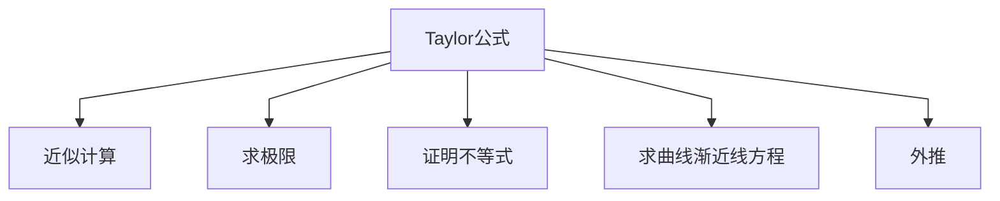
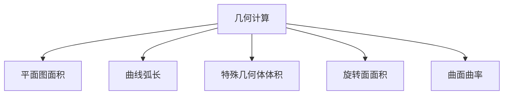
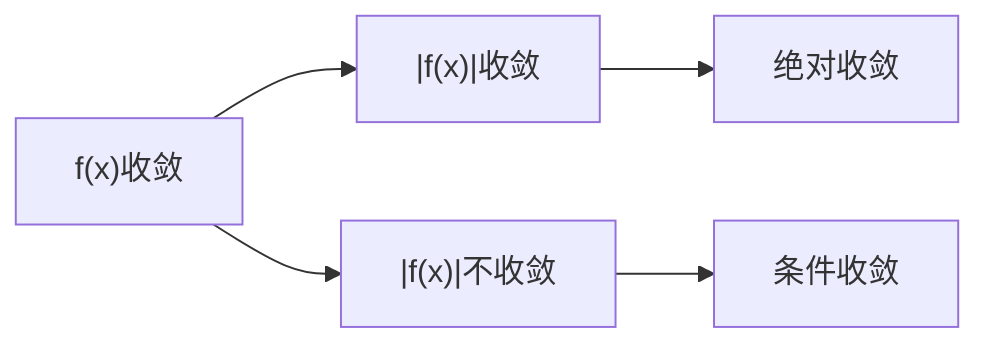

# 1 预备部分

### 0.1 函数与映射

用$\circ$表示复合函数
考查函数$f(x)=x^2. g(x)=sinx$
$$
g\circ f(x)=sinx^2. f\circ g(x)=sin^2x
$$

### 0.2 连加与连乘

满足交换律和结合律

$$
\begin{align}
\sum_{i=0}^n(a_i+b_i)&=(a_1+b_1)+\cdots+(a_n+b_n) \\
&=(a_1+\cdots+a_n)+(b_1+\cdots+b_n) \\
&=\sum_{i=0}^na_i+\sum_{i=0}^nb_i
\end{align}
$$
$$
\begin{align}
\sum_{i=0}^n(\lambda c_i)&=\lambda c_1+\cdots+\lambda c_n \\
&=\lambda(c_1+\cdots+c_n)\\
&=\lambda\sum_{i=0}^nc_i
\end{align}
$$

### 0.3 导数

# 2 分析学

## 1 第一章 实数

微积分创始于17世纪后半期，却未能为自己的方法提供逻辑上无懈可击的理论说明，直到19世纪初，柯西（Cauchy）才以极限理论为微积分奠定了坚实的基础，又过了半个世纪以后，康托 （Cantor）和戴德金（Dedekind）等人经过缜密的审查才发现：极限理论的某些基本原理，实际上依赖于实数系的一个非常重要的性质 ——连续性

### 1.1 实数的无尽小数表示与顺序


**无尽小数** 形状如

$$
 ±a_0 ，a_1a_2 {_\cdots} a_n{_\cdots} 
$$

这样的表示被称为无尽小数，这里$a_0\in Z_+$，而$a_1a_2 {_\cdots} a_n{_\cdots}$中的每一个属于\[0~9]的区间，我们还约定：如像$±a_0 ，a_1a_2 {_\cdots} a_m 0000{_\cdots}$这样的无尽小数可以写成$±a_0 ，a_1a_2 {_\cdots} a_m$，并可称为**有尽小数**

**等同关系** 我们给无尽小数规定如下的等同关系（$E_1$）和（$E_2$），等号左边是非规范小数，等号右边是规范小数，如果两实数有相同的规范小数表示，那么我们就说这两实数相等
$$
\begin{align}
0，000{_\cdots}&=+0，000{_\cdots}\tag{$E_1$}\\
\pm b_0，b_1{_\cdots}b_p999{_\cdots}&=\pm b_0，b_1{_\cdots}(b_p+1)000{_\cdots}(b_p<9)\tag{$E_2$}
\end{align}
$$

**相反数** 两个非0实数，如果它们的规范小数表示的各位数字分别相同，符号正好相反，那么就说这两实数互为相反数，0的相反数就规定为0自己，实数x的相反数通常记为-x

**实数的顺序** 逐位比较它们的各位数字
$$
\begin{align}
a&＝a_0，a_1a_2{_\cdots}a_n{_\cdots} \\
b&＝b_0，b_1b_2{_\cdots}b_n{_\cdots}
\end{align}
$$
1. 两实数为非负实数
$$
a_0=b_0，\cdots ，a_{p-1}=b_{p-1}，a_p>b_p
$$
则$a>b$
2. 两实数为负实数
$$
a_0=b_0，\cdots ，a_{p-1}=b_{p-1}，a_p<b_p
$$
则$-a>-b$
3. 两实数，一个是非负实数，另一个是负实数，我们规定任何非负实数大于任何负实数

**三歧性** 对任意两个实数a和b，必有且只有其中一种情况：
$$
a>b，a=b，a<b
$$

**传递性** 如果$a>b，b>c$，那么$a>c$

**稠密性** 在任意两个不相等的实数之间还可以再插进一个有尽小数
**定理** 设a和b是实数，$a<b$则存在有尽小数c，满足
$$
a<b<c
$$
**Proof** 如果$a<0<b$，那么$c=0$就合乎要求，因此只须考查$0\le a<b$ 或者$a<b\le0$的情形
$$
\begin{align}
设，a和b的规范小数表示为 \\
a&＝a_0，a_1a_2{_\cdots}\\
b&＝b_0，b_1b_2{_\cdots} \\
因为a<b，所以存在p\in Z_+ &，使得\\
a_0&=b_0，\cdots ，a_{p-1}=b_{p-1}，a_p<b_p\\
又因a_0，a_1a_2{_\cdots}是规范小数，&所以存在q>p，使得\\
a_q&<9\\
我们取\\
c&＝a_0，a_1{_\cdots}a_p{_\cdots}a_{q-1}(a_q+1)000{_\cdots} \\
于是，c是有尽小数，它满足 \\
a&<c<b~~\square
\end{align}
$$

**绝对值** 实数x的绝对值|x|定义如下：
$$
|x|=
\cases{x，&如果x是非负实数\\-x，&如果x是负实数}
$$

### 1.2 实数系的连续性

**上界与下界，有界集**
设$E\subset \mathbb{R}$，$E\not= \varnothing$
1. 如果存在$L\in \mathbb{R}$，使得$x\le L$，$\forall x\in E$，那么我们就说集合$E$有上界，并且说$L$是集合$E$的一个上界
2. 如果存在$l\in \mathbb{R}$，使得$x\le l$，$\forall x\in E$，那么我们就说集合$E$有下界，并且说$l$是集合$E$的一个下界
+ 如果一个集合有上界也有下界，那么我们就说这集合有界，或者说这集合是有界集
+ 如果$L$是集合$E$的上界，$L_1>L$，那么$L_1$也是集合$E$的一个上界，因 此，一个有上界的集合，不可能有最大的上界
+ 非空而有上界的实数集合，总有一个**最小的上界，通常称为上确界**

**上确界**
设$E\subset \mathbb{R}$，$E\not= \varnothing$如果存在一个实数$M$，满足下面的条件（ⅰ）和（ⅱ），那么我们就把$M$叫做集合$E$的上确界
（ⅰ）$M$是集合$E$的一个上界，即
$$
x\le M，\forall x \in E
$$
（ⅱ）$M$是集合$E$的最小的上界，任何小于$M$的实数$M'$都不再是集合$E$的上界，即
$$
\begin{align}
(\forall M'<M)(\exists x'\in E)(x'>M')\\or \\
\forall\epsilon >0，\exists x\in E，~\text{s，t，}~x>M-\epsilon
\end{align}
$$
**注：也就是说$M'$把$E$集合的部分$x$包含进去了，自然就不能成为上界**
把（ⅱ）改写成否定命题
$$
(\exists M'< M)(\forall x'\in E)(x'\le M')
$$
即，满足上界存在条件，那原命题的$M'$不再构成上界
+ 如果$M$和$M'$都是$E$的上确界
$$
M\ge M'，M'\ge M
$$
因此有$M=M'$
可以得知，集合$E$的上确界如果存在就必定只有一个，把它记作$supE$

**下确界**
设$E\subset \mathbb{R}$，$E\not= \varnothing$如果存在一个实数$m$，满足下面的条件（ⅰ）和（ⅱ），那么我们就把$m$叫做集合$E$的下确界
（ⅰ）$m$是集合$E$的一个下界，即
$$
x\ge m，\forall x \in E
$$
（ⅱ）$m$是集合$E$的最大的下界，任何大于$m$的实数$m'$都不再是集合$E$的下界，即
$$
\begin{align}
(\forall m'>m)(\exists x'\in E)(x'<m')\\or \\
\forall\epsilon >0，\exists x\in E，~\text{s，t，}~x<M+\epsilon
\end{align}
$$
集合$E$的下确界如果存在就必定只有一个，把它记作$infE$

设$E$是实数的非空集合，我们以$-E$表示$E$中各数的相反数组成的集合，即定义
$$
-E=\{-x|x\in E\}
$$
**确界原理**
$\mathbb{R}$的任何非空而有上界的子集合$E$在$\mathbb{R}$中有上确界
$\mathbb{R}$的任何非空且有下界的子集合$E$在$\mathbb{R}$中有下确界

### 1.3 实数的四则运算

**定理1** 设a和b是实数，则存在唯一实数u，使得对于满足条件
$$
\alpha\le a \le \alpha'，\beta\le b \le \beta'
$$
的任何有尽小数$\alpha，\alpha'$和$\beta，\beta'$，都有
$$
\alpha+\beta\le u \le \alpha'+\beta'
$$
**存在性证明**
$$
u=\sup\left\{
\alpha+\beta{\Huge|}^{\Large{a和b是有尽小数}}_{\Large{\alpha\le a~，~\beta\le b}}\right\}
$$
**唯一性证明**
取彼此充分靠近的有尽小数$\alpha，\alpha'$和$\beta，\beta'$，使得
$$
\alpha\le a \le \alpha'，\beta\le b \le \beta'
$$
$\alpha+\beta$和$\alpha'+\beta'$可以任意接近，从而在它们之间容不下两个数
**严谨证明：**
对于任意正的有尽小数$\epsilon$和自然数M＝N＝1. 根据[[#^26e8eb|引理3]]，存在正的有尽小数$\epsilon'$和$\epsilon''$，使得
$$
\epsilon'+\epsilon''<\epsilon
$$
又根据[[#^feff56|引理1]]，存在有尽小数α，α′和β，β′，分别满足
$$
\begin{align}
\alpha\le a\le\alpha'，~\alpha'-\alpha<\epsilon' \\
\beta\le b\le\beta'，~\beta'-\beta<\epsilon''
\end{align}
$$
因此
$$
\begin{align}
(\alpha'-\alpha)+(\beta'-\beta)&\le \epsilon \\
(\alpha'+\beta')-(\alpha+\beta)&\le \epsilon
\end{align}
$$
因为$\epsilon$可以取任何正的有尽小数，根据[[#^fe370f|引理2]]，满足条件
$$
\alpha+\beta\le u\le \alpha'+\beta'
$$
的实数u应该是唯一的$~~\square$

**定义** 我们把定理1中所述的唯一确定的实数u叫做实数a与实数b之和，并约定把它记为a+b
**定义** 实数a与实数b之差定义为a与-b之和，即规定
$$
a-b=a+(-b)
$$

**定理2** 设a和b是非负实数，则存在唯一实数$v$，使得对于满足条件
$$
0\le\alpha\le a \le \alpha'，0\le \beta\le b\le \beta'
$$
的任何有尽小数$\alpha，\alpha'$和$\beta，\beta'$，都有
$$
\alpha\beta\le v\le\alpha'\beta'
$$
**定义** 我们把定理2中所述的唯一确定的实数$v$叫做非负实数a与非负实数b的乘积，并约定把它记为ab
**定义** 任意实数a与b的乘积ab定义如下：
$$
ab=
\begin{cases}
|a||b|，如果a与b同号 \\
-(|a||b|)，如果a与b异号
\end{cases}
$$
**引理1** 设a是任意一个实数，则对任何正的有尽小数$\epsilon$，存在有尽小数$\alpha$和$\alpha'$，满足条件 ^feff56
$$
\alpha\le a\le\alpha'，\alpha'-\alpha<\epsilon
$$
**Proof** 我们设
$$
\epsilon=\epsilon_0，\epsilon_1\cdots\epsilon_p
$$
并设其中第一位不等于0的数字是$\epsilon _{k－1}，0\le k－1\le p$，则有
$$
\frac{1}{10^k}<\epsilon
$$
$$
example:\epsilon_{k-1}=\epsilon_2. k=3. \frac{1}{10^3}=\frac{1}{1000}=0，001=\epsilon_0，\epsilon_1\epsilon_2\epsilon_3<\epsilon
$$
如果a的规范小数表示为$a_0 ，a_1a_2 {_\cdots}$，则取
$$
\alpha=\alpha_0，\alpha_1\cdots\alpha_k，~\alpha'=\alpha_0，\alpha_1\cdots\alpha_k+\frac{1}{10^k}
$$
如果a的规范小数表示为$-a_0 ，a_1a_2 {_\cdots}$，则取
$$
\alpha=-\alpha_0，\alpha_1\cdots\alpha_k-\frac{1}{10^k}，~\alpha'=-\alpha_0，\alpha_1\cdots\alpha_k
$$
对这两种情形都有
$$
\alpha'-\alpha =\frac{1}{10^k}<\epsilon~~\square
$$

**引理2** 设$c$和$c'$是实数，$c\le c'$，如果对任何正的有尽小数$\epsilon$，存在有尽小数$\gamma$和$\gamma '$，满足条件 ^fe370f
$$
\gamma\le c\le  c '\le \gamma'，\gamma'-\gamma<\epsilon
$$
那么就必定有
$$
c=c'
$$
**Proof** 用反证法，假如$c<c'$′，那么存在有尽小数$\eta$和$\eta'$，满足
$$
c<\eta<\eta'<c'
$$
对于$\epsilon=\eta'-\eta>0$，任何满足条件
$$
\gamma\le c<\eta<\eta'<c'\le \gamma'
$$
的有尽小数$\gamma$和$\gamma '$都不能使得
$$
\gamma'-\gamma<\epsilon=\eta'-\eta
$$
因此如果引理所述的前提成立，那么就必定有
$$
c=c'~~\square
$$
**引理3** 设$\epsilon$是正的有尽小数，M和N是自然数，则存在正的有尽小数$\epsilon'$和$\epsilon''$，使得 ^26e8eb
$$
M\epsilon'+N\epsilon''<\epsilon
$$
**Proof** 我们设
$$
\epsilon=\epsilon_0，\epsilon_1\cdots\epsilon_p
$$
并设其中第一位不等于0的数字是$\epsilon _{k－1}，0\le k－1\le p$，则有
$$
\frac{1}{10^k}<\epsilon
$$
取自然数m和n，使得
$$
10^m\ge M，~10^n\ge N
$$
然后取
$$
\epsilon'=\frac{1}{10^{m+k+1}}，~\epsilon''=\frac{1}{10^{n+k+1}}
$$
因此
$$
\begin{align}
M\epsilon'+N\epsilon''&\le 10^m\epsilon'+10^n\epsilon'' \\
&=\frac{1}{10^{k+1}}+\frac{1}{10^{k+1}} \\
&<\frac{1}{10^k}<\epsilon~~\square
\end{align}
$$

**实数的除法** 有尽小数的“长除法”，确定近似商的除法手续，对于给定的正的有尽小数$\alpha，\beta$和自然数n，通过逐位试商，可以确定一个有尽小数
$$
\gamma=\gamma_0，\gamma_1\cdots \gamma_n
$$
满足这样的条件
$$
\gamma\cdot\alpha\le\beta<(\gamma+\frac{1}{10^n})\cdot\alpha
$$
对于给定的$\alpha，\beta$和n，这样的$\gamma$是唯一确定的，$(\gamma+\frac{1}{10^n})=\gamma'$分别叫做$\beta\div\alpha$的，精确到小数点以后n位的不足近似商（$\gamma$）和过剩近似商（$\gamma'$），记作
$$
\left(\frac{\beta}{\alpha}\right)_n=\gamma~，~\left(\frac{\beta}{\alpha}\right)'_n=\gamma'
$$
### 1.4 实数系的基本性质综述


### 1.5 不等式

1. 考查不等式$|x|<\alpha$，等价于
$$
x<\alpha~，~-x<\alpha
$$
即$-a<x<\alpha$，得到
$$
|x|<\alpha\Longleftrightarrow -\alpha<x<\alpha
$$
即不等式$|x|<\alpha$的解的集合是开区间$(-\alpha，\alpha)$

2. 有显然的不等式
$$
-|a|\le a\le|a|~，~-|b|\le b\le|b|
$$
相加得到
$$
\begin{align}
-(|a|+|b|)\le a+b\le|a|+|b| \\
|a+b|\le|a|+|b| 
\end{align}
$$

3. 又可以得到
$$
\begin{align}
|a|=|(a-b)+b|&\le|a-b|+|b| \\
|a|-|b|&\le|a-b|
\end{align}
$$
同理可得
$$
\begin{align}
|b|-|a|\le|b-a|=|a-b| \\
|a|-|b|\ge-|a-b| 
\end{align}
$$

4. 得到了
$$
-|a-b| \le|a|-|b|\le |a-b| 
$$
因此
$$
||a|-|b||\le|a-b| 
$$

5. 归纳法，可以把不等式
$$
|a+b|\le|a|+|b| 
$$
推广到n个实数的情形
$$
|a_1+a_2+\cdots+a_n|\le|a_1|+|a_2| +\cdots+|a_n|
$$

**伯努里（Bernoulli）不等式**

设$x\ge0$，则根据[[微积分公式及其推导#二项式定理|二项式定理]]
$$
(1+x)^n=1+nx+\frac{n(n-1)}{2}x^2+\cdots+x^2
$$
可以得到
$$
(1+x)^n\ge1+nx
$$
这不等式实际上对任何$x\ge-1$成立
**定理** 以下的伯努里不等式成立：
$$
(1+x)^n\ge1+nx~，~\forall x\ge-1
$$
**Proof** n＝1时，上式显然以等式的形式成立，假设已经证明了
$$
(1+x)^{n-1}\ge1+(n-1)x
$$
则
$$
\begin{align}
(1+x)^n&=(1+x)^{n-1}(1+x)\\
&\ge[1+(n-1)x ](1+x) \\
&=1+x+(n-1)x+(n-1)x^2 \\
&=1+nx+(n-1)x^2 \\
&\ge1+nx~，~\forall x\ge-1
\end{align}
$$
对一切自然数n伯努里不等式成立$~~\square$

**算术平均数与几何平均数不等式**
**定理** 设$x_1. x_2. \cdots，x_n\ge0$，则以下的算术平均数与几何平均数不等式（AM-GM不等式）成立：
$$
\frac{x_1+x_2+\cdots+x_n}{n}\ge \sqrt[n]{x_1x_2\cdots x_n}
$$
**Proof** n＝1的时候，上式显然（以等式形式）成立
假设对任意n-1个非负实数，AM-GM不等式成立
$$
\begin{align}
A&=\frac{x_1+\cdots+x_{n-1}}{n-1} \tag{a}\\
(n-1)A&=x_1+\cdots+x_{n-1}\tag{b}
\end{align}
$$
则
$$
x_n\ge A=\frac{x_1+\cdots+x_{n-1}}{n-1}\ge \sqrt[n-1]{x_1\cdots x_{n-1}}\tag{c}
$$
于是
$$
\begin{align}
&\left(\frac{x_1+x_2+\cdots+x_n}{n}\right)^n\\
&=\left[\frac{(n-1)A+x_n}{n}\right]^n \tag{refer b}\\
&=\left(\frac{An-A+x_n}{n}\right)^n  \\
&=\left(A+\frac{x_n-A}{n}\right)^n  \\
&=A^n+nA^{n-1}\left(\frac{x_n-A}{n}\right)+\cdots \\
&\ge A^n+nA^{n-1}\left(\frac{x_n-A}{n}\right) \\
&=A^n+A^{n-1}\left(x_n-A\right) \\
&=A^n+A^{n-1}x_n-A^n \\
&=A^{n-1}x_n\ge x_1\cdots x_{n-1}x_n \tag{refer c}\\
\end{align}
$$
即
$$
\frac{x_1+\cdots+x_n}{n}\ge \sqrt[n]{x_1\cdots x_n}~~\square
$$

**三角函数不等式**
**定理** 对于用弧度表示的角x，有以下不等式成立
$$
sinx<x<tanx~，~~\forall x\in(0，\frac{\pi}{2})
$$
**Proof** 在单位圆O中作圆心角x，它的始边为OX轴上的OA，终边为OB，用线段联结AB，过A点作OX轴的垂线交OB延长线于C

```tikz
\usepackage{tikz}
\begin{document}
\begin{tikzpicture}
    % Draw the circle
    \draw (0，0) circle(2);
    % Draw the x-axis
    \draw[->] (0，0) -- (3. 0) node[anchor=north] {$X$};
    % Draw points O and A
    \fill (0，0) circle(1pt) node[anchor=north] {$O$};
    \fill (2. 0) circle(1pt) node[anchor=north] {$A$};
    % Draw the angle line
    \draw[thick] (0，0) -- (2. 0);
    \node at (1. 0，2) {$x$};
    % Draw points B and C and lines OB and BC
    \coordinate (B) at (1. 532. 1. 332);
    \fill (B) circle(1pt) node[anchor=south] {$B$};
    \draw[thick] (0，0) -- (B);
    \coordinate (C) at (2. 1. 732);
    \fill (C) circle(1pt) node[anchor=south] {$C$};
    \draw[thick] (B) -- (C);
    \draw[thick] (2. 0) -- (C);
	\draw[thick] (2. 0) -- (B);
\end{tikzpicture}

\end{document}

```

有$\triangle$OAB的面积<扇形OAB的面积<$\triangle$OAC的面积，即
$$
\frac{1}{2}sinx<\frac{1}{2}x<\frac{1}{2}tanx
$$
因此
$$
sinx<x<tanx~，~~\forall x\in(0，\frac{\pi}{2})~~\square
$$

**推论** 以下不等式成立
$$
|sinx|\le|x|~，~~\forall x\in R
$$
**Proof** 有
$$
\begin{align}
|sinx|=sinx\le x=|x|~，~~\forall x\in[0，\frac{\pi}{2}) \\
|sin(-x)|=sinx\le x=|-x|~，~~\forall x\in[0，\frac{\pi}{2})
\end{align}
$$
综合得到
$$
|sinx|\le |x|~，~~\forall x\in(-\frac{\pi}{2}，\frac{\pi}{2}) 
$$
而当$|x|\ge \frac{\pi}{2}$时
$$
\begin{align}
&|sinx|\le 1<\frac{\pi}{2}\le |x| \\
\therefore~&|sinx|\le |x|~，~~\forall x\in R~~\square
\end{align}
$$

## 2 第二章 极限

### 2.1 有界序列与无穷小序列

从自然数集$\mathbb{N}$到实数集$\mathbb{R}$的一个映射
$$
x:\mathbb{N}\rightarrow \mathbb{R}
$$
相当于用自然数编号的一串实数
$$
x_1=x(1)，x_2=x(2)，\cdots，x_n=x(n)，\cdots
$$
这样的用自然数编号的一串实数$\{x_n\}$，称为是一个实数序列

#### 2.1.1 有界序列

**定义1** 设$\{x_n\}$是一个实数序列
1. 如果存在$M \in \mathbb{R}$使得
$$
x_n\le M，~\forall n\in \mathbb{N}
$$
就说：序列$\{x_n\}$有上界，实数M是它的一个上界
2. 如果存在$m \in \mathbb{R}$使得
$$
x_n\ge m，~\forall n\in \mathbb{N}
$$
就说：序列$\{x_n\}$有下界，实数m是它的一个下界
3. 如果序列$\{x_n\}$有上界并且也有下界，就说这序列有界
序列$\{x_n\}$有界的充分必要条件是：存在$K \in \mathbb{R}$使得
$$
|x_n|\le K，\forall n \in \mathbb{N}
$$
用符号表述为
$$
(\exists K\in\mathbb{R})(\forall x \in \mathbb{N})(|x_n|\le K)
$$
“序列$\{x_n\}$无界”是上面陈述的否定，它可以用符号表述为
$$
(\forall K\in\mathbb{R})(\exists x \in \mathbb{N})(|x_n|> K)
$$

> [!tip]
>当对一个陈述加以否定时，应该把逻辑量词“$\exists$”换成“$\forall$”，把“$\forall$”换成“$\exists$”，并且把最后的陈述换成原来陈述的否定

#### 2.1.2 无穷小序列

**定义2** 设$\{x_n\}$是一个实数序列，如果对任意实数$\epsilon>0$，都存在自然数$\mathbb{N}$，使得只要$n>\mathbb{N}$，就有
$$
|x_n|<\epsilon
$$
那么我们就称$\{x_n\}$为无穷小序列
符号表示为
$$
(\forall\epsilon>0)(\exists N\in\mathbb{N})(\forall n>N)(|x_n|<\epsilon)
$$
这就是说：只要取n足够大，$|x_n|$可以小于任何预先指定的正数
“序列$\{x_n\}$不是无穷小序列”，可以用符号表示成
$$
(\exists \epsilon>0)(\forall N\in\mathbb{N})(\exists n>N)(|x_n|\ge\epsilon)
$$
**几何解释** 考查以0点为中心的开区间
$$
(-\epsilon，\epsilon)
$$
我们把这开区间叫做0点的$\epsilon$邻域，用几何的语言来描述，“$\{x_n\}$是无穷小序列”意味着：不论0点的邻域怎样小，序列$\{x_n\}$从某一项之后的各项都要进入到这邻域之中

我们采取逐步倒推的方式，从任意给定的ε出发，寻找无穷小序列定义所要求的N，因为只需要指出这样的N存在，所以在倒推的过程中，允许适当地放宽不等式，以简化我们的讨论，这种放宽不等式的办法，可以概括为以下简单的引理：

**引理** 设$\{\alpha_n\}$和$\{\beta_n\}$是实数序列，并设存在$N_0\in \mathbb{N}$，使得
$$
|\alpha_n|\le\beta_n，\forall n>N_0
$$
如果$\{\beta_n\}$是无穷小序列，那么$\{\alpha_n\}$也是无穷小序列
**Proof** 对任意的$\epsilon >0$，存在$N_1\in N$，使得$n>N_1$时$|\beta_n|<\epsilon$，取
$$
N=max\{N_0，N_1\}
$$
则当$n>N$时，就有
$$
|\alpha_n|\le \beta_n \le\epsilon~~\square
$$

**引理** 如果$\{\alpha_n\}$是无穷小序列，那么它也是有界序列
**Proof** 对于$\epsilon=1$，存在$N\in \mathbb{N}$，使得只要$n>N$，就有
$$
|a_n|<1
$$
记
$$
K=max\{|a_1|，\cdots，|a_N|，1\}
$$
则显然有
$$
|a_n|\le K，~\forall n\in N~~\square
$$

**定理1** 关于有界序列与无穷小序列，有以下结果

1. 两个有界序列的和与乘积都是有界序列，即如果$\{x_n\}$，$\{y_n\}$都是有界序列，那么$\{x_n+y_n\}$与$\{x_ny_n\}$都是有界序列
**Proof**
$$
\begin{align}
|x_n|&\le K，\forall n>\mathbb{N}\\
|y_n|&\le L，\forall n>\mathbb{N} \\
|x_n+y_n|&\le |x_n|+|y_n|\le K+L，~~\forall n>\mathbb{N} \\
|x_ny_n|&\le |x_n||y_n|\le KL，~~\forall n>\mathbb{N}
\end{align}
$$
2. 两个无穷小序列$\{\alpha_n\}$与$\{\beta_n\}$之和$\{\alpha_n+\beta_n\}$也是无穷小序列
**Proof** 对任意$\epsilon>0$，存在$N_1\in N$和$N_2\in N$，分别使得
$$
\begin{align}
|\alpha_n|<\frac{\epsilon}{2}，~\forall n>N_1 \\
|\beta_n|<\frac{\epsilon}{2}，~\forall n>N_2
\end{align}
$$
取$N＝max\{N_1 ，N_2\}$，则$n>N$时，就有
$$
|\alpha_n+\beta_n|\le|\alpha_n|+|\beta_n|<\frac{\epsilon}{2}+\frac{\epsilon}{2}=\epsilon
$$
3. 无穷小序列$\{\alpha_n\}$与有界序列$\{x_n\}$的乘积$\{\alpha_nx_n\}$是无穷小序列
**Proof** 根据有界序列定义，存在$K\in\mathbb{R}$使得
$$
|x_n|\le K，\forall n\in\mathbb{N}
$$
设$K>0$，对任意$\epsilon >0$，我们有$\frac{\epsilon}{K}$，因而存在$N\in\mathbb{N}$，使得$n>N$时，有
$$
|a_n|<\frac{\epsilon}{K}
$$
因此
$$
|a_nx_n|=|a_n||x_n|<\frac{\epsilon}{K}K=\epsilon
$$

4. $\{\alpha_n\}$是无穷小序列$\Longleftrightarrow$$\{|\alpha_n|\}$是无穷小序列
**Proof** 有显然的关系$||a_n||=|a_n|$

**推论** 
5. 两个无穷小序列$\{\alpha_n\}$和$\{\beta_n\}$的乘积$\{\alpha_n\beta_n\}$也是无穷小序列
**Proof** 因为无穷小序列必然是有界序列，把$\{\beta_n\}$视为有界序列便满足**定理1-3**
6. 常数C与无穷小序列$\{\alpha_n\}$的乘积$\{C\alpha_n\}$也是无穷小序列
**Proof** 常数C可以视为有界序列$x_n=C，~n=1. 2. \cdots$
7. 有限个无穷小序列之和与乘积仍是无穷小序列
**Proof** 以两个无穷小的和积性质，利用数学归纳法就可证明
8. 以无穷小序列前n项的算术平均数和几何平均数作为通项的序列，也是一个无穷小序列

#### 2.1.3 无穷小序列的比较

当$n\to\infty$时$log_an\ll n^k\ll a^n\ll n!\ll n^n$ （其中$k>0,a>1$）

1. 设 $a\in\mathbf{R},|a|>1$,则
$$s_n=\frac1{a^n},\quad n=1,2,\cdotp\cdotp\cdotp $$
是无穷小序列.事实上
$$\begin{aligned}&\left|\frac{1}{a^{n}}\right|=\frac{1}{|a|^{n}}\\&=\frac{1}{\left(1+\left(\left|a\right|-1\right)\right)^{n}}<\frac{1}{n(\left|a\right|-1)}.\end{aligned}$$
要使$\frac1{n(|a|-1)}<\varepsilon$,只须 $n>\frac1{\varepsilon(|a|-1)}.$ 我们可取$N=\left[\frac1{\varepsilon(|a|-1)}\right]+1.$
于是，只要$n>N$,就有
$$|s_n|=\frac1{|a|^n}<\frac1{n(|a|-1)}<\varepsilon.$$

2. 设 $a\in\mathbf{R},|a|>1$,则
$$t_n=\frac{n}{a^n},\quad n=1,2,\cdotp\cdotp\cdotp,$$
是无穷小序列.
事实上，对于 $n\geqslant2$,我们有
$$
\begin{align}
\left|\frac n{a^n}\right|=\frac n{|a|^n}&=\frac n{(1+(|a|-1))^n}\\
&<\frac n{\frac{n(n-1)}2(|a|-1)^2} \\
&=\frac2{(n-1)(|a|-1)^2}
\end{align}
$$
要使
$$\frac2{(n-1)(|a|-1)^2}<\varepsilon,$$
只需
$$n>\frac2{\varepsilon(|a|-1)^2}+1.$$
可取$N=\left[\frac{2}{\boldsymbol{\varepsilon}(|a|-1)^{2}}\right]+2.$对这样选取的$N\in\mathbf{N}$,只要$n>N$,就有
$$|t_n|<\frac2{(n-1)(|a|-1)^2}<\varepsilon.$$

3. 设$b\in\mathbf{R},b>1,k\in\mathbf{N}.$则
$$x_n=\frac{n^k}{b^n},\quad n=1,2,\cdotp\cdotp\cdotp,$$
是无穷小序列.可以记
$$a=b^{\frac1k}=\sqrt[k]{b}.$$
于是有
$$x_n=\left(\frac n{a^n}\right)^k.$$
这是 $k$ 个无穷小序列 $t_n=\frac n{a^n}$的乘积，因而也是无穷小序列.

4. 设$c>0$则
$$y_n=\frac{c^n}{n!},\quad n=1,2,\cdotp\cdotp\cdotp,$$
是无穷小序列
取定一个$m\in\mathbf{N}$,使得$m>c$显然有
$$
\begin{align}
\left|\frac{c^n}{n!}\right|&=\frac1{m!}\cdot\frac{c^n}{(m+1)\cdots n}<\frac1{m!}\cdot\frac{c^n}{m^{n-m}}\\
&=\frac{m^m}{m!}\Big(\frac cm\Big)^n,\quad\forall n>m
\end{align}
$$
因为 $\frac{c}{m}<1$,$\left\{\left(\frac cm\right)^n\right\}$是无穷小序列，$\frac{m^m}{m!}$是常数，所以$\{y_n\}$边是无穷小序列

5. 设$f(x)=n^{k}(k>0),g(x)=\log_{a}n~(a>1).$我们指出
$$\lim_{n\to+\infty}\frac{\log_an}{n^k}=0$$
令$y=\log_an$,$a^y=n$,类比$|\frac{n}{a^n}|$则有
$$
\lim_{n\to+\infty}\frac{\log_{a}n}{n^{k}}=\lim_{n\to+\infty}\frac{y}{a^{yk}}=\lim_{n\to+\infty}\frac{y}{(a^{k})^{y}}=0
$$

6. $\lim_{n\to\infty}\frac{n!}{n^n}=0$
$$
\begin{align}
\lim_{n\to\infty}\frac{n!}{n^n}&=\frac{1\cdot 2\cdot 3\cdots n}{n\cdot n\cdot n\cdots n} \\
&=\frac{1}{n}\cdot \frac{2}{n}\cdot \frac{3}{n}\cdots \frac{n}{n}<\frac{1}{n}<\epsilon
\end{align}
$$
只需
$$n>\frac{1}{\epsilon}$$
可取$N=\left[ \frac{1}{\epsilon}\right]+1$对这样选取的$N\in\mathbf{N}$,只要$n>N$,就有
$$
\frac{n!}{n^n}<\frac{1}{n}<\epsilon
$$

### 2.2 收敛序列

**定义** 设$\{x_n\}$是实数序列，a是实数，如果对任意实数$\epsilon >0$都存在自然数N，使得只要$n>N$，就有
$$
|x_n-a|<\epsilon
$$
那么我们就说序列$\{x_n\}$收敛，它以a为极限（或者说序列$\{x_n\}$收敛于a），记为
$$
\begin{align}
\lim x_n=a&或x_n\rightarrow a \\
\lim_{n\rightarrow + \infty}x_n=a&或x_n\rightarrow a(n\rightarrow +\infty)
\end{align}
$$
不收敛的序列称为发散序列
**符号表示**
$\lim x_n＝a$的定义可以写成
$$
(\forall\epsilon>0)(\exists N\in\mathbb{N})(\forall n>N)(|x_n-a|<\epsilon)
$$
不收敛表示为
$$
(\exists\epsilon>0)(\forall N\in\mathbb{N})(\exists n>N)(|x_n-a|\ge\epsilon)
$$
**几何解释** 设$\epsilon\in\mathbb{R}，\epsilon>0$，我们把开区间$(a-\epsilon，a+\epsilon)$叫做**a点的 $\epsilon$邻域**，极限定义中的不等式
$$
|x_n-a|<\epsilon，~~\forall n>N
$$
可以写成
$$
a-\epsilon<x_n<a+\epsilon，~~\forall n>N
$$
即
$$
x_n\in(a-\epsilon，a+\epsilon)，~~\forall n>N
$$
如果采用几何式的语言，极限的定义可以表述为：不论a点的邻域怎样小，序列$\{x_n\}$以某一项之后的所有各项都要进入这邻域之中

**定理1** 如果序列$\{x_n\}$有极限，那么它的极限是唯一的
因为$a\not=b$，不妨设$a<b$，可取$\epsilon$充分小使得$a+\epsilon<b-\epsilon$（这只须取$\epsilon$满足$0<\epsilon<\frac{b-a}{2}$），于是a的$\epsilon$邻域与b的$\epsilon$邻域不相交
**Proof** 用反证法，假设序列$\{x_n\}$有极限a和b，a＜b，取$\epsilon\in\mathbb{R}$满足
$$
0<\epsilon<\frac{b-a}{2}
$$
于是，存在$N_1\in\mathbb{N}$，使得$n>N_1$时
$$
a-\epsilon<x_n<a+\epsilon
$$
又存在$N_2\in\mathbb{N}$，使得$n>N_2$时
$$
b-\epsilon<x_n<b+\epsilon
$$
置$N＝max\{N_1. N_2\}$，则当$n>N$时，就有
$$
\begin{align}
b-\epsilon<x_n<a+\epsilon \\
or \\
a-\epsilon<x_n<b+\epsilon
\end{align}
$$
这与$0<\epsilon<\frac{b-a}{2}$矛盾$~\square$

**定理2（夹挤原理）** 设$\{x_n\}，\{y_n\}，\{z_n\}$都是实数序列，满足条件
$$
x_n\le y_n\le z_n，~~\forall n\in\mathbb{N}
$$
如果$\lim{x_n}=\lim{z_n}=a$，那么$\{y_n\}$也是收敛序列，并且$\lim{y_n}=a$
**Proof** 对任意$\epsilon>0$，存在$N_1. N_2\in\mathbb{N}$，使得当$n>N_1$时，
$$
a-\epsilon<x_n<a+\epsilon
$$
当$n>N_2$时
$$
a-\epsilon<z_n<a+\epsilon
$$
置$N＝max\{N_1. N_2\}$，则当$n>N$时，就有
$$
a-\epsilon<x_n\le y_n\le z_n<a+\epsilon~~\square
$$

> [!tip]
> 
>从定义可以看出：无穷小序列就是以0为极限的序列，而“序列 $\{x_n\}$以a为极限”这一陈述等价于说：“$\{x_n-a\}$是无穷小序列”

**定理3** 设$\{x_n\}$是实数序列，a是实数，则以下三陈述等价：
1. 序列$\{x_n\}$以a为极限
2. $\{x_n-a\}$是无穷小序列
3. 存在无穷小序列$\{\alpha_n\}$使得
$$
x_n=a+\alpha_n，~~n=1. 2. \cdots
$$
**Proof** 
$1\rightarrow2$：由定义可以看出
$2\rightarrow3$：设$\alpha_n=x_n+a$，则$\{\alpha_n\}$是无穷小序列
$3\rightarrow1$：存在$N\in\mathbb{N}$，使得$n>N$时，$|\alpha_n|<\epsilon$，这时，
$$
|x_n-a|=|\alpha_n|<\epsilon~~\square
$$

**定理4** 收敛序列$\{x_n\}$是有界的
**Proof** 设$\lim{x_n}＝a$，则对于$\epsilon＝1>0$，存在$N\in\mathbb{N}$，使得当$n>N$时，就有
$$
-|a|-1\le a-1<x_n<a+1\le |a|+1
$$
即
$$
|x_n|<|a|+1
$$
记$K＝max\{|x_1|，\cdots，|x_N|，|a|+1\}$，则有
$$
|x_n|\le K，~~ \forall n \in \mathbb{N}~~\square
$$

**定理5**
1. 设$lim{x_n} = a$，则$lim{ |x_n|}= |a|$
**Proof** 
$$
||x_n|-|a||\le|x_n-a|
$$
2. 设 $\lim x_n = a$，$\lim y_n = b$，则
$$
\lim (x_n \pm y_n) = a \pm b，
$$
**Proof** 我们有
$$
|(x_n\pm y_n)-(a\pm b)|\le|x_n-a|+|y_n-b|
$$
对任意$\epsilon>0$，存在$N_1\in\mathbb{N}$和$N_2\in\mathbb{N}$，分别使得
$$
\begin{align}
当n>N_1时，~|x_n-a|<\frac{\epsilon}{2} \\
当n>N_2时，~|y_n-b|<\frac{\epsilon}{2}
\end{align}
$$
记$N=max\{N_1. N_2\}$，则当$n>N$时，就有
$$
|(x_n\pm y_n)-(a\pm b)|\le|x_n-a|+|y_n-b|<\frac{\epsilon}{2}+\frac{\epsilon}{2}=\epsilon
$$
3. 设 $\lim x_n = a$，$\lim y_n = b$，则
$$
\lim (x_n y_n) = ab
$$
**Proof** 因为收敛序列是有界的，所以存在$K\in\mathbb{R}$使得
$$
|y_n|\le K，~~n=1. 2. \cdots
$$
设$K>0$，又可取$L\in\mathbb{R}$使得$|a|<L$
于是有
$$
\begin{align}
|x_ny_n-ab|&=|x_ny_n-ay_n+ay_n-ab| \\
&=|(x_n-a)y_n+a(y_n-b)| \\
&\le|x_n-a||y_n|+|a||y_n-b| \\
&\le K|x_n-a|+L|y_n-b|
\end{align}
$$
对任意$\epsilon>0$，存在$N_1\in\mathbb{}$和$N_2\in\mathbb{N}$，分别使得
$$
\begin{align}
当n>N_1时，~|x_n-a|<\frac{\epsilon}{2K} \\
当n>N_2时，~|y_n-b|<\frac{\epsilon}{2L}
\end{align}
$$
记$N=max\{N_1. N_2\}$，则当$n>N$时，就有
$$
|x_ny_n-ab|\le K|x_n-a|+L|y_n-b|<\frac{\epsilon}{2}+\frac{\epsilon}{2}=\epsilon
$$
4. 设 $x_n \neq 0 \ (n = 1.  2.  \ldots )$，$\lim x_n = a \neq 0$，则 
$$
\lim \frac{1}{x_n} = \frac{1}{a}
$$
**Proof** 
因为$\lim{x_n}=a$，所以对于$\frac{|a|}{2}>0$，存在$N_0\in\mathbb{N}$，使得当$n>N_0$时
$$
|x_n-a|<\frac{|a|}{2}
$$
这时
$$
|x_n|=|a-(a-x_n)|\ge|a|-|a-x_n|>\frac{|a|}{2}
$$
$$
\left|\frac{1}{x_n}-\frac{1}{a}\right|=\frac{|a-x_n|}{|x_n||a|}\le \frac{2}{|a|^2}|x_n-a|
$$
对任意$\epsilon>0$，存在$N_1\in\mathbb{N}$，使得$n>N_1$时
$$
|x_n-a|<\frac{|a|^2}{2}\epsilon
$$
记$N=max\{N_0，N_1\}$，则当$n>N$时，就有
$$
\left|\frac{1}{x_n}-\frac{1}{a}\right|\le \frac{2}{|a|^2}|x_n-a|<\epsilon~~\square
$$

**推论**
5. 设$lim{x_n} = a$，$C\in\mathbb{R}$，则
$$
\lim{Cx_n}=Ca
$$
6. 设$x_n\not=0(n=1. 2. \cdots)$，$\lim{x_n}＝a\not=0$，$\lim{y_n}＝b$，则
$$
\lim\frac{y_n}{x_n}=\frac{b}{a}
$$

> [!tip] 公式汇总
> $\lim{|x_n|}=|\lim{x_n}|$
> $\lim{(x_n\pm y_n)}=\lim{x_n}\pm\lim{y_n}$
> $\lim{(x_n y_n)}=\lim{x_n}\cdot\lim{y_n}$
> $\lim{\frac{1}{x_n}}=\frac{1}{\lim{x_n}}$
> $\lim{(Cx_n)}=C\lim{x_n}$
> $\lim{\frac{y_n}{x_n}}=\frac{\lim{y_n}}{\lim{x_n}}$

**运用时一定要注意上面这些公式成立的条件，这些公式等号右边的式子要有意义**

**定理6** 如果$\lim{x_n}<\lim{y_n}$（这就是说：如果$\lim{x_n}=a，\lim{y_n}=b，a<b$），那么存在$N\in\mathbb{N}$，使得$n>N$时有
$$
x_n<y_n
$$
**Proof** 对于$\epsilon=\frac{b-a}{2}>0$，存在$N_1\in\mathbb{}$和$N_2\in\mathbb{N}$，分别使得
$$
\begin{align}
当n>N_1时，~a-\epsilon<x_n<a+\epsilon \\
当n>N_2时，~b-\epsilon<y_n<b+\epsilon 
\end{align}
$$
记$N=max\{N_1. N_2\}$，则当$n>N$时，就有
$$
x_n<a+\epsilon =b-\epsilon<y_n~~\square
$$
**注记** 常用特殊情形
1. 设$x_n=a$是常数列，这时定理6成为：如果$\lim{y_n}>a$，那么存在$N\in\mathbb{N}$，使得当$n>N$时，就有
$$
y_n>a
$$
2. 设$y_n=b$是常数列，这时定理6成为：如果$\lim{x_n}<b$，那么存在$N\in\mathbb{N}$，使得当$n>N$时，就有
$$
x_n<b
$$
3. 综合1和2. 得到：如果
$$
a<\lim{z_n}<b
$$
那么存在$N\in\mathbb{N}$，使得当$n>N$时，就有
$$
a<z_n<b
$$

**定理7** 如果$\{x_n\}$和$\{y_n\}$都是收敛序列，并且满足条件
$$
x_n\le y_n，~~\forall n>N_0
$$
那么
$$
\lim{x_n}\le\lim{y_n}
$$
**Proof** 用反证法，如果$\lim{x_n}>\lim{y_n}$，那么根据定理6. 存在
$N_1\in\mathbb{N}$，使得$n>N_1$时有
$$
x_n>y_n
$$
取$N=max\{N_0，N_1\}$就得到矛盾 $\square$
**注记** 即使有
$$
x_n<y_n，~~\forall n\in\mathbb{N}
$$
也不能保证$\lim{x_n}<\lim{y_n}$，例如$x_n=\frac{1}{2n}$，$y_n=\frac{1}{n}$，则显然有
$$
x_n<y_n，~~n=1. 2. \cdots
$$
但是
$$
\lim{x_n}=\lim{y_n}=0
$$

### 2.3 收敛原理

**单调收敛原理**
**定义** 
1. 若实数序列$\{x_n\}$满足
$$
x_n\le x_{n+1}，~~\forall n\in\mathbb{N}
$$
则称这序列是单调递增的，记为
$$
\{x_n\}\uparrow
$$
2. 若实数序列$\{x_n\}$满足
$$
x_n\ge x_{n+1}，~~\forall n\in\mathbb{N}
$$
则称这序列是单调递减的，记为
$$
\{x_n\}\downarrow
$$
3. 单调递增的序列和单调递减的序列统称为单调序列
**注记** 如果1中的不等式总是严格地成立，即
$$
x_n< x_{n+1}，~~\forall n\in\mathbb{N}
$$
那么我们就说序列$\{x_n\}$是严格递增的，2中的同理

**定理1** 递增序列$\{x_n\}$收敛的充分必要条件是它有上界
**Proof** 
必要性 收敛序列是有界的
充分性 设序列$\{x_n\}$有上界，则存在上确界
$$
a=sup\{x_n\}
$$
对任意$\epsilon >0$，显然$a-\epsilon <a$，因而存在$x_N$使得
$$
a-\epsilon<x_N\le a
$$
于是当$n>N$时，就有
$$
a-\epsilon<x_N\le x_n\le a
$$
这证明了
$$
\lim{x_n}=a=sup\{x_n\}~\square
$$
对于递减序列同理
**注记** 
1. 递增有界序列$\{x_n\}$的极限即它的上确界
$$
\lim{x_n}=sup\{x_n\}
$$
递减有界序列$\{y_n\}$的极限即它的下确界
$$
\lim{y_n}=inf\{y_n\}
$$
2. 因为一个序列的收敛性及其极限值都只与这序列从某一项之后的项有关，所以定理1及其推论中的单调性条件可以削弱为“从某一项之后单调”，即
$$
\begin{align}
x_n\le x_{n+1}，~~\forall n>N \\
y_n\ge y_{n+1}，~~\forall n>N
\end{align}
$$

**定理2（闭区间套原理）** 如果实数序列$\{a_n\}$和$\{b_n\}$满足条件
1. $a_{n-1}\le a_n\le b_n\le b_{n-1}$，$\forall n>1$
2. $\lim{(b_n-a_n)}=0$
那么
(I)序列$\{a_n\}$和序列$\{b_n\}$收敛于相同的极限值：
$$
\lim{a_n}=\lim{b_n}=c
$$
(II)c是满足以下条件的唯一实数：
$$
a_n\le c\le b_n，~~\forall n\in\mathbb{N}
$$
**证明** (I)由条件1可得
$$
a_1\le \cdots\le a_{n-1}\le a_n\le b_n\le b_{n-1}\le \cdots \le b_1
$$
序列$\{a_n\}$递增而有上界$b_1$，同样可以证明序列$\{b_n\}$递减而有下界$a_1$，根据单调收敛原理，$\{a_n\}$和$\{b_n\}$都是收敛序列
由条件2可得
$$
\lim{(b_n-a_n)}=\lim{b_n}-\lim{a_n}=0
$$
证明了序列$\{a_n\}$与序列$\{b_n\}$的极限相等
$$
\lim{a_n}=\lim{b_n}=c
$$
**证明** (II)因为
$$
c=sup\{a_n\}=inf\{b_n\}
$$
所以显然有
$$
a_n\le c\le b_n ，~~\forall n\in \mathbb{N}
$$
如果实数c'也满足条件
$$
a_n\le c'\le b_n ，~~\forall n\in \mathbb{N}
$$
那么在$n\rightarrow +\infty$取极限时
$$
c'=sup\{a_n\}=inf\{b_n\}
$$
就得到
$$
c'=\lim{a_n}=\lim{b_n}=c
$$
因此满足所述条件的实数c是唯一的 $\square$

**注记** 闭区间套原理的各条件对于保证结论成立都是十分重要
1. 如果一列闭区间不是一个套在另一个之中的，那么这列闭区间就有可能不含公共点，闭区间序列$\{[n，n+\frac{1}{n}]\}$就是这样的例子
2. 如果一列闭区间一个套在另一个之中，但这列闭区间的长度不收缩于0，那么属于这列闭区间的公共点就不止一个，例如闭区间序列$\{[-1-\frac{1}{n}，1+\frac{1}{n}]\}$的公共点就形成一个闭区间$[-1. 1]$
3. 如果把闭区间套换成了“开区间套” $\{(a_n，b_n)\}$（仍要求区间的长度收缩于0），那么仍存在
$$
\lim{a_n}=\lim{b_n}=c
$$
但c可以不属于各开区间$(a_n，b_n)$，开区间套$\{(0，\frac{1}{n})\}$就是这种情形

**定义** 设$\{x_n\}$是实数序列，而
$$
n_1<n_2<\cdots <n_k<n_{k+1}<\cdots
$$
是一串严格递增的自然数，则
$$
x_{n_1}，x_{n_2}，\cdots ，x_{n_k}，x_{n_{k+1}}，\cdots
$$
也形成一个实数序列，我们把这序列$\{x_{n_k}\}$叫做序列$\{x_n\}$的子序列，随着递增自然数串$\{n_k\}$的不同选择，我们得到序列$\{x_n\}$的不同的子序列$\{x_{n_k}\}$，但如果序列$\{x_n\}$本身是收敛的，那么它的所有的子序列都收敛于同一极限

**定理3** 设序列$\{x_n\}$收敛于a，则它的任何子序列$\{x_{n_k}\}$也都收敛于同一极限a
**Proof** 对于$\epsilon>0$，存在$N\in \mathbb{N}$，使得只要$n>N$，就有 ^2f14a4
$$
|x_n-a|<\epsilon
$$
当$k>N$时就有$n_k\ge k>N$，因而这时
$$
|x_{n_k}-a|<\epsilon~~\square
$$

**定理4 （Bolzano-Weierstrass）** 设$\{x_n\}$是有界序列，则它具有收敛的子序列
**Proof** 序列$\{x_n\}$有界，因而可设 ^28d198
$$
a \le x_n\le b，~~\forall n\in\mathbb{N}
$$
用中点$\frac{a+b}{2}$把闭区间$[a，b]$对分成两个闭子区间
$$
[a，\frac{a+b}{2}]~和~[\frac{a+b}{2}，b]
$$
在这两个闭子区间中，至少有一个含有序列$\{x_n\}$的无穷多项，把这一闭子区间记为$[a_1. b_1]$，再把闭区间$[a_1. b_1]$对分成两个闭子区间
$$
[a_1. \frac{a_1+b_1}{2}]~和~[\frac{a_1+b_1}{2}，b_1]
$$
在这两个闭子区间中，又至少有一个含有序列$\{x_n\}$的无穷多项，把这一闭子区间记为$[a_2. b_2]$
一般地，如果已经求得闭区间$[a_k，b_k]$，它含有序列$\{x_n\}$的无穷多项，那么就再把这闭区间对分为两个闭子区间
$$
[a_k，\frac{a_k+b_k}{2}]~和~[\frac{a_k+b_k}{2}，b_k]
$$
在这两个闭子区间中，又至少有一个含有序列$\{x_n\}$的无穷多项，把这一闭子区间记为$[a_{k+1}，b_{k+1}]$
用上述方式，我们得到一串闭区间
$$
[a_1. b_1]\supset[a_2. b_2]\supset\cdots\supset[a_k，b_k]\supset\cdots
$$
其中第k个闭区间$[a_k，b_k]$的长度为
$$
b_k-a_k=\frac{b-a}{2^k}
$$
根据闭区间套原理，可以断定存在一个实数c，满足
$$
c\in[a_k，b_k]，~~\forall k\in\mathbb{N}
$$
一般地，在$x_{n_k}$选定之后，因为$\{x_n\}$有无穷多项在$[a_{k+1}，b_{k+1}]$之中，可以选取其中在$x_{n_k}$之后的某一项，把它记为$x_{n_{k+1}}$，用这种方式得到$\{x_n\}$的一个子序列 $\{x_{n_k}\}$，它满足
$$
x_{n_k}\in[a_k，b_k]，~~\forall k\in\mathbb{N}
$$
因此
$$
|x_{n_k}-c|\le b_k-a_k=\frac{b-a}{2^k}，~~\forall k\in\mathbb{N}
$$
所以
$$
\lim{x_{n_k}}=c~\square
$$

**柯西收敛原理** 如果序列$\{x_n\}$收敛于a，那么这序列中序号充分大的两项$\{x_m\}$和$\{x_n\}$都接近于a，因而这两项本身也就彼此接近，对于任意$\epsilon>0$，存在$N\in \mathbb{N}$，使得只要$m，n>N$，有
$$
|x_m-a|<\frac{\epsilon}{2}，~~|x_n-a|<\frac{\epsilon}{2}
$$
这时就有
$$
\begin{align}
|x_m-x_n|&=|(x_m-a)-(x_n-a) | \\
&\le |x_m-a|+|x_n-a| \\
&<\frac{\epsilon}{2}+\frac{\epsilon}{2}=\epsilon
\end{align}
$$
**定义** 如果序列$\{x_n\}$满足条件：对任意对于$\epsilon>0$，存在$N\in \mathbb{N}$，使得只要$m,n>N$，就有 ^b89c3a
$$
|x_m-x_n|<\epsilon
$$
那么就称这序列为基本序列（或者**柯西序列**）
用符号表示为
$$
(\forall \epsilon>0)(\exists N\in\mathbb{N})(\forall m，n>N)(|x_m-x_n|<\epsilon)
$$
观察得知，收敛序列必定是基本序列 $\square$

> [!note] 柯西序列的其他形式
> $\forall\epsilon>0$，$\exists N$，$\forall n>N$，$\forall p\in\mathbb{N}_+$有$|x_{n+p}-x_n|<\epsilon$

**引理** 基本序列$\{x_n\}$是有界的
**Proof** 对于$\epsilon=1$，存在$N\in \mathbb{N}$，使得只要$m，n>N$，就有
$$
|x_m-x_n|<1
$$
于是，对于$n>N$有
$$
|x_n|=x_n-x_{N+1}+x_{N+1}\le |x_n-x_{N+1}|+|x_{N+1}|<1+|x_{N+1}|
$$
若记
$$
K=max\{|x_1|，\cdots，|x_N|，1+|x_{N+1}|\}
$$
则有
$$
|x_n|\le K，~~\forall n\in\mathbb{N}~~\square
$$
**定理5（收敛原理）** 序列$\{x_n\}$收敛的必要充分条件是：对任意对于$\epsilon>0$，存在$N\in \mathbb{N}$，使得只要$m，n>N$，就有
$$
|x_m-x_n|<\epsilon
$$
即：序列$\{x_n\}$收敛$\Longleftrightarrow$序列$\{x_n\}$是基本序列
**Proof** [[数学分析笔记#^b89c3a|必要性]]部分已经证明，因此证明充分性
因为基本序列是有界的，引用[[数学分析笔记#^28d198|Bolzano-Weierstrass]]定理，可以断定存在序列$\{x_n\}$收敛子序列$\{x_{n_k}\}$，设
$$
x_{n_k}\rightarrow a~~(k\rightarrow +\infty)
$$
对任意对于$\epsilon>0$，存在$N\in \mathbb{N}$，使得只要$m，n>N$，就有
$$
|x_m-x_n|<\frac{\epsilon}{2}
$$
又，存在$N_1\in \mathbb{N}$，使得$k>N_1$时有
$$
|x_{n_k}-a|<\frac{\epsilon}{2}
$$
以下取定一个$k>max\{N，N_1\}$，对于任意的$n>N$有
$$
\begin{align}
|x_n-a|&=|x_n-x_{n_k}+x_{n_k}-a| \\
&\le|x_n-x_{n_k}|+|x_{n_k}-a| \\
&<\frac{\epsilon}{2}+\frac{\epsilon}{2}=\epsilon
\end{align}
$$
这证明了
$$
\lim{x_n}=a~~\square
$$
在收敛原理的陈述中，m和n是任意两个大于N的自然数，我们可以认为m>n，于是m可以写成m=n+p，这样，收敛原理可以陈述为以下形式（这种形式有时更便于运用）：
序列$\{x_n\}$收敛的必要充分条件是：对任意对于$\epsilon>0$，存在$N\in \mathbb{N}$，使得只要$n>N$，就有
$$
|x_{n+p}-x_n|<\epsilon
$$
### 2.4 无穷大

**定义** 
1. 设$\{x_n\}$是实数序列，如果对任意正实数E，存在自然数N，使得当n>N时，就有
$$
x_n >E
$$
那么就说序列$\{x_n\}$发散于$+\infty$，记为
$$
\lim{x_n}=+\infty
$$
2. 设$\{x_n\}$是实数序列，如果对任意正实数E，存在自然数N，使得当n>N时，就有
$$
x_n <-E
$$
那么就说序列$\{x_n\}$发散于$+\infty$，记为
$$
\lim{x_n}=-\infty
$$
3. 设$\{x_n\}$是实数序列，如果序列$\{|x_n|\}$发散于$+\infty$，即$\lim{|x_n|}=+\infty$，那么就称$\{x_n\}$为无穷大序列，记为
$$
\lim x_n=\infty
$$
**几何解释** 引入记号
$$
\begin{align}
(E，+\infty)&=\{x\in\mathbb{R}|x>E\} \\
(-E，-\infty)&=\{x\in\mathbb{R}|x<-E\}
\end{align}
$$
用几何的语言，$\lim{x_n}=+\infty$这一事实可以陈述如下：对任意E>0，序列$\{x_n\}$从某一项之后的所有各项都进入$(E，+\infty)$之中

#### 2.4.1 扩充记号sup和inf的使用范围
1. 若集合$E\subset\mathbb{R}$无上界，则记
$$
\sup{E}=+\infty
$$
2. 若集合$E\subset\mathbb{R}$无下界，则记
$$
\sup{E}=-\infty
$$

#### 2.4.2 有关单调序列极限的定理扩充

**定理1** 单调序列必定具有（有穷的或无穷的）极限
**Proof** 如果$\{x_n\}$有上界，那么$\{x_n\}$收敛，并且
$$
\lim{x_n}=\sup{\{x_n\}}<+\infty
$$
如果$\{x_n\}$无上界，那么对任意$E>0$，存在$x_N$，满足
$$
x_N >E
$$
于是当n>N时，就有
$$
x_n\ge x_N> E
$$
这证明了
$$
\lim{x_n}=+\infty=\sup{\{x_n\}}
$$
下界同理 $\square$

**定理2** 设$\{x_n\}$和$\{y_n\}$是实数序列，满足条件
$$
x_n\le y_n，~~\forall n\in\mathbb{N}
$$
则有
1. 如果$\lim{x_n}=+\infty$，那么$\lim{y_n}=+\infty$
2. 如果$\lim{y_n}=-\infty$，那么$\lim{x_n}=-\infty$
**Proof** 对任意$E>0$，存在$N\in\mathbb{N}$，使得当n>N时，$x_n>E$， 这时就有
$$
y_n\ge x_n>E
$$
（2）同理 $\square$

**定理3** 如果$\lim{x_n}=+\infty$（或$-\infty$，或$\infty$），那么对于$\{x_n\}$的任意子序列$\{x_{n_k}\}$也有$\lim{x_{n_k}}=+\infty$（或$-\infty$，或$\infty$）
**Proof** 根据[[数学分析笔记#^2f14a4|收敛原理定理3]]类推
对任意$E>0$，存在$N\in\mathbb{N}$，使得当n>N时
$$
|x_n|>E
$$
当$k>N$时就有$n_k\ge k>N$，因而这时
$$
|x_{n_k}|>E~~\square
$$

**定理4** 设$x_n\not=0$，$\forall n\in\mathbb{N}$，则
$\{x_n\}$是无穷大序列$\Longleftrightarrow$$\{\frac{1}{x_n}\}$是无穷小序列
**Proof** 
设$\{x_n\}$是实数序列，如果对任意正实数E，存在自然数N，使得当n>N时，就有
$$
|x_n|>E
$$
因为$\forall E>0$，设$E=\frac{1}{\epsilon}$，得到
$$
x_n>E=\frac{1}{\epsilon}\Longrightarrow\frac{1}{x_n}<\epsilon\Longrightarrow|\frac{1}{x_n}|<\epsilon\Longrightarrow\lim{x_n}=0
$$

#### 2.4.3 扩充的实数系

给实数系$\mathbb{R}$添加两个符号$-\infty$和$+\infty$，这样就得到了扩充的实数系
$$
\overline{\mathbb{R}}\in \mathbb{R}\cup(-\infty，+\infty)
$$
在$\overline{\mathbb{R}}$中保留$\mathbb{R}$中元素的顺序关系，并且补充定义涉及$-\infty$和$+\infty$的 顺序关系
$$
-\infty<x<+\infty，~~\forall x\in\mathbb{R}
$$
对于扩充后的情形，极限的唯一性仍然保持

**定理5** 实数序列$\{x_n\}$至多只能有一个极限，即至多只能有一个 $c\in\overline{\mathbb{R}}$，使得
$$
\lim{x_n}=c
$$
**Proof** 三种情况只能有其一
1. 如果$\{x_n\}$收敛于$c\in\mathbb{R}$，那么它是有界的，不能有无穷极限
2. 如果$\{x_n\}$发散于$+\infty$，那么$\{x_n\}$无界，因而不能是有穷极限，并且也不能发散于$-\infty$
3. 如果$\{x_n\}$发散于$-\infty$，那么$\{x_n\}$无界，因而不能是有穷极限，并且也不能发散于$+\infty$

**无穷极限的运算**

如果$x\in R$，那么
$$
\begin{align}
x+(\pm\infty)&=(\pm\infty)+x=\pm\infty \\
x-(\pm\infty)&=\mp\infty
\end{align}
$$
如果$x\in R，x>0$，那么
$$
x\cdot(\pm\infty)=(\pm\infty)\cdot x=\pm\infty
$$
如果$x\in R，x<0$，那么
$$
x\cdot(\pm\infty)=(\pm\infty)\cdot x=\mp\infty
$$
如果$x\in R$，那么
$$
\frac{x}{+\infty}=\frac{x}{-\infty}=0
$$
$\infty$中有定义的是
$$
\begin{align}
(+\infty)+(+\infty)&=+\infty~，~(-\infty)+(-\infty)=-\infty \\
(+\infty)-(-\infty)&=+\infty~，~(-\infty)-(+\infty)=-\infty \\
(+\infty)\cdot(+\infty)&=+\infty~，~(-\infty)\cdot(-\infty)=+\infty \\
(+\infty)\cdot(-\infty)&=(-\infty)\cdot(+\infty)=-\infty
\end{align}
$$

### 2.5 斯笃兹（Stolz）定理

如果$\lim x_n=\infty$，$\lim y_n=\infty$，那么对序列$\frac{\{y_n\}}{\{x_n\}}$的极限状况，不能利用极限的运算法则得出一般性的结论，必须作具体的分析，这样情形叫做$\infty/\infty$未定型或者$\infty/\infty$未定式

**定义** 设给定了一个由非负实数排成的无穷三角形数表
$$
\begin{align}
&t_{11} \\
&t_{21}，t_{22} \\
&\cdots~\cdots~\cdots \\
&t_{n1}，t_{n2}， \cdots ，t_{nn}  \\
&\cdots~\cdots~\cdots~\cdots~\cdots 
\end{align}
$$
如果这数表满足两个条件
$$
(1)\sum_{k=1}^n t_{nk}=1. ~~\forall n\in\mathbb{N}\\
$$
$$
(2)\text{对任意给定的k（即任意行）都有}:\lim_{n\rightarrow +\infty}{t_{nk}}=0
$$
那么我们就把这样的数表$\{t_{nk}\}$叫做Toeplitz数表，并把序列变换
$$
\beta_n=\sum_{k=1}^n t_{nk}\alpha_k，~~n=1. 2. \cdots
$$
叫做Toeplitz变换

算术平均变换是托布利兹变换的一种特殊情形
$$
\beta_n=\frac{\alpha_1+\alpha_2+\cdots+\alpha_n}{n}
$$
对应的托布利兹数表是
$$
t_{nk}=\frac{1}{n}，~~n=1. 2. \cdots~~，k=1. 2. \cdots，n
$$

**引理1** 设$\{t_{nk}\}$是任意一个托布利兹数表，$\{\alpha_n\}$是任意一个无穷小 序列，并设
$$
\beta_n=\sum_{k=1}^n t_{nk}\alpha_k，~~n=1. 2. \cdots
$$
则有
$$
\lim{\beta_n}=0
$$
**Proof** 对任何$\epsilon>0$，存在$m\in N$，使得只要$k>m$，就有
$$
|\alpha_k|<\frac{\epsilon}{2}
$$
对这取定的m，又可取$p\in N$充分大，使得n＞p时，有
$$
t_{n1}|\alpha_1|+\cdots +t_{nm}|\alpha_m|<\frac{\epsilon}{2}
$$
我们记$N=\max{\{m，p\}}$，于是，对于n>N，就有
$$
\begin{align}
|\beta_n|&\le t_{n1}|\alpha_1|+\cdots +t_{nm}|\alpha_m| \\
&+t_{n(m+1)}|\alpha_{m+1}|+\cdots +t_{nn}|\alpha_n| \\
&<\frac{\epsilon}{2}+(t_{n(m+1)}+\cdots+t_{nn})\frac{\epsilon}{2} \\
&\le \frac{\epsilon}{2}+\frac{\epsilon}{2}=\epsilon~~\square
\end{align}
$$

**引理2** 设$\{t_{nk}\}$是一个托布利兹数表，$\{u_{n}\}$是收敛于a的一个实数序列 ^364b4b
$$
v_n=\sum_{k=1}^n t_{nk}u_k，~~n=1. 2. \cdots
$$
则有
$$
\lim{v_n}=a
$$
**Proof** 我们有
$$
u_n=a+\alpha_n
$$
这里$\{\alpha_n\}$是无穷小序列，于是
$$
\begin{align}
v_n&=\sum_{k=1}^n t_{nk}(a+\alpha_k) \\
&=a\sum_{k=1}^n t_{nk}+\sum_{k=1}^n t_{nk}\alpha_k \\
&=a+\sum_{k=1}^n t_{nk}\alpha_k
\end{align}
$$
由引理1可知是$\{\sum_{k=1}^n t_{nk}\alpha_k\}$无穷小序列，因而有
$$
\lim{v_n}=a~~\square
$$

**斯笃兹定理** 设$\{x_n\}$和$\{y_n\}$是实数序列，$0<x_1<x_2<\cdots<x_n<x_{n+1}<\cdots$，并且
$$
\lim{x_n}=+\infty
$$
如果存在有穷极限
$$
\lim{\frac{y_n-y_{n-1}}{x_n-x_{n-1}}}=a
$$
那么也就一定有
$$
\lim{\frac{y_n}{x_n}}=a
$$
**Proof** 为书写方便，记
$$
x_0=y_9=0
$$
考查托布利兹数表
$$
t_{nk}=\frac{x_k-x_{k-1}}{x_n}，~~n=1. 2. \cdots~~，k=1. 2. \cdots，n
$$
用这数表对序列
$$
u_n=\frac{y_n-y_{n-1}}{x_n-x_{n-1}}，~~n=1. 2. \cdots，
$$
变换就得到
$$
\begin{align}
v_n&=\sum_{k=1}^n t_{nk}u_k \\
&=\sum_{k=1}^n \frac{x_k-x_{k-1}}{x_n} \cdot \frac{y_n-y_{n-1}}{x_n-x_{n-1}} \\
&=\frac{1}{x_n}\sum_{k=1}^n (y_k-y_{k-1})=\frac{y_n}{x_n}  ，
~~~~~n=1. 2. \cdots
\end{align}
$$
因为
$$
\lim{u_n}=a
$$
又因为[[#^364b4b|引理2]]
$$
\lim{v_n}=a
$$
因此
$$
\lim{\frac{y_n}{x_n}}=a~~\square
$$

### 2.6 函数的极限

一般说来，在讨论极限$\lim_{x\rightarrow x_0}F(x)$的时候，只要求$F(x)$在$x_0$点附近除这点之外的地方有定义，并不要求$F(x)$在$x_0$点有定义，这样才能适用于较广泛的情形

#### 2.6.1 标记符号

1. 对于$x_0\in\mathbb{R}$和$\eta\in\mathbb{R}$，$\eta>0$，把$x_0$点的$\eta$邻域标记为
$$
\begin{align}
U(x_0，\eta)&=(x_0-\eta，x_0+\eta) \\
&=\{x\in\mathbb{R}||x-x_0|<\eta\}
\end{align}
$$
2. 把$x_0$点的去心$\eta$邻域标记为
$$
\begin{align}
\check{U}(x_0，\eta)&=(x_0-\eta，x_0+\eta)/\{x_0\} \\ 
&=\{x\in\mathbb{R}|0<|x-x_0|<\eta\}
\end{align}
$$
3. 对于$H\in\mathbb{R}，H>0$，把$+\infty$的去心H邻域标记为
$$
\begin{align}
\check{U}(+\infty，H)&=(H，+\infty) \\
&=\{x\in\mathbb{R}|x>H\}
\end{align}
$$
4. 把$-\infty$的去心H邻域标记为
$$
\begin{align}
\check{U}(-\infty，H)&=(-\infty，-H) \\
&=\{x\in\mathbb{R}|x<-H\}
\end{align}
$$

关于函数的极限有两种定义方式
1. 海因 （Heine）提出的序列式定义：能够统一地处理各种极限问题
2. 柯西（Cauchy）提出的$\epsilon-\delta$式定义（包括$\epsilon-\Delta$，$E-\delta$和$E-\Delta$等形式的定义）：有十分清晰的几何解释，应用普遍

函数极限的序列式定义
1. 对于$a\in\overline{\mathbb{R}}$，我们用$\check{U}(a)$表示a的某个去心邻域
2. 当a是有穷实数时，$\check{U}(a)$的形式为$\check{U}(a，\eta)$；
3. 当$a=+\infty$时，$\check{U}(a)$的形式为 $\check{U}(a，+\infty)$

#### 2.6.2 海因序列式定义

**定义1** 设$a，A\in\overline{\mathbb{R}}$，并设函数$f(x)$在a点的某个去心邻域$\check{U}(a)$上有定义，如果对于任何满足条件$x_n\rightarrow a$的序列$\{x_n\}\subset\check{U}(a)$，相应的函数值序列$\{f(x_n)\}$都以A为极限，那么我们就说当$x\rightarrow a$时，函数$f(x)$的极限为A，记为
$$
\lim_{x\rightarrow a}f(x)=A
$$

**海因（Heine）定理** $\lim_x\to x_0f(x)=A$的充分必要条件是：对于任意满足条件$\lim_{n\to\infty}x_n=x_0$,且$x_n\neq x_0(n=1,2,3,\cdots)$的数列$\{x_n\}$,相应的函数值数列$\{f(x_n)\}$成立
$$\lim_{n\to\infty}f(x_n)=A.$$

> [!note]
> Heine定理又称作归结原理，证明了函数极限可以被归结为数列极限

**证** 必要性：由$\lim_x\to x_0f(x)=A$可知，
$$\forall\varepsilon>0,\exists\delta>0,\forall x(0<|x-x_{0}|<\delta):|f(x)-A|<\varepsilon.$$
因为$\lim_n\to\infty x_n=x_0$,且$x_n\neq x_0(n=1,2,3,\cdots)$,对于上述 $\delta>0,\exists \mathbb{N},\forall n>\mathbb{N}:$
$$0<\mid x_{n}-x_{0}\mid<\delta$$
于是当$n>\mathbb{N}$时，成立
$$|f(\begin{array}{c}x_n\end{array})-A|<\varepsilon,$$
即$\lim _n\to \infty f($ $x_n$ $) = A.$

> [!note]
> 1. 必要性证明了连续的$f(x)$函数可以分解为离散的数列$x_n$的$f(x_n)$函数
> 2. 因为当$\lim_{n\to\infty}$（取极限）的时候$0<|x_{n}-x_{0}|<\delta$和$0<|x-x_{0}|<\delta$就可以收敛于同一个$\delta$，意味着在$n\to\infty$的时候它两可以被互相替代，于是得出结论$\forall\varepsilon>0,\exists\delta>0,\forall x(0<|x_n-x_{0}|<\delta):|f(x_n)-A|<\varepsilon$

充分性：用反证法.
按函数极限定义，命题“$f(x)$在 $x_0$点以$A$ 为极限”可以表述为
$$\forall\varepsilon>0,\exists\delta>0,\forall x(0<|x-x_0|<\delta):|f(x)-A|<\varepsilon.$$
于是它的否定命题“$f(x)$在 $x_0$点不以 $A$ 为极限”可以对偶地表述为
$$\exists\varepsilon_0>0,\forall\delta>0,\exists x(0<|x-x_0|<\delta):|f(x)-A|\geqslant\varepsilon_0.$$
也就是说，存在某个固定正数$\varepsilon_0$,不管$\delta$取得多么小，总能在$\check{U}(x_0,\delta)$中找到一
个 $x$,使 $f(x)$与 $A$ 的差的绝对值不小于 $\varepsilon_0$,即$|f(x)-A|\geq\varepsilon_0.$

现在取一列$\left \{ \delta _n\right \} , \delta _n= \frac 1n($ $n= 1$ ,2 ,3 $, \cdots ) .$
对 $\delta_1=1$,存在 $x_1(0<|x_1-x_0|<\delta_1)$,使$|f(x_1)-A|\geq\varepsilon_0;$ 
对 $\delta_{2}=\frac12$,存在 $x_2(0<|x_{2}-x_{0}|<\delta_{2})$,使$|f(x_{2})-A|\geqslant\varepsilon_{0};$

一般地，对 $\delta_k=\frac1k$,存在 $x_k(0<|x_k-x_0|<\delta_k)$,使$|f(x_k)-A|\geq\varepsilon_0.$
于是得到数列$\left\{x_n\right\}$,满足 $x_n\neq x_0,\lim_{n\to\infty}x_n=x_0$,但相应的函数值数列$\left\{f(x_n)\right\}$不可能以 $A$ 为极限.得到矛盾

> [!note] 
> 用了反证法，使得$\delta_1=1$的时候$|x_1-x_0|<\delta_1=1$，所对应的$f(x_1)$不收敛于A是可以成立的（$\delta$不够小），但当$\delta$充分小的时候($\frac{1}{k}$)，所对应的$f(x_k)$不收敛就与已经证过的必要性相矛盾（函数包含了数列，所以必要性是一定存在的），反证得证

**定理1** 函数极限$\lim_{x\rightarrow a}{f(x)}$是唯一的
**Proof** 对任意取定的满足条件$x_n\not=a$，$x_n\rightarrow a$的序列$\{x_n\}$，对应的函数值序列$\{f(x_n)\}$的极限至多只能有一个 $\square$

**定理2（夹挤原理）** 设$f(x)，g(x)，h(x)$，在a的某个去心邻域$\check{U}(a)$上有定义，并且满足不等式
$$
f(x)\le g(x)\le h(x)，~~\forall x\in\check{U}(a)
$$
如果
$$
\lim_{x\rightarrow a}f(x)=\lim_{x\rightarrow a}h(x)=A
$$
那么
$$
\lim_{x\rightarrow a}g(x)=A
$$
**Proof** 对任何满足条件$x_n\rightarrow a$的序列$\{x_n\}\subset\check{U}(a)$，有
$$
f(x_n)\le g(x_n)\le h(x_n)，~~\forall x\in\check{U}(a)
$$
$$
\lim f(x_n)=\lim h(x_n)=A
$$
$$
\lim g(x_n)=A~~\square
$$


---
**case**
设$P(x)=a_0x^m+a_1x^{m-1}+\cdots+a_m$，$Q(x)=b_0x^n+b_1x^{n-1}+\cdots+b_m$，$a_0\not=0，b_0\not=0$，则
$$
\lim_{x\rightarrow +\infty}\frac{P(x)}{Q(x)}=
\begin{cases}
&+\infty，&如果m>n \\
&\frac{a_0}{b_0}，&如果m=n \\
&0，&如果m<n
\end{cases}
$$
可以变形为
$$
\begin{align}
\lim_{x\rightarrow +\infty}\frac{P(x)}{Q(x)}&=
\lim_{x\rightarrow +\infty}
\begin{cases}
\LARGE{x^{m-n}\frac{a_0+\frac{a_1}{x}+\cdots+\frac{a_m}{x^m}}{b_0+\frac{b_1}{x}+\cdots+\frac{b_n}{x^n}}}
\end{cases}
\\
&=\begin{cases}
&+\infty，&如果m>n \\
&\frac{a_0}{b_0}，&如果m=n \\
&0，&如果m<n
\end{cases}
\end{align}
$$
---

#### 2.6.3 函数极限的$\epsilon-\delta$式定义

**定义2** 设$a，A\in\mathbb{R}$，函数$f(x)$在a点的某个去心邻域$\check{U}(a，\eta)$上有定义，如果对任意$\epsilon>0$，存在$\delta>0$，使得只要$0<|x-a|<\delta$，就有
$$
|f(x)-A|<\epsilon
$$
那么我们就说：$x\rightarrow a$时函数$f(x)$的极限是A，记为
$$
\lim_{x\rightarrow a}f(x)=A
$$
**几何解释** 对于A的任何$\epsilon$邻域$U(A，\epsilon)$，存在a的去心$\delta$邻域$\check{U}(a，\delta)$，使得只要$x$进入$\check{U}(a，\delta)$，相应的函数值$f(x)$就进入$U(A，\epsilon)$
$$
(\forall\epsilon>0)(\exists\delta>0)(\forall x\in\check{U}(a，\delta))(f(x)\in U(A，\epsilon))
$$

**引理** 设$a，A\in\mathbb{R}$，$\lim_{x\rightarrow a}f(x)=A$，则存在$\eta>0$，使得函数f在 $\check{U}(a，\eta)$上有界
**Proof** 对于$\epsilon=1>0$，存在$\eta>0$，使得对于$x\in\check{U}(a，\eta)$有
$$
|f(x)-A|<1
$$
这时就有

$$
\begin{align}
|f(x)|&\le|f(x)-A|+|A| \\
&<1+|A|~~\square
\end{align}
$$

**引理** 设$\lim_{x\rightarrow a}f(x)=A$，这里$a，A\in\mathbb{R}，A\not=0$，则存在$\eta>0$，使得对于$x\in\check{U}(a，\eta)$有
$$
|f(x)|>\frac{|A|}{2}
$$
**Proof** 对于$\epsilon=\frac{|A|}{2}>0$，存在$\eta>0$，使得对于$x\in\check{U}(a，\eta)$有
$$
|f(x)-A|<\frac{|A|}{2}
$$
这时就有
$$
\begin{align}
|f(x)|&\ge|A|-|f(x)-A| \\
&>|A|-\frac{|A|}{2}=\frac{|A|}{2}~~\square
\end{align}
$$

**定理3** 设$a，A，B\in\mathbb{R}$， $\lim_{x\rightarrow a}f(x)=A$，$\lim_{x\rightarrow a}g(x)=B$，则
$$
\begin{align}
\lim_{x\rightarrow a}(f(x)\pm g(x))&=A\pm B \\
\lim_{x\rightarrow a}(f(x)\cdot g(x))&=A\cdot B \\
\lim_{x\rightarrow a}\frac{1}{f(x)}&=\frac{1}{A}
\end{align}
$$
**Proof** 有不等式
$$
|(f(x)\pm g(x))-(A\pm B)|\le|f(x)-A|+|g(x)-B|
$$
对任意$\epsilon>0$，存在$\delta_1. \delta_2>0$，使得
$$
\begin{align}
0<|x-a|<\delta_1时，|f(x)-A|<\frac{\epsilon}{2} \\
0<|x-a|<\delta_2时，|g(x)-B|<\frac{\epsilon}{2}
\end{align}
$$
置$\delta=\min\{\delta_1. \delta_2\}$，则对于
$$
0<|x-a|<\delta
$$
就有
$$
\begin{align}
|(f(x)\pm g(x))-(A\pm B)|&\le|f(x)-A|+|g(x)-B| \\
&<\frac{\epsilon}{2}+\frac{\epsilon}{2}=\epsilon~~\square
\end{align}
$$
其他公式同理可得 $\square$

**定理6** 设$\lim_{x\rightarrow a}f(x)<\lim_{x\rightarrow a}g(x)$，则存在$\delta>0$，使得对于$x\in\check{U}(a，\delta)$有
$$
f(x)<g(x)
$$
**Proof** 设$\lim_{x\rightarrow a}f(x)=A，\lim_{x\rightarrow a}g(x)=B$，有A<B，则对于$\epsilon =\frac{(B-A)}{2}>0$，存在$\delta_1. \delta_2>0$，使得
$$
\begin{align}
0<|x-a|<\delta_1时，A-\epsilon<f(x)<A+\epsilon \\
0<|x-a|<\delta_2时，B-\epsilon<g(x)<B+\epsilon 
\end{align}
$$
记$\delta=\min\{\delta_1. \delta_2\}$，则对于$x\in\check{U}(a，\delta)$就有
$$
f(x)<A+\epsilon=B-\epsilon <g(x)~\square
$$
**推论** 如果在a的去心邻域$\check{U}(a，\eta)$中有
$$
f(x)\le g(x)
$$
并且存在极限
$$
\lim_{x\rightarrow a}f(x)=A，~~\lim_{x\rightarrow a}g(x)=B
$$
那么就有
$$
A\le B
$$

**定理7（关于函数极限的收敛原理）** 设函数$f(x)$在$\check{U}(a，\eta)$上有定义，则使得有穷极限$f(x)$存在的充分必要条件是：对任意$\epsilon>0$，存在$\delta>0$，使得只要x和x'适合
$$
0<|x-a|<\delta，~~0<|x'-a|<\delta
$$
就有
$$
|f(x)-f(x')|<\epsilon
$$
**Proof** 
必要性 设$\lim_{x\rightarrow a}f(x)=A\in \mathbb{R}$则对于任意$\epsilon>0$，存在$\delta>0$，使得
$$
0<|x-a|<\delta时\Longrightarrow|f(x)-A|<\frac{\epsilon}{2}
$$
只要
$$
0<|x-a|<\delta，~~0<|x'-a|<\delta
$$
就有
$$
\begin{align}
|f(x)-f(x')|&\le |f(x)-A|+|f(x')-A| \\
&<\frac{\epsilon}{2}+\frac{\epsilon}{2}=\epsilon
\end{align}
$$
充分性 设对任意$\epsilon>0$，存在$\delta>0$，使得只要$0<|x-a|<\delta，~~0<|x'-a|<\delta$，就有$|f(x)-f(x')|<\epsilon$，我们来证明这时一定存在有穷极限$\lim_{x\rightarrow a}f(x)$，设序列$\{x_n\}\subset \check{U}(a，\eta)$满足条件$x_n\rightarrow a$， 则存在$N\in\mathbb{R}$，使得n>N时有
$$
0<|x-a|<\delta
$$
于是，当$m，n>N$时，就有
$$
|f(x_m)-f(x_n)|<\epsilon
$$
根据序列的收敛原理可以断定：$\{f(x_n)\}$收敛，我们证明了：任何满 足条件$x_n\rightarrow a$的序列$\{x_n\}\subset \check{U}(a，\eta)$都使得相应的函数值序列$\{f(x_n)\}$收敛，据此又可断定：所有这样的序列$\{f(x_n)\}$都收敛于同一极限A

### 2.7 单侧极限

常常有这样的情形：函数f只在a点的单侧有定义，需要分别研究函数f在a点每一侧的状态，对这些情形，需要引入单侧极限的概念

**定义（序列方式）** 设$a\in\mathbb{R}，A\in\overline{\mathbb{R}}$，并设函数$f(x)$在$(a-\eta，a)$上有定义，如果对任意满足条件$x_n\rightarrow a$的序列$\{x_n\}\subset (a-\eta，a)$，相应的函数值序列$\{f(x_n)\}$都以A为极限，那么就说：$x\rightarrow a^-$时函数$f(x)$的极限为A，记为
$$
\lim_{x\rightarrow a^-}f(x)=A
$$

**定义（$\epsilon-\delta$方式）** 设$a，A\in\mathbb{R}$，并设函数$f(x)$在$(a-\eta，a)$上有定义，如果对任意$\epsilon>0$，存在$\delta>0$，使得只要$a-\delta <x<a$，就有
$$
|f(x)-A|<\epsilon
$$
那么就说：$x\rightarrow a^-$时函数$f(x)$的极限为A，记为
$$
\lim_{x\rightarrow a^-}f(x)=A
$$

**定义（$E-\delta$方式）** 设$a\in\mathbb{R}$，并设函数$f(x)$在$(a-\eta，a)$上有定义，如果对任意$E>0$，存在$\delta>0$，使得只要$a-\delta <x<a$，就有
$$
f(x)>E
$$
那么就说：$x\rightarrow a^-$时函数$f(x)$的极限为$+\infty$，记为
$$
\lim_{x\rightarrow a^-}f(x)=+\infty
$$

**对右侧极限可以用类似的方式予以讨论**

**定理1** 设$a，A\in\mathbb{R}$，函数$f(x)$在a点的某个去心邻域$\check{U}(a，\eta)$上有定义，则极限$\lim_{x\rightarrow a}f(x)$存在的充分必要条件是两个单侧极限存在并且相等
$$
\lim_{x\rightarrow a^-}f(x)=\lim_{x\rightarrow a^+}f(x)=A
$$
当这条件满足时
$$
\lim_{x\rightarrow a}f(x)=A
$$
**Proof** 
必要性 设$\lim_{x\rightarrow a}f(x)=A$，则对任意的$\epsilon>0$，存在$\delta>0$，使得只要$x\in\check{U}(a，\delta)$就有
$$
|f(x)-A|<\epsilon
$$
于是，不论对于$x\in(a-\delta，a)$，或者对于$x\in(a，a+\delta)$，都应有
$$
|f(x)-A|<\epsilon
$$
充分性 设$\lim_{x\rightarrow a^-}f(x)=\lim_{x\rightarrow a^+}f(x)=A$，则对任意的$\epsilon>0$，存在$\delta_1. \delta_2>0$，使得
$$
\begin{align}
x\in(a-\delta，a)时，~|f(x)-A|<\epsilon \\
x\in(a，a+\delta)时，~|f(x)-A|<\epsilon
\end{align}
$$
取$\delta=\min\{\delta_1. \delta_2\}$，于是只要$x\in\check{U}(a，\delta)$就有
$$
|f(x)-A|<\epsilon~~\square
$$

将极限拆成两个“单侧极限”加以考查，约定记
$$
\check{U}(\infty，H)=(-\infty，-H)\cup(H，+\infty)=\{x\in\mathbb{R}||x|>H\}
$$
并把这集合叫做$\infty$的去心邻域
**定理1′** 设函数$f(x)$在$\check{U}(\infty，H)$上有定义，则极限$\lim_{x\rightarrow \infty}f(x)$存在的充分必要条件是两个“单侧极限”存在并且相等：
$$
\lim_{x\rightarrow -\infty}f(x)=\lim_{x\rightarrow +\infty}f(x)=A
$$
当这条件满足时
$$
\lim_{x\rightarrow \infty}f(x)=A
$$
**Proof** 与定理1同理可得 $\square$

**定义** 设函数f在集合$S\subset \mathbb{R}$有定义
1. 如果对任何$x_1. x_2\in S$，$x_1<x_2$，都有
$$
f(x_1)\le f(x_2)
$$
那么就说函数f在集合S上是递增的
2. 如果对任何$x_1. x_2\in S$，$x_1<x_2$，都有
$$
f(x_1)\ge f(x_2)
$$
那么就说函数f在集合S上是递减的
3. 如果对任何$x_1. x_2\in S$，$x_1<x_2$，都有严格不等式
$$
f(x_1)< or> f(x_2)
$$
那么就说函数f在集合S上是严格单调

**单调函数的单侧极限总是存在的**

**定理2** 
1. 设函数$f(x)$在开区间$(a-\eta，a)$上递增（递减）， 则
$$
\lim_{x\rightarrow a^-}f(x)=\sup_{x\in(a-\eta，a)}f(x) \left( \inf_{x\in(a-\eta，a)}f(x) \right)
$$

2. 设函数$f(x)$在开区间$(a，\eta+a)$上递增（递减）， 则
$$
\lim_{x\rightarrow a^+}f(x)=\inf_{x\in(a，\eta+a)}f(x)\left( \sup_{x\in(a，\eta+a)}f(x) \right)
$$

**Proof** 
如果
$$
\sup_{x\in(a-\eta，a)}f(x)=+\infty
$$
那么对任意E>0，存在$x_E\in(a-\eta，a)$，使得
$$
f(x_E)>E
$$
设$\delta=a-x_E$，则对于
$$
a>x>a-\delta =x_E
$$
就有
$$
f(x)\ge f(x_E)>E
$$
这证明了
$$
\lim_{x\rightarrow a^-}f(x)=\sup_{x\in(a-\eta，a)}f(x)=+\infty
$$
如果
$$
\sup_{x\in(a-\eta，a)}f(x)=A<+\infty
$$
那么对任意何$\epsilon>0$，有$A-\epsilon<A$，根据上确界的定义，存在$x_\epsilon \in(a-\eta，a)$，使得
$$
A-\epsilon<f(x_\epsilon)\le A
$$
设$\delta=a-x_\epsilon$，则对于$x\in(a-\eta，a)$有
$$
\begin{align}
a>x>a-\delta =x_\epsilon \\
A\ge f(x)\ge f(x_\epsilon)>A-\epsilon
\end{align}
$$
这证明了
$$
\lim_{x\rightarrow a^-}f(x)=\sup_{x\in(a-\eta，a)}f(x)=A~~\square
$$

## 3 第三章 连续函数

### 3.1 连续与间断

**定义1** 设函数$f(x)$在$x_0$点的邻域$U(x_0，\eta)$上有定义，如果对任何满足条件$x_n\rightarrow x_0$的序列$\{x_n\}\subset U(x_0，\eta)$，都有$\lim f(x_n)=f(x_0)$，那么我们就说函数f在$x_0$点连续，或者说$x_0$点是函数f的连续点

**定义2** 设函数$f(x)$在$x_0$点的邻域$U(x_0，\eta)$上有定义，如果对任意$\epsilon>0$，存在$\delta>0$，使得只要$|x-x_0|<\delta$，就有
$$
|f(x)-f(x_0)|<\epsilon
$$
那么我们就说函数f在$x_0$点连续，或者说$x_0$点是函数f的连续点

**定理1** 设函数f在$x_0$点连续，则存在$\delta>0$，使得函数f在$U(x_0，\delta)$ 上有界

**以下一些结果很容易从关于极限的相应结果导出**
**定理2** 设函数f(x)和g(x)在$x_0$点连续，则
1. $f(x)\pm g(x)$在$x_0$点连续
2. $f(x)\cdot g(x)$在$x_0$点连续
3. $\frac{f(x)}{g(x)}$在使得$g(x_0)\not=0$的$x_0$点处连续
4. $c\cdot g(x)$在$x_0$点连续

**定理3** 设函数$f(x)$在$x_0$点连续，则函数$|f(x)|$在$x_0$点连续
**Proof** 有不等式
$$
||f(x)|-|f(x_0)||\le|f(x)-f(x_0)|~~\square
$$

**定理4** 设函数f(x)和g(x)在$x_0$点连续，如果$f(x_0)<g(x_0)$，那么存在$\delta>0$，使得只要$x\in U(x_0，\delta)$，就有
$$
f(x)<g(x)
$$
**特殊情形：**
1. 设$f(x)=A$是常值函数，这时定理4成为：如果g(x)在$x_0$点连续，$g(x_0)>A$，那么存在$\delta>0$，使得只要$x\in U(x_0，\delta)$有
$$
g(x)>A
$$
2. 设$g(x)=B$是常值函数，这时定理4成为：如果f(x)在$x_0$点连续，$f(x_0)<B$，那么存在$\delta>0$，使得只要$x\in U(x_0，\delta)$有
$$
f(x)<B
$$
3. 综合1和2的结果，得到：如果f(x)在$x_0$点连续，$A<h(x_0)<B$，那么存在$\delta>0$，使得只要$x\in U(x_0，\delta)$有
$$
A<h(x)<B
$$

**定理5（复合函数的连续性）** 设函数f(x)在$x_0$点连续，函数g(y)在$y_0=f(x_0)$点连续，那么复合函数$g\circ f(x)=g(f(x))$在$x_0$点连续
**Proof** 对任意 $\varepsilon > 0$ ，存在 $\sigma > 0$ ，使得只要 $\left| {y - {y}_{0}}\right| < \sigma$ ，就有
$$
\left| {g\left( y\right) - g\left( {y}_{0}\right) }\right| < \varepsilon \text{，}
$$
对这 $\sigma > 0$ ，又存在 $\delta > 0$ ，使得只要 $\left| {x - {x}_{0}}\right| < \delta$ ，就有
$$
\left| {f\left( x\right) - {y}_{0}}\right| = \left| {f\left( x\right) - f\left( {x}_{0}\right) }\right| < \sigma ，
$$
于是，当 $\left| {x - {x}_{0}}\right| < \delta$ 时，就有
$$
\begin{align}
\left| {g \circ f\left( x\right) - g \circ f\left( {x}_{0}\right) }\right|&= \left| {g\left( {f\left( x\right) }\right) - g\left( {f\left( {x}_{0}\right) }\right) }\right| \\
&= \left| {g\left( {f\left( x\right) }\right) - g\left( {y}_{0}\right) }\right| < \varepsilon~~\square
\end{align}
$$

**定义** 设函数 $f\left( x\right)$ 在 $\left( {{x}_{0} - \eta ，{x}_{0}}\right\rbrack$ 上有定义，如果
$$
\mathop{\lim }\limits_{{x \rightarrow {x}_{0} - }}f\left( x\right) = f\left( {x}_{0}\right) ，
$$
那么我们就说函数f在$x_0$点左侧连续，
类似地定义右侧连续
引入记号：
$$
f\left( {{x}_{0} - }\right) = \mathop{\lim }\limits_{{x \rightarrow {x}_{0} - }}f\left( x\right) ，f\left( {{x}_{0} + }\right) = \mathop{\lim }\limits_{{x \rightarrow {x}_{0} + }}f\left( x\right) ，
$$
于是，函数f在$x_0$点左侧连续的定义可以写成：
$$
f\left( {{x}_{0} - }\right) = f\left( {x}_{0}\right) 
$$
而函数f在$x_0$点右侧连续的定义可以写成：
$$
f\left( {{x}_{0} + }\right) = f\left( {x}_{0}\right) 
$$
极限 $\mathop{\lim }\limits_{{x \rightarrow {x}_{0}}}f\left( x\right)$ 存在的充分必要条件是两个单侧极限存在并且相等，即
$$
f\left( {{x}_{0} - }\right) = f\left( {{x}_{0} + }\right) 
$$
当这条件满足时就有
$$
\mathop{\lim }\limits_{{x \rightarrow {x}_{0}}}f\left( x\right) = f\left( {{x}_{0} - }\right) = f\left( {{x}_{0} + }\right) 
$$

**定理 6** 设函数$f\left(x\right)$在$U\left({{x}_{0}，\eta}\right)$上有定义，则$f\left(x\right)$在${x}_{0}$点连续的充分必要条件是它在这点左侧连续并且右侧连续
现在，设函数$f\left(x\right)$在$U\left({{x}_{0}，\eta}\right)$有定义但在${x}_{0}$点不连续，依上面的讨论，这时必出现以下两种情形之一
1. 函数$f\left(x\right)$在${x}_{0}$点的两个单侧极限$f\left({{x}_{0}-}\right)$和$f\left({{x}_{0}+ }\right)$都存在，但
$$
f\left( {{x}_{0} - }\right) \neq f\left( {{x}_{0} + }\right) 
$$
或者
$$
f\left( {{x}_{0} - }\right) = f\left( {{x}_{0} + }\right) \neq f\left( {x}_{0}\right) ;
$$
2. 函数 $f\left( x\right)$ 在 ${x}_{0}$ 点的至少一个单侧极限不存在

**定义** 设函数$f\left(x\right)$在$U\left({{x}_{0}，\eta}\right)$上有定义，在${x}_{0}$点不连续，如果出现上述情形1. 那么我们就说${\mathrm{x}}_{0}$点是函数f的第一类间断点；如果出现上述情形2. 那么我们就说${\mathrm{x}}_{0}$点是函数f的第二类间断点

**公式：**
$$
\begin{align}
\max\{a,b\}=\frac{a+b+|a-b|}{2} \\
\min\{a,b\}=\frac{a+b-|a-b|}{2}
\end{align}
$$
```tikz
\usepackage{tikz}
\begin{document}
\begin{tikzpicture}[scale=2]
 \draw(0.5,-1) rectangle (1.5,1); 
 \draw (0,-1) rectangle (1,-0.5); 
 \draw(-1,-1) -- (3,-1); 
  \draw(-1,-1)--(-1,2);
\node[scale=2] at(-0.3,-0.5){b};
\node [scale=2] at(1.8,1){a};
\end{tikzpicture} 
\end{document}
```

### 3.2 闭区间上连续函数的重要性质

**定义** 如果函数f在闭区间$[a，b]$上有定义，在每一点$x \in (a，b)$连续，在a点右侧连续，在b点左侧连续，那么我们就说函数f在闭区间$[a，b]$连续 
在以下的讨论中，我们将用到涉及闭区间$[a，b]$的一个简单的事实：

**引理** 设 $\left\{ {x}_{n}\right\} \subset \left\lbrack {a，b}\right\rbrack ，{x}_{n} \rightarrow {x}_{0}$ ，则 ${x}_{0} \in \left\lbrack {a，b}\right\rbrack$ 
**Proof** 从 $a \leq {x}_{n} \leq b，n = 1. 2. \ldots$ ，可以得到
$$
a \leq \lim {x}_{n} = {x}_{0} \leq b~~\square
$$

**定理1（零点定理）** 设函数 $f\left( x\right)$ 在闭区间 $\left\lbrack {a，b}\right\rbrack$ 连续，如果 $f\left( a\right)$ 与 $f\left( b\right)$ 异号： ^f3eec7
$$
f\left( a\right) f\left( b\right) < 0，
$$
那么必定存在一点 $\mathrm{c} \in \left( {\mathrm{a}，\mathrm{b}}\right)$ ，使得
$$
f\left( c\right) = 0\text{，}
$$
**Proof** 不妨设 $f\left( a\right) < 0 < f\left( b\right)$ ，考查闭区间 $\left\lbrack {\mathrm{a}，\mathrm{b}}\right\rbrack$ 的中点 $\frac{a + b}{2}$ ，若 $f\left( \frac{a + b}{2}\right) = 0$ ，则可取 $c = \frac{a + b}{2}$ ，若 $f\left( \frac{a + b}{2}\right) \neq 0$ ， 则它必与 $f\left( a\right)$ 或 $f\left( b\right)$ 之一异号，这就是说，在两个闭子区间
$$
\left\lbrack {a，\frac{a + b}{2}}\right\rbrack \text{ 和 }\left\lbrack {\frac{a + b}{2}，b}\right\rbrack 
$$
之中，必定有一个使得f在其两端点异f号，记这闭子区间为 $\left\lbrack {{\mathrm{a}}_{1}，{\mathrm{b}}_{1}}\right\rbrack$ ，则$\left\lbrack {{\mathrm{a}}_{1}，{\mathrm{b}}_{1}}\right\rbrack$ 满足条件：
$$
\begin{align}
\left\lbrack {a，b}\right\rbrack \supset &\left\lbrack {{a}_{1}，{b}_{1}}\right\rbrack \\
0 < {b}_{1} - &{a}_{1} = \frac{b - a}{2} \\
f(a_1)<&0<f(b_1)
\end{align}
$$
按照上述程序做下去，可能出现两种情形：得到一个 $c = \frac{{a}_{m} + {b}_{m}}{2}$ 使得 $f\left( c\right) = 0$ ; 或者得到一个闭区间序列 $\left\{ \left\lbrack {{a}_{n}，{b}_{n}}\right\rbrack \right\}$ ，满足

$$
\begin{align}
\left\lbrack {a，b}\right\rbrack \supset \left\lbrack {{a}_{1}，{b}_{1}}\right\rbrack \supset &\cdots \supset \left\lbrack {{a}_{n}，{b}_{n}}\right\rbrack \supset \cdots ，\\
0 < {b}_{n} - &{a}_{n} = \frac{b - a}{{2}^{n}} \\
f\left( {a}_{n}\right) < &0 < f\left( {b}_{n}\right) 
\end{align}
$$
闭区间套 $\left\{ \left\lbrack {{a}_{n}，{b}_{n}}\right\rbrack \right\}$ 收缩到唯一的一点
$$
c = \lim {a}_{n} = \lim {b}_{n} \in \left\lbrack {a，b}\right\rbrack ，
$$
因为函数f在闭区间$[a，b]$上连续，所以
$$
f\left( c\right) = \lim f\left( {a}_{n}\right) = \lim f\left( {b}_{n}\right) ，\
$$
从不等式
$$
f\left( {a}_{n}\right) < 0 < f\left( {b}_{n}\right) 
$$
可以得到
$$
f\left( c\right) = \lim f\left( {a}_{n}\right) \leq 0 \leq \lim f\left( {b}_{n}\right) = f\left( c\right) 
$$
于是只能有
$$
f\left( c\right) = 0~~\square
$$

> [!tip]
> 如果对分时能取到点$f(c)=0$就算了，如果不能就意味着$f(c)=0$在其中一边；区间端点异号是因为$f(c)=0$在其中，端点同号就不用考虑了；之后如果取到了$f(c)=0$就罢，取不到就一直进行下去，而它取到极限时，就一定会有一个特定的值（区间缩成一点），从而推导出$f(c)=0$

---
提供了求方程的根的一种近似方法：**对分区间法**
**example** 考查方程$x^3-2x-5=0$，记
$$\mathrm{f(x)=x^3-2x-5~，}$$
因为
$$
f\left( 2\right) = - 1 < 0 < f\left( 3\right) = {16}
$$
所以方程 $f\left( x\right) = 0$ 在 $\left( {2. 3}\right)$ 中有一个根， 我们用对分区间法求这根的近似值，得到如下的结果：

| 判别$f\left( {a}_{k}\right)<0<f\left( {b}_{k}\right)$ | 确定根的范围 $\left( {{a}_{k}，{b}_{k}}\right)$ |
| :-------------------------------------------------: | :--------------------------------------: |
|      $f\left( 2\right) < 0 < f\left( 3\right)$      |          $\left( {2. 3}\right)$           |
|    $f\left( 2\right) < 0 < f\left( {2. 5}\right)$    |        $\left( {2. {2. 5}}\right)$         |
|   $f\left( 2\right) < 0 < f\left( {2. 25}\right)$    |        $\left( {2. {2. 25}}\right)$        |
|  $f\left( 2\right) < 0 < f\left( {2. {125}}\right)$  |               $(2. 2. 125)$                |
|               $f(2.  0625)<0<f(2. 125)$               |             $(2. 0625. 2. 125)$             |
|              $f(2.  09375)<0<f(2.  125)$              |            ($2. 09375.  2. 125)$            |
|            $f(2.  09375)<0<f(2.  109375)$             |          $(2. 09375.  2. 109375)$           |

我们取根的近似值
$$
\widetilde{c} = \frac{{2. 09375} + {2. 109375}}{2} = {2. 1015625}
$$
误差的界为
$$
\left| {\widetilde{c} - c}\right| \leq \frac{1}{{2}^{7}} = \frac{1}{128} = {0，007515}
$$

> [!tip]
>$\widetilde{c}$是两边的平均值，$\left| {\widetilde{c} - c}\right|$意味着$\widetilde{c}$和c（无偏差）的距离，$2^7$是因为被对半分了7次，而误差值一定是在这之间的值

---

**定理2（介值定理）** 设函数f在闭区间$[a，b]$连续，如果在这闭区间的两端点的函数值$f\left(a\right)=\alpha$与$f\left(b\right)=\beta$不相等，那么在这两点之间函数$\mathrm{f}$能够取得介于$\alpha$与$\beta$之间的任意值$\gamma$，这就是说，如果$\mathrm{f}\left(\mathrm{a}\right)<\gamma<$$f\left(b\right)$(或者$f\left(a\right)>\gamma>f\left(b\right)$)，那么存在$c\in\left({a，b}\right)$，使得
$$
f\left(c\right)=\gamma\text{，}
$$
**Proof** 考查函数$g\left(x\right)=f\left(x\right)-\gamma$，显然函数$g$在闭区间$[a,b]$连续，并且在这闭区间的两端点取异号的值，由[[数学分析笔记#^f3eec7|定理1]]可知：存在$\mathrm{c} \in \left( {\mathrm{a}，\mathrm{b}}\right)$ ，使得 $\mathrm{g}\left( \mathrm{c}\right) = 0$ ，即
$$
f\left( c\right) = \gamma~~\square
$$


**定理3（有界性定理）** 设函数f在闭区间$[a,b]$连续，则f在$[a,b]$上有界
**Proof** 用反证法，假设$\mathrm{f}$在$\left\lbrack{\mathrm{a},\mathrm{b}}\right\rbrack$上无界，考查$\left\lbrack{\mathrm{a},\mathrm{b}}\right\rbrack$的两个闭子区间 ^71efc3
$$
\left\lbrack{a,\frac{a+b}{2}}\right\rbrack\text{和}\left\lbrack{\frac{a+b}{2},b}\right\rbrack
$$
可以断定$\mathrm{f}$至少在一个闭子区间上无界，我们记这闭子区间为$\left\lbrack{{\mathrm{a}}_{1},{\mathrm{b}}_{1}}\right\rbrack$，然后以$\left\lbrack{{a}_{1},{b}_{1}}\right\rbrack$代替$\left\lbrack{a,b}\right\rbrack$，重复上面的讨论，又可得到闭子区间$\left\lbrack{{a}_{2},{b}_{2}}\right\rbrack$，函数f在这闭子区间上无界，继续这样的手续，得到一串闭区间
$$
\left\lbrack{a,b}\right\rbrack\supset\left\lbrack{{a}_{1},{b}_{1}}\right\rbrack\supset\cdots\supset\left\lbrack{{a}_{n},{b}_{n}}\right\rbrack\supset\cdots,
$$
满足条件
1.  $0<{b}_{n}-{a}_{n}=\frac{b-a}{{2}^{n}}$
2.  函数$\mathrm{f}$在$\left\lbrack{{\mathrm{a}}_{\mathrm{n}},{\mathrm{b}}_{\mathrm{n}}}\right\rbrack$上无界

闭区间套 $\left\{ \left\lbrack {{a}_{n},{b}_{n}}\right\rbrack \right\}$ 收缩于唯一的一点
$$
c = \lim {a}_{n} = \lim {b}_{n} \in \left\lbrack {a,b}\right\rbrack
$$
因为函数 $f$ 在 $c$ 点连续，所以存在 $\eta > 0$ 使得 $f$ 在 $U\left( {c,\eta }\right)$ 上是有界的：
$$
\left| {f\left( x\right) }\right| \leq K,\forall x \in U\left( {c,\eta }\right) 
$$
又可取m充分大，使得
$$
\left| {{a}_{m} - c}\right| < \eta ,\left| {{b}_{m} - c}\right| < \eta ，
$$
这时就有
$$
\left\lbrack {{a}_{m},{b}_{m}}\right\rbrack \subset U\left( {c,\eta }\right) ,
$$
因而有
$$
\left| {f\left( x\right) }\right| \leq K,\forall x \in \left\lbrack {{a}_{m},{b}_{m}}\right\rbrack ，
$$
但这与闭子区间 $\left\lbrack {{\mathrm{a}}_{\mathrm{m}},{\mathrm{b}}_{\mathrm{m}}}\right\rbrack$ 的选取方式矛盾 (按照我们的选取方式，函数 $\mathrm{f}$ 应在闭子区间 $\left\lbrack {{a}_{m},{b}_{m}}\right\rbrack$ 上无界 $)$ ，这一矛盾说明: 所作的反证法假设不能成立，函数f在闭区间$[a,b]$上应该是有界的 $\square$

> [!note]
> 一直取闭区间中潜在的无界闭区间，当闭区间取极限的时候（扫遍潜在的无界闭区间）它仍然有界，因此不可能无界

**定理4 (最大值与最小值定理)** 设函数f在闭区间 $\left\lbrack {a,b}\right\rbrack$ 连续，记 ^ee82f4
$$
M = \mathop{\sup }\limits_{{x \in \left\lbrack {a,b}\right\rbrack }}f\left( x\right) ,m = \mathop{\inf }\limits_{{x \in \left\lbrack {a,b}\right\rbrack }}f\left( x\right) 
$$
则存在 ${\mathrm{x}}',{\mathrm{x}}^{\prime \prime } \in \left\lbrack {\mathrm{a},\mathrm{b}}\right\rbrack$ ，使得
$$
f\left( {x}'\right) = M,f\left( {x}^{\prime \prime }\right) = m
$$
**Proof** 由[[#^71efc3|定理3]]可知
$$
 - \infty < \mathrm{m} \leq \mathrm{M} < + \infty
$$
根据上确界的定义可以断定：对任意 $\mathrm{n} \in \mathrm{N}$ ，必定存在${\mathrm{x}}_{\mathrm{n}} \in \left\lbrack {\mathrm{a},\mathrm{b}}\right\rbrack$使得
$$
M - \frac{1}{n} < f\left( {x}_{n}\right) \leq M
$$
从有界序列 $\left\{ {x}_{n}\right\} \subset \left\lbrack {a,b}\right\rbrack$ 之中，可以选取收敛的子序列 $\left\{ {x}_{{n}_{k}}\right\}$ ，设
$$
{x}_{{n}_{k}} \rightarrow {x}' \in \left\lbrack {a,b}\right\rbrack
$$
由函数 $\mathrm{f}$ 在 ${\mathrm{x}}'$ 点的连续性可得
$$
f\left( {x}_{{n}_{k}}\right) \rightarrow f\left( {x}'\right) 
$$
但我们有
$$
M - \frac{1}{{n}_{k}} < f\left( {x}_{{n}_{k}}\right) \leq M
$$
在上面不等式中让 $\mathrm{k} \rightarrow + \infty$ ，取极限即得
$$
f\left( {x}'\right) = \lim f\left( {x}_{{n}_{k}}\right) = M
$$
最小值的论断可仿此作出证明 $\square$

> [!note]
> 根据上确界，即有一个确定的上界M， 比这个M小$\epsilon$的都不是它的上界，那么这个M就是上确界；连续性使得$x\rightarrow x_0$时，$f(x)\rightarrow f(x_0)$；k取极限，则递增有界，极限收敛于上确界M


**定理5 (一致连续性定理)** 如果函数 $f$ 在闭区间 $I = \left\lbrack  {a,b}\right\rbrack$ 连续,那么它在 $I$ 上是一致连续的.
**Proof** 用反证法. 假设函数 $f$ 在闭区间 $I$ 上连续而不一致连续,那么至少存在一个 $\varepsilon  > 0$ ,使得不论 $\delta  > 0$ 怎样小,总有 ${x}'$ , ${x}^{\prime \prime } \in  I$ ,满足条件
$$
\left| {{x}' - {x}^{\prime \prime }}\right|  < \delta ,\left| {f\left( {x}'\right)  - f\left( {x}^{\prime \prime }\right) }\right|  \geq  \varepsilon .
$$
对这样的 $\varepsilon$ 和 $\delta  = \frac{1}{n}\left( {n = 1,2,\cdots }\right)$ 存在 ${x}_{n}',{x}_{n}^{\prime \prime } \in  I$ ,满足
$$
\left| {{x}_{n}' - {x}_{n}^{\prime \prime }}\right|  < \frac{1}{n},\left| {f\left( {x}_{n}'\right)  - f\left( {x}_{n}^{\prime \prime }\right) }\right|  \geq  \varepsilon .
$$
因为 $\left\{  {x}_{n}'\right\}   \subset  I$ 是有界序列,它具有收敛的子序列 $\left\{  {x}_{{n}_{k}}'\right\}$ :
$$
{x}_{{n}_{k}}' \rightarrow  {x}_{0} \in  I\text{.}
$$
因为
$$
\left| {{x}_{0} - {x}_{{n}_{k}}^{\prime \prime }}\right|  \leq  \left| {{x}_{0} - {x}_{{n}_{k}}'}\right|  + \left| {{x}_{{n}_{k}}' - {x}_{{n}_{k}}^{\prime \prime }}\right|  < \left| {{x}_{0} - {x}_{{n}_{k}}'}\right|  + \frac{1}{{n}_{k}},
$$
所以又有
$$
{x}_{{n}_{k}}^{\prime \prime } \rightarrow  {x}_{0}
$$
又因为函数 $f$ 在 ${x}_{0}$ 点连续,所以
$$
\lim f\left( {x}_{{n}_{k}}'\right)  = \lim f\left( {x}_{{n}_{k}}^{\prime \prime }\right)  = f\left( {x}_{0}\right) .
$$
但这与
$$
\left| {f\left( {x}_{{n}_{k}}'\right)  - f\left( {x}_{{n}_{k}}^{\prime \prime }\right) }\right|  \geq  \varepsilon 
$$
相矛盾. 这一矛盾说明函数 $f$ 在 $I$ 上必须是一致连续的 $\square$

### 3.3 单调函数，反函数

**引理** 集合 $J \subset \mathbb{R}$ 是一个区间的充分必要条件为：对于任意两个实数 $\alpha, \beta \in J$，介于 $\alpha$ 和 $\beta$ 之间的任何实数 $\gamma$ 也一定属于 $J$， 
**证明** 条件的必要性是显然的，我们来证明这条件也是充分的，记 $$A = \inf J, \quad B = \sup J,$$ 则显然有 $$J \subset [A, B].$$ 按照确界的定义，对于任意 $\gamma \in (A, B)$，存在 $\alpha \in J$ 和 $\beta \in J$，使得 $$A \leq \alpha < \gamma < \beta \leq B,$$
因而 $\gamma \in J$，这证明了 $$(A, B) \subset J.$$ 再来考查 $A, B$ 两点，视 $A, B$ 是否属于 $J$，必有以下几种情形之一成立： 
$$
J = [A, B],~ J = [A, B),~J = (A, B], ~J = (A, B)~\square
$$
利用这一引理，可以给介值定理一个很好的几何式的陈述：
**定理1** 如果函数$f$在区间$I$上连续，那么
$$J=f(I)=\{f(x)|x\in I\}$$
也是一个区间.

定理1的逆命题一般说来并不成立，但对于一类比较特殊的函数——单调函数，定理1的逆命题是成立的.

**定理2** 设函数$f$在区间$I$上单调.则$f$在$I$连续的充分必要条件为：$f(I)$也是一个区间
**证明** 必要性部分即定理 .这里证明条件的充分性.
设$f$在$I$上递增并且$f(I)$是一个区间.我们来证明$f$在$I$连续(用反证法).
假设$f$在$x_0\in I$不连续，那么至少出现以下两种情形之一：$f(x_0-)<f(x_0)$ ,或者$f(x_0)<f(x_0+).$对这两种情形，我们分别用($\lambda,\rho)表示(f(x_0-),f(x_0))或者(f(x_0),f(x_0+))$, 于是在开区间($\lambda,\rho$)的两侧都有集合$f(I)$中的点，但由于函数$f$的单调性，任何 $\gamma\in(\lambda,\rho)$都不在集合 $f(I)$之中，因而 $f(I)$不能是一个区间.这一矛盾说明$f$必须在$I$的每一点连续.$\square$ 

定义一个函数 $g$ 如下：对任意 $y\in J$,函数值 $g(y)$ 规定为由关系$f(x)=y$所决定的唯一的$x\in I.$这样定义的函数$g$ 称为是函数$f$的反函数，记为 
$$g=f^{-1}.$$
\函数$f$及其反函数$g= f^{-1}$满足如下关系 : 
$$g(y)=x\Longleftrightarrow f(x)=y.$$
**定理3** 设函数$f$在区间$I$上严格单调并且连续，则它的反函数 $g=f^{-1}$在区间 $J=f(I)$上严格单调并且连续.
**证明** 对于任意的 $y_1,y_2\in J,y_1<y_2$,我们来比较 $x_1=g(y_1)$与 $x_2=$ $g(y_2)$的大小. 首先，不能有 $x_1=x_2$,否则将有 $y_1=f(x_1)=f(x_2)$ $=y_{2}$;其次，也不能有 $x_1>x_2$,否则将有 $y_1=f(x_1)>f(x_2)=y_2.$ 因而，只能有$x_1<x_2$,即$g(y_1)<g(y_2).$这样，我们证明了函数$g$ 在区间$J$上严格递增.又因为$g(J)=I$是一个区间，所以$g$在$J$连续.$\square$ ^7c7884

### 3.4 指数函数与对数函数,初等函数连续性问题小结

**定理1** 对于 $a\in\mathbf{R},a>0,p,q\in\mathbf{Q}$,我们有：
(1) $a^{p+ q}= a^{p}\cdot a^{q};$
(2) $a> 1, p< q\Rightarrow a^{p}< a^{q}$,
$a<1,p<q\Rightarrow a^p>a^q.$

**定理2** 对于$a\in\mathbf{R},a>0$和$x,y\in\mathbf{R}$,我们有
(1) $a^{x+ y}= a^{x}\cdot a^{y};$
(2) $a> 1$ $, x< y\Rightarrow a^{x}< a^{y}$,$a<1,x<y\Rightarrow a^x>a^y.$

**引理1** 设$a\in\mathbf{R},a>1;p,q\in\mathbf{Q},|p-q|<1.$则有
$$|a^p-a^q|\leqslant a^q(a-1)|p-q|.$$
**证明** 因为有
$$|a^p-a^q|=a^q|a^{p-q}-1|$$
所以只须证明
$$|a^{p-q}-1|\leqslant(a-1)|p-q|.$$
下面来证明：
$$|a^r-1|\leqslant(a-1)|r|,$$
$$\forall r\in\mathbb{Q},\quad|r|<1.$$
情形1 $r=0.$ 对这情形结论显然成立.
情形2 $r= m/ n\in ( 0, 1) .$对这情形，利用关于几何平均数与算术平均数的不等式可得
$$
\begin{align} 
a^r&=(a^m)^{1/n}=(a^m\cdot1^{n-m})^{1/n} \\
&\leqslant\frac{ma+n-m}n=\frac mn(a-1)+1 \\
&=(a-1)r+1 \\
0&<a^r-1\leqslant(a-1)r
\end{align}
$$
情形3 $r=-s\in(-1,0).$对这情形，我们有
$$\begin{aligned}|a^{r}-1|&=|a^{-s}-1|=1-a^{-s}\\
&=\frac{a^s-1}{a^s}<a^s-1\\
&\leqslant(a-1)s=(a-1)|r|
\end{aligned}$$
综合以上几种情形，得到：对任意的 $r\in\mathbf{Q}$,$|r|<1$,都有
$$|a^r-1|\leqslant(a-1)|r|~\square$$

**引理2** 设$a\in\mathbf{R},a>0,x\in\mathbf{R}$,则有：
(1)如果$\{p_n\}\subset\mathbf{Q},p_n\to x$,那么${a^{p_n}}$收敛
(2)如果$\{p_n\},\{q_n\}\subset\mathbf{Q},p_n\to x,q_n\to x$,那么
$$\lim a^{p_n}=\lim a^{q_n}.$$

**引理3** 设$a\in\mathbf{R},a>1,x,y\in\mathbf{R},|x-y|<1.$则有
$$|a^x-a^y|\leqslant a^y(a-1)|x-y|.$$
**证明** 设{$\left\{p_n\right\},\left\{q_n\right\}$是有理数序列，$p_n\to x,q_n\to y.$ 则对充分大的$n$有
$$|p_n-q_n|<1.$$
于是有
$$|a^{p_n}-a^{q_n}|\leqslant a^{q_n}(a-1)|p_n-q_n|.$$
在上式中让 $n\to+\infty$取极限就得到
$$|a^x-a^y|\leqslant a^y(a-1)|x-y|.$$

**定理3** 设$a\in\mathbf{R},a>1.$则指数函数$a^x$在$\mathbf{R}=(-\infty,+\infty)$上有定义，严格递增并且连续.
**证明** 只剩下关于连续性的结论尚待证明.设$x_0\in\mathbb{R}$,$\{x_n\}\subset\mathbf{R},x_n\to x_0.$则对充分大的$n$有
$$
|x_n-x_0|<1.
$$
于是有
$$|a^{x_n}-a^{x_0}|\leqslant a^{x_0}(a-1)|x_n-x_0|.$$
由此得知函数$a^x$在 $x_0$ 点连续 $\square$

**引理4** 设$a\in\mathbf{R},a>1.$则有

(1)$\lim_{x\to+\infty}a^x=+\infty$,
(2)$\lim_{x\to-\infty}a^x=0.$

**证明** (1)我们有不等式
$$
a^n= ( 1+ ( a- 1) ) ^n\geqslant 1+ n( a- 1)，\forall n\in \mathbf{N} 
$$
对任何$E>0$,可取$\Delta=\frac E{a-1}+1$,则当$x>\Delta$时，就有
$$
\begin{align}
a^x\geqslant a^{[x]}\geqslant1+[x](a-1) >1+\frac E{a-1}(a-1)>E.
\end{align}
$$

(2)
$$
\begin{align}
\lim_{x\to-\infty}a^x&=\lim_{x\to-\infty}\frac1{a^{-x}}\\
&= \lim _{u\to + \infty }\frac 1{a^{u}}= 0.~\square
\end{align}
$$

设$a\in\mathbf{R},a>1.$我们看到：严格递增的连续函数$y=a^x$把区间($-\infty,+\infty)$一对一地映成区间($0,+\infty$).因而对任意的$y\in (0,+\infty)$,存在唯一的 $x\in(-\infty,+\infty)$,使得$a^x=y.$
我们把这样由 y 唯一确定的$x$称为以$a$为底$y$的对数，记为
$$x=\log_ay.$$
作为指数函数$y=a^x$的反函数，对数函数$x=\log_ay$是连续的，写成以下定理

**定理4** 设$a\in\mathbf{R},a>1$,则
(1) 对数函数$x=\log_ay$在区间(0,+∞)上有定义，严格递增并且连续;
(2) $\lim _{y \rightarrow+\infty} \log _a y=+\infty, \lim _{y \rightarrow 0+} \log _a y=-\infty$.

**证明** 结论 (1) 可以从关于反函数的一般定理 ( 的定理 3)得出. 结论 (2) 的证明如下: 对任意 $E>0$, 可取 $\Delta=a^E>0$, 于是对于 $y>\Delta$, 就有 
$$
\log _a y>\log _a \Delta=E .
$$

这证明了
$$
\lim _{y \rightarrow+\infty} \log _a y=+\infty
$$

由此又可得到
$$
\begin{aligned}
\lim _{y \rightarrow 0+} \log _a y & =\lim _{y \rightarrow 0+}\left(-\log _a\left(\frac{1}{y}\right)\right) \\
& =\lim _{z \rightarrow+\infty}\left(-\log _a z\right) \\
& =-\infty
\end{aligned}
$$

多项式函数, 有理分式函数,三角函数,反三角函数, 指数函数,对数函数等函数在它们有定义的范围内都是连续的. 这些函数称为**基本初等函数**. 由基本初等函数经过**有限次四则运算和复合**而成的函数称为**初等函数**. 于是有:

**定理5** 初等函数在其有定义的范围内都是连续的

例 1 考查幂函数 $y=x^\mu(x>0, \mu \in \mathbb{R})$ 的连续性. 我们可以把它视为复合函数:
$$
y=x^\mu=\mathrm{e}^{\mu \ln x} .
$$
由指数函数和对数函数的连续性可知: 幂函数在它有定义的范围内是连续的.

例2 考查函数 $f(x)=u(x)^{v(x)}$, 这里 $u(x)$ 和 $v(x)$ 都是连续函数, $u(x)>0$. 我们把这函数改写为:
$$
f(x)=\mathrm{e}^{v(x) \ln u(x)}
$$
由此可看出它的连续性

### 3.5 无穷小量(无穷大量)的比较, 几个重要的极限

**定义1** 设函数 $\alpha(x)$ 在 $a$ 点的某个去心邻域 $\check{U}(a)$ 上有定义，如果
$$
\lim _{x \rightarrow a} \alpha(x)=0,
$$
那么我们就说 $\alpha(x)$ 是 $x \rightarrow a$ 时的无穷小量.
设 $\alpha(x)$ 和 $\beta(x)$ 都是 $x \rightarrow a$ 时的无穷小量， $\alpha(x) \neq 0$ ，关于比值
$$
\frac{\beta(x)}{\alpha(x)}
$$
的极限, 可以有各种各样的情形

**定义2** 设函数 $A(x)$ 在 $a$ 点的某个去心邻域 $\check{U}(a)$ 上有定义. 如果
$$
\lim _{x \rightarrow a} A(x)=\infty,
$$
那么我们就说 $A(x)$ 是 $x \rightarrow a$ 时的无穷大量
设 $A(x)$ 和 $B(x)$ 都是 $x \rightarrow a$ 时的无穷大量, $A(x) \neq 0$. 关于比值 $\frac{B(x)}{A(x)}$ 的极限, 也有各种各样的情形

为了便于比较无穷小量 (无穷大量), 我们引入适当的记号.
**定义 3** 设函数 $\varphi(x)$ 和 $\psi(x)$ 在 $a$ 点的某个去心邻域 $\check{U}(a)$ 上有定义, 并设在 $\check{U}(a)$ 上 $\varphi(x) \neq 0$. 我们分别用记号 " $O$ ", "o" 与 " "表示比值 $\frac{\psi(x)}{\varphi(x)}$ 在 $a$ 点邻近的几种状况:
(1) $\psi(x)=O(\varphi(x))$ 表示 $\frac{\psi(x)}{\varphi(x)}$ 是 $x \rightarrow a$ 时的有界变量 $\left(\right.$ 即 $\frac{\psi(x)}{\varphi(x)}$ 在 $a$ 点的某个去心邻域上是有界的)
(2) $\psi(x)=o(\varphi(x))$ 表示 $\frac{\psi(x)}{\varphi(x)}$ 是 $x \rightarrow a$ 时的无穷小量 $\left(\right.$ 即 $\left.\lim _{x \rightarrow a} \frac{\psi(x)}{\varphi(x)}=0\right)$
(3) $\psi(x) \sim \varphi(x)$ 表示
$$
\lim _{x \rightarrow a} \frac{\psi(x)}{\varphi(x)}=1
$$
$O, o$ 和这些记号都是相对于一定的极限过程而言的. 使用时通常要附以记号 $(x \rightarrow a)$, 以说明所涉及的极限过程. 例如:
$$
\begin{array}{ll}
\sin x=o(x) & (x \rightarrow \infty) \\
\sin x \sim x & (x \rightarrow 0)
\end{array}
$$

我们特别指出: 记号
$$\psi(x)=O(1)\quad(x\to a)$$
表示$\psi(x)$在$a$点的某个去心邻域上有界；
而记号
$$\omega(x)=o(1)\quad(x\to a)$$
表示
$$
\lim_{x\to a}\omega(x)=0
$$
设 $\varphi(x)$和 $\psi(x)$都是无穷小量(无穷大量).如果$\psi(x)=o(\varphi(x))$,那么我们就说 $\psi(x)$是比 $\varphi(x)$更高阶的无穷小(更低阶的无穷大).如果 $\psi(x)\sim\varphi(x)$,那么我们就说$\psi(x)$是与$\varphi(x)$等价的无穷小(等价的无穷大)

**定理1** 设 $\varphi(x)$ 和 $\psi(x)$ 在 $a$ 点的某个去心邻域 $\check{U}(a)$ 上有定义, $\varphi(x) \neq 0$. 则有 ^1003
$$
\psi(x) \sim \varphi(x) \Longleftrightarrow \psi(x)=\varphi(x)+o(\varphi(x))
$$
**证明** 我们有:
$$
\begin{aligned}
\lim _{x \rightarrow a} \frac{\psi(x)}{\varphi(x)}=1 & \Longleftrightarrow \lim _{x \rightarrow a}\left(\frac{\psi(x)}{\varphi(x)}-1\right)=0 \\
& \Longleftrightarrow \lim _{x \rightarrow a} \frac{\psi(x)-\varphi(x)}{\varphi(x)}=0 \\
& \Longleftrightarrow \psi(x)-\varphi(x)=o(\varphi(x)) \\
& \Longleftrightarrow \psi(x)=\varphi(x)+o(\varphi(x))
\end{aligned}
$$

关于 $O$ 和 $o$ ，有以下关系:
**定理2** 设 $\varphi(x)$ 在 $a$ 点的某一去心邻域上有定义并且不等于 0 , 则有
(1) $o(\varphi(x))=O(\varphi(x))$;
(2) $O(\varphi(x))+O(\varphi(x))=O(\varphi(x))$;
(3) $o(\varphi(x))+o(\varphi(x))=o(\varphi(x))$;
(4)
$$
\begin{aligned}
& o(\varphi(x)) O(1)=o(\varphi(x)) \\
& o(1) O(\varphi(x))=o(\varphi(x))
\end{aligned}
$$

**证明** 只要弄清楚各式的含义,证明就是显然的

**定理3** 对于极限过程 $x \rightarrow 0$, 我们有：
(1) $\sin x=x+o(x), \tan x=x+o(x)$;
(2) $\cos x=1-\frac{1}{2} x^2+o\left(x^2\right)$; $1-\cos x=\frac{1}{2} x^2+o\left(x^2\right)$
(3) $e^x=1+x+o(x)$; $e^x-1=x+o(x)$; $a^x-1=x\ln a+o(x)$
(4) $\ln (1+x)=x+o(x)$;
(5) $(1+x)^\mu=1+\mu x+o(x)$.

**证明** 
(1)我们有
$$
\begin{gathered}
\lim _{x \rightarrow 0} \frac{\sin x}{x}=1 \\
\lim _{x \rightarrow 0} \frac{\tan x}{x}=\lim _{x \rightarrow 0} \frac{\sin x}{x} \frac{1}{\cos x}=1
\end{gathered}
$$
(2) 从关系式
$$
\frac{\cos x-1}{-\frac{1}{2} x^2}=\frac{-2 \sin ^2\left(\frac{x}{2}\right)}{-\frac{1}{2} x^2}=\left(\frac{\sin \frac{x}{2}}{\frac{x}{2}}\right)^2
$$
可得
$$
\lim _{x \rightarrow 0} \frac{\cos x-1}{-\frac{1}{2} x^2}=1
$$
例 3.3.3 证明: $\ln (1+x) \sim x \quad(x \rightarrow 0)$.
证 证明了 $\lim _{x \rightarrow \infty}\left(1+\frac{1}{x}\right)^x=\mathrm{e}$ ，此式等价于 $\lim _{x \rightarrow 0}(1+x)^{\frac{1}{x}}=\mathrm{e}$ ，利用对数函数的连续性，得到
$$
\lim _{x \rightarrow 0} \frac{\ln (1+x)}{x}=\lim _{x \rightarrow 0} \frac{1}{x}\ln (1+x)=\lim _{x \rightarrow 0} \ln (1+x)^{\frac{1}{x}}=1
$$
例3.3.4 证明: $\mathrm{e}^x-1 \sim x \quad(x \rightarrow 0)$.
证 令 $y=\mathrm{e}^x-1$, 则当 $x \rightarrow 0$ 时, $y \rightarrow 0$, 且 $x=\ln (1+y)$, 于是
$$
\lim _{x \rightarrow 0} \frac{\mathrm{e}^x-1}{x}=\lim _{y \rightarrow 0} \frac{y}{\ln (1+y)}=1
$$
例 3.3.5 证明: $(1+x)^\alpha-1 \sim \alpha x \quad(x \rightarrow 0)$.
证 令 $(1+x)^\alpha-1=y$, 则当 $x \rightarrow 0$ 时, $y \rightarrow 0$. 于是
$$
\begin{align}
\lim _{x \rightarrow 0} \frac{(1+x)^\alpha-1}{x}&=\lim _{x \rightarrow 0} \frac{(1+x)^\alpha-1}{\ln (1+x)^\alpha} \cdot \frac{\alpha \ln (1+x)}{x} \\
&=\lim _{y \rightarrow 0} \frac{y}{\ln (1+y)} \cdot \lim _{x \rightarrow 0} \frac{\alpha \ln (1+x)}{x}=\alpha
\end{align}
$$


## 4 第四章 微分

### 4.1 微分的定义

```tikz
\usepackage{tikz}
\begin{document}

\begin{tikzpicture}[scale=2]
    % Draw axes
    \draw[->] (-0.5,0) -- (5,0) node[right] {$x$};
    \draw[->] (0,-0.5) -- (0,4) node[above] {$y$};
    
    % Function curve (quadratic for illustration)
    \draw[domain=0.5:3.5,smooth,variable=\x,thick] plot ({\x},{0.3*\x*\x-0.7 });
    
    % Points on the curve
    \filldraw[black] (2,0.5) circle (1pt) node[below] {$x$};
    \filldraw[black] (3,2) circle (1pt) node[below] {$x + \Delta x$};
    
    % Horizontal and vertical dashed lines
    \draw[dashed] (2,0.5) -- (2,0) node[below] {$x$};
    \draw[dashed] (3,2) -- (3,0) node[below] {$x + \Delta x$};
    \draw[dashed] (2,0.5) -- (0,0.5) node[left] {$f(x)$};
    \draw[dashed] (3,2) -- (0,2) node[left] {$f(x + \Delta x)$};
    
    % Draw the delta x and delta y
    \draw[<->] (2,-0.3) -- (3,-0.3) node[midway,below] {$\Delta x$};
    \draw[<->] (3.2,0.5) -- (3.2,2) node[midway,right] {$\Delta y$};
    
    % Label the function
    \node at (4,3) {$y = f(x)$};
    
\end{tikzpicture}

\end{document}

```

设$y=f(x)$是一个给定的函数，在点$x$附近有定义.若$f(x)$的自变量在$x$处产生了增量$\Delta x$变成了$x+\Delta x($增量$\Delta x$可正可负，但不为零),那么它的函数值也相应地产生了一个增量
$$\Delta y\left(x\right)=f(x+\Delta x)-f(x),$$
这里的增量$\Delta x$和$\Delta y(x)$分别称为自变量和因变量的差分.(在不会发生混淆的场合，或者是无需特别指明自变量的时候，我们一般就将 $\Delta y(x)$简单地记为 $\Delta y$）

**定义4.1.1** 对函数 $y=f(x)$定义域中的一点 $x_0$,若存在一个**只与 $x_0$有关，而与 $\Delta x$**
**无关**的数$g(x_0)$,使得**当$\Delta x\to0$时**恒成立关系式
$$\Delta y=g\left(\begin{array}{c}x_0\end{array}\right)\Delta x+o\left(\begin{array}{c}\Delta x\end{array}\right),$$
则称$f(x)$在 $x_0$处的微分存在，或称$f(x)$在 $x_0$处可微，若函数 $y=f(x)$在某一区间上的每一点都可微，则称 $f(x)$在该区间上可微

若$f(x)$在$x$处是可微的，那么当 $\Delta x\to0$ 时 $\Delta y$ 也是无穷小量，且当$g(x)\neq0$ 时，成立[[数学分析笔记#^1003|等价关系]]
$$\Delta y\sim g\left(x\right)\Delta x.$$
“$g(x)\Delta x$”这一项也被称为$\Delta y$的**线性主要部分**.很明显，当$|\Delta x|$充分小的时候，干脆就
用“$g(x)\Delta x$”这一项来代替因变量的增量 $\Delta y$,所产生的偏差将是很微小的.
于是，当$f(x)$在$x$处是可微且 $\Delta x\to0$ 时，我们将 $\Delta x$ 称为自变量的微分，记作 d$x$, 而将$\Delta y$的线性主要部分$g(x)$d$x($即$g(x)\Delta x)$称为因变量的微分，记作 d$y$或 d$f(x)$,这样就有了以下的微分关系式
$$\mathrm{d}y=g\left(x\right)\mathrm{d}x.$$

### 4.2 微分和导数

若 $f(x)$ 在 $x_0$处可微，则有关系式
$$\Delta y=g\left(\begin{array}{c}x_0\end{array}\right)\Delta x+o\left(\begin{array}{c}\Delta x\end{array}\right),$$
由于$g(x_0)$与$\Delta x$ 无关，即知 $g(x_0)$是当 $\Delta x\to0$ 时，因变量的差分与自变量的差分之比
$\frac{\Delta y}{\Delta x}($ 称为差商)的极限值.

**定义 4.1.2** 若函数 $y=f(x)$在其定义域中的一点 $x_0$处极限
$$\lim_{\Delta x\to0}\frac{\Delta y}{\Delta x}=\lim_{\Delta x\to0}\frac{f(x_0+\Delta x)-f(x_0)}{\Delta x}$$
存在，则称$f(x)$在 $x_0$处可导，并称这个极限值为$f(x)$在 $x_0$处的导数，记为$f'(x_0)或y'(x_0)$若函数 $y=f(x)$在某一区间上的每一点都可导，则称$f(x)$在该区间上可导

$f(x)$ 在 $x_0$ 处的导数还有如下的等价定义
$$
f'\left(x_0\right)=\lim _{x \rightarrow x_0} \frac{f(x)-f\left(x_0\right)}{x-x_0}
$$

函数 $f(x)$ 的所有可导点的集合是 $f(x)$ 定义域的子集，定义4.1.2 中的导数值 $f'(x)$ 可看成定义在这一子集上的一个新的函数, 我们将它称为函数 $f(x)$ 的导函数, 记为 $f'(x)\left(\right.$ 或 $\left.y'(x), \frac{\mathrm{d} f}{\mathrm{~d} x}, \frac{\mathrm{d} y}{\mathrm{~d} x}\right)$. 导函数一般就简称为导数.

可知, 若 $f(x)$ 在 $x$ 处可微, 则它必定在 $x$ 处可导, 而前面所述的函数 $g(x)$ 正是它在这一点的导数值 $f'(x)$. 于是, 差分的无穷小量关系式和微分关系式分别成为
$$
\Delta y=f'(x) \Delta x+o(\Delta x)
$$
和
$$
\mathrm{d} y=f'(x) \mathrm{d} x .
$$

反过来，$f(x)$在$x$处可导也足以保证它在$x$处可微.由定义4.1.2,这时存在
极限
$$\lim_{\Delta x\to0}\frac{\Delta y}{\Delta x}=f'\left(x\right),$$
即
$$\lim_{\Delta x\to0}\left[\frac{\Delta y}{\Delta x}-f'(x)\right]=0.$$

由无穷小量的定义，有
$$\frac{\Delta y}{\Delta x}-f'(x)=o(1),$$
也就是
$$\Delta y-f'\left(\begin{array}{c}x\end{array}\right)\Delta x=o\left(\begin{array}{c}1\end{array}\right)\Delta x=o\left(\begin{array}{c}\Delta x\end{array}\right),$$
由定义4.1.1,$f(x)$在$x$处可微.
上述结果可以表述为以下定理：
**定理 4.1.1** 函数 $y=f(x)$在 x处可微的充分必要条件是它在 x处可导

**单侧导数**
由于
$$f'(x_0)=\lim_{\Delta x\to0}\frac{f(x_0+\Delta x)-f(x_0)}{\Delta x},$$
由极限存在的定义，函数$f(x)$在 $x_0$处可导的充分必要条件是相应的左极限
$$f'_-(x_0)=\lim_{\Delta x\to0-}\frac{f(x_0+\Delta x)-f(x_0)}{\Delta x}$$
和右极限
$$f'_+(\begin{array}{c}x_0\end{array})=\lim_{\Delta x\to0+}\frac{f(\begin{array}{c}x_0+\Delta x\end{array})-f(\begin{array}{c}x_0\end{array})}{\Delta x}$$
存在并且相等，我们把它们分别称为$f(x)$在 $x_0$处的左导数和右导数

### 4.3 求导的四则运算法则

**定理 4.3.1** 设 $f(x)$和 $g(x)$在某一区间上都是可导的，则对任意常数 $c_1$和 $c_2$,它
们的线性组合$c_{\mathrm{u}}f(x)+c_{2}g(x)$也在该区间上可导，且满足如下的线性运算关系
$$[c_{1}f(x)+c_{2}g(x)]'=c_{1}f'(x)+c_{2}g'(x)$$
**证** 由$f(x)$和$g(x)$的可导性根据导数的定义可得
$$\begin{align}&\left[c_{1}f(x)+c_{2}g(x)\right]'\\
&=\lim_{\Delta x\to0}\frac{\left[c_{1}f(x+\Delta x)+c_{2}g(x+\Delta x)\right]-\left[c_{1}f(x)+c_{2}g(x)\right]}{\Delta x}\\&=c_{1}\cdot \lim_{\Delta x\to0}\frac{f\left(x+\Delta x\right)-f\left(x\right)}{\Delta x}+c_{2}\cdot \lim_{\Delta x\to0}\frac{g\left(x+\Delta x\right)-g\left(x\right)}{\Delta x}\\&=c_{1}f'\left(x\right)+c_{2}g'\left(x\right).\end{align}$$
对于函数 $c_{\mathrm{i}}f(x)+c_{2}g(x)$的微分，也有类似的结果：
$$\mathrm{d}\left[\begin{array}{c}c_1f(x)+c_2g(x)\end{array}\right]=c_1\mathrm{d}\left[\begin{array}{c}f(x)\end{array}\right]+c_2\mathrm{d}\left[\begin{array}{c}g(x)\end{array}\right].$$

**定理4.3.2** 设$f(x)$和 $g(x)$在某一区间上都是可导的，则它们的积函数也在该区
间上可导，且满足
$$\begin{bmatrix}f(x)\cdot g(x)\end{bmatrix}'=f'(x)g(x)+f(x)g'(x);$$
相应的微分表达式为
$$\mathrm{d}[f(x)\cdot g(x)]=g(x)\mathrm{d}[f(x)]+f(x)\mathrm{d}[g(x)].$$
**证** 因为
$$
\begin{align}
&\frac{f(x+\Delta x)\cdot g(x+\Delta x)-f(x)\cdot g(x)}{\Delta x}\\
&=\frac{\begin{bmatrix}f(x+\Delta x)\cdot g(x+\Delta x)-f(x+\Delta x)\cdot g(x)\end{bmatrix}+\begin{bmatrix}f(x+\Delta x)\cdot g(x)-f(x)\cdot g(x)\end{bmatrix}}{\Delta x}\\
&= f(x+ \Delta x) \frac {g\left ( x+ \Delta x\right ) - g\left ( x\right ) }{\Delta x}+ g\left ( x\right ) \frac {f\left ( x+ \Delta x\right ) - f\left ( x\right ) }{\Delta x}
\end{align}
$$
由$f(x)$和$g(x)$的可导性(显然$f(x)$也具有连续性),即可得到
$$
\begin{align}
[f(x)\cdot g(x)]'
&=\lim_{\Delta x\to0}\frac{f(x+\Delta x)\cdot g(x+\Delta x)-f(x)\cdot g(x)}{\Delta x} \\
&=\lim_{\Delta x\to0}f(x+\Delta x)\lim_{\Delta x\to0}\frac{g\left(x+\Delta x\right)-g\left(x\right)}{\Delta x} \\
&+ g\left(x\right)\lim_{\Delta x\to0}\frac{f\left(x+\Delta x\right)-f\left(x\right)}{\Delta x}\\&=f'\left(x\right)g\left(x\right)+f\left(x\right)g'\left(x\right).
\end{align}
$$

**定理4.3.3** 设 $g(x)$在某一区间上可导，且 $g(x)\neq0$,则它的倒数也在该区间上可导，且满足
$$\left[\frac{1}{g(x)}\right]'=-\frac{g'(x)}{\left[g(x)\right]^2};$$
相应的微分表达形式为
$$\mathrm{d}\bigg[\frac{1}{g(x)}\bigg]=-\frac{1}{\left[g(x)\right]^{2}}\mathrm{d}\bigg[g(x)\bigg].$$
**证** 记 $y=\frac1{g(x)}$,则有
$$
\begin{align}
\left[\frac{1}{g\left(x\right)}\right]'&=\lim_{\Delta x\to0}\frac{\Delta y}{\Delta x}=\lim_{\Delta x\to0}\frac{\frac{1}{g(x+\Delta x)}-\frac{1}{g(x)}}{\Delta x} \\
&=\lim_{\Delta x\to0}\frac{g\left(x\right)-g\left(x+\Delta x\right)}{g\left(x+\Delta x\right)\cdot g\left(x\right)\cdot\Delta x}\\
&=\frac{-1}{g\left(x\right)}\bigg(\lim\limits_{\Delta x\to0}\frac{g\left(x+\Delta x\right)-g\left(x\right)}{\Delta x}\bigg)\bigg(\lim\limits_{\Delta x\to0}\frac{1}{g\left(x+\Delta x\right)}\bigg)
\end{align}
$$
根据定理的条件，有
$$\lim\limits_{\Delta x\to0}\frac{g\left(x+\Delta x\right)-g\left(x\right)}{\Delta x}=g'\left(x\right),\quad\lim\limits_{\Delta x\to0}g\left(x+\Delta x\right)=g\left(x\right)\neq0,$$
代人后即知定理结论成立

**定理 4.3.4( 反函数求导定理)** 若函数 $y=f(x)$ 在$(a,b)$上连续、严格单调、可导并且$f^\prime(x)\neq0$,记 $\alpha=\min\left(f(a+),f(b-)\right),\beta=\max\left(f(a+),f(b-)\right)$,则它的反函数 $x=f^{-1}(y)$在$(\alpha,\beta)$上可导，且有
$$\begin{bmatrix}f^{-1}(y)\end{bmatrix}'=\frac{1}{f'(x)}.$$
**证** 因为函数 $y=f(x)$在$(a,b)$ 上连续且严格单调 ,由[[数学分析笔记#^7c7884|反函数连续定理]]，它的反函数 $x=f^{-1}(y)$在$(\alpha,\beta)$上存在、连续，且严格单调，这时 $\Delta y=f(x+\Delta x)-f(x)\neq0$ 等价于$\Delta x=f^{-1}(y+\Delta y)-f^{-1}(y)\neq0$,并且当 $\Delta y\to0$ 时有 $\Delta x\to0.$因此
$$
\begin{align}
[f^{-1}(y)]'&=\lim_{\Delta y\to0}\frac{f^{-1}(y+\Delta y)-f^{-1}(y)}{\Delta y}\\
&=\operatorname*{lim}_{\Delta x\to0}\frac{\Delta x}{f(x+\Delta x)-f(x)}\\
&=\frac{1}{\lim_{\Delta x\to0}\frac{f(x+\Delta x)-f(x)}{\Delta x}}=\frac{1}{f'(x)}
\end{align}
$$

定理 4.3.1 和定理 4. 3. 2 的结论可以推广到多个函数的情况：
(1)多个函数线性组合的导函数
$$\left[\sum\limits_{i=1}^{n}c_{i}f_{i}(x)\right]'=\sum\limits_{i=1}^{n}c_{i}f'{}_{i}(x),$$
其中 $c_i(i=1,2,\cdots,n)$为常数.
(2)多个函数乘积的导函数
$$\left[\prod\limits_{i=1}^nf_i(x)\right]'=\sum\limits_{j=1}^n\left\{f'_j(x)\prod^n_{\substack{i=1\\i\not=j}} f_i(x)\right\}.$$

**定理4.4.1(复合函数求导法则)** 设函数$u=g(x)$在$x=x_0$可导，而函数$y=f(u)$在
$u=u_{0}=g\left(x_{0}\right)$处可导，则复合函数$y=f\left(g\left(x\right)\right)在x=x_{0}$可导，且有
$$\begin{bmatrix}f(g(x))\end{bmatrix}'_{x=x_0}=f'(u_0)g'(x_0)=f'(g(x_0))g'(x_0).$$
**证** 因为 $y=f(u)$在 $u_0$处可导，所以可微，由可微的定义，对任意一个充分小的
$\Delta u\neq0$,都有
$$
\Delta y=f(\begin{array}{c}u_0+\Delta u\end{array})-f(u_0)=f'(u_0)\Delta u+o(\Delta u)(\Delta u\to0)
$$

>因为在$\Delta x\to 0，\Delta u\to 0$时，g(x)的x邻域取不到0，但f(u)的u可以，所以构造一个$\alpha$来满足取到0时的情况

令$\alpha=\frac{o(\Delta u)}{\Delta u}$,此时
$$
\lim_{\substack{\Delta u\to 0\\\Delta u\not=0}}\alpha=0
$$
令当$\Delta u=0$时，$\alpha=0$，此时无论$\Delta u$是否等于0，$\alpha$都等于0，所以有
$$
\Delta y=f(u_0+\Delta u)-f(u_0)=f'(u_0)\Delta u+\alpha\Delta u
$$
成立
使得$\Delta x\to 0\Rightarrow \Delta u\to0\begin{Bmatrix}\Delta u\not=0\\ \Delta u=0\end{Bmatrix}\Rightarrow\lim_{\Delta x\to 0}\alpha=0$
设 $\Delta u=g\left(x_{0}+\Delta x\right)-g\left(x_{0}\right)\left(\Delta x\neq0\right)$,在上式两边同时除以 $\Delta x$,则有
$$
\frac{\Delta y}{\Delta x}=\frac{f(g(x_0+\Delta x))-f(g(x_0))}{\Delta x}=f'(u_0)\frac{\Delta u}{\Delta x}+\alpha\frac{\Delta u}{\Delta x}
$$
令$\Delta x\to0$,得到
$$
\begin{align}
\frac{\mathrm{d}y}{\mathrm{d}x}&=\lim_{\Delta x\to0}\frac{f(g(x_{0}+\Delta x))-f(g(x_{0}))}{\Delta x} \\
&=f'(u_{0})\lim_{\Delta x\to0}\frac{\Delta u}{\Delta x}+\lim_{\Delta x\to0}\alpha\lim_{\Delta x\to0}\frac{\Delta u}{\Delta x} \\
&=f'(u_{0})g'(x_{0})
\end{align}
$$
> [!note]
>关键步骤在于构造一个$\alpha$使得 
>$$\cases{\alpha=0,\Delta u=0\\\alpha\not=0,\Delta u\to 0}$$

复合函数的求导规则可以写成
$$\frac{\mathrm{d}y}{\mathrm{d}x}=\frac{\mathrm{d}y}{\mathrm{d}u}\cdot\frac{\mathrm{d}u}{\mathrm{d}x}$$
一般称它为链式法则

### 4.4 一阶微分的形式不变性

复合函数的微分公式为
$$\mathrm{d}\left[f(g(x))\right]=f'(u)g'(x)\mathrm{d}x,$$
由于 d$u=g'(x)$d$x$,代人上式就得到它的等价表示形式
$$\mathrm{d}\big[f(u)\big]=f'(u)\mathrm{d}u,$$
这里$u=g(x)$是中间变量$,x$才是真正的自变量.但我们发现，它与以$u$为自变量的函数
$y= f($ $u)$的微分式
$$\mathrm{d}\left[f(u)\right]=f'\left(u\right)\mathrm{d}u$$
一模一样.换句话说，不论$u$是自变量还是中间变量，函数$y=f(u)$的微分形式是相同的，这被称为**一阶微分的形式不变性**
这是一阶微分的一个非常重要的性质，有了这个“形式不变性”作保证，我们拿到一个函数 $y=f(u)$之后，就可以按 $u$ 是自变量去求得它的微分$f^\prime(u)$d$u$,而无须顾忌此时$u$究竟真的是自变量，还是一个受自变量$x$制约的中间变量

### 4.5 高阶导数和高阶微分

**定义4.5.1** 设函数$y=f(x)$的$n-1$阶导数$f^{(n-1)}(x)$ $(n=2,3,\cdots)$仍是个可导函数，则它的导数$[f^{(n-1)}(x)]$, $\frac{\mathrm{d}}{\mathrm{d}x}\Big(\frac{\mathrm{d}^{n-1}y}{\mathrm{d}x^{n-1}}\Big)$被称为$f(x)$的$n$阶导数，记为
$$f^{(n)}\left(x\right)\left(\text{或}y^{(n)}\left(x\right),\frac{\mathrm{d}^{n}f}{\mathrm{d}x^{n}},\frac{\mathrm{d}^{n}y}{\mathrm{d}x^{n}}\right),$$
并称$f(x)$是$n$阶可导函数(简称$f(x)n$ 阶可导)或者$f(x)$的$n$阶导数存在

#### 4.5.1 高阶导数的运算法则

**定理 4.5.1** 设 $f(x)$和 $g(x)$都是 n 阶可导的，则对任意常数 $c_1$和 $c_2$,它们的线性
组合$c_1f(x)+c_2g(x)$也是$n$阶可导的，且满足如下的线性运算关系
$$\left[c_{1}f(x)+c_{2}g(x)\right]^{(n)}=c_{1}f^{(n)}\left(x\right)+c_{2}g^{(n)}\left(x\right).$$
这个结论可以推广到多个函数线性组合的情况：
$$\left[\sum_{i=1}^nc_if_i(x)\right]^{(n)}=\sum_{i=1}^nc_if_i^{(n)}\left(x\right),$$

**定理 4.5.2( Leibniz 公式)** 设$f(x)$和$g(x)$都是$n$ 阶可导函数，则它们的积函数也n阶可导，且成立公式
$$\left[f(x)\cdot g(x)\right]^{(n)}=\sum_{k=0}^{n}\mathrm{C}_{n}^{k}f^{(n-k)}\left(x\right)g^{(k)}\left(x\right),$$
这里 $C_n^k=\frac{n!}{k!(n-k)!}$是组合系数
**证** 用数学归纳法，当$n=1$时 ，上式为
$$\begin{bmatrix}f(x)\cdot g(x)\end{bmatrix}'=\mathrm{C}_{1}^{0}f'(x)g(x)+\mathrm{C}_{1}^{1}f(x)g'(x)=f'(x)g(x)+f(x)g'(x).$$
设当$n=m$时 Leibniz 公式成立，即有
$$\left[f(x)\cdot g(x)\right]^{(m)}=\sum_{k=0}^{m}\mathrm{C}_{m}^{k}f^{(m-k)}\left(x\right)g^{(k)}\left(x\right),$$则当$n=m+1$时 ,利用归纳法假设
$$\begin{align}&\left[f(x)\cdot g(x)\right]^{(m+1)}=\left\{\left[f(x)\cdot g(x)\right]^{(m)}\right\}'\\&=\sum_{k=0}^m\mathrm{C}_m^k\left[f^{(m-k)}\left(x\right)\cdot g^{(k)}\left(x\right)\right]'\\&=\sum_{k=0}^m\mathrm{C}_m^k\left\{\left[f^{(m-k)}\left(x\right)\right]'g^{(k)}\left(x\right)+f^{(m-k)}\left(x\right)\left[g^{(k)}\left(x\right)\right]'\right\}\\&=\sum_{k=0}^m\mathrm{C}_m^kf^{(m-k+1)}\left(x\right)g^{(k)}\left(x\right)+\sum_{k=0}^m\mathrm{C}_m^kf^{(m-k)}\left(x\right)g^{(k+1)}\left(x\right).\end{align}$$
将右边的第一项改写成
$$
\begin{align}
&\sum_{k=0}^{m}\mathrm{C}_{m}^{k}f^{(m+1-k)}\left(x\right)g^{(k)}\left(x\right) \\
=&f^{(m+1)}\left(x\right)g^{(0)}\left(x\right)+\sum_{k=1}^{m}\mathrm{C}_{m}^{k}f^{(m+1-k)}\left(x\right)g^{(k)}\left(x\right)
\end{align}
$$
而将右边的第二项改写成
$$\begin{align}&\sum_{j=0}^{m}\mathrm{C}_{m}^{j}f^{(m-j)}\left(x\right)g^{(j+1)}\left(x\right) \\
=&\sum_{k=1}^{m+1}\mathrm{C}_{m}^{k-1}f^{(m+1-k)}\left(x\right)g^{(k)}\left(x\right)&\text{(令 }k=j+1\text{)}\\=&\sum_{k=1}^{m}\mathrm{C}_{m}^{k-1}f^{(m+1-k)}\left(x\right)g^{(k)}\left(x\right)+f^{(0)}\left(x\right)g^{(m+1)}\left(x\right).\end{align}$$
两式合并后利用组合恒等式
$$\mathrm{C}_m^{k-1}+\mathrm{C}_m^k=\mathrm{C}_{m+1}^k\quad\text{和}\quad\mathrm{C}_{m+1}^0=\mathrm{C}_{m+1}^{m+1}=1,$$
便有
$$\left[f(x)\cdot g(x)\right]^{(m+1)}=\sum_{k=0}^{m+1}\mathrm{C}_{m+1}^{k}f^{(m+1-k)}\left(x\right)g^{(k)}\left(x\right),$$
即公式对 $n=m+1$ 也成立，所以，定理结论对任意正整数成立
将 Leibniz 公式和二项式展开公式的形式加以比较，以便于记忆
$$(\begin{array}{c}a+b\end{array})^n=\sum_{k=0}^n\text{C}_n^ka^{n-k}b^k$$
#### 4.5.2 高阶微分

可以通过与定义高阶导数类似的方法来定义高阶微分.如 dy 是函数$y=f(x)$的一阶微分；则称 dy 的微分
$$\mathrm{d}\left(\mathrm{~d}y\right)=\mathrm{d}^2y$$
为$y$的二阶微分
$\mathrm{d}^2y$的微分
$$\mathrm{d}\left(\mathrm{d}^2y\right)=\mathrm{d}^3y$$
为$y$的三阶微分
一般地，若 y 的$n-1$阶微分为$\operatorname{d}^{n-1}y$,定义$y$的$n$阶微分为
$$\mathrm{d}^ny=\mathrm{d}\left(\mathrm{d}^{n-1}y\right),\quad n=2,3,\cdots $$
(如果$d^{n-1}y$ 的微分存在的话).
求$y$的$n$阶微分的表达式，对$y=f(x)$的一阶微分
$$\mathrm{d}y=f'(x)\mathrm{d}x$$
的两边求微分，利用乘积的微分公式，则有
$$\mathrm{d}^2y=\mathrm{d}\big[f'(x)\mathrm{d}x\big]=\mathrm{d}\big[f'(x)\big]\cdot\mathrm{d}x+f'(x)\cdot\mathrm{d}(\mathrm{d}x).$$
在右边的第一项中，显然有
$$\mathrm{d}[f'(x)]=f^{\prime\prime}(x)\mathrm{d}x,$$
而在第二项中，由于 d$x($即 $\Delta x)$与自变量 $x$ 无关，我们视它为常量，因此有d( d$x)=0$,这样就得到了$y$ 的二阶微分为
$$\mathrm{d}^2y=f''(x)\mathrm{d}x^2,$$
其中 d$x^2$表示$(dx)^2.$以此类推，可以导出$y$ 的$n$ 阶微分的表达式
$$\mathrm{d}^ny=f^{(n)}\left(x\right)\mathrm{d}x^n,\quad n=2,3,\cdots,$$

## 5 第五章 微分中值定理
### 5.1 中值定理

**定义 5.1.1** 设$f(x)$在$(a,b)$上有定义$,x_0\in(a, b)$,如果存在点$x_0$的某一个邻域$O(x_0,\delta)\subset(a,b)$,使得$$
f(x)\leqslant f(x_0),\quad x\in O(x_0,\delta)
$$则称 $x_0$是 $f(x)$ 的一个**极大值点**，$f(x_0)$称为相应的**极大值**，完全类似地可以定义$f(x)$的极小值点和极小值，在不需要区分极大和极小的时候,我们将其统称为**极值点**和**极值**
1. “极大”“极小”是一个$x_0$邻域内的局部性质
2. $f(x)$一个领域内的极小值可以大于另一个邻域内的极大值
3. $f(x)$在一个区间中，极值点可以有无数个（比如$sin(nx+\frac{\pi}{2})$）

**定理 5.1.1( Fermat 引理)** 设 $x_0$是$f(x)$的一个极值点，且$f(x)$在 $x_0$处导数存
在，则
$$f'(x_0)=0.$$
**证** 不妨设 $x_0$是$f(x)$ 的极大值点.由极大值点的定义，在 $x_0$的某个邻域 $O(x_0,\delta)$
上$f(x)$有定义，且满足
$$f(x)\leqslant f(x_0)$$
于是当$x<x_{0}$时 ,有$\frac{f(x)-f(x_{0})}{x-x_{0}}\geqslant0;$当$x>x_{0}$时 ,有$\frac{f(x)-f(x_{0})}{x-x_{0}}\leqslant0$ ^cb7aae

> [!note]
> $f(x)\leqslant f(x_0)$的极大值定义中，在$x_0$左边有差分$\geqslant0$，$x_0$右边有差分$\leqslant0$，所以可以取极限用迫敛性

因为$f(x)$在$x_{0}$可导,所以$f'(x_0)=f_+'(x_0)=f_-'(x_0)$,由于
$$
\begin{align}
f'_{-}(x_{0})=\lim\limits_{x\to x_{0}^{-}}\frac{f(x)-f(x_{0})}{x-x_{0}}\geqslant0\\
\quad f'_{+}(x_{0})=\lim\limits_{x\to x_{0}^{+}}\frac{f(x)-f(x_{0})}{x-x_{0}}\leqslant0,
\end{align}
$$
因此
$$f'(x_0)=0.$$
同理可证 $x_0$为极小值点的情况

> [!note]
> 此处只是说明了：极值点+可导$\Rightarrow f'(x_0)=0$，但不代表一阶导为0的点就是极值点

#### 5.1.1 Rolle 中值定理

**定理 5.1.2 (Rolle 定理)** 设函数 $f\left( x\right)$ 在闭区间 $\left\lbrack  {a,b}\right\rbrack$ 上连续,在开区间 $\left( {a,b}\right)$ 上可导,且 $f\left( a\right)  = f\left( b\right)$ ,则至少存在一点 $\xi  \in  \left( {a,b}\right)$ ,使得
$$
{f}'\left( \xi \right)  = 0
$$
**证** 由闭区间上连续函数的性质（最大值与最小值）,存在 $\xi ,\eta  \in  \left\lbrack  {a,b}\right\rbrack$ ,满足
$$
f\left( \xi \right)  = M\text{ 和 }f\left( \eta \right)  = m
$$
其中 $M$ 和 $m$ 分别是 $f\left( x\right)$ 在 $\left\lbrack  {a,b}\right\rbrack$ 上的最大值和最小值. 现分两种情况
1. $M = m$ . 此时 $f\left( x\right)$ 在 $\left\lbrack  {a,b}\right\rbrack$ 上恒为常数,结论显然成立
2. $M > m$ . 这时 $M$ 和 $m$ 中至少有一个与 $f\left( a\right)$ (= $f\left( b\right)$ ) 不相同,不妨设
$$
M = f\left( \xi \right)  > f\left( a\right)  = f\left( b\right) ,
$$
$M=f(\xi)$是极大值，因此 $\xi  \in  \left( {a,b}\right)$ 是极大值点，而$f(x)$在 $\left( {a,b}\right)$ 上可导，所以$f(\xi)$可导，由 Fermat 引理
$$
{f}'\left( \xi \right)  = 0
$$

> [!note]
> 如果M和m都不和$f(a)$相同，那么有$M = f( \xi )  > f( a)  = f( b) >f(\eta)=m$，那$\xi  \in  ( {a,b})$ 是极大值点，$\eta  \in  ( {a,b})$ 是极小值点，都是极值点，且可导，都有$f'(\xi)=f'(\eta)=0$

#### 5.1.2 Lagrange 中值定理

**定理 5.1.3 (Lagrange 中值定理)** 设函数 $f( x)$ 在闭区间 $\left\lbrack  {a,b}\right\rbrack$ 上连续,在开区间 $( {a,b})$ 上可导,则至少存在一点 $\xi  \in  ( {a,b})$ ,使得
$$
{f}'( \xi )  = \frac{f( b)  - f( a) }{b - a}.
$$
**证** 作辅助函数
$$
\varphi ( x)  = f( x)  - f( a)  - \frac{f( b)  - f( a) }{b - a}( {x - a}) ,x \in  \left\lbrack  {a,b}\right\rbrack  ,
$$

> [!note]
> 类比直线方程：$y-y_0=k(x-x_0)$

由于函数 $f( x)$ 在闭区间 $\left\lbrack  {a,b}\right\rbrack$ 上连续,在开区间 $( {a,b})$ 上可导,因此函数 $\varphi ( x)$ 也在闭区间 $\left\lbrack  {a,b}\right\rbrack$ 上连续,在开区间 $( {a,b})$ 上可导,并且有
$$
\varphi ( a)  = \varphi ( b)  = 0
$$

> [!note]
> 代入a有$f( a)  - f( a)  - \frac{f( b)  - f( a) }{b - a}( {a - a})=0$
> 代入b有$f( b)  - f( a)  - \frac{f( b)  - f( a) }{b - a}( {b - a})=0$

于是由 Rolle 定理，至少存在一点 $\xi  \in  ( {a,b})$ ,使得 ${\varphi }'( \xi )  = 0$ . 对 $\varphi ( x)$ 的表达式求导
$$
\begin{align}
\varphi(x)&=f( x)  - f( a)  - \frac{f( b)  - f( a) }{b - a}( {x - a}) \\
\varphi'(x)&=f'(x)- \frac{f( b)  - f( a) }{b - a} \\
\varphi'(\xi)&=f'(\xi)- \frac{f( b)  - f( a) }{b - a} \\
0&=f'(\xi)- \frac{f( b)  - f( a) }{b - a} \\
f'(\xi)&=\frac{f( b)  - f( a) }{b - a}
\end{align}
$$
Lagrange 中值定理的结论一般称为 Lagrange 公式
由于 $\xi  \in  ( {a,b})$ ,因而总可以找到某个 $\theta  \in  ( {0,1})$ ,使
$$
\xi  = a + \theta ( {b - a}) ,
$$

>$\theta=0,\xi=a;\theta=1,\xi=b$

所以 Lagrange 公式也可以写成
$$
f( b)  - f( a)  = {f}'( {a + \theta ( {b - a}) }) ( {b - a}) ,\theta  \in  ( {0,1}) ;
$$
若记 $a$ 为 $x,b - a$ 为 ${\Delta x}$ ,则上式又可以表示为
$$
\begin{align}
f( {x + {\Delta x}})  - f( x)  &= {f}'( {x + {\theta \Delta x}}) {\Delta x},\theta  \in  ( {0,1}) \\
{\Delta y} &= {f}'( {x + {\theta \Delta x}}) {\Delta x}
\end{align}
$$
这是 Lagrange 公式最常用的两种形式，它给出了自变量、因变量的差分和函数的导数值的精确关系,可以与微分定义式${\Delta y} = {f}'( x) {\Delta x} + o( {\Delta x})$加以比较

> [!note] Lagrange公式的四种表达
> 1. $f'(\xi)=\frac{f( b)  - f( a) }{b - a},\xi\in(a,b)$
> 2. $f(b)  - f(a)  = {f}'( {a + \theta ( {b-a}) }) ( {b - a}) ,\theta  \in( {0,1})$
> 3. $f({x + {\Delta x}})  - f( x) = {f}'( {x + {\theta \Delta x}}) {\Delta x},\theta  \in  ( {0,1})$
> 4. ${\Delta y} = {f}'( {x + {\theta \Delta x}}) {\Delta x}$

由 Lagrange 中值定理可以推出一些重要的结果.
**定理 5.1.4** 若 $f( x)$ 在 $( {a,b})$ 上可导且有 ${f}'( x)  \equiv  0$ ,则 $f( x)$ 在 $( {a,b})$ 上恒为常数.
**证** 设${x}_{1}$和 ${x}_{2}( {{x}_{1} < {x}_{2}})$ 是区间 $( {a,b})$ 中**任意两点**,在 $\left\lbrack  {{x}_{1},{x}_{2}}\right\rbrack$ 上应用 Lagrange 中值定理,即知存在 $\xi  \in  ( {{x}_{1},{x}_{2}})  \subset  ( {a,b})$ ,使得
$$
f( {x}_{2})  - f( {x}_{1})  = {f}'( \xi ) ( {{x}_{2} - {x}_{1}}) ,
$$
由${f}'( x)  \equiv  0$，有 ${f}'( \xi )  = 0$ ,便有
$$
f( {x}_{1})  = f( {x}_{2}) ,
$$
由 ${x}_{1}$ 和 ${x}_{2}$ 的任意性,就得到
$$
f( x)  = C,\;x \in  ( {a,b}) .
$$

**定理 5.1.5 (一阶导数与单调性的关系)** 设函数 $f( x)$ 在区间 $I$ 上可导,则 $f( x)$ 在 $I$ 上单调增加的充分必要条件是: 对于任意 $x \in  I$ 有 ${f}'( x)  \geq  0$
特别地，若对于任意 $x \in  I$ 有 ${f}'( x)  > 0$ ,则 $f( x)$ 在 $I$ 上严格单调增加.

> [!note]
> 充要证明，可以考虑三段论，在区间可导是大前提，有${f}'( x)  \geq  0$是小前提，单增是结论
> 充分性证明：前提成立$\Rightarrow$结论；必要性证明：结论成立$\Rightarrow$前提

**证** 充分性: 设 ${x}_{1}$ 和 ${x}_{2}( {{x}_{1} < {x}_{2}})$ 是区间 $I$ 中任意两点,在 $\left\lbrack  {{x}_{1},{x}_{2}}\right\rbrack$ 上应用 Lagrange 中值定理,即知存在 $\xi  \in  ( {{x}_{1},{x}_{2}})$ ,使得
$$
f( {x}_{2})  - f( {x}_{1})  = {f}'( \xi ) ( {{x}_{2} - {x}_{1}}) 
$$
由于 ${x}_{2} - {x}_{1} > 0,f'(\xi)\geqslant 0$ ,因此
$$
\begin{align}
f({x}_{2})  - f( {x}_{1})\geqslant & 0 \\
f(x_2)  \geqslant &   f(x_1) &
\end{align}
$$
由 ${x}_{1}$ 和 ${x}_{2}$ 在 $\left\lbrack  {a,b}\right\rbrack$ 中的任意性,即知 $f( x)$ 在 $I$ 单调增加或严格单调增加.

必要性: 设 $x$ 是区间 $I$ 中任意一点,由于 $f( x)$ 在 $I$ 单调增加,所以对于任意 ${x}' \in$ $I( {{x}' \neq  x})$ 成立
$$
\frac{f( {x}')  - f( x) }{{x}' - x} \geqslant  0
\begin{cases}
x'>x\Rightarrow x'-x>0,f(x')-f(x)\geqslant 0\\
x'<x\Rightarrow x'-x<0,f(x')-f(x)\leqslant 0
\end{cases}
$$
令 ${x}' \rightarrow  x$ 
$$
f'(x)=\lim_{x'\to x}\frac{f(x')-f(x)}{x'-x}\geqslant0
$$
若将定理 5.1.5 后半部分的条件减弱为 “在 $I$ 中除了有限个点外, 都有 ${f}'( x)  > 0$ ”,则结论 “ $f( x)$ 在 $I$ 严格单调增加” 依然成立. 因此 “ ${f}'( x)  > 0$ ” 只是 $f( x)$ 严格单调增加的充分条件而非必要条件


由于区间 $( {{x}_{1},{x}_{2}})$ 中任意一点可表示成 $\lambda {x}_{1} + ( {1 - \lambda }) {x}_{2},\lambda  \in  ( {0,1})$ ,过该点作一条垂直于 $x$ 轴的直线,则它与直线段交点的纵坐标 ${\lambda f}( {x}_{1})  + ( {1 - \lambda }) f( {x}_{2})$ 必定大于它与曲线交点的纵坐标 $f( {\lambda {x}_{1} + ( {1 - \lambda }) {x}_{2}})$ ,由此引进相应凸函数的如下定义:

```tikz
\usepackage{tikz}
\begin{document}
\begin{tikzpicture}[scale=2]
    % 轴线
    \draw[->] (-0.5,0) -- (5,0) node[right] {$x$};
    \draw[->] (0,-0.5) -- (0,4) node[above] {$y$};

    % 定义点
    \coordinate (A) at (1,1); % (x1, f(x1))
    \coordinate (B) at (4,4); % (x2, f(x2))
    \coordinate (C) at (2.5,1.75); % λf(x1) + (1-λ)f(x2)
    \coordinate (D) at (2.5,2.5); % f(λx1 + (1-λ)x2)
    % 画曲线，使用贝塞尔曲线使其经过所有点
    \draw[thick, smooth] plot coordinates { (0.3,1)(A) (C) (B) (4,4)};
    % 画虚线
    \draw[dashed] (A) -- (1,0) node[below,scale=2] {$x_1$};
    \draw[dashed] (B) -- (4,0) node[below,scale=2] {$x_2$};
    \draw[dashed] (D) -- (2.5,0) node[below,scale=1.5] {$\lambda x_1 + (1-\lambda) x_2$};
    \draw[dashed] (C) -- (2.5,0);

    % 画直线段
    \draw[thick] (A) -- (B);

    % 标记点
    \filldraw[black] (C) circle (1pt) node[below right,scale=1.5] {$f(\lambda x_1 + (1-\lambda) x_2)$};
    \filldraw[black] (D) circle (1pt) node[left,scale=1.5] {$\lambda f(x_1) + (1-\lambda) f(x_2)$};
    % 连接 C 和 D 的虚线
    \draw[thick, dotted] (C) -- (D);
\end{tikzpicture}
\end{document}
```

**定义 5.1.2** 设函数 $f( x)$ 在区间 $I$ 上定义,若对 $I$ 中的任意两点 ${x}_{1}$ 和 ${x}_{2}$ ,和任意 $\lambda  \in  ( {0,1})$ ,都有
$$
f( {\lambda {x}_{1} + ( {1 - \lambda }) {x}_{2}})  \leq  {\lambda f}( {x}_{1})  + ( {1 - \lambda }) f( {x}_{2}) ,
$$
则称 $f( x)$ 是 $I$ 上的下凸函数
若不等号严格成立,则称 $f( x)$ 在 $I$ 上是严格下凸函数
类似地可以给出上凸函数和严格上凸函数的定义

**定理 5.1.6(二阶导数与凸性的关系)** 设函数 $f( x)$ 在区间 $I$ 上二阶可导,则 $f( x)$ 在区间 $I$ 上是下凸函数的充分必要条件是: 对于任意 $x \in  I$ 有 ${f}^{\prime \prime }( x)  \geq  0$ 
特别地,若对于任意 $x \in  I$ 有 ${f}^{\prime \prime }( x)  > 0$ ,则 $f( x)$ 在 $I$ 上是严格下凸函数.
**证** 必要性: 因为 $f( x)$ 在 $I$ 上是下凸函数,由定义可推出,对于任意 $x \in  I$ 和 ${\Delta x} > 0$ , 若 $x + {\Delta x}$ 和 $x - {\Delta x}$ 都属于 $I$ ,则有 (在定义 5.1.2 中取 $\lambda  = 1/2$ )
$$
\frac{f( {x + {\Delta x}})  + f( {x - {\Delta x}}) }{2} \geq  f\left( {\frac{1}{2}( {x + {\Delta x}})  + \frac{1}{2}( {x - {\Delta x}}) }\right)= f( x) 
$$

>可以理解为最右边$x+\Delta x$, 最左边$x-\Delta x$

所以
$$
f( {x + {\Delta x}})  - f( x)  \geq  f( x)  - f( {x - {\Delta x}}) .
$$
对于任意 ${x}_{1},{x}_{2} \in  I$ ,不妨设 ${x}_{1} < {x}_{2}$ ,令 $x_2-x_1=n\Delta {x}_{n}~,~\Delta {x}_{n} = \frac{{x}_{2} - {x}_{1}}{n}$ ,反复利用上式,就得到
$$
\begin{align}
f( {x}_{2})  - f( {{x}_{2} - \Delta {x}_{n}})  &\geq  f( {{x}_{2} - \Delta {x}_{n}})  - f( {{x}_{2} - {2\Delta }{x}_{n}}) \\
 & \geq  f( {{x}_{2} - {2\Delta }{x}_{n}})  - f( {{x}_{2} - {3\Delta }{x}_{n}})  \geq  \cdots \\
 & \geq  f( {{x}_{2} - ( {n - 1}) \Delta {x}_{n}})  - f( {{x}_{2} - n \cdot  \Delta {x}_{n}}) \\
 & = f( {{x}_{1} + \Delta {x}_{n}})  - f( {x}_{1}) 
\end{align}
$$

> [!note] 
> 每个$\Delta x_n$都是x轴上等距的，但下凸的曲线$y=f(x_2-n\Delta x_n)$，越靠近$x_2$值越大
> 这也在说，从$x_2$开始切成n个，每个右边的$f(x_2-\Delta x)$的值比左边的大，而从右向左推到最后一个$f(x_2-(n-1)\Delta x)$，也就是最左边的$f(x_1+\Delta x_n)$

因此有
$$
\begin{align}
 -(f( {{x}_{2} + ( {-\Delta {x}_{n}}) }  - f( {x}_{2}) ) & \ge f( {{x}_{1} + \Delta {x}_{n}})  - f( {x}_{1}) \\
\frac{f( {{x}_{2} + ( {-\Delta {x}_{n}}) } - f( {x}_{2}) }{( -\Delta {x}_{n}) }  & \geq  \frac{f( {{x}_{1} + \Delta {x}_{n}})  - f( {x}_{1}) }{\Delta {x}_{n}}
\end{align}
$$
由于 $f( x)$ 在 ${x}_{1}$ 和 ${x}_{2}$ 可导,令 $n \rightarrow  \infty$ 即 $\Delta {x}_{n} \rightarrow  0$ ,便得到
$$
{f}'( {x}_{2})  \geq  {f}'( {x}_{1}) ,
$$
即 ${f}'( x)$ 在 $I$ 上单调增加,因此 ${f}'( x)$ 在 $I$ 上的导数非负,即
$$
{f}^{\prime \prime }( x)  \geq  0,\;x \in  I.
$$
充分性: 若在 $I$ 上 ${f}^{\prime \prime }( x)  \geq  0$ ,则 ${f}'( x)$ 在 $I$ 上单调增加. 对 $I$ 上任意两点 ${x}_{1},{x}_{2}$ (不妨设 ${{x}_{1} < {x}_{2}})$ 及 $\lambda  \in  ( {0,1})$ ,取 ${x}_{0} = \lambda {x}_{1} + ( {1 - \lambda }) {x}_{2}$ ,那么 ${x}_{1} < {x}_{0} < {x}_{2}$ ,且
$$
{x}_{1} - {x}_{0} = ( {1 - \lambda }) ( {{x}_{1} - {x}_{2}}) ,{x}_{2} - {x}_{0} = \lambda ( {{x}_{2} - {x}_{1}}) .
$$
在 $\left\lbrack  {{x}_{1},{x}_{0}}\right\rbrack$ 和 $\left\lbrack  {{x}_{0},{x}_{2}}\right\rbrack$ 上分别应用 Lagrange 中值定理(第二种形式),则存在 ${\eta }_{1} \in  ( {{x}_{1},{x}_{0}})$ 和 ${\eta }_{2} \in  ( {x}_{0},{x}_{2})$ ,使得
$$
f( {x}_{1})  = f( {x}_{0})  + {f}'( {\eta }_{1}) ( {{x}_{1} - {x}_{0}}) ,\;f( {x}_{2})  = f( {x}_{0})  + {f}'( {\eta }_{2}) ( {{x}_{2} - {x}_{0}}) ,
$$
因此利用 ${f}'( x)$ 在 $I$ 上的单调增加性质得
$$
f( {x}_{1})  \geq  f( {x}_{0})  + {f}'( {x}_{0}) ( {{x}_{1} - {x}_{0}})  = f( {x}_{0})  + ( {1 - \lambda }) {f}'( {x}_{0}) ( {{x}_{1} - {x}_{2}}) 
$$
$$
f( {x}_{2})  \geq  f( {x}_{0})  + {f}'( {x}_{0}) ( {{x}_{2} - {x}_{0}})  = f( {x}_{0})  + \lambda {f}'( {x}_{0}) ( {{x}_{2} - {x}_{1}}) 
$$
分别用 $\lambda$ 和 $1 - \lambda$ 乘以上两式并相加得
$$
\begin{align}
{\lambda f}( {x}_{1})  + ( {1 - \lambda }) f( {x}_{2}) \ge  & \lambda[f( {x}_{0})  + ( {1 - \lambda }) {f}'( {x}_{0}) ( {{x}_{1} - {x}_{2}}) )]\\
+ & (1-\lambda)[f( {x}_{0})  +  \lambda {f}'( {x}_{0}) ( {{x}_{2} - {x}_{1}}) ] \\
\ge  & \lambda f( {x}_{0})+(1-\lambda)f( {x}_{0})=(\lambda +1-\lambda)f(x_0)
\end{align}
$$
$$
{\lambda f}( {x}_{1})  + ( {1 - \lambda }) f( {x}_{2})  \geq  f( {x}_{0})  = f( {\lambda {x}_{1} + ( {1 - \lambda }) {x}_{2}}) .
$$
由定义, $f( x)$ 在 $I$ 上是下凸函数

若将定理 5.1.6 后半部分的条件减弱为 “在 $I$ 中除了有限个点外, 都有 ${f}^{\prime \prime }\left( x\right)  > 0$ ”,结论 “ $f\left( x\right)$ 在 $I$ 上是严格下凸函数” 依然成立. 因此 “ ${f}^{\prime \prime }\left( x\right)  > 0$ ” 只是 $f\left( x\right)$ 严格下凸的充分条件而非必要条件

**定理 5.1.7（拐点）** 设 $f\left( x\right)$ 在区间 $I$ 上连续, $\left( {{x}_{0} - \delta ,{x}_{0} + \delta }\right)  \subset  I$ .

1. 设 $f\left( x\right)$ 在 $\left( {{x}_{0} - \delta ,{x}_{0}}\right)$ 与 $\left( {{x}_{0},{x}_{0} + \delta }\right)$ 上二阶可导. 若 ${f}^{\prime \prime }\left( x\right)$ 在 $\left( {{x}_{0} - \delta ,{x}_{0}}\right)$ 与 $\left( {{x}_{0},{x}_{0} + }\right.$ $\delta )$ 上的符号相反,则点 $\left( {{x}_{0},f\left( {x}_{0}\right) }\right)$ 是曲线 $y = f\left( x\right)$ 的拐点; 符号相同,则点 $\left( {{x}_{0},f\left( {x}_{0}\right) }\right)$ 不是曲线 $y = f\left( x\right)$ 的拐点.
2. 设 $f\left( x\right)$ 在 $\left( {{x}_{0} - \delta ,{x}_{0} + \delta }\right)$ 上二阶可导,若点 $\left( {{x}_{0},f\left( {x}_{0}\right) }\right)$ 是曲线 $y = f\left( x\right)$ 的拐点, 则 ${f}^{\prime \prime }\left( {x}_{0}\right)  = 0$ .

**证** 结论 (1) 是显然的. 现证结论 (2).
由于点 $\left( {{x}_{0},f\left( {x}_{0}\right) }\right)$ 是曲线 $y = f\left( x\right)$ 的拐点,
不妨设曲线 $y = f\left( x\right)$ 
$$
\begin{rcases}
在 \left( {{x}_{0} - \delta ,{x}_{0}}\right) 上是下凸的\Rightarrow f''(x)\geqslant 0 \Rightarrow f'(x)单调递增\\
在 \left( {{x}_{0},{x}_{0} + \delta }\right) 上是上凸的\Rightarrow f''(x)\leqslant 0 \Rightarrow f'(x)单调递减
\end{rcases}
\Rightarrow x_0是f'(x)的极大值点
$$
再由 ${f}^{\prime \prime }\left( {x}_{0}\right)$ 的存在性与 Fermat 引理（极大值点+一阶可导$\Rightarrow f'(x_0)=0$）,得到 ${f}^{\prime \prime }\left( {x}_{0}\right)  = 0$ 

**定理 5.1.8 (Jensen 不等式)** 若 $f\left( x\right)$ 为区间 $I$ 上的下凸 (上凸) 函数,则对于任意 ${x}_{i} \in  I$ 和满足 $\mathop{\sum }\limits_{{i = 1}}^{n}{\lambda }_{i} = 1$ 的 ${\lambda }_{i} > 0\left( {i = 1,2,\cdots ,n}\right)$ ,成立
$$
f\left( {\mathop{\sum }\limits_{{i = 1}}^{n}{\lambda }_{i}{x}_{i}}\right)  \leq  \mathop{\sum }\limits_{{i = 1}}^{n}{\lambda }_{i}f\left( {x}_{i}\right) \;\left( {f\left( {\mathop{\sum }\limits_{{i = 1}}^{n}{\lambda }_{i}{x}_{i}}\right)  \geq  \mathop{\sum }\limits_{{i = 1}}^{n}{\lambda }_{i}f\left( {x}_{i}\right) ).}\right)
$$
特别地,取 ${\lambda }_{i} = \frac{1}{n}\left( {i = 1,2,\cdots ,n}\right)$ ,就有
$$
f\left( {\frac{1}{n}\mathop{\sum }\limits_{{i = 1}}^{n}{x}_{i}}\right)  \leq  \frac{1}{n}\mathop{\sum }\limits_{{i = 1}}^{n}f\left( {x}_{i}\right) \;\left( {f\left( {\frac{1}{n}\mathop{\sum }\limits_{{i = 1}}^{n}{x}_{i}}\right)  \geq  \frac{1}{n}\mathop{\sum }\limits_{{i = 1}}^{n}f\left( {x}_{i}\right) }\right) 
$$

#### 5.1.3 Cauchy 中值定理

**定理 5.1.9 (Cauchy 中值定理)** 设 $f\left( x\right)$ 和 $g\left( x\right)$ 都在闭区间 $\left\lbrack  {a,b}\right\rbrack$ 上连续,在开区间 $\left( {a,b}\right)$ 上可导,且对于任意 $x \in  \left( {a,b}\right) ,{g}^{\prime }\left( x\right)  \neq  0$ . 则至少存在一点 $\xi  \in  \left( {a,b}\right)$ ,使得
$$
\frac{{f}^{\prime }\left( \xi \right) }{{g}^{\prime }\left( \xi \right) } = \frac{f\left( b\right)  - f\left( a\right) }{g\left( b\right)  - g\left( a\right) }.
$$
当 $g\left( x\right)  = x$ 时,上式即为 Lagrange 公式,所以 Lagrange 中值定理是 Cauchy 中值定理的特殊情况.
**证** 由闭区间上连续函数的性质,以及 $g\left( x\right)$ 在 $\left\lbrack  {a,b}\right\rbrack$ 上连续,在 $\left( {a,b}\right)$ 上可导,且导数恒不为零,不难用反证法证明, $g\left( x\right)$ 在 $\left\lbrack  {a,b}\right\rbrack$ 上严格单调 . 不妨设 $g\left( x\right)$ 严格单调增加.
记 $g\left( a\right)  = \alpha ,g\left( b\right)  = \beta$ ,由反函数存在定理和反函数导数存在定理,在 $\left\lbrack  {\alpha ,\beta }\right\rbrack$ 上存在 $g\left( x\right)$ 的反函数 ${g}^{-1}\left( y\right) ,{g}^{-1}\left( y\right)$ 在 $\left\lbrack  {\alpha ,\beta }\right\rbrack$ 上连续,在 $\left( {\alpha ,\beta }\right)$ 上可导,其导数
$$
{\left\lbrack  {g}^{-1}\left( y\right) \right\rbrack  }^{\prime } = \frac{1}{{g}^{\prime }\left( x\right) },
$$
并且 ${g}^{-1}\left( y\right)$ 在 $\left\lbrack  {\alpha ,\beta }\right\rbrack$ 上也是严格单调增加的
考虑 $\left\lbrack  {\alpha ,\beta }\right\rbrack$ 上的复合函数 $F\left( y\right)  = f\left( {{g}^{-1}\left( y\right) }\right)$ ,由定理条件和以上讨论,即知 $F\left( y\right)$ 在 $\left\lbrack  {\alpha ,\beta }\right\rbrack$ 上满足 Lagrange 中值定理条件,于是,存在 $\eta  \in  \left( {\alpha ,\beta }\right)$ ,使得
$$
{F}^{\prime }\left( \eta \right)  = \frac{F\left( \beta \right)  - F\left( \alpha \right) }{\beta  - \alpha } = \frac{f\left( {{g}^{-1}\left( \beta \right) }\right)  - f\left( {{g}^{-1}\left( \alpha \right) }\right) }{\beta  - \alpha } = \frac{f\left( b\right)  - f\left( a\right) }{g\left( b\right)  - g\left( a\right) }.
$$
由 $g\left( x\right)$ 和 ${g}^{-1}\left( y\right)$ 的关系,在 $\left( {a,b}\right)$ 中一定存在一点 $\xi$ ,满足 $g\left( \xi \right)  = \eta$ ,
$$
\begin{align}
 &  \overset{\Large\xi}{\Uparrow}^{<----|}\\
y =g(x)\in( & a.b) ~~~~~~~|\\
x =g^{-1}(y)\in( & \alpha,\beta)~~~~~~| \tag{示意图}\\
 & \underset{\Large\eta}{\Downarrow}  \\
 & ~~~^{<----|}
\end{align}
$$
于是$x=g^{-1}(\eta)=\xi$，有
$$
\begin{align}
{F}^{\prime }\left( \eta \right) = {\left\{  f\left( {g}^{-1}\left( y\right) \right) \right\}  }^{\prime } & = \left\{  {{f}^{\prime }\left( {{g}^{-1}\left( y\right) }\right)  \cdot  {\left\lbrack  {g}^{-1}\left( y\right) \right\rbrack  }^{\prime }}\right\}
\\
 & = {\left. \left\{  {f}^{\prime }\left( x\right)  \cdot  \frac{1}{{g}^{\prime }\left( x\right) }\right\}  \right| }_{x = {g}^{-1}\left( \eta \right)  = \xi } = \frac{{f}^{\prime }\left( \xi \right) }{{g}^{\prime }\left( \xi \right) }.
\end{align}
$$
代入上式就得到了定理结论

### 5.2 L'Hospital 法则

分子分母都趋于零或都趋于无穷大, 这时无法使用 “商的极限等于极限的商” 的法则, 运算将遇到很大的困难，将这种类型的极限称为 $\frac{0}{0}$ 待定型或 $\frac{\infty }{\infty }$ 待定型,简称 $\frac{0}{0}$ 型或 $\frac{\infty }{\infty }$ 型，还有 $0 \cdot  \infty$ 型、 $\infty  \pm  \infty$ 型、 $\infty {}^{0}$ 型、 ${1}^{\infty }$ 型、 ${0}^{0}$ 型等几种. 但后面的几种类型都可以化成前面两种类型, 所以主要讨论如何求 $\frac{0}{0}$ 型和 $\frac{\infty }{\infty }$ 型的极限

**定理 5.2.1 ( $\mathrm{L}$ ’ Hospital 法则)** 设函数 $f\left( x\right)$ 和 $g\left( x\right)$ 在 $(a,a + d\rbrack$ 上可导 $(d$ 是某个正常数),且 ${g}^{\prime }\left( x\right)  \neq  0$ . 若此时有
$$
\mathop{\lim }\limits_{{x \rightarrow  a + }}f\left( x\right)  = \mathop{\lim }\limits_{{x \rightarrow  a + }}g\left( x\right)  = 0
$$
或
$$
\mathop{\lim }\limits_{{x \rightarrow  a + }}g\left( x\right)  = \infty
$$
且 $\mathop{\lim }\limits_{{x \rightarrow  a + }}\frac{{f}^{\prime }\left( x\right) }{{g}^{\prime }\left( x\right) }$ 存在 (可以是有限数或 $\infty$ ),则成立
$$
\mathop{\lim }\limits_{{x \rightarrow  a + }}\frac{f\left( x\right) }{g\left( x\right) } = \mathop{\lim }\limits_{{x \rightarrow  a + }}\frac{{f}^{\prime }\left( x\right) }{{g}^{\prime }\left( x\right) }
$$
**证** 这里仅对 $\mathop{\lim }\limits_{{x \rightarrow  {a}^{ + }}}\frac{{f}^{\prime }\left( x\right) }{{g}^{\prime }\left( x\right) } = A$ 为有限数时来证明,当 $A$ 为无穷大时的证明过程是类似的
先证明 $\mathop{\lim }\limits_{{x \rightarrow  a + }}f\left( x\right)  = \mathop{\lim }\limits_{{x \rightarrow  a + }}g\left( x\right)  = 0$ 的情况：
由于函数在 $x = a$ 处的值与 $x \rightarrow  a +$ 时的极限无关,因此可以补充定义
$$
f\left( a\right)  = g\left( a\right)  = 0
$$
使得 $f\left( x\right)$ 和 $g\left( x\right)$ 在 $\left\lbrack  {a,a + d}\right\rbrack$ 上连续. 补充定义后的函数 $f\left( x\right)$ 和 $g\left( x\right)$ 在 $\lbrack a$ , $a + d\rbrack$上满足 Cauchy 中值定理,因而对于任意 $x \in  \left( {a,a + d}\right)$ ,存在 $\xi  \in  \left( {a,a + d}\right)$ , 满足
$$
\frac{f\left( x\right) }{g\left( x\right) } = \frac{f\left( x\right)  - f\left( a\right) }{g\left( x\right)  - g\left( a\right) } = \frac{{f}^{\prime }\left( \xi \right) }{{g}^{\prime }\left( \xi \right) }
$$
当 $x \rightarrow  a +$ 时显然有 $\xi  \rightarrow  a +$ . 由于 $\mathop{\lim }\limits_{{x \rightarrow  {a}^{ + }}}\frac{{f}^{\prime }\left( x\right) }{{g}^{\prime }\left( x\right) }$ 存在,两端令 $x \rightarrow  a +$ ,即有
$$
\mathop{\lim }\limits_{{x \rightarrow  {a}^{ + }}}\frac{f\left( x\right) }{g\left( x\right) } = \mathop{\lim }\limits_{{\xi  \rightarrow  {a}^{ + }}}\frac{{f}^{\prime }\left( \xi \right) }{{g}^{\prime }\left( \xi \right) } = \mathop{\lim }\limits_{{x \rightarrow  {a}^{ + }}}\frac{{f}^{\prime }\left( x\right) }{{g}^{\prime }\left( x\right) }
$$
下面证明 $\mathop{\lim }\limits_{{x \rightarrow  {a}^{ + }}}g\left( x\right)  = \infty$ 时的情况
记 ${x}_{0}$ 是 $(a,a + d\rbrack$ 中任意一个固定点,则当 $x \neq  {x}_{0}$ 时, $\frac{f\left( x\right) }{g\left( x\right) }$ 可以改写为
$$
\frac{f\left( x\right) }{g\left( x\right) } = \frac{f\left( x\right)  - f\left( {x}_{0}\right) }{g\left( x\right) } + \frac{f\left( {x}_{0}\right) }{g\left( x\right) }
$$
$$
= \frac{g\left( x\right)  - g\left( {x}_{0}\right) }{g\left( x\right) } \cdot  \frac{f\left( x\right)  - f\left( {x}_{0}\right) }{g\left( x\right)  - g\left( {x}_{0}\right) } + \frac{f\left( {x}_{0}\right) }{g\left( x\right) }
$$
$$
= \left\lbrack  {1 - \frac{g\left( {x}_{0}\right) }{g\left( x\right) }}\right\rbrack  \frac{f\left( x\right)  - f\left( {x}_{0}\right) }{g\left( x\right)  - g\left( {x}_{0}\right) } + \frac{f\left( {x}_{0}\right) }{g\left( x\right) }
$$
于是
$$
\begin{align}
\left| {\frac{f\left( x\right) }{g\left( x\right) } - A}\right|   & = \left| {\left\lbrack  {1 - \frac{g\left( {x}_{0}\right) }{g\left( x\right) }}\right\rbrack  \frac{f\left( x\right)  - f\left( {x}_{0}\right) }{g\left( x\right)  - g\left( {x}_{0}\right) } + \frac{f\left( {x}_{0}\right) }{g\left( x\right) } - A}\right| \\
 & \leq  \left| {1 - \frac{g\left( {x}_{0}\right) }{g\left( x\right) }}\right|  \cdot  \left| {\frac{f\left( x\right)  - f\left( {x}_{0}\right) }{g\left( x\right)  - g\left( {x}_{0}\right) } - A}\right|  + \left| \frac{f\left( {x}_{0}\right)  - {Ag}\left( {x}_{0}\right) }{g\left( x\right) }\right| 
\end{align}
$$
因为 $\mathop{\lim }\limits_{{x \rightarrow  {a}^{ + }}}\frac{{f}^{\prime }\left( x\right) }{{g}^{\prime }\left( x\right) } = A$ ,所以对于任意 $\varepsilon  > 0$ ,存在 $\rho  > 0\left( {\rho  < d}\right)$ ,当 $0 < x - a < \rho$ 时
$$
\left| {\frac{{f}^{\prime }\left( x\right) }{{g}^{\prime }\left( x\right) } - A}\right|  < \varepsilon 
$$
取 ${x}_{0} = a + \rho$ ,由 Cauchy 中值定理,对于任意 $x \in  \left( {a,{x}_{0}}\right)$ ,存在$\xi  \in  \left( {x,{x}_{0}}\right)  \subset  \left( {a,a + \rho }\right)$满足
$$
\frac{f\left( x\right)  - f\left( {x}_{0}\right) }{g\left( x\right)  - g\left( {x}_{0}\right) } = \frac{{f}^{\prime }\left( \xi \right) }{{g}^{\prime }\left( \xi \right) }
$$
> [!note] 
> 也就是用$x$把$(a,x_0)$分成两部分，然后$x,x_0$当作一个闭区间

于是得到
$$
\left| {\frac{f\left( x\right)  - f\left( {x}_{0}\right) }{g\left( x\right)  - g\left( {x}_{0}\right) } - A}\right|  = \left| {\frac{{f}^{\prime }\left( \xi \right) }{{g}^{\prime }\left( \xi \right) } - A}\right|  < \varepsilon
$$
又因为 $\mathop{\lim }\limits_{{x \rightarrow  a + }}g\left( x\right)  = \infty$ ,所以可以找到正数 $\delta  < \rho$ ,当 $0 < x - a < \delta$ 时,成立
$$
\left| {1 - \frac{g\left( {x}_{0}\right) }{g\left( x\right) }}\right|  < 2,\;\left| \frac{f\left( {x}_{0}\right)  - {Ag}\left( {x}_{0}\right) }{g\left( x\right) }\right|  < \varepsilon 
$$
综上所述,即知对于任意 $\varepsilon  > 0$ ,存在 $\delta  > 0$ ,当 $0 < x - a < \delta$ 时
$$
\begin{align}
\left| {\frac{f\left( x\right) }{g\left( x\right) } - A}\right|  &  \leq  \left| {1 - \frac{g\left( {x}_{0}\right) }{g\left( x\right) }}\right|  \cdot  \left| {\frac{f\left( x\right)  - f\left( {x}_{0}\right) }{g\left( x\right)  - g\left( {x}_{0}\right) } - A}\right|  + \left| \frac{f\left( {x}_{0}\right)  - {Ag}\left( {x}_{0}\right) }{g\left( x\right) }\right|   \\
 & < {2\varepsilon } + \varepsilon  = {3\varepsilon }
\end{align}
$$
由定义即得
$$
\mathop{\lim }\limits_{{x \rightarrow  a + }}\frac{f\left( x\right) }{g\left( x\right) } = A = \mathop{\lim }\limits_{{x \rightarrow  a + }}\frac{{f}^{\prime }\left( x\right) }{{g}^{\prime }\left( x\right) }
$$

从定理的后半部分的证明过程可以知道,若当 $x \rightarrow  a +$ 时 $g\left( x\right)  \rightarrow  \infty$ ,那么此时对 $f\left( x\right)$ 的变化趋势事实上没有任何要求. 也就是说,这时无论 $f\left( x\right)$ 有无极限、有界无界, 只要 $\mathop{\lim }\limits_{{x \rightarrow  a + }}\frac{{f}^{\prime }\left( x\right) }{{g}^{\prime }\left( x\right) }$存在,L'Hospital 法则都将是有效的. 所以尽管习惯上大家将它称作 “ $\frac{\infty }{\infty }$ 型”,但实际上它的使用范围可以扩展为 “ $\frac{ * }{\infty }$ 型” 极限,“ $*$ ” 代表任意变化类型，以上结论在 $x \rightarrow  a \pm  \text{、}x \rightarrow  a$ 或是 $x \rightarrow  \infty$ (包括 $+ \infty$ 和 $- \infty$ ) 时也是成立的

### 5.3 Taylor 公式和插值多项式

本节中我们用中值定理去研究用一个多项式近似代替一个复杂的函数时所产生的一些问题, 先导出极为重要的 Taylor 公式, 再讨论一般的插值公式
#### 5.3.1 带 Peano 余项的 Taylor 公式
如果 $f\left( x\right)$ 在 ${x}_{0}$ 处可微,那么在 ${x}_{0}$ 附近就有
$$
f\left( x\right)  = f\left( {x}_{0}\right)  + {f}^{\prime }\left( {x}_{0}\right) \left( {x - {x}_{0}}\right)  + o\left( {x - {x}_{0}}\right) .
$$
这意味着当我们在 $x = {x}_{0}$ 附近用一次多项式 $f\left( {x}_{0}\right)  + {f}^{\prime }\left( {x}_{0}\right) \left( {x - {x}_{0}}\right)$ 近似代替 $f\left( x\right)$ 时,其精确度对于 $x - {x}_{0}$ 而言只达到一阶,即误差为 $\left( {x - {x}_{0}}\right)$ 的高阶无穷小量. 为了提高精确度, 必须考虑用更高次数的多项式作逼近. 当 $f\left( x\right)$ 在 ${x}_{0}$ 处 $n$ 阶可导时,有如下更精确的估计:

**定理 5.3.1 (带 Peano 余项的 Taylor 公式)** 设 $f\left( x\right)$ 在 ${x}_{0}$ 处有 $n$ 阶导数,则存在 ${x}_{0}$ 的一个邻域,对于该邻域中的任一点 $x$ ,成立
$$
\begin{align}
f(x)   & = f\left( {x}_{0}\right)  + {f}^{\prime }\left( {x}_{0}\right) \left( {x - {x}_{0}}\right)  + \frac{{f}^{\prime \prime }\left( {x}_{0}\right) }{2!}{\left( x - {x}_{0}\right) }^{2} + \cdots  + \frac{{f}^{\left( n\right) }\left( {x}_{0}\right) }{n!}{\left( x - {x}_{0}\right) }^{n} + {r}_{n}\left( x\right) \\
 & = p_n(x)+r_n(x)
\end{align}
$$
其中余项 ${r}_{n}\left( x\right)$ 满足${r}_{n}\left( x\right)  = o\left( {\left( x - {x}_{0}\right) }^{n}\right)$

上述公式称为 $f\left( x\right)$ 在 $x = {x}_{0}$ 处的带 Peano 余项的 Taylor 公式
$$
\begin{align}
{p}_{n}\left( x\right)   & = f\left( {x}_{0}\right)  + {f}^{\prime }\left( {x}_{0}\right) \left( {x - {x}_{0}}\right)  + \frac{{f}^{\prime \prime }\left( {x}_{0}\right) }{2!}{\left( x - {x}_{0}\right) }^{2} + \cdots  + \frac{{f}^{\left( n\right) }\left( {x}_{0}\right) }{n!}{\left( x - {x}_{0}\right) }^{n} \\
 & =\sum_{k=0}^n\frac{1}{k!}f^{(k)}(x_0)(x-x_0)^k
\end{align}
$$
$p_n(x)$称为 $f\left( x\right)$ 的 $n$ 次 Taylor 多项式，余项 ${r}_{n}\left( x\right)  = o\left( {\left( x - {x}_{0}\right) }^{n}\right)$ 称为 Peano 余项
**证** 考虑 ${r}_{n}\left( x\right)  = f\left( x\right)  - \mathop{\sum }\limits_{{k = 0}}^{n}\frac{1}{k!}{f}^{\left( k\right) }\left( {x}_{0}\right) {\left( x - {x}_{0}\right) }^{k}$ ,只要证明 ${r}_{n}\left( x\right)  = o\left( {\left( x - {x}_{0}\right) }^{n}\right)$ 
$$
\begin{align}
{r}_{n}(x)   & = f(x)  - \mathop{\sum }\limits_{{k = 0}}^{n}\frac{1}{k!}{f}^{(k) }({x}_{0}) {(x - {x}_{0}) }^{k} ~~,r_n(x_0)=0\\
{r}_{n}'(x)   & = f'(x)  - \mathop{\sum }\limits_{{k = 1}}^{n}\frac{1}{(k-1)!}{f}^{(k) }({x}_{0}) {(x - {x}_{0}) }^{k-1}~~ ,r_n'(x_0)=0 \\
\cdots \\
{r}_{n}^{(n-1)}(x)   & = f^{(n-1)}(x)  - \mathop{\sum }\limits_{{k = n-1}}^{n}\frac{1}{(k-(n-1)!}{f}^{(k) }({x}_{0}) {(x - {x}_{0}) }^{k-(n-1)}  \\
 & =f^{(n-1)}(x) -f^{(n-1)}(x_0) -f^{(n)}(x_0)(x-x_0),~~{r}_{n}^{(n-1)}(x_0) =0 
\end{align}
$$
反复应用 L' Hospital 法则, 可得
$$
\mathop{\lim }\limits_{{x \rightarrow  {x}_{0}}}\frac{{r}_{n}\left( x\right) }{{\left( x - {x}_{0}\right) }^{n}} = \mathop{\lim }\limits_{{x \rightarrow  {x}_{0}}}\frac{{r}_{n}^{\prime }\left( x\right) }{n{\left( x - {x}_{0}\right) }^{n - 1}} = \mathop{\lim }\limits_{{x \rightarrow  {x}_{0}}}\frac{{r}_{n}^{\prime \prime }\left( x\right) }{n\left( {n - 1}\right) {\left( x - {x}_{0}\right) }^{n - 2}} = \cdots
$$
$$
\begin{align}
 & = \mathop{\lim }\limits_{{x \rightarrow  {x}_{0}}}\frac{{r}_{n}^{\left( n - 1\right) }\left( x\right) }{n\left( {n - 1}\right)  \cdot  \cdots  \cdot  2 \cdot  \left( {x - {x}_{0}}\right) } = \frac{1}{n!}\mathop{\lim }\limits_{{x \rightarrow  {x}_{0}}}\left\lbrack  \frac{{f}^{\left( n - 1\right) }\left( x\right)  - {f}^{\left( n - 1\right) }\left( {x}_{0}\right)  - {f}^{\left( n\right) }\left( {x}_{0}\right) \left( {x - {x}_{0}}\right) }{x - {x}_{0}}\right\rbrack \\
 & = \frac{1}{n!}\mathop{\lim }\limits_{{x \rightarrow  {x}_{0}}}\left\lbrack  {\frac{{f}^{\left( n - 1\right) }\left( x\right)  - {f}^{\left( n - 1\right) }\left( {x}_{0}\right) }{x - {x}_{0}} - {f}^{\left( n\right) }\left( {x}_{0}\right) }\right\rbrack   = \frac{1}{n!}\left\lbrack  {{f}^{\left( n\right) }\left( {x}_{0}\right)  - {f}^{\left( n\right) }\left( {x}_{0}\right) }\right\rbrack   = 0.
\end{align}
$$
因此
$$
{r}_{n}\left( x\right)  = o\left( {\left( x - {x}_{0}\right) }^{n}\right) .
$$

#### 5.3.2 带 Lagrange 余项的 Taylor 公式
另一种常见的余项形式由下面的定理给出, 它是余项的一个定量化的形式
**定理 5.3.2 (带 Lagrange 余项的 Taylor 公式)** 设 $f\left( x\right)$ 在 $\left\lbrack  {a,b}\right\rbrack$ 上具有 $n$ 阶连续导数,且在 $\left( {a,b}\right)$ 上有 $n + 1$ 阶导数. 设 ${x}_{0} \in  \left\lbrack  {a,b}\right\rbrack$ 为一定点,则对于任意 $x \in  \left\lbrack  {a,b}\right\rbrack$ ,成立
$$
f\left( x\right)  = f\left( {x}_{0}\right)  + {f}^{\prime }\left( {x}_{0}\right) \left( {x - {x}_{0}}\right)  + \frac{{f}^{\prime \prime }\left( {x}_{0}\right) }{2!}{\left( x - {x}_{0}\right) }^{2} + \cdots  + \frac{{f}^{\left( n\right) }\left( {x}_{0}\right) }{n!}{\left( x - {x}_{0}\right) }^{n} + {r}_{n}\left( x\right) ,
$$
其中余项 ${r}_{n}\left( x\right)$ 满足
$$
{r}_{n}\left( x\right)  = \frac{{f}^{\left( n + 1\right) }\left( \xi \right) }{\left( {n + 1}\right) !}{\left( x - {x}_{0}\right) }^{n + 1},\xi\in(x,x_0)
$$
上述公式称为 $f\left( x\right)$ 在 $x = {x}_{0}$ 处的带 Lagrange 余项 Taylor 公式. 余项称为 Lagrange 余项
**证** 考虑辅助函数
$$
G\left( t\right)  = f\left( x\right)  - \mathop{\sum }\limits_{{k = 0}}^{n}\frac{1}{k!}{f}^{\left( k\right) }\left( t\right) {\left( x - t\right) }^{k}\text{ 和 }H\left( t\right)  = {\left( x - t\right) }^{n + 1}.
$$
那么定理的结论 (即需要证明的) 就是
$$
G\left( {x}_{0}\right)  = \frac{{f}^{\left( n + 1\right) }\left( \xi \right) }{\left( {n + 1}\right) !}H\left( {x}_{0}\right) .
$$
不妨设 ${x}_{0} < x\left( {x < {x}_{0}}\right.$ 时证明类似). 则 $G\left( t\right)$ 和 $H\left( t\right)$ 在 $\left\lbrack  {{x}_{0},x}\right\rbrack$ 上连续,在 $\left( {{x}_{0},x}\right)$ 上可导,且
$$
{G}^{\prime }\left( t\right)  =- \frac{{f}^{\left( n + 1\right) }\left( t\right) }{n!}{\left( x - t\right) }^{n},{H}^{\prime }\left( t\right)  =  - \left( {n + 1}\right) {\left( x - t\right) }^{n}.
$$
显然 ${H}^{\prime }\left( t\right)$ 在 $\left( {{x}_{0},x}\right)$ 上不等于零. 因为 $G\left( x\right)  = H\left( x\right)  = 0$ ,由 Cauchy 中值定理可得
$$
\frac{G\left( {x}_{0}\right) }{H\left( {x}_{0}\right) } = \frac{G\left( x\right)  - G\left( {x}_{0}\right) }{H\left( x\right)  - H\left( {x}_{0}\right) } = \frac{{G}^{\prime }\left( \xi \right) }{{H}^{\prime }\left( \xi \right) } = \frac{{f}^{\left( n + 1\right) }\left( \xi \right) }{\left( {n + 1}\right) !},\;\xi  \in  \left( {{x}_{0},x}\right) ,
$$
因此 $G\left( {x}_{0}\right)  = \frac{{f}^{\left( n + 1\right) }\left( \xi \right) }{\left( {n + 1}\right) !}H\left( {x}_{0}\right)$
特别地,当 $n = 0$ 时,定理 5.3.2 成为
$$
f\left( x\right)  = f\left( {x}_{0}\right)  + {f}^{\prime }\left( \xi \right) \left( {x - {x}_{0}}\right) ,\;\xi \text{在}x\text{和}{x}_{0}\text{之间,}
$$
这恰为 Lagrange 中值定理的结果.所以, 带 Lagrange 余项的 Taylor 公式可以看成是 Lagrange 中值定理的推广

在实际使用时, 经常将 Taylor 公式写成 (带 Lagrange 余项)
$$
\begin{align}
f\left( {x + {\Delta x}}\right)   & = f\left( x\right)  + {f}^{\prime }\left( x\right) {\Delta x} + \frac{{f}^{\prime \prime }\left( x\right) }{2!}\Delta {x}^{2} + \cdots  + \frac{{f}^{\left( n\right) }\left( x\right) }{n!}\Delta {x}^{n}  \\
 & +\frac{{f}^{\left( n + 1\right) }\left( {x + {\theta \Delta x}}\right) }{\left( {n + 1}\right) !}\Delta {x}^{n + 1}\;\left( {\theta  \in  \left( {0,1}\right) }\right) 
\end{align}
$$
或是 (带 Peano 余项)
$$
f\left( {x + {\Delta x}}\right)  = f\left( x\right)  + {f}^{\prime }\left( x\right) {\Delta x} + \frac{{f}^{\prime \prime }\left( x\right) }{2!}\Delta {x}^{2} + \cdots  + \frac{{f}^{\left( n\right) }\left( x\right) }{n!}\Delta {x}^{n} + o\left( {\Delta {x}^{n}}\right)
$$
的形式
### 5.4 函数的 Taylor 公式及其应用
#### 5.4.1 Maclaurin公式
考虑函数 $f\left( x\right)$ 在 $x = 0$ 处的 Taylor 公式,即
$$
f\left( x\right)  = f\left( 0\right)  + {f}^{\prime }\left( 0\right) x + \frac{{f}^{\prime \prime }\left( 0\right) }{2!}{x}^{2} + \cdots  + \frac{{f}^{\left( n\right) }\left( 0\right) }{n!}{x}^{n} + {r}_{n}\left( x\right) 
$$
其中 ${r}_{n}\left( x\right)$ 有 Peano 余项与 Lagrange 余项两种表示形式
即有 ${r}_{n}\left( x\right)  = o\left( {x}^{n}\right)$ ,或 ${r}_{n}\left( x\right)  =$ $\frac{{f}^{\left( n + 1\right) }\left( {\theta x}\right) }{\left( {n + 1}\right) !}{x}^{n + 1},\theta  \in  \left( {0,1}\right)$ 
函数 $f\left( x\right)$ 在 $x = 0$ 处的 Taylor 公式又称为函数 $f\left( x\right)$ 的 Maclaurin公式

**定理 5.4.1** 设 $f\left( x\right)$ 在 ${x}_{0}$ 的某个邻域有 $n + 2$ 阶导数存在,则它的 $n + 1$ 次 Taylor 多项式的导数恰为 ${f}^{\prime }\left( x\right)$ 的 $n$ 次 Taylor 多项式

常用Taylor公式推导：[[Taylor & Maclaurin|Taylor & Maclaurin]]
#### 5.4.2 Taylor 公式的应用



#### 5.4.3 近似计算

例 5.4.9 用 ${\mathrm{e}}^{x}$ 的 10 次 Taylor 多项式求 $\mathrm{e}$ 的近似值,并估计误差
解 在 ${\mathrm{e}}^{x}$ 的 Taylor 公式 (例 5.4.1) 中取 $x = 1,n = {10}$ ,则可算得
$$
\mathrm{e} \approx  1 + 1 + \frac{1}{2!} + \frac{1}{3!} + \cdots  + \frac{1}{{10}!} = {2.718281801}\cdots \text{. }
$$
由于 $\mathrm{e}$ 的精确值为 $\mathrm{e} = {2.718281828}\cdots$ ,可以看出这么算得的结果是比较准确的. 关于计算的误差, 则有如下的估计
$$
\left| d\right|  = {\left. \left( \frac{{\mathrm{e}}^{\xi }}{{11}!}{x}^{11}\right) \right| }_{x = 1} < \frac{3}{{11}!} \approx  {6.8} \times  {10}^{-8}.
$$
必须注意,Taylor 公式只是一种局部性质,因此在用它进行近似计算时, $x$ 不能远离 ${x}_{0}$ ,否则效果会比较差

> [!note]
> 1.设x，从而使函数变成容易处理的形式（$ln2=ln(1+x)$，令x=1）
> 2.套用泰勒展开
> 3.求通项公式
> 4.用通项计算余项n什么时候符合精度要求
> 5.泰勒展开到第n项

#### 5.4.4 求极限

对于待定型的极限问题,一般可以采用 $\mathrm{L}$ ,Hospital 法则来求.但是一些求导比较繁琐, 特别是要多次使用 L' Hospital 法则的情况, Taylor 公式比 L' Hospital 法则更有效

例 5.4.11 求 $\mathop{\lim }\limits_{{x \rightarrow  0}}\frac{\ln \left( {1 + {\sin }^{2}x}\right)  - 6\left( {\sqrt[3]{2 - \cos x} - 1}\right) }{{x}^{4}}$ 
解 这也是个 $\frac{0}{0}$ 待定型的极限问题.有
$$
\sqrt[3]{2 - \cos x} - 1 = \frac{{x}^{2}}{6} - \frac{{x}^{4}}{24} + o\left( {x}^{4}\right) ,\;\ln \left( {1 + {\sin }^{2}x}\right)  = {\sin }^{2}x - \frac{{\sin }^{4}x}{2} + o\left( {{\sin }^{4}x}\right) .
$$
用 ${\sin }^{2}x = {\left\lbrack  x - \frac{{x}^{3}}{6} + o\left( {x}^{4}\right) \right\rbrack  }^{2}$ 代入
$$
\ln \left( {1 + {\sin }^{2}x}\right)  = {x}^{2} - \frac{5{x}^{4}}{6} + o\left( {x}^{4}\right) .
$$
于是
$$
\begin{align}
 & \mathop{\lim }\limits_{{x \rightarrow  0}}\frac{\ln \left( {1 + {\sin }^{2}x}\right)  - 6\left( {\sqrt[3]{2 - \cos x} - 1}\right) }{{x}^{4}}  \\
 = &  \mathop{\lim }\limits_{{x \rightarrow  0}}\frac{\left\lbrack  {{x}^{2} - \frac{5}{6}{x}^{4} + o\left( {x}^{4}\right) }\right\rbrack   - 6\left\lbrack  {\frac{1}{6}{x}^{2} - \frac{1}{24}{x}^{4} + o\left( {x}^{4}\right) }\right\rbrack  }{{x}^{4}} =  - \frac{7}{12}.
\end{align}
$$

#### 5.4.5 证明不等式

关于不等式的证明：
1. 利用 Lagrange 中值定理来证明不等式
2. 利用函数的凸性来证明不等式
3. 通过讨论导数的符号来得到函数的单调性, 从而证明不等式的方法

Taylor 公式也是证明不等式的一个重要方法
例 5.4.12 设 $\alpha  > 1$ ,证明: 当 $x >  - 1$ 时成立
$$
{\left( 1 + x\right) }^{\alpha } \geq  1 + {\alpha x}
$$
且等号仅当 $x = 0$ 时成立
证 $f\left( x\right)  = {\left( 1 + x\right) }^{\alpha }$ 在 $\left( {-1, + \infty }\right)$ 上二阶可导,且有
$$
\begin{align}
f\left( 0\right)  = 1; & {f}^{\prime }\left( x\right)  = \alpha {\left( 1 + x\right) }^{\alpha  - 1},{f}^{\prime }\left( 0\right)  = \alpha\\
 & {f}^{\prime \prime }\left( x\right)  = \alpha \left( {\alpha  - 1}\right) {\left( 1 + x\right) }^{\alpha  - 2}
\end{align}
$$
于是,对 $f\left( x\right)$ 应用在 $x = 0$ 处的带 Lagrange 余项的 Taylor 公式,得到
$$
{\left( 1 + x\right) }^{\alpha } = 1 + {\alpha x} + \frac{\alpha \left( {\alpha  - 1}\right) }{2}{\left( 1 + \theta x\right) }^{\alpha  - 2}{x}^{2},\;x >  - 1
$$
注意到上式中最后一项是非负的,且仅当 $x = 0$ 时为零. 所以
$$
{\left( 1 + x\right) }^{\alpha } \geq  1 + {\alpha x},\;x >  - 1
$$
且等号仅当 $x = 0$ 时成立

#### 5.4.6 求曲线的渐近线方程

若曲线 $y = f\left( x\right)$ 上的点 $\left( {x,f\left( x\right) }\right)$ 到直线 $y = {ax} + b$ 的距离在 $x \rightarrow   + \infty$ 或 $x \rightarrow   - \infty$ 时趋于零,则称直线 $y = {ax} + b$ 是曲线 $y = f\left( x\right)$ 的一条渐近线
直线 $y = {ax} + b$ 是曲线 $y = f\left( x\right)$ 的渐近线的充分必要条件为
$$
\mathop{\lim }\limits_{{x \rightarrow   + \infty }}\left\lbrack  {f\left( x\right)  - \left( {{ax} + b}\right) }\right\rbrack   = 0
$$
或
$$
\mathop{\lim }\limits_{{x \rightarrow   - \infty }}\left\lbrack  {f\left( x\right)  - \left( {{ax} + b}\right) }\right\rbrack   = 0.
$$

> [!note]
> 函数$f(x)$和$ax+b$之间的距离在$x\to\infty$时趋近于0，那么说明两者是逐渐靠近的，$y=ax+b$的直线也就成了渐近线

1. 如果 $y = {ax} + b$ 是曲线 $y = f\left( x\right)$ 的渐近线,则
$$
\begin{align}
 & \mathop{\lim }\limits_{{x \rightarrow \infty }}\frac{f\left( x\right)  - \left( {{ax} + b}\right) }{x} = 0 \\
 & \lim_{x\to\infty}\left(\frac{f(x)}{x}-a-\frac{b}{x} \right)= 0
\end{align}
$$
所以有
$$
a = \mathop{\lim }\limits_{{x \rightarrow \infty }}\frac{f\left( x\right) }{x}
$$
再由 $\mathop{\lim }\limits_{{x \rightarrow  \infty }}\left\lbrack  {f\left( x\right)  - \left( {{ax} + b}\right) }\right\rbrack   = 0$ 可得
$$
b = \mathop{\lim }\limits_{{x \rightarrow \infty }}\left\lbrack  {f\left( x\right)  - {ax}}\right\rbrack
$$
如果由以上两式确定了 $a$ 和 $b$ ,那么 $y = {ax} + b$ 就是曲线 $y = f\left( x\right)$ 的一条渐近线
如果上面的极限计算对于 $x \rightarrow  \infty$ 成立,则说明直线 $y = {ax} + b$ 关于曲线 $y =$ $f\left( x\right)$ 在 $x \rightarrow   + \infty$ 和 $- \infty$ 两个方向上都是渐近线
2. 当 $a = 0$ 时称为水平渐近线($y=b$),否则称为斜渐近线
3. 如果当 $x \rightarrow  a +$ 或 $a -$ 时, $f\left( x\right)$ 趋于 $+ \infty$ 或 $- \infty$ ,即
$$
\mathop{\lim }\limits_{{x \rightarrow  {a}^{ + }}}f\left( x\right)  =  \pm  \infty \text{ 或 }\mathop{\lim }\limits_{{x \rightarrow  {a}^{ - }}}f\left( x\right)  =  \pm  \infty ,
$$
则称直线 $x = a$ 是曲线 $y = f\left( x\right)$ 的一条垂直渐近线

> [!note]
> 如果x趋于某一个特定点的时候，y轴趋于无穷，那么就是垂直渐近线

> [!note] 解题方法
> $\lim_{x\to\infty \frac{f(x)}{x}}=\infty$时，函数没有渐近线
> 垂直渐近线：把函数代入，找到$x\to a$时函数趋于无穷的值
> 斜渐近线：用渐近线的极限求ab的值，把值代入直线方程，如果a是0就是水平渐近线

求曲线的渐近线方程本质上就是求函数的极限, 关于求函数的极限, 可以有多种方法, 但对于一些特殊的情况, 则需要应用 Taylor 公式

#### 5.4.7 外推

外推是一种通过将精度较低的近似值进行适当组合, 产生精度较高的近似值的方法, 它的基础是 Taylor 公式
若对于某个值 $a$ ,按参数 $h$ 算出的近似值 ${a}_{1}\left( h\right)$ 可以展开成
$$
{a}_{1}\left( h\right)  = a + {c}_{1}h + {c}_{2}{h}^{2} + {c}_{3}{h}^{3} + \cdots
$$
(先不管 ${c}_{i}$ 的具体形式),那么按参数 $\frac{h}{2}$ 算出的近似值 ${a}_{1}\left( \frac{h}{2}\right)$ 就是
$$
{a}_{1}\left( \frac{h}{2}\right)  = a + \frac{1}{2}{c}_{1}h + \frac{1}{4}{c}_{2}{h}^{2} + \frac{1}{8}{c}_{3}{h}^{3} + \cdots
$$
${a}_{1}\left( h\right)$ 和 ${a}_{1}\left( \frac{h}{2}\right)$ 与准确值 $a$ 的误差都是 $O\left( h\right)$ 阶的
将后一式乘上 2 减去前一式, 便得到
$$
{a}_{2}\left( h\right)  = \frac{2{a}_{1}\left( \frac{h}{2}\right)  - {a}_{1}\left( h\right) }{2 - 1} = a + {d}_{2}{h}^{2} + {d}_{3}{h}^{3} + \cdots
$$
也就是说,对两个 $O\left( h\right)$ 阶的近似值化了少量几步四则运算进行组合之后,却得到了具有 $O\left( {h}^{2}\right)$ 阶的近似值 ${a}_{2}\left( h\right)$ . 这样的过程就称为外推

### 5.5 微分应用

#### 5.5.1 极值问题

设 ${x}_{0}$ 为 $f\left( x\right)$ 的一个极值点，如果 $f\left( x\right)$ 在 ${x}_{0}$ 处可导,则由[[#^cb7aae|Fermat引理]],必有 ${f}^{\prime }\left( {x}_{0}\right)  = 0$,就是说, **$f\left( x\right)$ 的全部极值点必定都在使得 ${f}^{\prime }\left( x\right)  = 0$ 和使得 ${f}^{\prime }\left( x\right)$ 不存在的点集之中**，使 ${f}^{\prime }\left( x\right)  = 0$ 的点称为 $f\left( x\right)$ 的**驻点**

**定理 5.5.1 (极值点判定定理)** 设函数 $f\left( x\right)$ 在 ${x}_{0}$ 点的某一邻域中有定义，且 $f\left( x\right)$ 在 ${x}_{0}$ 点连续

1. 设存在 $\delta  > 0$ ,使得 $f\left( x\right)$ 在 $\left( {{x}_{0} - \delta ,{x}_{0}}\right)$ 与 $\left( {{x}_{0},{x}_{0} + \delta }\right)$ 上可导
	1. 若在 $\left( {{x}_{0} - \delta ,{x}_{0}}\right)$ 上有 ${f}^{\prime }\left( x\right)  \geq  0$ ,在 $\left( {{x}_{0},{x}_{0} + \delta }\right)$ 上有 ${f}^{\prime }\left( x\right)  \leq  0$ ,则 ${x}_{0}$ 是 $f\left( x\right)$ 的极大值点;
	2. 若在 $\left( {{x}_{0} - \delta ,{x}_{0}}\right)$ 上有 ${f}^{\prime }\left( x\right)  \leq  0$ ,在 $\left( {{x}_{0},{x}_{0} + \delta }\right)$ 上有 ${f}^{\prime }\left( x\right)  \geq  0$ ,则 ${x}_{0}$ 是 $f\left( x\right)$ 的极小值点;
	3. 若 ${f}^{\prime }\left( x\right)$ 在 $\left( {{x}_{0} - \delta ,{x}_{0}}\right)$ 与 $\left( {{x}_{0},{x}_{0} + \delta }\right)$ 上同号,则 ${x}_{0}$ 不是 $f\left( x\right)$ 的极值点
2. 设 ${f}^{\prime }\left( {x}_{0}\right)  = 0$ ,且 $f\left( x\right)$ 在 ${x}_{0}$ 点二阶可导,
	1. 若 ${f}^{\prime \prime }\left( {x}_{0}\right)  < 0$ ,则 ${x}_{0}$ 是 $f\left( x\right)$ 的极大值点;
	2. 若 ${f}^{\prime \prime }\left( {x}_{0}\right)  > 0$ ,则 ${x}_{0}$ 是 $f\left( x\right)$ 的极小值点;
	3. 若 ${f}^{\prime \prime }\left( {x}_{0}\right)  = 0$ ,则 ${x}_{0}$ 可能是 $f\left( x\right)$ 的极值点,也可能不是 $f\left( x\right)$ 的极值点

**证** (1) 的结论显然,我们只证 (2).
因为 ${f}^{\prime }\left( {x}_{0}\right)  = 0$ ,由 Taylor 公式
$$
\begin{align}
f\left( x\right)   & = f\left( {x}_{0}\right)  + {f}^{\prime }\left( {x}_{0}\right) \left( {x - {x}_{0}}\right)  + \frac{{f}^{\prime \prime }\left( {x}_{0}\right) }{2!}{\left( x - {x}_{0}\right) }^{2} + o\left( {\left( x - {x}_{0}\right) }^{2}\right)\\
 & = f\left( {x}_{0}\right)  + \frac{{f}^{\prime \prime }\left( {x}_{0}\right) }{2!}{\left( x - {x}_{0}\right) }^{2} + o\left( {\left( x - {x}_{0}\right) }^{2}\right)
\end{align}
$$
得到
$$
\frac{f\left( x\right)  - f\left( {x}_{0}\right) }{{\left( x - {x}_{0}\right) }^{2}} = \frac{1}{2!}{f}^{\prime \prime }\left( {x}_{0}\right)  + \frac{o\left( {\left( x - {x}_{0}\right) }^{2}\right) }{{\left( x - {x}_{0}\right) }^{2}}
$$
因为当 $x \rightarrow  {x}_{0}$ 时上式右侧第二项趋于 0,所以当 ${f}^{\prime \prime }\left( {x}_{0}\right)  < 0$ 时,由极限的性质可知在 ${x}_{0}$ 点附近成立
$$
\frac{f\left( x\right)  - f\left( {x}_{0}\right) }{{\left( x - {x}_{0}\right) }^{2}} < 0
$$
所以
$$
f\left( x\right)  < f\left( {x}_{0}\right) ,
$$
从而 $f\left( x\right)$ 在 ${x}_{0}$ 取极大值，同样可讨论 ${f}^{\prime \prime }\left( {x}_{0}\right)  > 0$ 的情况 $\square$

> [!note] 极值问题中的技巧
> 如果有$y=f(x)$和$z=g(x)$两个函数都是连续且可导的，并且y‘和z’的都同样大于0或小于0，那么说明其两个函数$f(x)$和$g(x)$的单调性相同
> + $y'=1>0,(y^3)'=3y^2>0\Longrightarrow$$y=\sqrt[3]{\frac{x-1}{x+1}}$和$y^3=\frac{x-1}{x+1}$具有相同的单调性
> 因为单调性相同，所以可以只分析其较为简单的那个函数的单调性

#### 5.5.2 最值问题

1. 根据连续函数的性质, 闭区间上的连续函数必定能取到最大值与最小值. 需要注意的是, 如果去掉函数的连续性或者将闭区间改为开区间, 函数有可能取不到最大值或最小值
2. 函数的最大值与最小值统称为函数的**最值**, 使函数取到最值的点称为函数的最值点
3. 函数的极大值与极小值反映的是函数的一种局部性质, 而函数的最大值与最小值反映的是函数在某一范围内的一种整体性质

对于定义于闭区间 $\left\lbrack  {a,b}\right\rbrack$ 上的函数 $f\left( x\right)$ 来说,区间的两个端点 $a$ 与 $b$ 是有可能成为它的最值点的. 同时最值点属于开区间(a,b)的话,那它一定是函数的极值点，因此，我们只要按照前面在极值问题中所述的方法，找出所有 $f\left( x\right)$ 的驻点与使 ${f}^{\prime }\left( x\right)$ 不存在的点，再加上区间的端点，从中找出使函数取最大值或最小值的点就可以了

> [!note]
> 因为“$f(x)$是极值点且可导，$f'(x)=0$”，但$f'(x)$不存在也可能是极值点，因此最值点是要找出“端点&潜在的所有极值点”中最大（最小）的一个
> 潜在最值点=端点+驻点+一阶导不存在点

#### 5.5.3 数学建模

要用数学技术去解决实际问题, 首先必须将所考虑的现实问题通过 “去芜存菁, 去伪存真”的深入分析和研究, 用数学工具将它归结为一个相应的数学问题, 这个过程称为数学建模, 所得到的数学问题称为数学模型
数学建模可以使用多种数学方法, 甚至对同一现实问题可以建立不同形式的数学模型, 而其中最重要、最常用的数学工具是微分

例 5.5.7 (Malthus 人口模型) 设 $p\left( t\right)$ 是某地区的人口数量函数,那么该地区在单位时间中的人口增长数,即人口增长速率应为人口数量函数的导数 ${p}^{\prime }\left( t\right)$ .
显然, 某一时刻的人口数量越多, 在单位时间中的人口增长数也就越多. 通过对当时的资料分析,Malthus 假定这两者成比例关系,设比例系数为 $\lambda$ (可以由已有的资料定出), 于是他在 1798 年提出了人类历史上的第一个人口模型
$$
\left\{  \begin{array}{l} {p}^{\prime }\left( t\right)  = {\lambda p}\left( t\right) , \\  p\left( {t}_{0}\right)  = {p}_{0}. \end{array}\right.
$$
这里,像 “ ${p}^{\prime }\left( t\right)  = {\lambda p}\left( t\right)$ ” 这种含有未知函数的导数 (或微分) 的方程称为微分方程,而 " $p\left( {t}_{0}\right)  = {p}_{0}$ " 称为微分方程的初值条件,代表在某个给定的 ${t}_{0}$ 时刻的实际人口数
将 “ ${p}^{\prime }\left( t\right)  = {\lambda p}\left( t\right)$ ” 写成微分形式
$$
\frac{\mathrm{d}p}{p} = \lambda \mathrm{d}t
$$
把它看成是由某个隐函数
$$
f\left( p\right)  = g\left( t\right)
$$
两边求微分的结果, 由一阶微分的形式不变性和基本初等函数的微分表, 即得
$$
f\left( p\right)  = \ln p + C,\;g\left( t\right)  = {\lambda t} + C
$$
$C$ 是任意给定的常数. 于是
$$
\ln p = {\lambda t} + C
$$
也就是
$$
p = {C}_{1}{\mathrm{e}}^{\lambda t}
$$
其中 ${C}_{1} = {\mathrm{e}}^{C}$ . 令 $t = {t}_{0}$ 并利用初值条件 $p\left( {t}_{0}\right)  = {p}_{0}$ ,可以定出
$$
{C}_{1} = {p}_{0}{\mathrm{e}}^{-\lambda {t}_{0}}
$$
最终得到人口数量函数
$$
p\left( t\right)  = {p}_{0}{\mathrm{e}}^{\lambda \left( {t - {t}_{0}}\right) }
$$
以上求未知函数 $p\left( t\right)$ 的过程称为解微分方程,其结果 “ $p\left( t\right)  = {p}_{0}{\mathrm{e}}^{\lambda \left( {t - {t}_{0}}\right) }$ ” 称为该微分方程的满足初值条件的解

#### 5.5.4 函数作图

在指定的坐标系中作出一个函数的图形, 从而可以直观地去研究它的某些性态, 这是很有实际意义的. 现在虽说有了电子计算机和许多数学软件, 可以 (用描点法) 画出各种各样的函数图形, 但用分析的方法勾勒出函数的大致形状仍然是数学研究中的重要手段之一

> [!note] 对称性定义
> 关于y轴对称：$f(-x)=f(x)$时（偶函数）
> 关于x轴对称：$f(x)=-f(x)$时
> 关于原点对称：$f(-x)=-f(x)$时（奇函数）

函数作图的过程一般可分为以下几个步骤:
1. 考虑函数的对称性和周期性
2. 考察函数 $f\left( x\right)$ 的定义域及其在定义域内的连续性,找出函数的不连续点,并以这些点作为分点, 将定义域分成若干个区间, 使函数在每个区间上连续.
3. 计算 ${f}^{\prime }\left( x\right)$ ,找出 $f\left( x\right)$ 的驻点与导数不存在的点,从而求出 $f\left( x\right)$ 的极值点与极值, 并以这些点为分点, 对区间进行再划分, 使函数在每个区间上保持单调.
4. 计算 ${f}^{\prime \prime }\left( x\right)$ ,找出所有使 ${f}^{\prime \prime }\left( x\right)  = 0$ 的点与使 ${f}^{\prime \prime }\left( x\right)$ 不存在的点,从而求出 $f\left( x\right)$ 的拐点, 并以这些点为分点, 继续对区间进行再划分, 使函数在每个区间上保持固定的凸性.
5. 对上述三个步骤所得到的结果列出表格,在表格中标出函数在每个分点上的函数值 (如果有定义的话), 以及函数在每个区间上的单调性与凸性.
6. 求出曲线 $y = f\left( x\right)$ 的渐近线,包括水平渐近线、垂直渐近线和斜渐近线.

通过上述步骤, 我们就可以在平面坐标系上标出函数曲线的一些特殊点, 如极值点与拐点等 (如有需要的话,还可补充计算若干个点上 $f\left( x\right)$ 的值并定位于坐标系中), 再根据曲线的凸性与渐近线的位置,就可作出函数 $y = f\left( x\right)$ 的图像

## 6 第六章 不定积分

### 6.1 不定积分概念与运算

**定义 6.1.1** 若在某个区间上,函数 $F\left( x\right)$ 和 $f\left( x\right)$ 成立关系
$$
{F}^{\prime }\left( x\right)  = f\left( x\right) 
$$
或等价地
$$
\mathrm{d}\left( {F\left( x\right) }\right)  = f\left( x\right) \mathrm{d}x
$$
则称 $F\left( x\right)$ 是 $f\left( x\right)$ 在这个区间上的一个原函数
1. 若 $F\left( x\right)$ 是 $f\left( x\right)$ 的原函数，即 ${F}^{\prime }\left( x\right)  = f\left( x\right)$ ，那么对任何常数 $C$ ，都有 ${\left\lbrack  F\left( x\right)  + C\right\rbrack  }^{\prime } = f\left( x\right)$ ，$F\left( x\right)  + C$ 也是 $f\left( x\right)$ 的原函数，所以 $f\left( x\right)$ 的原函数有无穷多个
2. 若 $G\left( x\right)$ 是 $f\left( x\right)$ 的任一个原函数,则 ${G}^{\prime }\left( x\right)  = f\left( x\right)$，也就是${\left\lbrack  F\left( x\right)  - G\left( x\right) \right\rbrack  }^{\prime } = 0$$\Longrightarrow$$F\left( x\right)  - G\left( x\right)  \equiv  C$$\Longrightarrow$$G\left( x\right)  = F\left( x\right)  + C$ 所以可以用 $F\left( x\right)  + C$ 来代表 $f\left( x\right)$ 的全部原函数

**定义 6.1.2** 一个函数 $f\left( x\right)$ 的原函数全体称为这个函数的不定积分,记作$\int f\left( x\right) \mathrm{d}x$
求不定积分 $\int f\left( x\right) \mathrm{d}x$ 就是由一个函数的微分 $f\left( x\right) \mathrm{d}x$ 求它的原函数，微分运算$\mathrm{d}$与不定积分运算$\int$构成了一对逆运：
$$
\begin{align}
&~~~~~~~ d\\
F(x) &~~~~ \longrightarrow \\
 &  & f(x)dx \\
F(x)+C & ~~~~\longleftarrow \\
 & ~~~~~~\tiny\int
\end{align}
$$
**定理 6.1.1 (线性性)** 若函数 $f\left( x\right)$ 和 $g\left( x\right)$ 的原函数都存在,则对任意常数 ${k}_{1}$ 和 ${k}_{2}$ ,函数 ${k}_{1}f\left( x\right)  + {k}_{2}g\left( x\right)$ 的原函数也存在,且有
$$
\int \left\lbrack  {{k}_{1}f\left( x\right)  + {k}_{2}g\left( x\right) }\right\rbrack  \mathrm{d}x = {k}_{1}\int f\left( x\right) \mathrm{d}x + {k}_{2}\int g\left( x\right) \mathrm{d}x.
$$
**证** 设 $F\left( x\right)$ 和 $G\left( x\right)$ 分别为 $f\left( x\right)$ 和 $g\left( x\right)$ 的一个原函数,那么对任意常数 ${k}_{1}$ 和 ${k}_{2}$ , ${k}_{1}F\left( x\right)  + {k}_{2}G\left( x\right)$ 是 ${k}_{1}f\left( x\right)  + {k}_{2}g\left( x\right)$ 的一个原函数,因此有
$$
\int \left\lbrack  {{k}_{1}f\left( x\right)  + {k}_{2}g\left( x\right) }\right\rbrack  \mathrm{d}x = {k}_{1}F\left( x\right)  + {k}_{2}G\left( x\right)  + C
$$
与
$$
\begin{align}
{k}_{1}\int f\left( x\right) \mathrm{d}x + {k}_{2}\int g\left( x\right) \mathrm{d}x &  = {k}_{1}\left( {F\left( x\right)  + {C}_{1}}\right)  + {k}_{2}\left( {G\left( x\right)  + {C}_{2}}\right)\\
 & = {k}_{1}F\left( x\right)  + {k}_{2}G\left( x\right)  + \left( {{k}_{1}{C}_{1} + {k}_{2}{C}_{2}}\right) \\
 & =k_1F(x)+k_2G(x)+C
\end{align}
$$
$$
\therefore\int \left\lbrack  {{k}_{1}f\left( x\right)  + {k}_{2}g\left( x\right) }\right\rbrack  \mathrm{d}x = {k}_{1}\int f\left( x\right) \mathrm{d}x + {k}_{2}\int g\left( x\right) \mathrm{d}x~\square
$$

### 6.2 换元积分与分部积分

#### 6.2.1 换元积分法
分为一类和二类：

**一类换元积分法（凑微分法）：**
如果不定积分$\int f(x)dx$可以等价变形成$\int \widetilde{f} (g(x))g'(x)dx$，而函数$\widetilde{f}(u)$的原函数$\widetilde{F}(u)$是容易求的，因为$\left[\widetilde{F}(g(x))\right]'=\widetilde{F}'(g(x))g'(x)=\widetilde{f}(g(x))g'(x)=f(x)$，可得
$$
\int f(x)dx=\widetilde{F}(g(x))+C
$$
计算时采用如下步骤：
令$u=g(x)$，此时有$du=g'(x)dx$，所以
$$
\begin{aligned}\int f( x ) \mathrm{d}x&= \int\widetilde{f}( g( x ) ) g^{\prime}( x ) \mathrm{d}x= \int\widetilde{f}( g( x ) ) \mathrm{d}g( x )\\&= \int\widetilde{f}( u ) \mathrm{d}u=\widetilde{F}( u )+C=\widetilde{F}( g( x ) )+C\end{aligned}
$$

**二类换元积分法：**
如果不定积分$\int f(x)dx$不能直接求出，但能找到一个合适的变量代换$x=\varphi(t)$（要求反函数$t=\varphi^{-1}(x)$存在）将原式替换为
$$
\int f(x)dx=\int f(\varphi(t))d(\varphi(t))=\int f(\varphi(t))\varphi'(t)dt
$$
而函数$f(\varphi(t))\varphi'(t)$的原函数$\widetilde{F}(t)$是容易求的
因为
$$
\frac{\mathrm{d}}{\mathrm{d}x}\widetilde{F}( \varphi^{-1}( x ) )=\widetilde{F}^{\prime}( t ) \frac{\mathrm{d}t}{\mathrm{d}x}=f( \varphi( t ) ) \varphi^{\prime}( t ) \frac{\mathrm{d}t}{\mathrm{d}x}=f( \varphi( t ) ) \varphi^{\prime}( t ) \frac{1}{\varphi^{\prime}( t )}=f( \varphi( t ) )=f( x )
$$
所以
$$
\int f(x)dx=\widetilde{F}(\varphi^{-1}(x))+C
$$
计算时采用如下步骤：
$$
\int f( x ) \mathrm{d}x = \int f( \varphi( t ) ) \mathrm{d}\varphi( t )= \int f( \varphi( t ) ) \varphi^{\prime}( t ) \mathrm{d}t=\widetilde{F}( t )+C=\widetilde{F}( \varphi^{-1}( x ) )+C
$$


对某些形如$\int f^n(x)dx$的不定积分，利用分部积分法降低幂指数，导出递推公式。
**例6.2.18** 求 $I_n=\int\frac{dx}{(x^2 + a^2)^n}$ ^ce0db5
**解** 由例6.2.2，
$$I_1=\int\frac{dx}{x^2 + a^2}=\frac{1}{a}\arctan\frac{x}{a}+C$$
而对于$n\geq2$，有
$$
\begin{aligned}
I_n &= \int\frac{dx}{(x^2 + a^2)^n} \\
&= \frac{1}{a^2}\int\frac{x^2 + a^2 - x^2}{(x^2 + a^2)^n}dx \\
&= \frac{I_{n - 1}}{a^2} + \frac{1}{a^2}\int\frac{-x^2}{(x^2 + a^2)^n}dx
\end{aligned}
$$
对最后一项分部积分：
$$
\begin{aligned}
I_n &= \frac{I_{n - 1}}{a^2} + \frac{1}{2a^2(n - 1)}\int xd\left[\frac{1}{(x^2 + a^2)^{n - 1}}\right] \\
&= \frac{I_{n - 1}}{a^2} + \frac{x}{2a^2(n - 1)(x^2 + a^2)^{n - 1}} - \frac{I_{n - 1}}{2a^2(n - 1)}
\end{aligned}
$$
**递推关系**：
$$
\begin{cases}
I_n = \dfrac{2n - 3}{2a^2(n - 1)}I_{n - 1} + \dfrac{x}{2a^2(n - 1)(x^2 + a^2)^{n - 1}}, & n\geq2 \\
I_1 = \dfrac{1}{a}\arctan\dfrac{x}{a} + C
\end{cases}
$$

### 6.3 有理函数的不定积分

在考虑有理函数的不定积分$\int\frac{p_{m}(x)}{q_{n}(x)}dx$时，我们总假定$\frac{p_{m}(x)}{q_{n}(x)}$ 是真分式，即成立$m<n$，因为不然的话，可以通过多项式的带余除法，使得
$$ \frac{p_{m}(x)}{q_{n}(x)}=p_{m-n}(x)+\frac{r(x)}{q_{n}(x)}, $$
其中$p_{m-n}(x)$是$m-n$次多项式，而$r(x)$是次数不超过$n-1$的多项式。这样就得到
$$ \int\frac{p_{m}(x)}{q_{n}(x)}dx=\int p_{m-n}(x)dx+\int\frac{r(x)}{q_{n}(x)}dx. $$

由于求$\int p_{m-n}(x)dx$非常容易，原问题就变为求一个真分式类型的有理函数的不定积分了。另外，为了讨论的方便，我们假定$q_{n}(x)$的最高次项系数为1。

由代数学基本定理，分母多项式$q_{n}(x)$在复数域上恰有n个根。由于$q_{n}(x)$是实多项式，因此它的根要么是实根，要么是成对出现的共轭复根。设它的全部实根为$\alpha_{1},\alpha_{2},\cdots\alpha_{i}$，其重数分别为$m_1,m_2,\cdots ,m_i$全部复根为$\beta_{1}\pm i\gamma_{1},\beta_{2}\pm i\gamma_{2},\cdots,\beta_{j}\pm i\gamma_{j}$，其重数分别为$n_{1},n_{2},\cdots,n_{j}(\sum_{k=1}^{i}m_{k}+2\sum_{k=1}^{j}n_{k}=n)$，记$\xi_{k}=-\beta_{k},\eta_{k}^{2}=\beta_{k}^{2}+\gamma_{k}^{2}(\xi_{k}^{2}<\eta_{k}^{2})$，则在实数域上可将$q_{n}(x)$因式分解为
$$ q_{n}(x)=\prod_{k=1}^{i}(x-\alpha_{k})^{m_{k}}\cdot\prod_{k=1}^{j}(x^{2}+2\xi_{k}x+\eta_{k}^{2})^{n_{k}}. $$

> [!note]
> 设$\beta\pm i\gamma$是$q_n(x)$的一对共轭复根，所对应的线性因式为$(x-(\beta+i\gamma))$和$(x-(\beta-i\gamma))$,则有$$\begin{align}
(x-(\beta+i\gamma))(x-(\beta-i\gamma)) & =((x-\beta)-i\gamma))((x-\beta)+i\gamma) \\
 & =(x-\beta)^2-(i\gamma)^2 \\
 & =x^2-2\beta x+\beta^2-\gamma^2
\end{align}$$代入$\xi_{k} = -\beta_{k},\quad \eta_{k}^{2} = \beta_{k}^{2} + \gamma_{k}^{2} \left(\xi_{k}^{2} < \eta_{k}^{2}\right)$即得$x^2+2\xi x+\eta^2$

求有理函数的不定积分$\int\frac{p_{m}(x)}{q_{n}(x)}dx$的关键，是将有理函数$\frac{p_{m}(x)}{q_{n}(x)}$分解成简单分式之和，再分别求简单分式的不定积分

**定理6.3.1(实根情形分解)** 设有理函数$\frac{p(x)}{q(x)}$是真分式，多项式$q(x)$有$k$重实根$\alpha$，即$q(x)=(x-\alpha)^{k}q_{1}(x) , q_{1}(\alpha)\neq 0$，则存在实数$\lambda$与多项式$p_{1}(x)$，$p_{1}(x)$的次数低于$(x-\alpha)^{k-1}q_{1}(x)$的次数，成立
$$ \frac{p(x)}{q(x)}=\frac{\lambda}{(x-\alpha)^{k}}+\frac{p_{1}(x)}{(x-\alpha)^{k-1}q_{1}(x)}$$
**证明** 令$\frac{p(\alpha)}{q_{1}(\alpha)}=\lambda$，则$x=\alpha$是多项式$p(x)-\lambda q_{1}(x)$的根，设
$$ p(x)-\lambda q_{1}(x)=(x-\alpha)p_{1}(x), $$

> [!note]
> $p(x)-\lambda q(x)=0$，所以等式左边多项式有根，$p(x)-\lambda q(x)=(x-a)p_1(x)$保证了多项式至少有一个根，至于是否有更多的根或重根则取决于是否$p_1(x)=0$
就得到
$$ \frac{p(x)}{q(x)}=\frac{\lambda}{(x-\alpha)^{k}}+\frac{p_{1}(x)}{(x-\alpha)^{k-1}q_{1}(x)}~\square$$

**定理6.3.2(复根情形分解)** 设有理函数$\frac{p(x)}{q(x)}$是真分式，多项式$q(x)$有$l$重共轭复根$\beta\pm i\gamma$，即$q(x)=(x^{2}+2\xi x+\eta^{2})^{l}q^{*}(x),q^{*}(\beta\pm i\gamma)\neq 0$，其中$\xi=-\beta,\eta^{2}=\beta^{2}+\gamma^{2}(\xi^{2}<\eta^{2})$。则存在实数$\mu,\nu$和多项式$p^{*}(x),p^{*}(x)$的次数低于$(x^{2}+2\xi x+\eta^{2})^{l-1}q^{*}(x)$的次数，成立
$$ \frac{p(x)}{q(x)}=\frac{\mu x+\nu}{(x^{2}+2\xi x+\eta^{2})^{l}}+\frac{p^{*}(x)}{(x^{2}+2\xi x+\eta^{2})^{l-1}q^{*}(x)}. $$
**证明** 令
$$ \frac{p(\beta+i\gamma)}{q^{*}(\beta+i\gamma)}=\mu(\beta+i\gamma)+\nu, $$
其中$\mu,\nu$为实数，则
$$ \frac{p(\beta-i\gamma)}{q^{*}(\beta-i\gamma)}=\mu(\beta-i\gamma)+\nu$$
于是$x=\beta\pm i\gamma$是多项式$p(x)-(\mu x+\nu)q^{*}(x)$的根，设
$$ p(x)-(\mu x+\nu)q^{*}(x)=(x^{2}+2\xi x+\eta^{2})p^{*}(x),$$
就得到
$$ \frac{p(x)}{q(x)}=\frac{\mu x+\nu}{(x^{2}+2\xi x+\eta^{2})^{l}}+\frac{p^{*}(x)}{(x^{2}+2\xi x+\eta^{2})^{l-1}q^{*}(x)}~\square$$
重复应用定理6.3.1与6.3.2，可将有理函数
$$ \frac{p_{m}(x)}{q_{n}(x)}=\frac{p_{m}(x)}{\prod_{k=1}^{i}(x-\alpha_{k})^{m_{k}}\cdot\prod_{k=1}^{j}(x^{2}+2\xi_{k}x+\eta_{k}^{2})^{n_{k}}} $$
分解成简单分式之和，分解的规律是：
若$q_{n}(x)$含有因子$(x-\alpha_{k})^{m_{k}}$，则在和式中就有项
$$ \frac{\lambda_{k1}}{x-\alpha_{k}},\frac{\lambda_{k2}}{(x-\alpha_{k})^{2}},\cdots,\frac{\lambda_{km_{k}}}{(x-\alpha_{k})^{m_{k}}} $$
若$q_{n}(x)$含有因子$(x^{2}+2\xi_{k}x+\eta_{k}^{2})^{n_{k}}$，则在和式中就有项
$$ \frac{\mu_{k1}x+\nu_{k1}}{x^{2}+2\xi_{k}x+\eta_{k}^{2}},\frac{\mu_{k2}x+\nu_{k2}}{(x^{2}+2\xi_{k}x+\eta_{k}^{2})^{2}},\cdots,\frac{\mu_{kn_{k}}x+\nu_{kn_{k}}}{(x^{2}+2\xi_{k}x+\eta_{k}^{2})^{n_{k}}} $$
即
$$ \frac{p_{m}(x)}{q_{n}(x)}=\sum_{k=1}^{i}\sum_{r=1}^{m_{k}}\frac{\lambda_{kr}}{(x-\alpha_{k})^{r}}+\sum_{k=1}^{j}\sum_{r=1}^{n_{k}}\frac{\mu_{kr}x+\nu_{kr}}{(x^{2}+2\xi_{k}x+\eta_{k}^{2})^{r}}, $$
其中$\lambda_{kr},\mu_{kr},\nu_{kr}$可以用待定系数法具体算出来
由不定积分的线性性质，即知
$$ \int\frac{p_{m}(x)}{q_{n}(x)}dx=\sum_{k=1}^{i}\sum_{r=1}^{m_{k}}\lambda_{kr}\int\frac{dx}{(x-\alpha_{k})^{r}}+\sum_{k=1}^{j}\sum_{r=1}^{n_{k}}\int\frac{\mu_{kr}x+\nu_{kr}}{(x^{2}+2\xi_{k}x+\eta_{k}^{2})^{r}}dx. $$
他所涉及的不定积分只有两种类型：
类型1：
$$\int \frac{d x}{(x-\alpha)^{n}}~ (n\geqslant 1)$$
此时有
$$ \int \frac{d x}{(x-\alpha)^{n}}=\left\{\begin{array}{ll}
\ln |x-\alpha|+C, &n=1, \\
-\frac{1}{n-1} \cdot \frac{1}{(x-\alpha)^{n-1}}+C, &n\geqslant 2.
\end{array}\right. $$

类型2：
$$\int \frac{\mu x+\nu}{\left(x^{2}+2 \xi x+\eta^{2}\right)^{n}} d x~(n\geqslant 1, \xi^{2}<\eta^{2})$$
首先，将原式化成
$$ \int \frac{\mu x+\nu}{\left(x^{2}+2 \xi x+\eta^{2}\right)^{n}} d x=\frac{\mu}{2} \int \frac{2 x+2 \xi}{\left(x^{2}+2 \xi x+\eta^{2}\right)^{n}} d x+(\nu-\mu \xi) \int \frac{d x}{\left(x^{2}+2 \xi x+\eta^{2}\right)^{n}} . $$
等号右端第一项中的积分可利用第一类换元积分法：
$$ \int \frac{2 x+2 \xi}{\left(x^{2}+2 \xi x+\eta^{2}\right)^{n}} d x=\int \frac{d\left(x^{2}+2 \xi x+\eta^{2}\right)}{\left(x^{2}+2 \xi x+\eta^{2}\right)^{n}}=\left\{\begin{array}{ll}
\ln \left|x^{2}+2 \xi x+\eta^{2}\right|+C, &n=1, \\
-\frac{1}{n-1} \cdot \frac{1}{\left(x^{2}+2 \xi x+\eta^{2}\right)^{n-1}}+C, &n\geqslant 2.
\end{array}\right. $$
等号右端第二项中的积分可配成
$$ \int \frac{d x}{\left(x^{2}+2 \xi x+\eta^{2}\right)^{n}}=\int \frac{d(x+\xi)}{\left[(x+\xi)^{2}+(\eta^{2}-\xi^{2})\right]^{n}}\tag{$\int\frac{dx}{(x^2+a^2)^n}$}$$
再应用[[数学分析笔记#^ce0db5|例6.2.18]]的递推表达式：
$$ \left\{\begin{array}{l}
I_{n}=\frac{1}{2\left(\eta^{2}-\xi^{2}\right)(n-1)}\left[(2 n-3)I_{n-1}+\frac{x+\xi}{\left(x^{2}+2\xi x+\eta^{2}\right)^{n-1}}\right],\quad n\geqslant 2,\\
I_{1}=\frac{1}{\sqrt{\eta^{2}-\xi^{2}}}\arctan\frac{x+\xi}{\sqrt{\eta^{2}-\xi^{2}}}+C.
\end{array}\right. $$
特别地
$$ I_{2}=\frac{1}{2(\sqrt{\eta^{2}-\xi^{2}})^{3}}\arctan\frac{x+\xi}{\sqrt{\eta^{2}-\xi^{2}}}+\frac{1}{2(\eta^{2}-\xi^{2})}\cdot\frac{x+\xi}{x^{2}+2\xi x+\eta^{2}}. $$
至此，在理论上，求有理函数的不定积分问题已经圆满地得到了解决，并且上面的结果也告诉我们，有理函数的原函数一定是初等函数

#### 6.3.1 可化成有理函数不定积分的情况

带根号的 $R\left( {x,\sqrt{\frac{{\xi x} + \eta }{{\mu x} + \nu }}}\right)$ 类的不定积分. 这里 $R\left( {u,v}\right)$ 表示两个变量 $u,v$ 的有理函数 (即分子和分母都是关于 $u,v$ 的二元多项式).
对 $R\left( {x,\sqrt[n]{\frac{{\xi x} + \eta }{{\mu x} + \nu }}}\right)$ 作变量代换 $\sqrt[n]{\frac{{\xi x} + \eta }{{\mu x} + \nu }} = t$ ,则 $x = \varphi \left( t\right)  = \frac{-\nu {t}^{n} + \eta }{\mu {t}^{n} - \xi }$ . 由于有理函数与有理函数的复合仍为有理函数, 有理函数的导数也是有理函数, 因此,
$$
\int R\left( {x,\sqrt[n]{\frac{{\xi x} + \eta }{{\mu x} + \nu }}}\right) \mathrm{d}x = \int R\left( {\frac{-\nu {t}^{n} + \eta }{\mu {t}^{n} - \xi },t}\right) {\varphi }^{\prime }\left( t\right) \mathrm{d}t
$$
上式右端的被积函数是一个关于变量 $t$ 的有理函数.$R\left( {x,\sqrt[n]{\frac{{\xi x} + \eta }{{\mu x} + \nu }}}\right)$ 类型不定积分的最常见的简单情况是 $\mu  = 0$ ,这时被积函数变成了$R\left( {x,\sqrt[n]{{\xi x} + \eta }}\right)$ 

$R\left( {\sin x,\cos x}\right)$ 类的不定积分,这里 $R\left( {u,v}\right)$ 的意义与上面相同.由于 $\tan x,\cot x,\sec x$ 和 $\csc x$ 都是 $\sin x$ 和 $\cos x$ 的有理函数,所以凡是三角函数的有理函数都可以化成 $\sin x$ 和 $\cos x$ 的有理函数,因此只要研究如何去求形如
$$
\int R\left( {\sin x,\cos x}\right) \mathrm{d}x
$$
的不定积分就可以了.
用三角函数的[[三角函数推导#^82f5f0|万能公式]] $\tan \frac{x}{2} = t$ 作代换,则
$$
\sin x = 2\sin \frac{x}{2}\cos \frac{x}{2} = \frac{2t}{1 + {t}^{2}};\;\cos x = {\cos }^{2}\frac{x}{2} - {\sin }^{2}\frac{x}{2} = \frac{1 - {t}^{2}}{1 + {t}^{2}};\;\mathrm{d}x = \mathrm{d}\left( {2\arctan t}\right)  = \frac{2\mathrm{\;d}t}{1 + {t}^{2}}
$$
于是, 原式化成了求有理函数
$$\int R\left( {\sin x,\cos x}\right) \mathrm{d}x = \int R\left( {\frac{2t}{1 + {t}^{2}},\frac{1 - {t}^{2}}{1 + {t}^{2}}}\right) \frac{2}{1 + {t}^{2}}\mathrm{\;d}t$$
的不定积分, 同样可以用前面讲过的方法将它求出来

> [!note] 计算提示
> 根据多项式恒等定理，两个多项式相等，对应次数项系数也必须相等，因此解方程时可以把所有未知数展开，找到其等式对应次数的系数

## 7 第七章 定积分
### 7.1 定积分的概念和可积条件

![[Excalidraw/Drawing 2024-12-01 14.34.54.excalidraw|center]]

1. 用步长 $h = \frac{1}{n}$ 将 $\left\lbrack  {0,1}\right\rbrack$ 分成 $n$ 个长度为 $h$ 的小区间,其分割点 (称为分点) 为
$$
{x}_{i} = {ih},\;i = 0,1,2,\cdots ,n - 1,n
$$
先在每个小区间 $\left\lbrack  {{x}_{i - 1},{x}_{i}}\right\rbrack$ 上,构造以 $h$ 为底、以 $f\left( {x}_{i - 1}\right)  = {x}_{i - 1}^{2}$ 为高的小矩形,则所有
$$
{S}_{n}^{\prime } = \mathop{\sum }\limits_{{i = 1}}^{n}h \cdot{x}_{i - 1}^{2} = \frac{1}{n}\mathop{\sum }\limits_{{i = 1}}^{n}{\left( \frac{i - 1}{n}\right) }^{2} = \frac{1}{{n}^{3}}\mathop{\sum }\limits_{{i = 1}}^{n}{\left( i - 1\right) }^{2}
$$
这些小矩形的面积之和为
$$
{S}_{n}^{\prime } = \mathop{\sum }\limits_{{i = 1}}^{n}h \cdot  {x}_{i - 1}^{2} = \frac{1}{n}\mathop{\sum }\limits_{{i = 1}}^{n}{\left( \frac{i - 1}{n}\right) }^{2} = \frac{1}{{n}^{3}}\mathop{\sum }\limits_{{i = 1}}^{n}{\left( i - 1\right) }^{2};
$$
再在每个小区间 $\left\lbrack  {{x}_{i - 1},{x}_{i}}\right\rbrack$ 上,构造以 $h$ 为底、以 $f\left( {x}_{i}\right)  = {x}_{i}^{2}$ 为高的小矩形,则所有这些小矩形的面积之和为
$$
{S}_{n}^{\prime \prime } = \mathop{\sum }\limits_{{i = 1}}^{n}h \cdot  {x}_{i}^{2} = \frac{1}{n}\mathop{\sum }\limits_{{i = 1}}^{n}{\left( \frac{i}{n}\right) }^{2} = \frac{1}{{n}^{3}}\mathop{\sum }\limits_{{i = 1}}^{n}{i}^{2}.
$$
设曲边三角形的面积为 $S$ ,则有
$$
{S}_{n}^{\prime } < S < {S}_{n}^{\prime \prime }.
$$
利用数学归纳法, 容易证明
$$
\mathop{\sum }\limits_{{i = 1}}^{n}{\left( i - 1\right) }^{2} = {1}^{2} + {2}^{2} + {3}^{2} + \cdots  + {\left( n - 1\right) }^{2} = \frac{n\left( {n - 1}\right) \left( {{2n} - 1}\right) }{6}
$$
与
$$
\mathop{\sum }\limits_{{i = 1}}^{n}{i}^{2} = {1}^{2} + {2}^{2} + {3}^{2} + \cdots  + {n}^{2} = \frac{n\left( {n + 1}\right) \left( {{2n} + 1}\right) }{6},
$$
令 $n \rightarrow  \infty$ ,得到
$$
\mathop{\lim }\limits_{{n \rightarrow  \infty }}{S}_{n}^{\prime } = \mathop{\lim }\limits_{{n \rightarrow  \infty }}\frac{n\left( {n - 1}\right) \left( {{2n} - 1}\right) }{6{n}^{3}} = \frac{1}{3}
$$
与
$$
\mathop{\lim }\limits_{{n \rightarrow  \infty }}{S}_{n}^{\prime \prime } = \mathop{\lim }\limits_{{n \rightarrow  \infty }}\frac{n\left( {n + 1}\right) \left( {{2n} + 1}\right) }{6{n}^{3}} = \frac{1}{3}.
$$
由极限的夹逼性, 可知曲边三角形的面积为
$$
S = \frac{1}{3}.
$$
由此可以想到,如果在每个小区间 $\left\lbrack  {{x}_{i - 1},{x}_{i}}\right\rbrack$ 上任意取点 ${\xi }_{i} \in  \left\lbrack  {{x}_{i - 1},{x}_{i}}\right\rbrack$ ,并构造以 $h$ 为底、以 $f\left( {\xi }_{i}\right)  = {\xi }_{i}^{2}$ 为高的小矩形,则所有这些小矩形的面积之和为 $\frac{1}{n}\mathop{\sum }\limits_{{i = 1}}^{n}{\xi }_{i}^{2}$ ,显然仍然有
$$
{S}_{n}^{\prime } \leq  \frac{1}{n}\mathop{\sum }\limits_{{i = 1}}^{n}{\xi }_{i}^{2} \leq  {S}_{n}^{\prime \prime },
$$
令 $n \rightarrow  \infty$ ,由极限的夹逼性,得到 $\mathop{\lim }\limits_{{n \rightarrow  \infty }}\frac{1}{n}\mathop{\sum }\limits_{{i = 1}}^{n}{\xi }_{i}^{2} = \frac{1}{3}$ ,就是所求的曲边三角形的面积

2. 在 $\left\lbrack  {a,b}\right\rbrack$ 中取一系列的分点 ${x}_{i}$ ,作成一种划分
$$
P : a = {x}_{0} < {x}_{1} < {x}_{2} < \cdots  < {x}_{n} = b,
$$
记小区间 $\left\lbrack  {{x}_{i - 1},{x}_{i}}\right\rbrack$ 的长度为
$$
\Delta {x}_{i} = {x}_{i} - {x}_{i - 1},
$$
并在每个小区间上任意取一点 ${\xi }_{i}$ ,用底为 $\Delta {x}_{i}$ ,高为 $f\left( {\xi }_{i}\right)$ 的矩形面积近似代替小的曲边梯形的面积, 那么这些小矩形面积之和
$$
\mathop{\sum }\limits_{{i = 1}}^{n}f\left( {\xi }_{i}\right) \Delta {x}_{i}
$$
就是整个大的曲边梯形的面积的近似. 令 $\lambda  = \mathop{\max }\limits_{{1 \leq  i \leq  n}}\left( {\Delta {x}_{i}}\right)$ ,当 $\lambda  \rightarrow  0$ 时,若极限
$$
\mathop{\lim }\limits_{{\lambda  \rightarrow  0}}\mathop{\sum }\limits_{{i = 1}}^{n}f\left( {\xi }_{i}\right) \Delta {x}_{i}
$$
存在, 那么这个极限显然就是所要求的曲边梯形的精确面积

> [!note]
> 每一段$\Delta x_i$都是任取的，长度不一定相同，让最长的那段趋于0，自然全部都趋于0

### 7.2 定积分的定义

设 $f\left( x\right)$ 是定义于 $\left\lbrack  {a,b}\right\rbrack$ 上的函数,若要求对任意划分 $P$ 和任意 ${\xi }_{i} \in  \left\lbrack  {{x}_{i - 1},{x}_{i}}\right\rbrack$ ,极限 $\mathop{\lim }\limits_{{\lambda  \rightarrow  0}}\mathop{\sum }\limits_{{i = 1}}^{n}f\left( {\xi }_{i}\right) \Delta {x}_{i}$ 都存在,则 $f\left( x\right)$ 必须是 $\left\lbrack  {a,b}\right\rbrack$ 上的有界函数，为此，在定义函数的定积分时, 首先要求函数是有界的

**定义 7.1.1** 设 $f\left( x\right)$ 是定义在 $\left\lbrack  {a,b}\right\rbrack$ 上的有界函数,在 $\left\lbrack  {a,b}\right\rbrack$ 上任意取分点 ${\left\{  {x}_{i}\right\}  }_{i = 0}^{n}$ , 作成一种划分
$$
P : a = {x}_{0} < {x}_{1} < {x}_{2} < \cdots  < {x}_{n} = b,
$$
并任意取点 ${\xi }_{i} \in  \left\lbrack  {{x}_{i - 1},{x}_{i}}\right\rbrack$ . 记小区间 $\left\lbrack  {{x}_{i - 1},{x}_{i}}\right\rbrack$ 的长度为 $\Delta {x}_{i} = {x}_{i} - {x}_{i - 1}$ ,并令 $\lambda  =$ $\mathop{\max }\limits_{{1 \leq  i \leq  n}}\left( {\Delta {x}_{i}}\right)$ ,若当 $\lambda  \rightarrow  0$ 时,极限
$$
\mathop{\lim }\limits_{{\lambda  \rightarrow  0}}\mathop{\sum }\limits_{{i = 1}}^{n}f\left( {\xi }_{i}\right) \Delta {x}_{i}
$$
存在,且极限值既与划分 $P$ 无关,又与对 ${\xi }_{i}$ 的取法无关,则称 $f\left( x\right)$ 在 $\left\lbrack  {a,b}\right\rbrack$ 上 Riemann 可积. 和式
$$
{S}_{n} = \mathop{\sum }\limits_{{i = 1}}^{n}f\left( {\xi }_{i}\right) \Delta {x}_{i}
$$
称为 Riemann 和,其极限值 $I$ 称为 $f\left( x\right)$ 在 $\left\lbrack  {a,b}\right\rbrack$ 上的定积分,记为
$$
\mathop{\lim }\limits_{{\lambda  \rightarrow  0}}\mathop{\sum }\limits_{{i = 1}}^{n}f\left( {\xi }_{i}\right) \Delta {x}_{i}=I = {\int }_{a}^{b}f\left( x\right) \mathrm{d}x
$$
这里 $a$ 和 $b$ 分别被称为积分的下限和上限

在上面的定义中,要求 $a < b$ . 当 $a \geq  b$ 时,我们规定
$$
{\int }_{a}^{b}f\left( x\right) \mathrm{d}x =  - {\int }_{b}^{a}f\left( x\right) \mathrm{d}x,
$$
并由此得到
$$
{\int }_{a}^{a}f\left( x\right) \mathrm{d}x = 0.
$$
它们的几何意义是很明显的
这一定义也可以用 “ $\varepsilon  - \delta$ 语言”表述如下:
设有定数 $I$ ,对任意给定的 $\varepsilon  > 0$ ,存在 $\delta  > 0$ ,使得对任意一种划分
$$
P : a = {x}_{0} < {x}_{1} < {x}_{2} < \cdots  < {x}_{n} = b,
$$
和任意点 ${\xi }_{i} \in  \left\lbrack  {{x}_{i - 1},{x}_{i}}\right\rbrack$ ,只要 $\lambda  = \mathop{\max }\limits_{{1 \leq  i \leq  n}}\left( {\Delta {x}_{i}}\right)  < \delta$ ,便有
$$
\left| {\mathop{\sum }\limits_{{i = 1}}^{n}f\left( {\xi }_{i}\right) \Delta {x}_{i} - I}\right|  < \varepsilon ,
$$
则称 $f\left( x\right)$ 在 $\left\lbrack  {a,b}\right\rbrack$ 上 Riemann 可积,称 $I$ 是 $f\left( x\right)$ 在 $\left\lbrack  {a,b}\right\rbrack$ 上的定积分，“可积”要求 Riemann 和的极限值与划分 $P$ 以及 ${\xi }_{i}$ 的取法无关

### 7.3 Darboux 和

并不是所有的有界函数都是可积的,下面我们来导出 $f\left( x\right)$ 的可积条件
![[Excalidraw/Drawing 2024-12-01 14.37.46.excalidraw|center]]
记 $f\left( x\right)$ 在 $\left\lbrack  {a,b}\right\rbrack$ 上的上确界和下确界分别为 $M$ 和 $m$ ,则有
$$
m \leq  f\left( x\right)  \leq  M.
$$
另外,记 $f\left( x\right)$ 在 $\left\lbrack  {{x}_{i - 1},{x}_{i}}\right\rbrack$ 的上确界和下确界分别为 ${M}_{i}$ 和 ${m}_{i}\left( {i = 1,2,\cdots ,n}\right)$ ,即
$$
{M}_{i} = \sup \left\{  {f\left( x\right)  \mid  x \in  \left\lbrack  {{x}_{i - 1},{x}_{i}}\right\rbrack  }\right\}  \text{ 和 }{m}_{i} = \inf \left\{  {f\left( x\right)  \mid  x \in  \left\lbrack  {{x}_{i - 1},{x}_{i}}\right\rbrack  }\right\}  ,
$$
显然,它们与对 $\left\lbrack  {a,b}\right\rbrack$ 所作的划分 $P$ 有关
取定了划分 $P$ 后,定义和式
$$
\bar{S}\left( P\right)  = \mathop{\sum }\limits_{{i = 1}}^{n}{M}_{i}\Delta {x}_{i}\text{ 与 }\underline{S}\left( P\right)  = \mathop{\sum }\limits_{{i = 1}}^{n}{m}_{i}\Delta {x}_{i},
$$
它们分别被称为相应于划分 $P$ 的 Darboux 大和与 Darboux 小和 (统称为 Darboux 和),那么显然有
$$
\underline{S}\left( P\right)  \leq  \mathop{\sum }\limits_{{i = 1}}^{n}f\left( {\xi }_{i}\right) \Delta {x}_{i} \leq  \bar{S}\left( P\right) .
$$
从直观上容易看出,如果对任意一种划分 $P$ ,当 $\lambda  = \mathop{\max }\limits_{{1 \leq  i \leq  n}}\left( {\Delta {x}_{i}}\right)  \rightarrow  0$ 时, $\bar{S}\left( P\right)$ (顶边为实线的矩形面积之和) 和 $\underline{S}\left( P\right)$ (顶边为虚线的矩形面积之和) 的极限都存在并且相等,那么 $f\left( x\right)$ 是可积的,反之亦然. 下面来严格证明这一结论. 先引入以下引理

**引理 7.1.1** 若在原有划分中加入分点形成新的划分, 则大和不增, 小和不减
![[Excalidraw/Drawing 2024-12-01 19.24.42.excalidraw|center|600]]
**证** 设 $\bar{S}\left( P\right)$ 和 $\underline{S}\left( P\right)$ 是对应于某一划分 $P$ 的 Darboux 大和与 Darboux 小和,设相应的分点为 ${\left\{  {x}_{i}\right\}  }_{i = 1}^{n}$ ,不失一般性,我们证明对这种划分再增加一个新分点后所得到新划分 ${P}^{\prime }$ 的 Darboux 大和 $\bar{S}\left( {P}^{\prime }\right)$ 与 Darboux 小和 $\underline{S}\left( {P}^{\prime }\right)$ ,成立
$$
\bar{S}\left( {P}^{\prime }\right)  \leq  \bar{S}\left( P\right) ,\underline{S}\left( P\right)  \leq  \underline{S}\left( {P}^{\prime }\right) .
$$
设增加的新分点 ${x}^{\prime } \in  \left( {{x}_{i - 1},{x}_{i}}\right)$ ,记 $f\left( x\right)$ 在 $\left\lbrack  {{x}_{i - 1},{x}^{\prime }}\right\rbrack$ 和 $\left\lbrack  {{x}^{\prime },{x}_{i}}\right\rbrack$ 上的上确界分别为 ${M}_{i}^{\prime }$ 和 ${M}_{i}^{\prime \prime }$ ,则显然有
$$
{M}_{i}^{\prime } \leq  {M}_{i},{M}_{i}^{\prime \prime } \leq  {M}_{i},
$$
于是
$$
{M}_{i}^{\prime }\left( {{x}^{\prime } - {x}_{i - 1}}\right)  + {M}_{i}^{\prime \prime }\left( {{x}_{i} - {x}^{\prime }}\right)  \leq  {M}_{i}\left( {{x}_{i} - {x}_{i - 1}}\right) ,
$$
而这时 $\bar{S}\left( {P}^{\prime }\right)$ 和 $\bar{S}\left( P\right)$ 中的其他项都没有变化,因此
$$
\bar{S}\left( {P}^{\prime }\right)  \leq  \bar{S}\left( P\right) .
$$
同理可证 $\underline{S}\left( P\right)  \leq  \underline{S}\left( {P}^{\prime }\right)$

以下记 $\overline{\mathbf{S}}$ 是一切可能的划分所得到的 Darboux 大和的集合,而 $\underline{\mathbf{S}}$ 是一切可能的划分所得到的 Darboux 小和的集合
**引理 7.1.2** 对任意 $\bar{S}\left( {P}_{1}\right)  \in  \overline{\mathbf{S}}$ 和 $\underline{S}\left( {P}_{2}\right)  \in  \underline{\mathbf{S}}$ ,恒有
$$
m\left( {b - a}\right)  \leq  \underline{S}\left( {P}_{2}\right)  \leq  \bar{S}\left( {P}_{1}\right)  \leq  M\left( {b - a}\right) .
$$
**证** 任意一种划分都可以看成是由 $n = 1$ 的划分
$$
a = {x}_{0} < {x}_{1} = b
$$
中插入若干分点所产生的新的划分, 因此由引理 7.1.1 即知上式中前后两个不等式成立

下面证明中间的不等式. 若 $\bar{S}\left( {P}_{1}\right)$ 和 $\underline{S}\left( {P}_{2}\right)$ 是同一种划分的 Darboux 大和与 Darboux 小和, 那么不等式已经成立
若它们是相应于不同划分的 Darboux 大和与 Darboux 小和,则将这两种划分的分点合并在一起形成一种新的划分 $P$ ,设**相应于新划分 $P$** 的 Darboux 大和与 Darboux 小和分别为 $\bar{S}\left( P\right)$ 和 $\underline{S}\left( P\right)$ ,则由引理 7.1.1
$$
\underline{S}\left( {P}_{2}\right)  \leq  \underline{S}\left( P\right)  \leq  \bar{S}\left( P\right)  \leq  \bar{S}\left( {P}_{1}\right) .
$$
由引理 ${7.1.2},\overline{\mathbf{S}}$ 和 $\underline{\mathbf{S}}$ 都是有界集合,因此分别有下确界和上确界
记 $\overline{\mathbf{S}}$ 的下确界为
$$
L = \inf \{ \bar{S}\left( P\right)  \mid  \bar{S}\left( P\right)  \in  \overline{\mathbf{S}}\} ,
$$
$\underline{\mathbf{S}}$ 的上确界为
$$
l = \sup \{ \underline{S}\left( P\right)  \mid  \underline{S}\left( P\right)  \in  \underline{\mathbf{S}}\} ,
$$
则对任意 $\bar{S}\left( {P}_{1}\right)  \in  \overline{\mathbf{S}}$ 和 $\underline{S}\left( {P}_{2}\right)  \in  \underline{\mathbf{S}}$ ,有
$$
\underline{S}\left( {P}_{2}\right)  \leq  l \leq  L \leq  \bar{S}\left( {P}_{1}\right) .
$$
下面我们来证明,当 $\lambda  = \mathop{\max }\limits_{{1 \leq  i \leq  n}}\left( {\Delta {x}_{i}}\right)  \rightarrow  0$ 时,Darboux 大和与 Darboux 小和的极限确实存在,且分别等于它们各自的下确界和上确界

**引理 7.1.3 (Darboux 定理)** 对任意在 $\left\lbrack  {a,b}\right\rbrack$ 上有界的函数 $f\left( x\right)$ ,恒有
$$
\mathop{\lim }\limits_{{\lambda  \rightarrow  0}}\bar{S}\left( P\right)  = L,\mathop{\lim }\limits_{{\lambda  \rightarrow  0}}\underline{S}\left( P\right)  = l.
$$
**证** 对于任意给定的 $\varepsilon  > 0$ ,因为 $L$ 是 $\overline{\mathbf{S}}$ 的下确界,所以存在着一个 $\bar{S}\left( {P}^{\prime }\right)  \in  \overline{\mathbf{S}}$ ,满足
$$
0 \leq  \bar{S}\left( {P}^{\prime }\right)  - L < \frac{\varepsilon }{2}.
$$
设对应 $\bar{S}\left( {P}^{\prime }\right)$ 的划分为
$$
{P}^{\prime } : a = {x}_{0}^{\prime } < {x}_{1}^{\prime } < {x}_{2}^{\prime } < \cdots  < {x}_{p}^{\prime } = b,
$$
取
$$
\delta  = \min \left\{  {\Delta {x}_{1}^{\prime },\Delta {x}_{2}^{\prime },\cdots ,\Delta {x}_{p}^{\prime },\frac{\varepsilon }{2\left( {p - 1}\right) \left( {M - m}\right) }}\right\}  ,
$$
对任意一个满足 $\lambda  = \mathop{\max }\limits_{{1 \leq  i \leq  n}}\left( {\Delta {x}_{i}}\right)  < \delta$ 的划分
$$
P : a = {x}_{0} < {x}_{1} < {x}_{2} < \cdots  < {x}_{n} = b,
$$
记与其相应的大和为 $\bar{S}\left( P\right)$ ,我们在 ${\left\{  {x}_{i}\right\}  }_{i = 0}^{n}$ 中插入 ${\left\{  {x}_{j}^{\prime }\right\}  }_{j = 0}^{p}$ 形成新的划分 ${P}^{ * }$ ,并将这一新划分的大和记作 $\bar{S}\left( {P}^{ * }\right)$ ,则由引理 7.1.1,即知
$$
\bar{S}\left( {P}^{ * }\right)  - \bar{S}\left( {P}^{\prime }\right)  \leq  0.
$$
将对应于划分 $P$ 的区间 $\left\lbrack  {{x}_{i - 1},{x}_{i}}\right\rbrack$ 分成两类:
(1) $\left( {{x}_{i - 1},{x}_{i}}\right)$ 中不含有新插入的分点. 显然,这时 $\bar{S}\left( P\right)$ 和 $\bar{S}\left( {P}^{ * }\right)$ 中的相应项同为 ${M}_{i}\Delta {x}_{i}$ .
(2) $\left( {{x}_{i - 1},{x}_{i}}\right)$ 中含有新插入的分点. 由于两种划分的端点 $a,b$ 重合,因此这样的区间至多只有 $p - 1$ 个.
因为对任意 $i,j$ ,
$$
\Delta {x}_{i} \leq  \delta  \leq  \Delta {x}_{j}^{\prime },i = 1,2,\cdots ,n,j = 1,2,\cdots ,p,
$$
所以在 $\left( {{x}_{i - 1},{x}_{i}}\right)$ 中只有一个新插入的分点 ${x}_{j}^{\prime }$ . 利用前面的记号,这时 $\bar{S}\left( P\right)$ 和 $\bar{S}\left( {P}^{ * }\right)$ 中的相应项之差为
$$
{M}_{i}\left( {{x}_{i} - {x}_{i - 1}}\right)  - \left\lbrack  {{M}_{i}^{\prime }\left( {{x}_{j}^{\prime } - {x}_{i - 1}}\right)  + {M}_{i}^{\prime \prime }\left( {{x}_{i} - {x}_{j}^{\prime }}\right) }\right\rbrack   \leq  \left( {M - m}\right) \left( {{x}_{i} - {x}_{i - 1}}\right)  < \left( {M - m}\right) \delta ,
$$
于是
$$
0 \leq  \bar{S}\left( P\right)  - \bar{S}\left( {P}^{ * }\right)  < \left( {p - 1}\right) \left( {M - m}\right) \delta  \leq  \frac{\varepsilon }{2}.
$$
综合上面的结论, 即有
$$
0 \leq  \bar{S}\left( P\right)  - L = \left\lbrack  {\bar{S}\left( P\right)  - \bar{S}\left( {P}^{ * }\right) }\right\rbrack   + \left\lbrack  {\bar{S}\left( {P}^{ * }\right)  - \bar{S}\left( {P}^{\prime }\right) }\right\rbrack   + \left\lbrack  {\bar{S}\left( {P}^{\prime }\right)  - L}\right\rbrack   < \frac{\varepsilon }{2} + \frac{\varepsilon }{2} = \varepsilon~\square
$$

> [!note]
> 也可以用闭区间单调有界来理解，在区间$[a,b]$中每增加一个分点，新增分点的$\bar{S}'\le$原来的$\bar{S}$,而$\underline{S}'\ge\underline{S}$，所以当$\lambda\to0$时，$\bar{S}$单调递减收敛于下确界$L$，$\underline{S}$单调递增手收敛于上确界$l$

### 7.4 Riemann 可积的充分必要条件

**定理 7.1.1** 有界函数 $f\left( x\right)$ 在 $\left\lbrack  {a,b}\right\rbrack$ 可积的充分必要条件是,对于任意划分 $P$ ,当 $\lambda$ $= \mathop{\max }\limits_{{1 \leq  i \leq  n}}\left( {\Delta {x}_{i}}\right)  \rightarrow  0$ 时,Darboux 大和与 Darboux 小和的极限相等,即成立
$$
\mathop{\lim }\limits_{{\lambda  \rightarrow  0}}\bar{S}\left( P\right)  = L = l = \mathop{\lim }\limits_{{\lambda  \rightarrow  {0}^{ - }}}\underline{S}\left( P\right) .
$$
**证** 先证必要性. 设 $f\left( x\right)$ 可积且积分值为 $I$ ,则由定义,对任意的 $\varepsilon  > 0$ ,存在 $\delta  > 0$ ,使得对任意划分
$$
P : a = {x}_{0} < {x}_{1} < {x}_{2} < \cdots  < {x}_{n} = b
$$
和任意点 ${\xi }_{i} \in  \left\lbrack  {{x}_{i - 1},{x}_{i}}\right\rbrack$ ,只要 $\lambda  = \mathop{\max }\limits_{{1 \leq  i \leq  n}}\left( {\Delta {x}_{i}}\right)  < \delta$ ,便有
$$
\left| {\mathop{\sum }\limits_{{i = 1}}^{n}f\left( {\xi }_{i}\right) \Delta {x}_{i} - I}\right|  < \frac{\varepsilon }{2}.
$$
特殊地,取 ${\xi }_{i}$ 是 $\left\lbrack  {{x}_{i - 1},{x}_{i}}\right\rbrack$ 中满足
$$
0 \leq  {M}_{i} - f\left( {\xi }_{i}\right)  < \frac{\varepsilon }{2\left( {b - a}\right) }
$$

> [!note]
> ${M}_{i} - f\left( {\xi }_{i}\right)$是分段的上确界和$\xi$的高度，上述不等式表示它俩距离相接近，而在不断细分的过程中，总会在某个时候，这两个高度的距离无限接近

的点,由于 ${M}_{i}$ 是 $f\left( x\right)$ 在 $\left\lbrack  {{x}_{i - 1},{x}_{i}}\right\rbrack$ 中的上确界,因此这样的 ${\xi }_{i}$ 是一定可以取得到的. 于是
$$
\left| {\bar{S}\left( P\right)  - \mathop{\sum }\limits_{{i = 1}}^{n}f\left( {\xi }_{i}\right) \Delta {x}_{i}}\right|  = \mathop{\sum }\limits_{{i = 1}}^{n}\left\lbrack  {{M}_{i} - f\left( {\xi }_{i}\right) }\right\rbrack  \Delta {x}_{i} < \frac{\varepsilon }{2\left( {b - a}\right) } \cdot  \left( {b - a}\right)  = \frac{\varepsilon }{2},
$$
所以
$$
\left| {\bar{S}\left( P\right)  - I}\right|  \leq  \left| {\bar{S}\left( P\right)  - \mathop{\sum }\limits_{{i = 1}}^{n}f\left( {\xi }_{i}\right) \Delta {x}_{i}}\right|  + \left| {\mathop{\sum }\limits_{{i = 1}}^{n}f\left( {\xi }_{i}\right) \Delta {x}_{i} - I}\right|  < \frac{\varepsilon }{2} + \frac{\varepsilon }{2} = \varepsilon ,
$$
这就是
$$
\mathop{\lim }\limits_{{\lambda  \rightarrow  0}}\bar{S}\left( P\right)  = I.
$$
同理可证
$$
\mathop{\lim }\limits_{{\lambda  \rightarrow  0}}\underline{S}\left( P\right)  = I.
$$
于是
$$
\mathop{\lim }\limits_{{\lambda  \rightarrow  0}}\bar{S}\left( P\right)  = \mathop{\lim }\limits_{{\lambda  \rightarrow  0}}\underline{S}\left( P\right) .
$$
再证充分性
按 Darboux 和的定义,对任意一种划分 $P$ ,其 Darboux 大和与小和总满足
$$
\underline{S}\left( P\right)  \leq  \mathop{\sum }\limits_{{i = 1}}^{n}f\left( {\xi }_{i}\right) \Delta {x}_{i} \leq  \bar{S}\left( P\right) .
$$
若
$$
\mathop{\lim }\limits_{{\lambda  \rightarrow  0}}\bar{S}\left( P\right)  = \mathop{\lim }\limits_{{\lambda  \rightarrow  {0}^{ - }}}\underline{S}\left( P\right)  = I,
$$
那么两边取极限, 即有
$$
\mathop{\lim }\limits_{{\lambda  \rightarrow  0}}\mathop{\sum }\limits_{{i = 1}}^{n}f\left( {\xi }_{i}\right) \Delta {x}_{i} = I~\square
$$

若记
$$
{\omega }_{i} = {M}_{i} - {m}_{i}
$$
为 $f\left( x\right)$ 在 $\left\lbrack  {{x}_{i - 1},{x}_{i}}\right\rbrack$ 上的振幅,则定理 7.1.1 也可以等价地表述为

**定理 7.1.2** 有界函数 $f\left( x\right)$ 在 $\left\lbrack  {a,b}\right\rbrack$ 可积的充分必要条件是,对任意划分,当 $\lambda  =$ $\mathop{\max }\limits_{{1 \leq  i \leq  n}}\left( {\Delta {x}_{i}}\right)  \rightarrow  0$ 时,
$$
\mathop{\lim }\limits_{{\lambda  \rightarrow  0}}\mathop{\sum }\limits_{{i = 1}}^{n}{\omega }_{i}\Delta {x}_{i} = 0.
$$
定理 7.1.2 的几何意义是当分割无限细分时 (即 $\lambda  \rightarrow  0$ ),阴影部分的面积之和趋于零
![[Excalidraw/Drawing 2024-12-02 21.10.28.excalidraw|center]]
由上述充分必要条件可以判断某些函数类的可积性.

**推论 1** 闭区间上的连续函数必定可积
**证** 设 $f\left( x\right)$ 在 $\left\lbrack  {a,b}\right\rbrack$ 上连续,则它在 $\left\lbrack  {a,b}\right\rbrack$ 上一致连续. 也就是说,对任意 $\varepsilon  > 0$ ,存在 $\delta  > 0$ ,对任意 ${x}^{\prime },{x}^{\prime \prime } \in  \left\lbrack  {a,b}\right\rbrack$ ,只要 $\left| {{x}^{\prime } - {x}^{\prime \prime }}\right|  < \delta$ ,就有
$$
\left| {f\left( {x}^{\prime }\right)  - f\left( {x}^{\prime \prime }\right) }\right|  < \frac{\varepsilon }{b - a}.
$$
因此,对于任意划分 $P$ ,只要 $\lambda  = \mathop{\max }\limits_{{1 \leq  i \leq  n}}\left( {\Delta {x}_{i}}\right)  < \delta$ ,便有
$$
{\omega }_{i} = \mathop{\max }\limits_{{x \in  \left\lbrack  {{x}_{i - 1},{x}_{i}}\right\rbrack  }}f\left( x\right)  - \mathop{\min }\limits_{{x \in  \left\lbrack  {{x}_{i - 1},{x}_{i}}\right\rbrack  }}f\left( x\right)  < \frac{\varepsilon }{b - a}\;\left( {i = 1,2,\cdots ,n}\right) ,
$$
于是
$$
\mathop{\sum }\limits_{{i = 1}}^{n}{\omega }_{i}\Delta {x}_{i} < \frac{\varepsilon }{b - a}\mathop{\sum }\limits_{{i = 1}}^{n}\Delta {x}_{i} = \varepsilon .
$$
由定理 ${7.1.2},f\left( x\right)$ 在 $\left\lbrack  {a,b}\right\rbrack$ 可积 $\square$

**推论 2** 闭区间上的单调函数必定可积
**证** 设 $f\left( x\right)$ 在 $\left\lbrack  {a,b}\right\rbrack$ 上单调,不妨设其为单调增加,则在任意小区间 $\left\lbrack  {{x}_{i - 1},{x}_{i}}\right\rbrack$ 上, $f\left( x\right)$ 的振幅为
$$
{\omega }_{i} = f\left( {x}_{i}\right)  - f\left( {x}_{i - 1}\right) .
$$
于是,对任意给定的 $\varepsilon  > 0$ ,取 $\delta  = \frac{\varepsilon }{f\left( b\right)  - f\left( a\right) } > 0$ ,当 $\lambda  = \mathop{\max }\limits_{{1 \leq  i \leq  n}}\left( {\Delta {x}_{i}}\right)  < \delta$ 时,
$$
\begin{align}
 & \mathop{\sum }\limits_{{i = 1}}^{n}{\omega }_{i}\Delta {x}_{i} = \mathop{\sum }\limits_{{i = 1}}^{n}\left\lbrack  {f\left( {x}_{i}\right)  - f\left( {x}_{i - 1}\right) }\right\rbrack   \cdot  \Delta {x}_{i}\\
 & < \frac{\varepsilon }{f\left( b\right)  - f\left( a\right) }\mathop{\sum }\limits_{{i = 1}}^{n}\left\lbrack  {f\left( {x}_{i}\right)  - f\left( {x}_{i - 1}\right) }\right\rbrack\\
 & = \frac{\varepsilon }{f\left( b\right)  - f\left( a\right) } \cdot  \left\lbrack  {f\left( b\right)  - f\left( a\right) }\right\rbrack   = \varepsilon
\end{align}
$$
由定理 ${7.1.2},f\left( x\right)$ 在 $\left\lbrack  {a,b}\right\rbrack$ 可积 $\square$

对于实际应用来说, 定理 7.1.2 对于判别函数不可积可能更为方便一些, 如对例 7.1.1 所述的 $\left\lbrack  {0,1}\right\rbrack$ 上的 Dirichlet 函数,不管如何作分割,它在每个小区间 $\left\lbrack  {{x}_{i - 1},{x}_{i}}\right\rbrack$ 上的振幅恒有 ${\omega }_{i} = 1$ ,于是
$$
\mathop{\lim }\limits_{{\lambda  \rightarrow  0}}\mathop{\sum }\limits_{{i = 1}}^{n}{\omega }_{i}\Delta {x}_{i} = \mathop{\lim }\limits_{{\lambda  \rightarrow  0}}\mathop{\sum }\limits_{{i = 1}}^{n}\Delta {x}_{i} = 1,
$$
所以 Dirichlet 函数不是 Riemann 可积的.
但是,要通过“对任意划分都有 $\mathop{\sum }\limits_{{i = 1}}^{n}{\omega }_{i}\Delta {x}_{i} \rightarrow  0\left( {\lambda  \rightarrow  0}\right)$ ”来证明函数可积,一般说来是很困难的, 下面给出一个更易于判断的条件
回顾一下 Darboux 定理. 仔细分析其证明过程可以知道, 它实际上证明了: 对任意给定的 $\varepsilon  > 0$ ,只要有一个划分 ${P}^{\prime }$ ,使得
$$
0 \leq  \bar{S}\left( {P}^{\prime }\right)  - L < \frac{\varepsilon }{2}\;\left( {\text{ 或 }0 \leq  l - \underline{S}\left( {P}^{\prime }\right)  < \frac{\varepsilon }{2}}\right) ,
$$
那么就一定存在某个 $\delta  > 0$ ,对满足 $\lambda  = \mathop{\max }\limits_{{1 \leq  i \leq  n}}\left( {\Delta {x}_{i}}\right)  < \delta$ 的任意一种划分 $P$ ,必有
$$
0 \leq  \bar{S}\left( P\right)  - L < \varepsilon \;\left( {\text{ 或 }0 \leq  l - \underline{S}\left( P\right)  < \varepsilon }\right) .
$$
利用这一思想, 即可推出如下结论
**定理 7.1.3** 有界函数 $f\left( x\right)$ 在 $\left\lbrack  {a,b}\right\rbrack$ 可积的充分必要条件是,对任意给定的 $\varepsilon  > 0$ , 存在着一种划分,使得相应的振幅满足
$$
\mathop{\sum }\limits_{{i = 1}}^{n}{\omega }_{i}\Delta {x}_{i} < \varepsilon
$$

**推论 3** 闭区间上只有有限个不连续点的有界函数必定可积
**证** 设 $f\left( x\right)$ 在 $\left\lbrack  {a,b}\right\rbrack$ 上的不连续点共有 $k$ 个,记为 $a \leq  {p}_{1}^{\prime } < {p}_{2}^{\prime } < \cdots  < {p}_{k}^{\prime } \leq  b$ ,设相邻两个点之间的最小距离为 $d$ . 不妨假设 ${p}_{1}^{\prime }$ 和 ${p}_{k}^{\prime }$ 在 $\left\lbrack  {a,b}\right\rbrack$ 的内部
![[Excalidraw/Drawing 2024-12-02 21.49.26.excalidraw|center]]
对任意给定的 $\varepsilon  > 0$ ,取 $\delta  = \min \left\{  {\frac{{p}_{1}^{\prime } - a}{2},\frac{b - {p}_{k}^{\prime }}{2},\frac{d}{3},\frac{\varepsilon }{{4k}\left( {M - m}\right) }}\right\}   > 0$ ,先以 ${p}_{j}^{\prime }$ 的 $\delta$ 领域的两个端点 ${p}_{j}^{\prime } - \delta ,{p}_{j}^{\prime } + \delta$ 为分点,将 $\left\lbrack  {a,b}\right\rbrack$ 分成 ${2k} + 1$ 个子区间,于是 $f\left( x\right)$ 在子区间 ${D}^{\left( 1\right) } = \lbrack a$ , $\left. {{p}_{1}^{\prime } - \delta }\right\rbrack  ,{D}^{\left( j\right) } = \left\lbrack  {{p}_{j - 1}^{\prime } + \delta ,{p}_{j}^{\prime } - \delta }\right\rbrack  \left( {j = 2,\cdots ,k}\right)$ ,和 ${D}^{\left( k + 1\right) } = \left\lbrack  {{p}_{k}^{\prime } + \delta ,b}\right\rbrack$ 上连续. 由推论 1, $f\left( x\right)$ 在这些子区间上都可积,所以在每个 ${D}^{\left( j\right) }$ 上分别存在分点
$$
{x}_{0}^{\left( j\right) } < {x}_{1}^{\left( j\right) } < \cdots  < {x}_{{l}_{j}}^{\left( j\right) }\;\left( {j = 1,\cdots ,k + 1}\right)
$$
使得
$$
\mathop{\sum }\limits_{{i = 1}}^{{l}_{j}}{\omega }_{i}^{\left( j\right) }\Delta {x}_{i}^{\left( j\right) } < \frac{\varepsilon }{2\left( {k + 1}\right) }.
$$
将所有分点合为一组,看成是 $\left\lbrack  {a,b}\right\rbrack$ 的一个划分,记 ${\omega }_{j}^{\prime }$ 为 $f\left( x\right)$ 在 $\left\lbrack  {{p}_{j}^{\prime } - \delta ,{p}_{j}^{\prime } + \delta }\right\rbrack$ 的振幅, 即有
$$
\mathop{\sum }\limits_{{i = 1}}^{n}{\omega }_{i}\Delta {x}_{i} = \mathop{\sum }\limits_{{j = 1}}^{{k + 1}}\mathop{\sum }\limits_{{i = 1}}^{{l}_{j}}{\omega }_{i}^{\left( j\right) }\Delta {x}_{i}^{\left( j\right) } + \mathop{\sum }\limits_{{j = 1}}^{k}{\omega }_{j}^{\prime }\left\lbrack  {\left( {{p}_{j}^{\prime } + \delta }\right)  - \left( {{p}_{j}^{\prime } - \delta }\right) }\right\rbrack
$$
$$
< \left( {k + 1}\right)  \cdot  \frac{\varepsilon }{2\left( {k + 1}\right) } + \frac{2\varepsilon }{{4k}\left( {M - m}\right) } \cdot  k\left( {M - m}\right)  = \varepsilon
$$

由定理 ${7.1.3},f\left( x\right)$ 在 $\left\lbrack  {a,b}\right\rbrack$ 可积  $\square$
当 ${p}_{1}^{\prime }$ 和 ${p}_{k}^{\prime }$ 为 $\left\lbrack  {a,b}\right\rbrack$ 的端点时可类似证得

> [!note]
> 相当于，把不连续点拿出来，插入两个新分点夹住不连续点构成一个新区间，虽然不连续点的振幅无法下降但用$\delta$的足够小的性质来压缩这个新区间，就使得在某种情况下这个新区间足够小，以至于所有的不连续点处的${\omega }_{j}^{\prime }\left\lbrack  {\left( {{p}_{j}^{\prime } + \delta }\right)  - \left( {{p}_{j}^{\prime } - \delta }\right) }\right\rbrack$都足够小，能够收敛于$\epsilon$，使得最终加上了不连续点的函数能够收敛于$\epsilon$

### 7.5 定积分的基本性质

**性质 1 (线性性质)** 设 $f\left( x\right)$ 和 $g\left( x\right)$ 都在 $\left\lbrack  {a,b}\right\rbrack$ 上可积, ${k}_{1}$ 和 ${k}_{2}$ 是常数. 则函数 ${k}_{1}f\left( x\right)  + {k}_{2}g\left( x\right)$ 在 $\left\lbrack  {a,b}\right\rbrack$ 上也可积,且有
$$
{\int }_{a}^{b}\left\lbrack  {{k}_{1}f\left( x\right)  + {k}_{2}g\left( x\right) }\right\rbrack  \mathrm{d}x = {k}_{1}{\int }_{a}^{b}f\left( x\right) \mathrm{d}x + {k}_{2}{\int }_{a}^{b}g\left( x\right) \mathrm{d}x.
$$
**证** 对 $\left\lbrack  {a,b}\right\rbrack$ 的任意一个划分
$$
a = {x}_{0} < {x}_{1} < {x}_{2} < \cdots  < {x}_{n} = b
$$
和任意点 ${\xi }_{i} \in  \left\lbrack  {{x}_{i - 1},{x}_{i}}\right\rbrack$ ,成立等式
$$
\mathop{\sum }\limits_{{i = 1}}^{n}\left\lbrack  {{k}_{1}f\left( {\xi }_{i}\right)  + {k}_{2}g\left( {\xi }_{i}\right) }\right\rbrack  \Delta {x}_{i} = {k}_{1}\mathop{\sum }\limits_{{i = 1}}^{n}f\left( {\xi }_{i}\right) \Delta {x}_{i} + {k}_{2}\mathop{\sum }\limits_{{i = 1}}^{n}g\left( {\xi }_{i}\right) \Delta {x}_{i}.
$$
两边令 $\lambda  = \mathop{\max }\limits_{{1 \leq  i \leq  n}}\left( {\Delta {x}_{i}}\right)  \rightarrow  0$ ,由于 $f\left( x\right)$ 和 $g\left( x\right)$ 都在 $\left\lbrack  {a,b}\right\rbrack$ 上可积,因此有
$$
\mathop{\lim }\limits_{{\lambda  \rightarrow  0}}\mathop{\sum }\limits_{{i = 1}}^{n}\left\lbrack  {{k}_{1}f\left( {\xi }_{i}\right)  + {k}_{2}g\left( {\xi }_{i}\right) }\right\rbrack  \Delta {x}_{i}
$$
$$
= {k}_{1}\mathop{\lim }\limits_{{\lambda  \rightarrow  0}}\mathop{\sum }\limits_{{i = 1}}^{n}f\left( {\xi }_{i}\right) \Delta {x}_{i} + {k}_{2}\mathop{\lim }\limits_{{\lambda  \rightarrow  0}}\mathop{\sum }\limits_{{i = 1}}^{n}g\left( {\xi }_{i}\right) \Delta {x}_{i}
$$
$$
= {k}_{1}{\int }_{a}^{b}f\left( x\right) \mathrm{d}x + {k}_{2}{\int }_{a}^{b}g\left( x\right) \mathrm{d}x,
$$
由定义, ${k}_{1}f\left( x\right)  + {k}_{2}g\left( x\right)$ 在 $\left\lbrack  {a,b}\right\rbrack$ 上可积,且
$$
{\int }_{a}^{b}\left\lbrack  {{k}_{1}f\left( x\right)  + {k}_{2}g\left( x\right) }\right\rbrack  \mathrm{d}x = {k}_{1}{\int }_{a}^{b}f\left( x\right) \mathrm{d}x + {k}_{2}{\int }_{a}^{b}g\left( x\right) \mathrm{d}x~\square
$$

由定积分的线性性质和推论 3 可以得出一个重要结论:
**推论** 若 $f\left( x\right)$ 在 $\left\lbrack  {a,b}\right\rbrack$ 上可积,而 $g\left( x\right)$ 只在有限个点上与 $f\left( x\right)$ 的取值不相同,则 $g\left( x\right)$ 在 $\left\lbrack  {a,b}\right\rbrack$ 上也可积,并且有
$$
{\int }_{a}^{b}f\left( x\right) \mathrm{d}x = {\int }_{a}^{b}g\left( x\right) \mathrm{d}x.
$$
这就是说, 若在有限个点上改变一个可积函数的函数值, 并不影响其可积性和积分值

**性质 2 (乘积可积性)** 设 $f\left( x\right)$ 和 $g\left( x\right)$ 都在 $\left\lbrack  {a,b}\right\rbrack$ 上可积,则 $f\left( x\right)  \cdot  g\left( x\right)$ 在 $\left\lbrack  {a,b}\right\rbrack$ 上也可积
**证** 由于 $f\left( x\right)$ 和 $g\left( x\right)$ 都在 $\left\lbrack  {a,b}\right\rbrack$ 上可积,所以它们在 $\left\lbrack  {a,b}\right\rbrack$ 上有界. 因此存在常数$M$ ,满足
$$
\left| {f\left( x\right) }\right|  \leq  M\text{ 和 }\left| {g\left( x\right) }\right|  \leq  M,\;x \in  \left\lbrack  {a,b}\right\rbrack  .
$$
对 $\left\lbrack  {a,b}\right\rbrack$ 的任意划分
$$
a = {x}_{0} < {x}_{1} < {x}_{2} < \cdots  < {x}_{n} = b,
$$
设 $\widehat{x}$ 和 $\bar{x}$ 是 $\left\lbrack  {{x}_{i - 1},{x}_{i}}\right\rbrack$ 中的任意两点,则有
$$
\begin{align}
 \left| {f\left( \widehat{x}\right) g\left( \widehat{x}\right)  - f\left( \bar{x}\right) g\left( \bar{x}\right) }\right| & \le|f\left( \widehat{x}\right) g\left( \widehat{x}\right)-f\left( \bar{x}\right) g\left( \widehat{x}\right)|+|f\left( \bar{x}\right) g\left( \widehat{x}\right)-f\left( \bar{x}\right) g\left( \bar{x}\right) |\\
 & \leq  \left| {f\left( \widehat{x}\right)  - f\left( \bar{x}\right) }\right|  \cdot  \left| {g\left( \widehat{x}\right) }\right|  + \left| {f\left( \bar{x}\right) }\right|  \cdot  \left| {g\left( \widehat{x}\right)  - g\left( \bar{x}\right) }\right|\\
 & \leq  M\left\lbrack  {\left| {f\left( \widehat{x}\right)  - f\left( \bar{x}\right) }\right|  + \left| {g\left( \widehat{x}\right)  - g\left( \bar{x}\right) }\right| }\right\rbrack
\end{align}
$$
记 $f\left( x\right)  \cdot  g\left( x\right)$ 在小区间 $\left\lbrack  {{x}_{i - 1},{x}_{i}}\right\rbrack$ 上的振幅为 ${\omega }_{i},f\left( x\right)$ 和 $g\left( x\right)$ 在小区间 $\left\lbrack  {{x}_{i - 1},{x}_{i}}\right\rbrack$ 上的振幅分别为 ${\omega }_{i}^{\prime }$ 和 ${\omega }_{i}^{\prime \prime }$ ,则上式意味着
$$
{\omega }_{i} \leq  M\left( {{\omega }_{i}^{\prime } + {\omega }_{i}^{\prime \prime }}\right) ,
$$
因此
$$
0 \leq  \mathop{\sum }\limits_{{i = 1}}^{n}{\omega }_{i}\Delta {x}_{i} \leq  M\left( {\mathop{\sum }\limits_{{i = 1}}^{n}{\omega }^{\prime }{}_{i}\Delta {x}_{i} + \mathop{\sum }\limits_{{i = 1}}^{n}{\omega }^{\prime \prime }{}_{i}\Delta {x}_{i}}\right) .
$$
由于 $f\left( x\right)$ 和 $g\left( x\right)$ 都在 $\left\lbrack  {a,b}\right\rbrack$ 可积,因而当 $\lambda  = \mathop{\max }\limits_{{1 \leq  i \leq  n}}\left( {\Delta {x}_{i}}\right)  \rightarrow  0$ 时,上面的不等式的右端趋于零. 由极限的夹逼性, 得到
$$
\mathop{\lim }\limits_{{\lambda  \rightarrow  0}}\mathop{\sum }\limits_{{i = 1}}^{n}{\omega }_{i}\Delta {x}_{i} = 0,
$$
根据 Riemann 可积的充分必要条件,即知 $f\left( x\right)  \cdot  g\left( x\right)$ 在 $\left\lbrack  {a,b}\right\rbrack$ 可积
但一般说来
$$
{\int }_{a}^{b}f\left( x\right) g\left( x\right) \mathrm{d}x \neq  \left( {{\int }_{a}^{b}f\left( x\right) \mathrm{d}x}\right)  \cdot  \left( {{\int }_{a}^{b}g\left( x\right) \mathrm{d}x}\right) ,
$$

**性质 3 (保序性)** 设 $f\left( x\right)$ 和 $g\left( x\right)$ 都在 $\left\lbrack  {a,b}\right\rbrack$ 上可积,且在 $\left\lbrack  {a,b}\right\rbrack$ 上恒有 $f\left( x\right)  \geq  g\left( x\right)$ ,则成立
$$
{\int }_{a}^{b}f\left( x\right) \mathrm{d}x \geq  {\int }_{a}^{b}g\left( x\right) \mathrm{d}x.
$$
**证** 我们只要证明对 $\left\lbrack  {a,b}\right\rbrack$ 上的非负函数 $f\left( x\right)$ ,成立
$$
{\int }_{a}^{b}f\left( x\right) \mathrm{d}x \geq  0.
$$
由于在 $\left\lbrack  {a,b}\right\rbrack$ 上 $f\left( x\right)  \geq  0$ ,因此对 $\left\lbrack  {a,b}\right\rbrack$ 的任意一个划分
$$
a = {x}_{0} < {x}_{1} < {x}_{2} < \cdots  < {x}_{n} = b
$$
和任意点 ${\xi }_{i} \in  \left\lbrack  {{x}_{i - 1},{x}_{i}}\right\rbrack$ ,有
$$
\mathop{\sum }\limits_{{i = 1}}^{n}f\left( {\xi }_{i}\right) \Delta {x}_{i} \geq  0
$$
令 $\lambda  = \mathop{\max }\limits_{{1 \leq  i \leq  n}}\left( {\Delta {x}_{i}}\right)  \rightarrow  0$ ,即得到
$$
{\int }_{a}^{b}f\left( x\right) \mathrm{d}x = \mathop{\lim }\limits_{{\lambda  \rightarrow  0}}\mathop{\sum }\limits_{{i = 1}}^{n}f\left( {\xi }_{i}\right) \Delta {x}_{i} \geq  0.
$$

**性质 4 (绝对可积性)** 设 $f\left( x\right)$ 在 $\left\lbrack  {a,b}\right\rbrack$ 上可积,则 $\left| {f\left( x\right) }\right|$ 在 $\left\lbrack  {a,b}\right\rbrack$ 上也可积,且成立 ^633c34
$$
\left| {{\int }_{a}^{b}f\left( x\right) \mathrm{d}x}\right|  \leq  {\int }_{a}^{b}\left| {f\left( x\right) }\right| \mathrm{d}x.
$$
**证** 由于对于任意两点 $\widehat{x}$ 和 $\widetilde{x}$ ,都有
$$
\left| \right| f\left( \widehat{x}\right) \left| -\right| f\left( \widetilde{x}\right) \left| \right|  \leq  \left| {f\left( \widehat{x}\right)  - f\left( \widetilde{x}\right) }\right| ,
$$
仿照性质 2 的证明即可证得 $\left| {f\left( x\right) }\right|$ 在 $\left\lbrack  {a,b}\right\rbrack$ 上可积
又因为对任意 $x \in  \left\lbrack  {a,b}\right\rbrack$ ,成立
$$
- \left| {f\left( x\right) }\right|  \leq  f\left( x\right)  \leq  \left| {f\left( x\right) }\right| ,
$$
由性质 3 得到
$$
- {\int }_{a}^{b}\left| {f\left( x\right) }\right| \mathrm{d}x \leq  {\int }_{a}^{b}f\left( x\right) \mathrm{d}x \leq  {\int }_{a}^{b}\left| {f\left( x\right) }\right| \mathrm{d}x,
$$
这就是
$$
\left| {{\int }_{a}^{b}f\left( x\right) \mathrm{d}x}\right|  \leq  {\int }_{a}^{b}\left| {f\left( x\right) }\right| \mathrm{d}x~\square
$$
性质 4 的逆命题是不成立的,也就是说,由 $\left| {f\left( x\right) }\right|$ 在 $\left\lbrack  {a,b}\right\rbrack$ 上可积并不能得出 $f\left( x\right)$ 在 $\left\lbrack  {a,b}\right\rbrack$ 上也可积

**性质 5 (区间可加性)** 设 $f\left( x\right)$ 在 $\left\lbrack  {a,b}\right\rbrack$ 上可积,则对任意点 $c \in  \left\lbrack  {a,b}\right\rbrack  ,f\left( x\right)$ 在 $\lbrack a$ , $c\rbrack$ 和 $\left\lbrack  {c,b}\right\rbrack$ 上都可积; 反过来,若 $f\left( x\right)$ 在 $\left\lbrack  {a,c}\right\rbrack$ 和 $\left\lbrack  {c,b}\right\rbrack$ 上都可积,则 $f\left( x\right)$ 在 $\left\lbrack  {a,b}\right\rbrack$ 上可积. 此时成立
$$
{\int }_{a}^{b}f\left( x\right) \mathrm{d}x = {\int }_{a}^{c}f\left( x\right) \mathrm{d}x + {\int }_{c}^{b}f\left( x\right) \mathrm{d}x.
$$
**证** 先假定 $f\left( x\right)$ 在 $\left\lbrack  {a,b}\right\rbrack$ 上可积,设 $c$ 是 $\left\lbrack  {a,b}\right\rbrack$ 中任意给定的一点
由定理 7.1.3,对任意给定的 $\varepsilon  > 0$ ,存在 $\left\lbrack  {a,b}\right\rbrack$ 的一个划分
$$
a = {x}_{0} < {x}_{1} < {x}_{2} < \cdots  < {x}_{n} = b,
$$
使得满足
$$
\mathop{\sum }\limits_{{i = 1}}^{n}{\omega }_{i}\Delta {x}_{i} < \varepsilon
$$
总可以假定 $c$ 是其中的某一个分点 ${x}_{k}$ ,否则只要在原有划分中插入分点 $c$ 作成新的划分, 由 Darboux 和的性质 (引理 7.1.1), 上面的不等式仍然成立.将
$$
a = {x}_{0} < {x}_{1} < {x}_{2} < \cdots  < {x}_{k} = c
$$
和
$$
c = {x}_{k} < {x}_{k + 1} < {x}_{k + 2} < \cdots  < {x}_{n} = b
$$
分别看成是对 $\left\lbrack  {a,c}\right\rbrack$ 和 $\left\lbrack  {c,b}\right\rbrack$ 作的划分,则显然有
$$
\mathop{\sum }\limits_{{i = 1}}^{k}{\omega }_{i}\Delta {x}_{i} < \varepsilon \text{ 和 }\mathop{\sum }\limits_{{i = k + 1}}^{n}{\omega }_{i}\Delta {x}_{i} < \varepsilon ,
$$

由定理 ${7.1.3},f\left( x\right)$ 在 $\left\lbrack  {a,c}\right\rbrack$ 和 $\left\lbrack  {c,b}\right\rbrack$ 上都是可积的
反过来,若 $f\left( x\right)$ 在 $\left\lbrack  {a,c}\right\rbrack$ 和 $\left\lbrack  {c,b}\right\rbrack$ 上都可积,则对任意给定的 $\varepsilon  > 0$ ,分别存在 $\left\lbrack  {a,c}\right\rbrack$ 和 $\left\lbrack  {c,b}\right\rbrack$ 的划分
$$
a = {x}_{0}^{\prime } < {x}_{1}^{\prime } < {x}_{2}^{\prime } < \cdots  < {x}_{{n}_{1}}^{\prime } = c
$$
和
$$
c = {x}_{0}^{\prime \prime } < {x}_{1}^{\prime \prime } < {x}_{2}^{\prime \prime } < \cdots  < {x}_{{n}_{2}}^{\prime \prime } = b,
$$
使得
$$
\mathop{\sum }\limits_{{i = 1}}^{{n}_{1}}{\omega }_{i}^{\prime }\Delta {x}_{i}^{\prime } < \frac{\varepsilon }{2}\text{ 和 }\mathop{\sum }\limits_{{i = 1}}^{{n}_{2}}{\omega }_{i}^{\prime \prime }\Delta {x}_{i}^{\prime \prime } < \frac{\varepsilon }{2},
$$
将这两组分点合起来作为 $\left\lbrack  {a,b}\right\rbrack$ 的一组分点 ${\left\{  {x}_{i}\right\}  }_{i = 0}^{n}$ ,这里 $n = {n}_{1} + {n}_{2}$ ,于是得到
$$
\mathop{\sum }\limits_{{i = 1}}^{n}{\omega }_{i}\Delta {x}_{i} = \mathop{\sum }\limits_{{i = 1}}^{{n}_{1}}{\omega }_{i}^{\prime }\Delta {x}_{i}^{\prime } + \mathop{\sum }\limits_{{i = 1}}^{{n}_{2}}{\omega }_{i}^{\prime \prime }\Delta {x}_{i}^{\prime \prime } < \varepsilon ,
$$
因此 $f\left( x\right)$ 在 $\left\lbrack  {a,b}\right\rbrack$ 上可积
在 ${\int }_{a}^{b}f\left( x\right) \mathrm{d}x,{\int }_{a}^{c}f\left( x\right) \mathrm{d}x$ 和 ${\int }_{c}^{b}f\left( x\right) \mathrm{d}x$ 都存在的条件下,利用定积分的定义,容易证明
$$
{\int }_{a}^{b}f\left( x\right) \mathrm{d}x = {\int }_{a}^{c}f\left( x\right) \mathrm{d}x + {\int }_{c}^{b}f\left( x\right) \mathrm{d}x
$$

**性质 6 (积分第一中值定理)** 设 $f\left( x\right)$ 和 $g\left( x\right)$ 都在 $\left\lbrack  {a,b}\right\rbrack$ 上可积, $g\left( x\right)$ 在 $\left\lbrack  {a,b}\right\rbrack$ 上不变号,则存在 $\eta  \in  \left\lbrack  {m,M}\right\rbrack$ ,使得 ^90c910
$$
{\int }_{a}^{b}f\left( x\right) g\left( x\right) \mathrm{d}x = \eta {\int }_{a}^{b}g\left( x\right) \mathrm{d}x,
$$
这里 $M$ 和 $m$ 分别表示 $f\left( x\right)$ 在 $\left\lbrack  {a,b}\right\rbrack$ 的上确界和下确界
特别地(闭区间介值定理),若 $f\left( x\right)$ 在 $\left\lbrack  {a,b}\right\rbrack$ 上连续,则存在 $\xi  \in  \left\lbrack  {a,b}\right\rbrack$ ,使得
$$
{\int }_{a}^{b}f\left( x\right) g\left( x\right) \mathrm{d}x = f\left( \xi \right) {\int }_{a}^{b}g\left( x\right) \mathrm{d}x.
$$
**证** 因为 $g\left( x\right)$ 在 $\left\lbrack  {a,b}\right\rbrack$ 上不变号,不妨设
$$
g\left( x\right)  \geq  0,\;x \in  \left\lbrack  {a,b}\right\rbrack  ,
$$
于是有
$$
{mg}\left( x\right)  \leq  f\left( x\right) g\left( x\right)  \leq  {Mg}\left( x\right) ,
$$
由性质 3 , 得到
$$
m{\int }_{a}^{b}g\left( x\right) \mathrm{d}x \leq  {\int }_{a}^{b}f\left( x\right) g\left( x\right) \mathrm{d}x \leq  M{\int }_{a}^{b}g\left( x\right) \mathrm{d}x.
$$
由于 ${\int }_{a}^{b}f\left( x\right) g\left( x\right) \mathrm{d}x$ 和 ${\int }_{a}^{b}g\left( x\right) \mathrm{d}x$ 都是常数,因而必有某个 $\eta  \in  \left\lbrack  {m,M}\right\rbrack$ ,使得
$$
{\int }_{a}^{b}f\left( x\right) g\left( x\right) \mathrm{d}x = \eta {\int }_{a}^{b}g\left( x\right) \mathrm{d}x.
$$
若 $f\left( x\right)$ 在 $\left\lbrack  {a,b}\right\rbrack$ 上连续,则由闭区间上连续函数的中间值定理,此时必存在某个 $\xi  \in  \left\lbrack  {a,b}\right\rbrack$ ,使得 $f\left( \xi \right)  = \eta$ ,因此
$$
{\int }_{a}^{b}f\left( x\right) g\left( x\right) \mathrm{d}x = f\left( \xi \right) {\int }_{a}^{b}g\left( x\right) \mathrm{d}x~\square
$$

---
<center>对泛函分析重要的例子</center>
**例 7.2.2 (Hölder 不等式)** 设 $f\left( x\right) ,g\left( x\right)$ 在 $\left\lbrack  {a,b}\right\rbrack$ 上连续, $p,q$ 为满足 $\frac{1}{p} + \frac{1}{q} = 1$ 的正数, 证明
$$
{\int }_{a}^{b}\left| {f\left( x\right) g\left( x\right) }\right| \mathrm{d}x \leq  {\left( {\int }_{a}^{b}{\left| f\left( x\right) \right| }^{p}\mathrm{\;d}x\right) }^{\frac{1}{p}}{\left( {\int }_{a}^{b}{\left| g\left( x\right) \right| }^{q}\mathrm{\;d}x\right) }^{\frac{1}{q}}.
$$
**证** 当 $f\left( x\right)  \equiv  0$ 或 $g\left( x\right)  \equiv  0$ 时,上式显然成立
否则的话, 令
$$
\varphi \left( x\right)  = \frac{\left| f\left( x\right) \right| }{{\left( {\int }_{a}^{b}{\left| f\left( x\right) \right| }^{p}\mathrm{\;d}x\right) }^{\frac{1}{p}}},\psi \left( x\right)  = \frac{\left| g\left( x\right) \right| }{{\left( {\int }_{a}^{b}{\left| g\left( x\right) \right| }^{q}\mathrm{\;d}x\right) }^{\frac{1}{q}}},x \in  \left\lbrack  {a,b}\right\rbrack
$$
注意： ${\int }_{a}^{b}{\left| f\left( x\right) \right| }^{p}\mathrm{\;d}x$ 和 ${\int }_{a}^{b}{\left| g\left( x\right) \right| }^{q}\mathrm{\;d}x$ 均大于零(因为函数本身是连续的，即使其他部分都是等于0，函数邻域也不会突然下降，从而使得积分面积大于0)
![[Excalidraw/Drawing 2024-12-04 20.41.10.excalidraw|center]]
$$
\varphi \left( x\right) \psi \left( x\right)  \leq  \frac{1}{p}\varphi {\left( x\right) }^{p} + \frac{1}{q}\psi {\left( x\right) }^{q}
$$
即
$$
\frac{\left| f\left( x\right) g\left( x\right) \right| }{{\left( {\int }_{a}^{b}{\left| f\left( x\right) \right| }^{p}\mathrm{\;d}x\right) }^{\frac{1}{p}}{\left( {\int }_{a}^{b}{\left| g\left( x\right) \right| }^{q}\mathrm{\;d}x\right) }^{\frac{1}{q}}}\leq  \frac{{\left| f\left( x\right) \right| }^{p}}{p{\int }_{a}^{b}{\left| f\left( x\right) \right| }^{p}\mathrm{\;d}x} + \frac{{\left| g\left( x\right) \right| }^{q}}{q{\int }_{a}^{b}{\left| g\left( x\right) \right| }^{q}\mathrm{\;d}x},x \in  \left\lbrack  {a,b}\right\rbrack
$$
对上式两边在 $\left\lbrack  {a,b}\right\rbrack$ 上求积分,利用定积分的性质得
$$
\frac{1}{{\left( {\int }_{a}^{b}{\left| f\left( x\right) \right| }^{p}\mathrm{\;d}x\right) }^{\frac{1}{p}}{\left( {\int }_{a}^{b}{\left| g\left( x\right) \right| }^{q}\mathrm{\;d}x\right) }^{\frac{1}{q}}}{\int }_{a}^{b}\left| {f\left( x\right) g\left( x\right) }\right| \mathrm{d}x
$$
$$
\leq  \frac{{\int }_{a}^{b}{\left| f\left( x\right) \right| }^{p}\mathrm{\;d}x}{p{\int }_{a}^{b}{\left| f\left( x\right) \right| }^{p}\mathrm{\;d}x} + \frac{{\int }_{a}^{b}{\left| g\left( x\right) \right| }^{q}\mathrm{\;d}x}{q{\int }_{a}^{b}{\left| f\left( x\right) \right| }^{q}\mathrm{\;d}x} = \frac{1}{p} + \frac{1}{q} = 1.
$$
在不等式两边同乘以 ${\left( {\int }_{a}^{b}{\left| f\left( x\right) \right| }^{p}\mathrm{\;d}x\right) }^{\frac{1}{p}}{\left( {\int }_{a}^{b}{\left| g\left( x\right) \right| }^{q}\mathrm{\;d}x\right) }^{\frac{1}{q}}$ ,即得
$$
{\int }_{a}^{b}\left| {f\left( x\right) g\left( x\right) }\right| \mathrm{d}x \leq  {\left( {\int }_{a}^{b}{\left| f\left( x\right) \right| }^{p}\mathrm{\;d}x\right) }^{\frac{1}{p}}{\left( {\int }_{a}^{b}{\left| g\left( x\right) \right| }^{q}\mathrm{\;d}x\right) }^{\frac{1}{q}}~\square
$$
---

### 7.6 微积分基本定理
#### 7.6.1 Newton-Leibniz 公式
设 $f\left( x\right)$ 在区间 $\left\lbrack  {a,b}\right\rbrack$ 上可积,由定积分的区间可加性,可知对任意 $x \in  \left\lbrack  {a,b}\right\rbrack$ ,积分 ${\int }_{a}^{x}f\left( t\right) \mathrm{d}t$ 存在. 当 $x$ 在 $\left\lbrack  {a,b}\right\rbrack$ 中变化时, ${\int }_{a}^{x}f\left( t\right) \mathrm{d}t$ 的值也随之而变化,所以它是定义在 $\left\lbrack  {a,b}\right\rbrack$ 上的关于 $x$ 的函数. 这个函数具有如下的重要性质:

**定理 7.3.1** 设 $f\left( x\right)$ 在 $\left\lbrack  {a,b}\right\rbrack$ 上可积,作函数
$$
F\left( x\right)  = {\int }_{a}^{x}f\left( t\right) \mathrm{d}t,\;x \in  \left\lbrack  {a,b}\right\rbrack  ,
$$
则
1. $F\left( x\right)$ 是 $\left\lbrack  {a,b}\right\rbrack$ 上的连续函数
2. 若 $f\left( x\right)$ 在 $\left\lbrack  {a,b}\right\rbrack$ 上连续,则 $F\left( x\right)$ 在 $\left\lbrack  {a,b}\right\rbrack$ 上可微,且有
$$
{F}^{\prime }\left( x\right)  = f\left( x\right) .
$$

**证** 由定理条件,知 $F\left( x\right)$ 在整个 $\left\lbrack  {a,b}\right\rbrack$ 上有定义. 由定积分的区间可加性
$$
F\left( {x + {\Delta x}}\right)  - F\left( x\right)  = {\int }_{a}^{x + {\Delta x}}f\left( t\right) \mathrm{d}t - {\int }_{a}^{x}f\left( t\right) \mathrm{d}t = {\int }_{x}^{x + {\Delta x}}f\left( t\right) \mathrm{d}t.
$$
记 $m,M$ 分别为 $f\left( x\right)$ 在 $\left\lbrack  {a,b}\right\rbrack$ 上的下确界和上确界,由定积分第一中值定理,即得到
$$
\begin{align}
 & F\left( {x + {\Delta x}}\right)  - F\left( x\right) \\
= &  \left\{  \begin{array}{ll} \eta  \cdot  {\Delta x}\;\left( {\eta  \in  \left\lbrack  {m,M}\right\rbrack  }\right) , & \text{ 若 }f\left( x\right) \text{ 在 }\left\lbrack  {a,b}\right\rbrack  \text{ 上可积,} \\  f\left( \xi \right)  \cdot  {\Delta x}\;\left( {\xi \text{ 在 }x\text{ 与 }x + {\Delta x}\text{ 之间 }}\right) , & \text{ 若 }f\left( x\right) \text{ 在 }\left\lbrack  {a,b}\right\rbrack  \text{ 上连续. } \end{array}\right.
\end{align}
$$
显然,不管在哪一种情况下,当 ${\Delta x} \rightarrow  0$ 时都有 $F\left( {x + {\Delta x}}\right)  - F\left( x\right)  \rightarrow  0$ ,即 $F\left( x\right)$ 在 $\lbrack a$ , $b\rbrack$ 上连续
若 $f\left( x\right)$ 在 $\left\lbrack  {a,b}\right\rbrack$ 连续,当 ${\Delta x} \rightarrow  0$ 时有 $\xi  \rightarrow  x$ ,因而 $f\left( \xi \right)  \rightarrow  f\left( x\right)$ ,于是
$$
{F}^{\prime }\left( x\right)  = \mathop{\lim }\limits_{{{\Delta x} \rightarrow  0}}\frac{F\left( {x + {\Delta x}}\right)  - F\left( x\right) }{\Delta x} = \mathop{\lim }\limits_{{{\Delta x} \rightarrow  0}}f\left( \xi \right)  = f\left( x\right)~\square
$$
此定理的另一个结论
$$
{\left( {\int }_{a}^{x}f\left( t\right) \mathrm{d}t\right) }^{\prime } = f\left( x\right)\cdot x'=f(x)
$$
还给出了对 ${\int }_{a}^{x}f\left( t\right) \mathrm{d}t$ 这种形式的函数求导 (通常称为 “对积分上限求导” ) 的一个法则

> [!note] 变限积分求导
> $\frac{d}{dx}\int_{g(x)}^{h(x)}f(t)dt=f[h(x)]h'(x)-f[g(x)]g'(x)$
> 如果上下限是常数，常数部分求导为0

**定理 7.3.2 (微积分基本定理)** 设 $f\left( x\right)$ **在 $\left\lbrack  {a,b}\right\rbrack$ 上连续**, $F\left( x\right)$ 是 $f\left( x\right)$ 在 $\left\lbrack  {a,b}\right\rbrack$ 上的一个原函数, 则成立
$$
{\int }_{a}^{b}f\left( x\right) \mathrm{d}x = F\left( b\right)  - F\left( a\right) .
$$
**证** 设 $F\left( x\right)$ 是 $f\left( x\right)$ 在 $\left\lbrack  {a,b}\right\rbrack$ 上的任一个原函数,而由定理 7.3.1, ${\int }_{a}^{x}f\left( t\right) \mathrm{d}t$ 也是 $f\left( x\right)$ 在 $\left\lbrack  {a,b}\right\rbrack$ 上的一个原函数,因而两者至多相差一个常数. 记
$$
{\int }_{a}^{x}f\left( t\right) \mathrm{d}t = F\left( x\right)  + C,
$$
令 $x = a$ ,即得到 $C =  - F\left( a\right)$ ,所以
$$
{\int }_{a}^{x}f\left( t\right) \mathrm{d}t = F\left( x\right)  - F\left( a\right) .
$$
再令 $x = b$ ,由于定积分中的自变量用什么记号与积分值无关,便可得到
$$
{\int }_{a}^{b}f\left( x\right) \mathrm{d}x = {\int }_{a}^{b}f\left( t\right) \mathrm{d}t = F\left( b\right)  - F\left( a\right) .
$$
#### 7.6.2 积分法
若将 $\int f\left( x\right) \mathrm{d}x$ 理解为 $f\left( x\right)$ 的任意一个给定的原函数,则 Newton-Leibniz 公式可以从形式上表达为
$$
{\int }_{a}^{b}f\left( x\right) \mathrm{d}x = {\left. {\left( \int f\left( x\right) \mathrm{d}x\right) }^{\prime }\right| }_{a}^{b}
$$
因此,由不定积分的运算法则可直接推出定积分的相应的运算法则
##### 7.6.2.1 分部积分法
由不定积分的分部积分公式
$$
\int u{v}^{\prime }\mathrm{d}x = {uv} - \int v{u}^{\prime }\mathrm{d}x
$$
可立即推出定积分的分部积分公式
**定理 7.3.3** 设 $u\left( x\right) ,v\left( x\right)$ 在区间 $\left\lbrack  {a,b}\right\rbrack$ 上有连续导数,则
$$
{\int }_{a}^{b}u\left( x\right) {v}^{\prime }\left( x\right) \mathrm{d}x = {\left. \left\lbrack  u\left( x\right) v\left( x\right) \right\rbrack  \right| }_{a}^{b} - {\int }_{a}^{b}v\left( x\right) {u}^{\prime }\left( x\right) \mathrm{d}x
$$
上式也能写成下列形式
$$
{\int }_{a}^{b}u\left( x\right) \mathrm{d}v\left( x\right)  = {\left. \left\lbrack  u\left( x\right) v\left( x\right) \right\rbrack  \right| }_{a}^{b} - {\int }_{a}^{b}v\left( x\right) \mathrm{d}u\left( x\right) 
$$

**定义 7.3.1** 设 ${g}_{n}\left( x\right)$ 是定义在 $\left\lbrack  {a,b}\right\rbrack$ 上的一列函数 $\left( {n = 0,1,2,\cdots }\right)$ ,若对任意的 $m$ 和 $n,{g}_{m}\left( x\right) {g}_{n}\left( x\right)$ 在 $\left\lbrack  {a,b}\right\rbrack$ 上可积,且有
$$
{\int }_{a}^{b}{g}_{m}\left( x\right) {g}_{n}\left( x\right) \mathrm{d}x = \left\{  \begin{array}{ll} 0, & m \neq  n, \\  {\int }_{a}^{b}{g}_{n}^{2}\left( x\right) \mathrm{d}x > 0, & m = n, \end{array}\right.
$$
则称 $\left\{  {{g}_{n}\left( x\right) }\right\}$ 是 $\left\lbrack  {a,b}\right\rbrack$ 上的正交函数列. 特别地,当 ${g}_{n}\left( x\right)$ 是 $n$ 次多项式时,称 $\left\{  {{g}_{n}\left( x\right) }\right\}$ 是 $\left\lbrack  {a,b}\right\rbrack$ 上的正交多项式列

##### 7.6.2.2 换元积分法
**定理 7.3.4** 设 $f\left( x\right)$ 在区间 $\left\lbrack  {a,b}\right\rbrack$ 上连续, $x = \varphi \left( t\right)$ 在区间 $\left\lbrack  {\alpha ,\beta }\right\rbrack$ (或区间 $\left\lbrack  {\beta ,\alpha }\right\rbrack$ )上有连续导数,其值域包含于 $\left\lbrack  {a,b}\right\rbrack$ ,且满足 $\varphi \left( \alpha \right)  = a$ 和 $\varphi \left( \beta \right)  = b$ ,则
$$
{\int }_{a}^{b}f\left( x\right) \mathrm{d}x = {\int }_{\alpha }^{\beta }f\left( {\varphi \left( t\right) }\right) {\varphi }^{\prime }\left( t\right) \mathrm{d}t.
$$
**证** 因为 $f\left( x\right)$ 连续,所以必有原函数. 设 $F\left( x\right)$ 为 $f\left( x\right)$ 的某个原函数,由复合函数求导法则,可知 $F\left( {\varphi \left( t\right) }\right)$ 是 $f\left( {\varphi \left( t\right) }\right) {\varphi }^{\prime }\left( t\right)$ 的一个原函数. 按 Newton-Leibniz 公式,则有
$$
{\int }_{\alpha }^{\beta }f\left( {\varphi \left( t\right) }\right) {\varphi }^{\prime }\left( t\right) \mathrm{d}t = F\left( {\varphi \left( \beta \right) }\right)  - F\left( {\varphi \left( \alpha \right) }\right)  = F\left( b\right)  - F\left( a\right)  = {\int }_{a}^{b}f\left( x\right) \mathrm{d}x.
$$

> 换元后的定积分 ${\int }_{\alpha }^{\beta }f\left( {\varphi \left( t\right) }\right) {\varphi }^{\prime }\left( t\right) \mathrm{d}t$ 的上下限 $\alpha$ 和 $\beta$ 必须与原来定积分的上下限 $a$ 和 $b$ 相对应,而不必考虑 $\alpha$ 与 $\beta$ 之间谁大谁小，且 $\alpha$ 与 $\beta$ 对应的值域要在$[a,b]$中

**定理 7.3.5** 设 $f\left( x\right)$ 在对称区间 $\left\lbrack  {-a,a}\right\rbrack$ 上可积
(1)若 $f\left( x\right)$ 是偶函数,则成立
$$
{\int }_{-a}^{a}f\left( x\right) \mathrm{d}x = 2{\int }_{0}^{a}f\left( x\right) \mathrm{d}x;
$$
(2)若 $f\left( x\right)$ 是奇函数,则成立
$$
{\int }_{-a}^{a}f\left( x\right) \mathrm{d}x = 0.
$$
**证** 由
$$
{\int }_{-a}^{a}f\left( x\right) \mathrm{d}x = {\int }_{-a}^{0}f\left( x\right) \mathrm{d}x + {\int }_{0}^{a}f\left( x\right) \mathrm{d}x,
$$
对积分 ${\int }_{-a}^{0}f\left( x\right) \mathrm{d}x$ 作变量代换 $x =  - t$ ,得
$$
{\int }_{-a}^{0}f\left( x\right) \mathrm{d}x =  - {\int }_{a}^{0}f\left( {-t}\right) \mathrm{d}t = \left\{  \begin{array}{ll} {\int }_{0}^{a}f\left( x\right) \mathrm{d}x, & f\left( x\right) \text{ 为偶函数,} \\   - {\int }_{0}^{a}f\left( x\right) \mathrm{d}x, & f\left( x\right) \text{ 为奇函数,} \end{array}\right.
$$
从而得到所需结论 $\square$

**定理 7.3.6** 设 $f\left( x\right)$ 是以 $T$ 为周期的可积函数,则对任意 $a$ 
$$
{\int }_{a}^{a + T}f\left( x\right) \mathrm{d}x = {\int }_{0}^{T}f\left( x\right) \mathrm{d}x.
$$
**证** 根据周期性的定义：$f(x+T)=f(x)$
令$u=x-a,x=u+a,dx=du$，积分范围$x\in[a,a+T]\to u\in[0,T]$
$$
{\int }_{a}^{a + T}f\left( x\right) \mathrm{d}x = {\int }_{0}^{T}f\left( u\right) \mathrm{d}u={\int }_{0}^{T}f\left( x\right) \mathrm{d}x~\square
$$

##### 7.6.2.3 Wallis 公式
$$
\int_0^\frac{\pi}{2}sin^nxdx=\int_0^\frac{\pi}{2}cos^nxdx=
\begin{cases}
\frac{(n-1)!!}{n!!}\cdot\frac{\pi}{2}&n为正偶数 \\ \frac{(n-1)!!}{n!!}&n为正奇数
\end{cases}
$$
**证明** 令$I_n=\int_0^\frac{\pi}{2}sin^nxdx$
显然有$I_0=\int_0^\frac{\pi}{2}sin^0xdx=\frac{\pi}{2},I_1=\int_0^\frac{\pi}{2}sinxdx=1$，因此对于$n\ge2$有
$$\begin{aligned}
I_{n} & =\int_{0}^{\frac{\pi}{2}}\sin^{n}x\mathrm{d}x=\int_{0}^{\frac{\pi}{2}}\sin^{n-1}x\cdot\sin x\mathrm{d}x \\
 & =-\sin^{n-1}x\cos x|_{0}^{\frac{\pi}{2}}+(n-1)\int_{0}^{\frac{\pi}{2}}\sin^{n-2}x\cdot\cos^{2}x\mathrm{d}x \\
 & =(n-1)\int_{0}^{\frac{\pi}{2}}\sin^{n-2}x\cdot\cos^{2}x\mathrm{d}x \\
 & =(n-1)\int_{0}^{\frac{\pi}{2}}\sin^{n-2}x\cdot(1-\sin^{2}x)\mathrm{d}x \\
 & =(n-1)(I_{n-2}-I_{n}),
\end{aligned}$$
于是得到递推关系式$I_n=\frac{n-1}{n}I_{n-2}$
$$\therefore\int_0^{\frac{\pi}{2}}\sin^nx\:\mathrm{d}x=\begin{cases}\dfrac{n-1}{n}\cdot\dfrac{n-3}{n-2}\cdot\cdots\cdot\dfrac{1}{2}\cdot\dfrac{\pi}{2}=\dfrac{(\:n-1\:)\:!\:!}{n\:!\:!}\cdot\dfrac{\pi}{2}\:,&n=\text{偶数}\:,\\[2ex]\dfrac{n-1}{n}\cdot\dfrac{n-3}{n-2}\cdot\cdots\cdot\dfrac{2}{3}=\dfrac{(\:n-1\:)\:!\:!}{n\:!\:!},&n=\text{奇数}.\end{cases}$$
对于$\int_0^\frac{\pi}{2}cos^nxdx$的证明同理

##### 7.6.2.4 区间再现公式
1. 基本形式：
$$
\int_a^b f(x)dx=\int_a^bf(a+b-x)dx
$$
证明：用换元法令$u=a+b-x$，证略
2. 三角函数：
$$
\int^\frac{\pi}{2}_0 sin^2xdx=\int^\frac{\pi}{2}_0cos^2xdx=\frac{\pi}{2}\int^\frac{\pi}{2}_01dx=\frac{\pi}{4}
$$
证明：用换元法令$t=\frac{\pi}{2}-x$，证略
3. $\int_0^\frac{\pi}{2}xsinxdx$
$$
\int_0^\pi xsinxdx=\frac{\pi}{2}\int_0^\pi sinxdx
$$
证明：
令：$t=\pi-x,x=\pi-t,dx=-dt~,~x:0\to\pi,t:\pi\to0$
$$
\begin{align}
\int_0^\pi xsinxdx & =\int^\pi_0 (\pi-t)sintdt \\
 & =\pi\int^\pi_0 sinxdx-\int^\pi_0 xsinxdx \\
2\int_0^\pi xsinxdx & =\pi\int^\pi_0 sinxdx \\
\int_0^\pi xsinxdx & =\frac{\pi}{2}\int^\pi_0 sinxdx
\end{align}
$$

#### 7.6.3 定积分在几何计算中的应用



##### 7.6.3.1 求平面图形的面积

**A类：** 考虑由连续曲线 $y = f\left( x\right)$ ,直线 $x = a,x = b$ 和 $y = 0$ (即 $x$ 轴) 所围区域的面积. 当 $f\left( x\right)  > 0$ 时,面积为 ${\int }_{a}^{b}f\left( x\right) \mathrm{d}x$ ; 当 $f\left( x\right)  < 0$ 时,面积为 ${\int }_{a}^{b}\left\lbrack  {-f\left( x\right) }\right\rbrack  \mathrm{d}x$ . 而当 $f\left( x\right)$ 在区间 $\left\lbrack  {a,b}\right\rbrack$ 上不保持定号时,所要求的面积应为
$$
S = {\int }_{a}^{b}\left| {f\left( x\right) }\right| \mathrm{d}x.
$$
![[Excalidraw/Drawing 2024-12-17 21.52.22.excalidraw|center]]

夹在连续曲线 $y = f\left( x\right)$ 和 $y = g\left( x\right)$ 之间,左右分别由直线 $x = a,x = b$ 界定的那部分区域的面积为
$$
S = {\int }_{a}^{b}\left| {f\left( x\right)  - g\left( x\right) }\right| \mathrm{d}x.
$$
![[Excalidraw/Drawing 2024-12-17 21.58.45.excalidraw|center]]

**B类（参数方程）：** 三角函数又统称为圆函数, 这是因为,若在单位圆上取点(x,y)和(x, - y),类似地考虑由圆弧与连接点(x,y)和原点的线段,连接点 (x, - y)和原点的线段所围成的扇形, 设扇形的面积为 $t$ ,则有熟知的结论
$$
\left\{  \begin{array}{l} x = \cos t \\  y = \sin t \end{array}\right.
$$
![[Excalidraw/Drawing 2024-12-17 22.14.44.excalidraw|center]]
若 $y = f\left( x\right)$ 是用参数形式
$$
\left\{  {\begin{array}{l} x = x\left( t\right) , \\  y = y\left( t\right) , \end{array}\;t \in  \left\lbrack  {{T}_{1},{T}_{2}}\right\rbrack  }\right.
$$
表达的, $x\left( t\right)$ 在 $\left\lbrack  {{T}_{1},{T}_{2}}\right\rbrack$ 上具有连续导数,且 ${x}^{\prime }\left( t\right)  \neq  0$ . 那么不难用换元法证明,所求的面积可表示成
$$
S = {\int }_{{T}_{1}}^{{T}_{2}}\left| {y\left( t\right) {x}^{\prime }\left( t\right) }\right| \mathrm{d}t.
$$

**例子B1：** 求椭圆 $\frac{{x}^{2}}{{a}^{2}} + \frac{{y}^{2}}{{b}^{2}} = 1$ 的面积
![[Excalidraw/Drawing 2024-12-17 22.05.10.excalidraw|center]]
解 利用对称性, 只求第一象限的那一块面积，将椭圆写成参数方程形式
$$
\left\{  \begin{array}{l} x = a\cos t, \\  y = b\sin t, \end{array}\right.
$$
则当 $x$ 从 0 变到 $a$ 时, $t$ 从 $\frac{\pi }{2}$ 变到 0,所以
$$
\frac{S}{4} = {ab}{\int }_{\frac{\pi }{2}}^{0}\sin t{\left( \cos t\right) }^{\prime }\mathrm{d}t = {ab}{\int }_{0}^{\frac{\pi }{2}}{\sin }^{2}t\mathrm{\;d}t = \frac{\pi }{4}{ab},
$$
即
$$
S = {\pi ab}
$$

**例子B2：** 求旋轮线 (摆线) $\left\{  {\begin{array}{l} x = a\left( {t - \sin t}\right) , \\  y = a\left( {1 - \cos t}\right) , \end{array}t \in  \left\lbrack  {0,{2\pi }}\right\rbrack  }\right.$ 与 $x$ 轴所围区域的面积
![[Excalidraw/Drawing 2024-12-17 23.00.34.excalidraw|center]]
解 $S = {a}^{2}{\int }_{0}^{2\pi }{\left( 1 - \cos t\right) }^{2}\mathrm{\;d}t = {a}^{2}{\int }_{0}^{2\pi }\left( {1 - 2\cos t + \frac{1 + \cos {2t}}{2}}\right) \mathrm{d}t = {3\pi }{a}^{2}$

**C类（极坐标下的求面积公式）：**
设曲线的极坐标方程 $r = r\left( \theta \right)$ 是区间 $\left\lbrack  {\alpha ,\beta }\right\rbrack$ 上的连续函数 $\left( {\beta  - \alpha  \leq  {2\pi }}\right)$ ,用与 $§{7.1}$ 类似的讨论来求由两条极径 $\theta  = \alpha \text{、}\theta  = \beta$ 与 $r = r\left( \theta \right)$ 围成的图形的面积 $S$ 
![[Excalidraw/Drawing 2024-12-17 23.31.35.excalidraw|center]]
在 $\left\lbrack  {\alpha ,\beta }\right\rbrack$ 中取一系列的分点 ${\theta }_{i}$ ,满足
$$
\alpha  = {\theta }_{0} < {\theta }_{1} < {\theta }_{2} < \cdots  < {\theta }_{n} = \beta .
$$
记 $\Delta {\theta }_{i} = {\theta }_{i} - {\theta }_{i - 1}$ ,在每个 $\left\lbrack  {{\theta }_{i - 1},{\theta }_{i}}\right\rbrack$ 上任取一点 ${\xi }_{i}$ ,用半径为 $r\left( {\xi }_{i}\right)$ 、圆心角为 $\Delta {\theta }_{i}$ 的小扇形的面积 $\frac{1}{2}{r}^{2}\left( {\xi }_{i}\right) \Delta {\theta }_{i}$ 近似代替相应的小曲边扇形的面积,那么
$$
S \approx  \frac{1}{2}\mathop{\sum }\limits_{{i = 1}}^{n}{r}^{2}\left( {\xi }_{i}\right) \Delta {\theta }_{i},
$$
因为 $r = r\left( \theta \right)$ 在 $\left\lbrack  {\alpha ,\beta }\right\rbrack$ 中连续,所以 $\frac{1}{2}{r}^{2}\left( \theta \right)$ 在 $\left\lbrack  {\alpha ,\beta }\right\rbrack$ 上可积. 令小扇形的圆心角的最大值 $\lambda  = \mathop{\max }\limits_{{1 \leq  i \leq  n}}\left( {\Delta {\theta }_{i}}\right)  \rightarrow  0$ ,即有
$$
S = \frac{1}{2}\mathop{\lim }\limits_{{\lambda  \rightarrow  0}}\mathop{\sum }\limits_{{i = 1}}^{n}{r}^{2}\left( {\xi }_{i}\right) \Delta {\theta }_{i} = \frac{1}{2}{\int }_{\alpha }^{\beta }{r}^{2}\left( \theta \right) \mathrm{d}\theta ,
$$
这就是极坐标下的求面积公式

##### 7.6.3.2 求曲线的弧长

定义一段曲线的弧长，设平面曲线的参数方程为
$$
\left\{  {\begin{array}{l} x = x\left( t\right) , \\  y = y\left( t\right) , \end{array}\;t \in  \left\lbrack  {{T}_{1},{T}_{2}}\right\rbrack  .}\right.
$$
对区间 $\left\lbrack  {{T}_{1},{T}_{2}}\right\rbrack$ 作如下划分
$$
{T}_{1} = {t}_{0} < {t}_{1} < {t}_{2} < \cdots  < {t}_{n} = {T}_{2},
$$
得到这条曲线上，顺次排列的 $n + 1$ 个点 ${P}_{0},{P}_{1},\cdots ,{P}_{n},{P}_{i} = \left( {x\left( {t}_{i}\right) ,y\left( {t}_{i}\right) }\right)$ . 用 $\overline{{P}_{i - 1}{P}_{i}}$ 表示联结点 ${P}_{i - 1}$ 和 ${P}_{i}$ 的直线段的长度, 那么相应的折线的长度可以表示为 $\mathop{\sum }\limits_{{i = 1}}^{n}\overline{{P}_{i - 1}{P}_{i}}$ . 若当 $\lambda  = \mathop{\max }\limits_{{1 \leq  i \leq  n}}\left( {\Delta {t}_{i}}\right)  \rightarrow  0$ 时,极限 $\mathop{\lim }\limits_{{\lambda  \rightarrow  0}}\mathop{\sum }\limits_{{i = 1}}^{n}\overline{{P}_{i - 1}{P}_{i}}$ 存在,且极限值与区间 $\left\lbrack  {T}_{1}\right.$ , $\left. {T}_{2}\right\rbrack$ 的划分无关,则称这条曲线是可求长的, 并将此极限值
$$
l = \mathop{\lim }\limits_{{\lambda  \rightarrow  0}}\mathop{\sum }\limits_{{i = 1}}^{n}\overline{{P}_{i - 1}{P}_{i}}
$$
称为该条曲线的弧长
![[Excalidraw/Drawing 2024-12-18 00.15.13.excalidraw|center]]
按定义得到的和式“ $\mathop{\sum }\limits_{{i = 1}}^{n}\overline{{P}_{i - 1}{P}_{i}}$ ”并非是 Riemann 和“ $\mathop{\sum }\limits_{{i = 1}}^{n}f\left( {\xi }_{i}\right) \Delta {t}_{i}$ ”的形式. 为了能够用定积分来求弧长, 首先必须将它化成 Riemann 和的形式，显然
$$
\overline{{P}_{i - 1}{P}_{i}} = \sqrt{{\left\lbrack  x\left( {t}_{i}\right)  - x\left( {t}_{i - 1}\right) \right\rbrack  }^{2} + {\left\lbrack  y\left( {t}_{i}\right)  - y\left( {t}_{i - 1}\right) \right\rbrack  }^{2}},
$$
若 $x\left( t\right)$ 和 $y\left( t\right)$ 在 $\left\lbrack  {{T}_{1},{T}_{2}}\right\rbrack$ 中连续,在 $\left( {{T}_{1},{T}_{2}}\right)$ 中可导,则由 Lagrange 中值定理,存在 ${\eta }_{i}$ 和 ${\sigma }_{i}$ 属于 $\left( {{t}_{i - 1},{t}_{i}}\right)$ ,满足
$$
\begin{align}
x\left( {t}_{i}\right)  - x\left( {t}_{i - 1}\right)  = {x}^{\prime }\left( {\eta }_{i}\right) \Delta {t}_{i}\\
y\left( {t}_{i}\right)  - y\left( {t}_{i - 1}\right)  = {y}^{\prime }\left( {\sigma }_{i}\right) \Delta {t}_{i}
\end{align}
$$
于是
$$
\mathop{\sum }\limits_{{i = 1}}^{n}\overline{{P}_{i - 1}{P}_{i}} = \mathop{\sum }\limits_{{i = 1}}^{n}\sqrt{{\left\lbrack  {x}^{\prime }\left( {\eta }_{i}\right) \right\rbrack  }^{2} + {\left\lbrack  {y}^{\prime }\left( {\sigma }_{i}\right) \right\rbrack  }^{2}} \cdot  \Delta {t}_{i}.
$$
由于 ${\eta }_{i}$ 和 ${\sigma }_{i}$ 一般不会相同,上式还不是 Riemann 和
$$
\mathop{\sum }\limits_{{i = 1}}^{n}\sqrt{{\left\lbrack  {x}^{\prime }\left( {\xi }_{i}\right) \right\rbrack  }^{2} + {\left\lbrack  {y}^{\prime }\left( {\xi }_{i}\right) \right\rbrack  }^{2}} \cdot  \Delta {t}_{i},\;{\xi }_{i} \in  \left\lbrack  {{t}_{i - 1},{t}_{i}}\right\rbrack
$$
的形式,但两者已相当接近了. 这提示我们,很有可能弧长 $l$ 正是这一 Riemann 和的极限值

> [!note]
> 如果把弧长$l$和Riemann和相减得到0，就说明两者可以代替

**定义 7.4.1** 若 ${x}^{\prime }\left( t\right)$ 和 ${y}^{\prime }\left( t\right)$ 在 $\left\lbrack  {{T}_{1},{T}_{2}}\right\rbrack$ 上连续,且 ${\left\lbrack  {x}^{\prime }\left( t\right) \right\rbrack  }^{2} + {\left\lbrack  {y}^{\prime }\left( t\right) \right\rbrack  }^{2} \neq  0$ （不同时为0）,则由参数方程
$$
\left\{  {\begin{array}{l} x = x\left( t\right) , \\  y = y\left( t\right) , \end{array}\;t \in  \left\lbrack  {{T}_{1},{T}_{2}}\right\rbrack  }\right.
$$
确定的曲线称为光滑曲线，光滑曲线上的切线是连续变动的

**定理 7.4.1 (弧长公式)** 若由参数方程
$$
\left\{  {\begin{array}{l} x = x\left( t\right) , \\  y = y\left( t\right) , \end{array}\;t \in  \left\lbrack  {{T}_{1},{T}_{2}}\right\rbrack  }\right.
$$
确定的曲线是光滑曲线,则它是可求长的,其弧长为
$$
l = {\int }_{{T}_{1}}^{{T}_{2}}\sqrt{{\left\lbrack  {x}^{\prime }\left( t\right) \right\rbrack  }^{2} + {\left\lbrack  {y}^{\prime }\left( t\right) \right\rbrack  }^{2}}\mathrm{\;d}t.
$$
**证** 利用上面的记号,则对区间 $\left\lbrack  {{T}_{1},{T}_{2}}\right\rbrack$ 的任意划分,有
$$
\begin{align}
 & \left| {\mathop{\sum }\limits_{{i = 1}}^{n}\overline{{P}_{i - 1}{P}_{i}} - \mathop{\sum }\limits_{{i = 1}}^{n}\sqrt{{\left\lbrack  {x}^{\prime }\left( {\xi }_{i}\right) \right\rbrack  }^{2} + {\left\lbrack  {y}^{\prime }\left( {\xi }_{i}\right) \right\rbrack  }^{2}}\Delta {t}_{i}}\right|\\
 = & \left| {\mathop{\sum }\limits_{{i = 1}}^{n}\sqrt{{\left\lbrack  {x}^{\prime }\left( {\eta }_{i}\right) \right\rbrack  }^{2} + {\left\lbrack  {y}^{\prime }\left( {\sigma }_{i}\right) \right\rbrack  }^{2}}\Delta {t}_{i} - \mathop{\sum }\limits_{{i = 1}}^{n}\sqrt{{\left\lbrack  {x}^{\prime }\left( {\xi }_{i}\right) \right\rbrack  }^{2} + {\left\lbrack  {y}^{\prime }\left( {\xi }_{i}\right) \right\rbrack  }^{2}}\Delta {t}_{i}}\right| \\
 \leq & \mathop{\sum }\limits_{{i = 1}}^{n}\left| {\sqrt{{\left\lbrack  {x}^{\prime }\left( {\eta }_{i}\right) \right\rbrack  }^{2} + {\left\lbrack  {y}^{\prime }\left( {\sigma }_{i}\right) \right\rbrack  }^{2}} - \sqrt{{\left\lbrack  {x}^{\prime }\left( {\xi }_{i}\right) \right\rbrack  }^{2} + {\left\lbrack  {y}^{\prime }\left( {\xi }_{i}\right) \right\rbrack  }^{2}}}\right| \Delta {t}_{i}
\end{align}
$$
由三角不等式
$$
\left| {\sqrt{{x}_{1}^{2} + {x}_{2}^{2}} - \sqrt{{y}_{1}^{2} + {y}_{2}^{2}}}\right|  \leq  \sqrt{{\left( {x}_{1} - {y}_{1}\right) }^{2} + {\left( {x}_{2} - {y}_{2}\right) }^{2}} \leq  \left| {{x}_{1} - {y}_{1}}\right|  + \left| {{x}_{2} - {y}_{2}}\right| ,
$$
得到
$$
\begin{align}
 & \left| {\mathop{\sum }\limits_{{i = 1}}^{n}\overline{{P}_{i - 1}{P}_{i}} - \mathop{\sum }\limits_{{i = 1}}^{n}\sqrt{{\left\lbrack  {x}^{\prime }\left( {\xi }_{i}\right) \right\rbrack  }^{2} + {\left\lbrack  {y}^{\prime }\left( {\xi }_{i}\right) \right\rbrack  }^{2}}\Delta {t}_{i}}\right| \\
\leq & \mathop{\sum }\limits_{{i = 1}}^{n}\left| {{x}^{\prime }\left( {\eta }_{i}\right)  - {x}^{\prime }\left( {\xi }_{i}\right) }\right| \Delta {t}_{i} + \mathop{\sum }\limits_{{i = 1}}^{n}\left| {{y}^{\prime }\left( {\sigma }_{i}\right)  - {y}^{\prime }\left( {\xi }_{i}\right) }\right| \Delta {t}_{i} \\
\leq & \mathop{\sum }\limits_{{i = 1}}^{n}{\bar{\omega }}_{i}\Delta {t}_{i} + \mathop{\sum }\limits_{{i = 1}}^{n}{\widetilde{\omega }}_{i}\Delta {t}_{i}
\end{align}
$$
其中 ${\bar{\omega }}_{i}$ 和 ${\widetilde{\omega }}_{i}$ 分别是 ${x}^{\prime }\left( t\right)$ 和 ${y}^{\prime }\left( t\right)$ 在 $\left\lbrack  {{t}_{i - 1},{t}_{i}}\right\rbrack$ 中的振幅.
因为 ${x}^{\prime }\left( t\right)$ 和 ${y}^{\prime }\left( t\right)$ 在 $\left\lbrack  {{T}_{1},{T}_{2}}\right\rbrack$ 上可积,由定积分存在的充分必要条件,当 $\lambda  =$ $\mathop{\max }\limits_{{1 \leq  i \leq  n}}\left( {\Delta {t}_{i}}\right)  \rightarrow  0$ ,有
$$
\mathop{\sum }\limits_{{i = 1}}^{n}{\bar{\omega }}_{i}\Delta {t}_{i} \rightarrow  0\text{,及}\mathop{\sum }\limits_{{i = 1}}^{n}{\widetilde{\omega }}_{i}\Delta {t}_{i} \rightarrow  0\text{,}
$$
于是
$$
\begin{align}
l = \mathop{\lim }\limits_{{\lambda  \rightarrow  0}}\mathop{\sum }\limits_{{i = 1}}^{n}\overline{{P}_{i - 1}{P}_{i}}  & = \mathop{\lim }\limits_{{\lambda  \rightarrow  0}}\mathop{\sum }\limits_{{i = 1}}^{n}\sqrt{{\left\lbrack  {x}^{\prime }\left( {\xi }_{i}\right) \right\rbrack  }^{2} + {\left\lbrack  {y}^{\prime }\left( {\xi }_{i}\right) \right\rbrack  }^{2}}\Delta {t}_{i} \\
 & = {\int }_{{T}_{1}}^{{T}_{2}}\sqrt{{\left\lbrack  {x}^{\prime }\left( t\right) \right\rbrack  }^{2} + {\left\lbrack  {y}^{\prime }\left( t\right) \right\rbrack  }^{2}}\mathrm{\;d}t~\square
\end{align}
$$
并且将
$$
\mathrm{d}l = \sqrt{{\left\lbrack  {x}^{\prime }\left( t\right) \right\rbrack  }^{2} + {\left\lbrack  {y}^{\prime }\left( t\right) \right\rbrack  }^{2}}\mathrm{\;d}t
$$
称为弧长的微分

##### 7.6.3.3 特殊几何体体积
![[Excalidraw/Drawing 2024-12-18 18.32.02.excalidraw|center]]
设三维空间中的一个几何体夹在平面 $x = a$ 和 $x = b$ 之间,若对于任意 $x \in  \left\lbrack  {a,b}\right\rbrack$ ,过 $x$ 点且与 $x$ 轴垂直的平面与该几何体相截,截面的面积 $A\left( x\right)$ 是已知的,且 $A\left( x\right)$ 又是 $\left\lbrack  {a,b}\right\rbrack$ 上的连续函数,则可以用定积分计算出它的体积
对区间 $\left\lbrack  {a,b}\right\rbrack$ 作划分
$$
a = {x}_{0} < {x}_{1} < {x}_{2} < \cdots  < {x}_{n} = b
$$
记小区间 $\left\lbrack  {{x}_{i - 1},{x}_{i}}\right\rbrack$ 的长度为
$$
\Delta {x}_{i} = {x}_{i} - {x}_{i - 1},
$$
在每个小区间上取一点 ${\xi }_{i}$ ,用底面积为 $A\left( {\xi }_{i}\right)$ ,高为 $\Delta {x}_{i}$ 的柱体体积近似代替夹在平面 $x = {x}_{i - 1}$ 和 $x =$ ${x}_{i}$ 之间的那块小几何体的体积,那么这些柱体体积之和
$$
\mathop{\sum }\limits_{{i = 1}}^{n}A\left( {\xi }_{i}\right) \Delta {x}_{i}
$$
就是整个几何体体积的近似. 由于 $A\left( x\right)$ 在 $\left\lbrack  {a,b}\right\rbrack$ 上连续,当 $\lambda  = \mathop{\max }\limits_{{1 \leq  i \leq  n}}\left( {\Delta {x}_{i}}\right)  \rightarrow  0$ 时,即知
$$
V = \mathop{\lim }\limits_{{\lambda  \rightarrow  0}}\mathop{\sum }\limits_{{i = 1}}^{n}A\left( {\xi }_{i}\right) \Delta {x}_{i} = {\int }_{a}^{b}A\left( x\right) \mathrm{d}x
$$
就是所要求的几何体的体积

##### 7.6.3.4 旋转曲面的面积
![[Excalidraw/Drawing 2024-12-18 19.33.12.excalidraw|center]]
设
$$
\left\{  {\begin{array}{l} x = x\left( t\right) , \\  y = y\left( t\right) , \end{array}\;t \in  \left\lbrack  {{T}_{1},{T}_{2}}\right\rbrack  }\right.
$$
确定平面上一段光滑曲线,且在 $\left\lbrack  {{T}_{1},{T}_{2}}\right\rbrack$ 上 $y\left( t\right)  \geq  0$ ,它绕 $x$ 轴旋转一周得到一个旋转曲面
对区间 $\left\lbrack  {{T}_{1},{T}_{2}}\right\rbrack$ 作划分:
$$
{T}_{1} = {t}_{0} < {t}_{1} < {t}_{2} < \cdots  < {t}_{n} = {T}_{2}
$$
由此得到曲线上顺次排列的 $n + 1$ 个点 ${P}_{0},{P}_{1}$ , $\cdots ,{P}_{n}$
$$
{P}_{i} = \left( {x\left( {t}_{i}\right) ,y\left( {t}_{i}\right) }\right) .
$$
记 $\Delta {S}_{i}$ 是联结 ${P}_{i - 1}$ 和 ${P}_{i}$ 的直线段绕 $x$ 轴旋转一周得到的圆台侧面的面积, 则
$$
\begin{align}
\Delta {S}_{i}  & = \pi \left\lbrack  {y\left( {t}_{i - 1}\right)  + y\left( {t}_{i}\right) }\right\rbrack   \cdot  \overline{{P}_{i - 1}{P}_{i}} \\
圆周长 & =2\pi r=2\pi\frac{y(t_{i-1})+y(t_i)}{2}\tag{注记}
\end{align}
$$
若当 $\lambda  = \mathop{\max }\limits_{{1 \leq  i \leq  n}}\left( {\Delta {t}_{i}}\right)  \rightarrow  0$ 时,极限
$$
\mathop{\lim }\limits_{{\lambda  \rightarrow  0}}\mathop{\sum }\limits_{{i = 1}}^{n}\Delta {S}_{i} = \pi \mathop{\lim }\limits_{{\lambda  \rightarrow  0}}\mathop{\sum }\limits_{{i = 1}}^{n}\left\lbrack  {y\left( {t}_{i - 1}\right)  + y\left( {t}_{i}\right) }\right\rbrack   \cdot  \overline{{P}_{i - 1}{P}_{i}}
$$
存在,且极限值与区间 $\left\lbrack  {{T}_{1},{T}_{2}}\right\rbrack$ 的划分无关,则称极限值
$$
S = \mathop{\lim }\limits_{{\lambda  \rightarrow  0}}\mathop{\sum }\limits_{{i = 1}}^{n}\Delta {S}_{i} = \pi \mathop{\lim }\limits_{{\lambda  \rightarrow  0}}\mathop{\sum }\limits_{{i = 1}}^{n}\left\lbrack  {y\left( {t}_{i - 1}\right)  + y\left( {t}_{i}\right) }\right\rbrack   \cdot  \overline{{P}_{i - 1}{P}_{i}}
$$
为该段曲线绕 $x$ 轴旋转一周所得到的旋转曲面的面积
这也不是 Riemann 和的极限, 但与求曲线长度时的讨论一样, 可以得到
$$
S = {2\pi }{\int }_{{T}_{1}}^{{T}_{2}}y\left( t\right) \sqrt{{\left\lbrack  {x}^{\prime }\left( t\right) \right\rbrack  }^{2} + {\left\lbrack  {y}^{\prime }\left( t\right) \right\rbrack  }^{2}}\mathrm{\;d}t.
$$
利用弧长的微分公式,也可以将上式写成
$$
S = {2\pi }{\int }_{{T}_{1}}^{{T}_{2}}y\left( t\right) \mathrm{d}l.
$$

##### 7.6.3.5 公式汇总表

|        | 直角坐标显式方程<br>$y=f(x),x\in[a,b]$               | 直角坐标参数方程<br>$\left\{\begin{array}{l}x=x(t)\\y=y(t)\end{array}~t\in[T_1,T_2]\right.$ | 极坐标方程<br>$r=r(\theta),\theta\in[\alpha,\beta]$                                      |
| ------ | -------------------------------------------- | ----------------------------------------------------------------------------------- | ----------------------------------------------------------------------------------- |
| 平面图形面积 | $$\int_a^b f(x)dx$$                          | $$\int_{T_1}^{T_2}{\|y(t)x'(t)\|}dt$$                                               | $$\frac{1}{2}\int_\alpha^\beta r^2(\theta)d\theta$$                                 |
| 弧长微分   | $$dl=\sqrt{1+[f'(x)]^2}dx$$                  | $$dl=\sqrt{[x'(t)]^2+[y'(t)]^2}dt$$                                                 | $$dl=\sqrt{r^2(\theta)+r'^2(\theta)}d\theta$$                                       |
| 曲线弧长   | $$\int_a^b\sqrt{1+[f'(x)]^2}dx$$             | $$\int_{T_1}^{T_2}\sqrt{[x'(t)]^2+[y'(t)]^2}dt$$                                    | $$\int_\alpha^\beta\sqrt{r^2(\theta)+r'^2(\theta)}d\theta$$                         |
| 旋转体体积  | $$\pi\int_a^b [f(x)]^2dx$$                   | $$\pi\int_{T_1}^{T_2} y^2(t)\|x'(t)\|dt$$                                           | $$\frac{2}{3}\pi\int_\alpha^\beta r^3(\theta)sin\theta d\theta$$                    |
| 旋转曲面面积 | $$2\pi\int_a^b\|f(x)\|\sqrt{1+[f'(x)]^2}dx$$ | $$2\pi\int_{T_1}^{T_2}\|y(t)\|\sqrt{[x'(t)]^2+[y'(x)]^2}dt$$                        | $$2\pi\int_\alpha^\beta r(\theta)\sin\theta\sqrt{r^2(\theta)+r'^2(\theta)}d\theta$$ |

##### 7.6.3.6 曲线曲率

两条光滑曲线 $C$ 和 ${C}^{\prime }$ 上的曲线段 $\overset{\frown}{AB}$ 和 $\overset{\frown}{A'B'}$ ,它们的弧长分别记为 ${\Delta s}$ 与 $\Delta {s}^{\prime }$ . 当动点从 $A$ 点沿曲线段 $\overset{\frown}{AB}$ 运动到 $B$ 点时, $A$ 点的切线 ${\tau }_{A}$ 也随着转动到 $B$ 点的切线 ${\tau }_{B}$ ,记这两条切线之间的夹角为 ${\Delta \varphi }$ (它等于 ${\tau }_{B}$ 和 $x$ 轴的交角与 ${\tau }_{A}$ 和 $x$ 轴的交角之差),同样地,记曲线段 $\overset{\frown}{A'B'}$ 的两个端点 ${A}^{\prime },{B}^{\prime }$ 处的切线 ${\tau }_{{A}^{\prime }}$ 和 ${\tau }_{{B}^{\prime }}$ 的夹角为 $\Delta {\varphi }^{\prime }$ 
![[Excalidraw/Drawing 2024-12-18 21.51.02.excalidraw|center|1000]]
显然, 当弧的长度相同时, 则切线间的夹角愈大, 曲线的弯曲程度就愈大; 而当切线间的夹角相同时, 则弧的长度愈小, 同样曲线的弯曲程度就愈大. 也就是说, 如果 $\Delta {s}^{\prime } = {\Delta s}$ ,而 $\Delta {\varphi }^{\prime } > {\Delta \varphi }$ ,那么可以认为 $\overset{\frown}{A'B'}$ 的弯曲程度比 $\overset{\frown}{AB}$ 的弯曲程度大; 反之,如果 $\Delta {\varphi }^{\prime } = {\Delta \varphi }$ ,而 $\Delta {s}^{\prime } < {\Delta s}$ ,那么同样可以认为 $\overset{\frown}{A'B'}$ 的弯曲程度比 $\overset{\frown}{AB}$ 的弯曲程度大
综上所述,定义
$$
K= \left| \frac{\Delta \varphi }{\Delta s}\right|
$$
为曲线段 $\overset{\frown}{AB}$ 的**平均曲率**,它刻画了曲线段 $\overset{\frown}{AB}$ 的平均弯曲程度. 平均曲率只描写了曲线 $C$ 在这一段的 “平均弯曲程度”. $B$ 越接近于 $A$ ,即 ${\Delta s}$ 越小, $\overset{\frown}{AB}$ 弧的平均曲率就越能精确刻画曲线 $C$ 在 $A$ 处的弯曲程度,因此定义
$$
K = \mathop{\lim }\limits_{{{\Delta s} \rightarrow  0}}\left| \frac{\Delta \varphi }{\Delta s}\right|  = \left| \frac{\mathrm{d}\varphi }{\mathrm{d}s}\right|
$$
为曲线 $C$ 在 $A$ 点的**曲率** (如果该式中的极限存在的话). 取绝对值是为了使曲率不为负数

设曲线 $C$ 在点 $A$ 处的曲率 $K \neq  0$ ,若过 $A$ 点作一个半径为 $\frac{1}{K}$ 的圆,使它在 $A$ 点处与曲线 $C$ 有相同的切线,并在 $A$ 点附近与该曲线位于切线的同侧. 我们把这个圆称为曲线 $C$ 在点 $A$ 处的**曲率圆**或**密切圆**. 曲率圆的半径 $R = \frac{1}{K}$ 和圆心 ${A}_{0}$ 分别称为曲线 $C$ 在点 $A$ 处的**曲率半径**和**曲率中心**. 由曲率圆的定义可以知道,曲线 $C$ 在点 $A$ 处与曲率圆既有相同的切线, 又有相同的曲率和凸性.
![[Excalidraw/Drawing 2024-12-18 22.41.50.excalidraw|center]]
设光滑曲线由参数方程
$$
\left\{  {\begin{array}{l} x = x\left( t\right) , \\  y = y\left( t\right) , \end{array}\;\alpha  \leq  t \leq  \beta }\right.
$$
确定,且 $x\left( t\right) ,y\left( t\right)$ 有二阶导数. 对于每个 $t \in  \left\lbrack  {\alpha ,\beta }\right\rbrack$ ,曲线在对应点的切线斜率为
$$
\frac{\mathrm{d}y}{\mathrm{\;d}x} = \frac{{y}^{\prime }\left( t\right) }{{x}^{\prime }\left( t\right) } = \tan \varphi ,
$$
其中 $\varphi$ 是该切线与 $x$ 轴的夹角,由 $\varphi  = \arctan \frac{{y}^{\prime }\left( t\right) }{{x}^{\prime }\left( t\right) }$ ,即可得到
$$
\frac{\mathrm{d}\varphi }{\mathrm{d}t} = \frac{{x}^{\prime }\left( t\right) {y}^{\prime \prime }\left( t\right)  - {x}^{\prime \prime }\left( t\right) {y}^{\prime }\left( t\right) }{{x}^{\prime 2}\left( t\right)  + {y}^{\prime 2}\left( t\right) }.
$$
另外, 由弧长的微分公式可知
$$
\frac{\mathrm{d}s}{\mathrm{\;d}t} = \sqrt{{x}^{\prime 2}\left( t\right)  + {y}^{\prime 2}\left( t\right) },
$$
于是
$$
K = \left| \frac{\mathrm{d}\varphi }{\mathrm{d}s}\right|  = \left| \frac{\frac{\mathrm{d}\varphi }{\mathrm{d}t}}{\frac{\mathrm{d}s}{\mathrm{\;d}t}}\right|  = \frac{\left| {x}^{\prime }\left( t\right) {y}^{\prime \prime }\left( t\right)  - {x}^{\prime \prime }\left( t\right) {y}^{\prime }\left( t\right) \right| }{{\left( {x}^{\prime 2}\left( t\right)  + {y}^{\prime 2}\left( t\right) \right) }^{\frac{3}{2}}}.
$$
这就是曲率的计算公式
特别地,如果曲线由 $y = y\left( x\right)$ 表示,且 $y\left( x\right)$ 有二阶导数,那么相应的计算公式为
$$
K = \frac{\left| {y}^{\prime \prime }\right| }{{\left( 1 + {y}^{\prime 2}\right) }^{\frac{3}{2}}}.
$$
容易知道, 直线上曲率处处为 0

#### 7.6.4 微元法

我们先回忆一下求曲边梯形面积 $S$ 的步骤: 对区间 $\left\lbrack  {a,b}\right\rbrack$ 作划分
$$
a = {x}_{0} < {x}_{1} < {x}_{2} < \cdots  < {x}_{n} = b,
$$
然后在小区间 $\left\lbrack  {{x}_{i - 1},{x}_{i}}\right\rbrack$ 中任取点 ${\xi }_{i}$ ,并记 $\Delta {x}_{i} = {x}_{i} - {x}_{i - 1}$ ,这样就得到了小曲边梯形面积的近似值 $\Delta {S}_{i} \approx  f\left( {\xi }_{i}\right) \Delta {x}_{i}$ . 最后,将所有的小曲边梯形面积的近似值相加,再取极限,就得到
$$
S = \mathop{\lim }\limits_{{\lambda  \rightarrow  0}}\mathop{\sum }\limits_{{i = 1}}^{n}f\left( {\xi }_{i}\right) \Delta {x}_{i} = {\int }_{a}^{b}f\left( x\right) \mathrm{d}x.
$$
对于上述步骤,我们可以换一个角度来看: 将分点 ${x}_{i - 1}$ 和 ${x}_{i}$ 分别记为 $x$ 和 $x + {\Delta x}$ ,将区间 $\left\lbrack  {x,x + {\Delta x}}\right\rbrack$ 上的小曲边梯形的面积记为 ${\Delta S}$ ,并取 ${\xi }_{i} = x$ ,于是就有 ${\Delta S} \approx  f\left( x\right) {\Delta x}$ . 然后令 ${\Delta x} \rightarrow  0$ ,这相当于对自变量作微分,这样 ${\Delta x}$ 变成 $\mathrm{d}x,{\Delta S}$ 变成 $\mathrm{d}S$ ,于是上面的近似等式就变为微分形式下的严格等式 $\mathrm{d}S = f\left( x\right) \mathrm{d}x$ . 最后,把对小曲边梯形面积的近似值进行相加,再取极限的过程视作对微分形式 $\mathrm{d}S = f\left( x\right) \mathrm{d}x$ 在区间 $\left\lbrack  {a,b}\right\rbrack$ 上求定积分,就得到
$$
S = {\int }_{a}^{b}f\left( x\right) \mathrm{d}x.
$$
根据上面的理解, 在解决实际问题时, 我们可以简捷地按照步骤
$$
\begin{align}
\xrightarrow[]{\text{自变量分割 }}\left\lbrack  {x,x + {\Delta x}}\right\rbrack  \xrightarrow[]{\text{ 科学规律}}{\Delta S} \approx  f\left( x\right) {\Delta x} \\
\xrightarrow[]{\text{转为微分 }}\mathrm{d}S = f\left( x\right) \mathrm{d}x\xrightarrow[]{\text{直接积分 }}S = {\int }_{a}^{b}f\left( x\right) \mathrm{d}x
\end{align}
$$
来直接求解
了解了方法的实质以后,上述过程还可以进一步简化：即一开始就将小区间形式地取为 $\left\lbrack  {x,x + \mathrm{d}x}\right\rbrack$ ( $\mathrm{d}x$ 称为 $x$ 的微元),然后根据实际问题得出微分形式 $\mathrm{d}S = f\left( x\right) \mathrm{d}x$ ( $\mathrm{d}S$ 称为 $S$ 的微元),再在区间 $\left\lbrack  {a,b}\right\rbrack$ 上求积分. 也就是
$$
\mathrm{d}x \Longrightarrow  \mathrm{d}S = f\left( x\right) \mathrm{d}x \Longrightarrow  S = {\int }_{a}^{b}f\left( x\right) \mathrm{d}x.
$$
在这一过程中,微元 $\mathrm{d}x$ 的作用实际上具有两重性. 首先, $\mathrm{d}x$ 被当作一个相对静止的有限量,这时根据所考虑的具体问题建立的 $\mathrm{d}S$ 与 $\mathrm{d}x$ 的关系式是近似成立的. 然后, 再将 $\mathrm{d}x$ 看成无穷小量,这时关系式
$$
\mathrm{d}S = f\left( x\right) \mathrm{d}x
$$
严格成立, 便可对其进行积分了
这种处理问题和解决问题的方法称为微元法. 微元法略去了 ${\Delta x} \rightarrow  0$ 的极限过程以及在运算过程中可能出现的高阶无穷小量, 使用起来非常方便, 而且有上述严格的数学基础,在解决实际问题中应用极为广泛,如计算曲线的弧长、几何体的体积、旋转曲面的面积等公式都可以直接用微元法来导出

#### 7.6.5 定积分的数值计算

实际问题中，很多函数只是通过测量、实验出若干个离散点上的函数值，如果最后的结果有赖于求出这个函数在某个区间上的积分值，那么Newton-Leibniz公式难有用武之地，所以需要寻找求定积分的各种近似方法， 数值积分是其中最重要的一种

从数值计算的观点来看,若能在 $\left\lbrack  {a,b}\right\rbrack$ 上找到一个具有足够精度的替代 $f\left( x\right)$ 的可积函数 $p\left( x\right)$ ,而 $p\left( x\right)$ 的原函数可以用初等函数 $P\left( x\right)$ 表示,比如, $p\left( x\right)$ 为 $f\left( x\right)$ 的某个插值多项式,那么便可用 $p\left( x\right)$ 的积分值近似地代替 $f\left( x\right)$ 的积分值,即
$$
{\int }_{a}^{b}f\left( x\right) \mathrm{d}x \approx  {\int }_{a}^{b}p\left( x\right) \mathrm{d}x = {\left. P\left( x\right) \right| }_{a}^{b}.
$$
此外, 从定积分的几何意义知道, 将积分区间分得越细, 小块近似面积之和与总面积就越是接近. 因此, 用简单函数替代被积函数, 并将积分区间细化是数值积分的主要思想

##### 7.6.5.1 Newton-Cotes 求积公式

这是一个取等距节点的数值积分公式.
将积分区间 $\left\lbrack  {a,b}\right\rbrack$ 以步长 $h = \frac{b - a}{n}$ 分成 $n$ 等份,以分点
$$
{x}_{i} = a + {ih}\;\left( {i = 0,1,2,\cdots ,n - 1,n}\right)
$$
为节点作 $f\left( x\right)$ 的 Lagrange 插值多项式
$$
f\left( x\right)  \approx  {p}_{n}\left( x\right)  = \mathop{\sum }\limits_{{i = 0}}^{n}\left\lbrack  {\mathop{\prod }\limits_{\substack{{j = 0} \\  {j \neq  i} }}^{n}\frac{x - {x}_{j}}{{x}_{i} - {x}_{j}}}\right\rbrack  f\left( {x}_{i}\right) ,
$$
对等式两边在 $\left\lbrack  {a,b}\right\rbrack$ 上积分,便有
$$
{\int }_{a}^{b}f\left( x\right) \mathrm{d}x \approx  {\int }_{a}^{b}{p}_{n}\left( x\right) \mathrm{d}x = \left( {b - a}\right) \mathop{\sum }\limits_{{i = 0}}^{n}{C}_{i}^{\left( n\right) }f\left( {x}_{i}\right) .
$$
这里
$$
\begin{align}
{C}_{i}^{\left( n\right) }  & = \frac{1}{b - a}{\int }_{a}^{b}\mathop{\prod }\limits_{\substack{{j = 0} \\  {j \neq  i} }}^{n}\frac{x - {x}_{j}}{{x}_{i} - {x}_{j}}\mathrm{\;d}x\;\left( {\text{ 令 }x = a + {th}}\right)\\
 & = \frac{h}{b - a}{\int }_{0}^{n}\mathop{\prod }\limits_{\substack{{j = 0} \\  {j \neq  i} }}^{n}\frac{t - j}{i - j}\mathrm{\;d}t\\
 & = \frac{1}{n}\frac{{\left( -1\right) }^{n - i}}{i!\left( {n - i}\right) !}{\int }_{0}^{n}\mathop{\prod }\limits_{\substack{{j = 0} \\  {j \neq  i} }}^{n}\left( {t - j}\right) \mathrm{d}t
\end{align}
$$
这就是 $n$ 步 Newton-Cotes 求积公式,计算时需取 $n + 1$ 个节点,相应的 ${C}_{i}^{\left( n\right) }$ 称为 Cotes 系数, 它与积分区间和被积函数无关, 可通过求多项式的积分事先算好
容易看出, Cotes 系数具有如下性质:
1. 对称性. 可从 ${C}_{i}^{\left( n\right) }$ 的表达式直接算出
$$
{C}_{i}^{\left( n\right) } = {C}_{n - i}^{\left( n\right) },\;i = 0,1,2,\cdots ,n - 1,n.
$$
2. 规范性. 由于 Newton-Cotes 公式对 $f\left( x\right)  \equiv  1$ 是精确成立的,因此
$$
{\int }_{a}^{b}1 \cdot  \mathrm{d}x = \left( {b - a}\right) \mathop{\sum }\limits_{{i = 0}}^{n}{C}_{i}^{\left( n\right) }
$$
即
$$
\mathop{\sum }\limits_{{i = 0}}^{n}{C}_{i}^{\left( n\right) } = 1
$$
Newton-Cotes 公式将求定积分问题近似地转化为一个求和问题, 下面是几个常用的情况

1. 梯形公式
当 $n = 1$ 时,由 Cotes 系数的性质,即知
$$
{C}_{0}^{\left( 1\right) } = {C}_{1}^{\left( 1\right) } = \frac{1}{2},
$$
因此
$$
{\int }_{a}^{b}f\left( x\right) \mathrm{d}x \approx  \frac{b - a}{2}\left\lbrack  {f\left( a\right)  + f\left( b\right) }\right\rbrack  .
$$
它的几何意义是用以 $\left( {a,0}\right) ,\left( {a,f\left( a\right) }\right) ,\left( {b,f\left( b\right) }\right)$ 和(b,0)为顶点的直角梯形的面积近似代替由 $y = f\left( x\right) ,x = a,x = b$ 和 $x$ 轴所围成的曲边梯形的面积,所以称为梯形公式
![[Excalidraw/Drawing 2024-12-25 21.44.59.excalidraw|center|500]]

2. Simpson 公式
当 $n = 2$ 时
$$
{C}_{0}^{\left( 2\right) } = \frac{1}{4}{\int }_{0}^{2}\left( {t - 1}\right) \left( {t - 2}\right) \mathrm{d}t = \frac{1}{6} = {C}_{2}^{\left( 2\right) },\;{C}_{1}^{\left( 2\right) } = 1 - {C}_{0}^{\left( 2\right) } - {C}_{2}^{\left( 2\right) } = \frac{4}{6},
$$
因此得到 Simpson 公式
$$
{\int }_{a}^{b}f\left( x\right) \mathrm{d}x \approx  \frac{b - a}{6}\left\lbrack  {f\left( a\right)  + {4f}\left( \frac{a + b}{2}\right)  + f\left( b\right) }\right\rbrack  .
$$
它的几何意义是用过点 $\left( {a,f\left( a\right) }\right) ,\left( {\frac{a + b}{2},f\left( \frac{a + b}{2}\right) }\right)$ 和 $\left( {b,f\left( b\right) }\right)$ 的抛物线 $y = {p}_{2}\left( x\right)$ 与 $x =$ $a,x = b$ 和 $x$ 轴所围成的曲边梯形的面积,近似代替由 $y = f\left( x\right) ,x = a,x = b$ 和 $x$ 轴所围成的曲边梯形的面积，所以 Simpson 公式也称为抛物线公式.
![[Excalidraw/Drawing 2024-12-25 21.51.15.excalidraw|center|500]]

3. Cotes 公式
当 $n = 4$ 时
$$
{C}_{0}^{\left( 4\right) } = \frac{1}{96}{\int }_{0}^{4}\left( {t - 1}\right) \left( {t - 2}\right) \left( {t - 3}\right) \left( {t - 4}\right) \mathrm{d}t = \frac{7}{90} = {C}_{4}^{\left( 4\right) },
$$
$$
{C}_{1}^{\left( 4\right) } =  - \frac{1}{24}{\int }_{0}^{4}t\left( {t - 2}\right) \left( {t - 3}\right) \left( {t - 4}\right) \mathrm{d}t = \frac{32}{90} = {C}_{3}^{\left( 4\right) },
$$
$$
{C}_{2}^{\left( 4\right) } = 1 - 2\left( {{C}_{0}^{\left( 4\right) } - {C}_{1}^{\left( 4\right) }}\right)  = \frac{12}{90},
$$
于是得到 Cotes 公式
$$
{\int }_{a}^{b}f\left( x\right) \mathrm{d}x \approx  \frac{b - a}{90}\left\{  {7\left\lbrack  {f\left( {x}_{0}\right)  + f\left( {x}_{4}\right) }\right\rbrack   + {32}\left\lbrack  {f\left( {x}_{1}\right)  + f\left( {x}_{3}\right) }\right\rbrack   + {12f}\left( {x}_{2}\right) }\right\}  ,
$$
这里
$$
{x}_{i} = \frac{\left( {4 - i}\right) a + {ib}}{4},\;i = 0,1,2,3,4
$$

**定理 7.6.1 (Newton-Cotes 公式误差估计定理)** 设 ${f}^{\left( n + 1\right) }\left( x\right)$ 在 $\left\lbrack  {a,b}\right\rbrack$ 连续,则用Newton-Cotes公式计算 ${\int }_{a}^{b}f\left( x\right) \mathrm{d}x$ 的误差 ${R}_{n}\left( f\right)$ 满足估计式
$$
\left| {{R}_{n}\left( f\right) }\right|  \leq  \frac{{M}_{f}{h}^{n + 2}}{\left( {n + 1}\right) !}{\int }_{0}^{n}\left| {\mathop{\prod }\limits_{{j = 0}}^{n}\left( {t - j}\right) }\right| \mathrm{d}t,
$$
这里
$$
{M}_{f} = \mathop{\max }\limits_{{x \in  \left\lbrack  {a,b}\right\rbrack  }}\left| {{f}^{\left( n + 1\right) }\left( x\right) }\right| .
$$
**证** ${R}_{n}\left( f\right)  = {\int }_{a}^{b}f\left( x\right) \mathrm{d}x - \left( {b - a}\right) \mathop{\sum }\limits_{{i = 0}}^{n}{C}_{i}^{\left( n\right) }f\left( {x}_{i}\right)  = {\int }_{a}^{b}f\left( x\right) \mathrm{d}x - {\int }_{a}^{b}{p}_{n}\left( x\right) \mathrm{d}x = {\int }_{a}^{b}\left\lbrack  {f\left( x\right)  - {p}_{n}\left( x\right) }\right\rbrack  \mathrm{d}x$由 Lagrange 插值多项式余项定理
$$
{R}_{n}\left( f\right)  = {\int }_{a}^{b}\frac{{f}^{\left( n + 1\right) }\left( \xi \right) }{\left( {n + 1}\right) !}\mathop{\prod }\limits_{{i = 0}}^{n}\left( {x - {x}_{i}}\right) \mathrm{d}x,\;\xi  \in  \left( {{x}_{\min },{x}_{\max }}\right)
$$
于是
$$
\begin{align}
\left| {{R}_{n}\left( f\right) }\right| & \leq  {\int }_{a}^{b}\left| {\frac{{f}^{\left( n + 1\right) }\left( \xi \right) }{\left( {n + 1}\right) !}\mathop{\prod }\limits_{{i = 0}}^{n}\left( {x - {x}_{i}}\right) }\right| \mathrm{d}x\\
 & \leq  \frac{{M}_{f}}{\left( {n + 1}\right) !}{\int }_{a}^{b}\left| {\mathop{\prod }\limits_{{i = 0}}^{n}\left( {x - {x}_{i}}\right) }\right| \mathrm{d}x\;\left( {\text{ 令 }x = a + {th}}\right)\\
 & \leq  \frac{{M}_{f}{h}^{n + 2}}{\left( {n + 1}\right) !}{\int }_{0}^{n}\left| {\mathop{\prod }\limits_{{j = 0}}^{n}\left( {t - j}\right) }\right| \mathrm{d}t
\end{align}
$$

**定义 7.6.1** 若一个数值求积公式在被积函数是任意不高于 $n$ 次的多项式时都精确成立,而存在着一个 $n + 1$ 次多项式使公式不能精确成立,则称该求积公式具有 $n$ 次代数精度.
从某种意义上说, 代数精度的次数越高越好
**推论1** ${n}$ 步 Newton-Cotes 求积公式的代数精度至少为 $n$ .但若 $n$ 为偶数时,推论 1 的结果还可以改进.
**推论2** ${n} = {2k}$ 步的 Newton-Cotes 求积公式的代数精度至少为 ${2k} + 1$
**证** 我们只要证明 $n = {2k}$ 步的 Newton-Cotes 求积公式对 $f\left( x\right)  = {x}^{{2k} + 1}$ 精确成立就可以了
此时, ${f}^{\left( 2k + 1\right) }\left( x\right)  \equiv  \left( {{2k} + 1}\right) !$ ,由定理 7. 6.1 证明的中间过程得到
$$
\begin{align}
\frac{{R}_{2k}\left( f\right) }{{h}^{{2k} + 2}}  & = {\int }_{0}^{2k}\mathop{\prod }\limits_{{j = 0}}^{{2k}}\left( {t - j}\right) \mathrm{d}t\;\left( {\text{ 令 }u = t - k}\right)\\
 & = {\int }_{-k}^{k}\mathop{\prod }\limits_{{j =  - k}}^{k}\left( {u + j}\right) \mathrm{d}u\;\left( {\text{ 令 }v =  - u}\right)\\
 & = {\left( -1\right) }^{{2k} + 1}{\int }_{-k}^{k}\mathop{\prod }\limits_{{j =  - k}}^{k}\left( {v - j}\right) \mathrm{d}v\\
 & =  - {\int }_{-k}^{k}\mathop{\prod }\limits_{{j =  - k}}^{k}\left( {v + j}\right) \mathrm{d}v =  - \frac{{R}_{2k}\left( f\right) }{{h}^{{2k} + 2}}
\end{align}
$$
所以
$$
{R}_{2k}\left( f\right)  = 0
$$

##### 7.6.5.2 复化求积公式

要提高数值积分的精度, 不能采用一味提高 Newton-Cotes 公式的步数的办法. 理论上已经证明, $n$ 较大时,Newton-Cotes 公式的计算过程中将产生不稳定,因此实际使用时,几乎不会有人将 $n$ 取得大于 4
既然此路不通, 那就得另谋出路. 一个顺理成章的思路是, 先将积分区间分成若干等份, 再在每一个小区间上使用低步数的 Newton-Cotes 公式, 最后将各小区间上的积分近似值加起来

1. 复化梯形公式
将 $\left\lbrack  {a,b}\right\rbrack$ 以步长 $h = \frac{b - a}{m}$ 作 $m$ 等分 ${x}_{i} = a + {ih}\left( {i = 0,1,2,\cdots ,m - 1,m}\right)$ ,在每一个小区间 $\left\lbrack  {{x}_{i - 1},{x}_{i}}\right\rbrack$ 使用梯形公式
$$
{\int }_{a}^{b}f\left( x\right) \mathrm{d}x = \mathop{\sum }\limits_{{i = 1}}^{m}{\int }_{{x}_{i - 1}}^{{x}_{i}}f\left( x\right) \mathrm{d}x \approx  \frac{h}{2}\mathop{\sum }\limits_{{i = 1}}^{m}\left\lbrack  {f\left( {x}_{i - 1}\right)  + f\left( {x}_{i}\right) }\right\rbrack  .
$$
记
$$
{T}_{m}^{\left( 1\right) } = \frac{h}{2}\left\lbrack  {f\left( a\right)  + f\left( b\right)  + 2\mathop{\sum }\limits_{{i = 1}}^{{m - 1}}f\left( {x}_{i}\right) }\right\rbrack  ,
$$
则 ${T}_{m}^{\left( 1\right) }$ 称为将区间 $m$ 等分的复化梯形公式
可以证明,复化梯形公式与 ${\int }_{a}^{b}f\left( x\right) \mathrm{d}x$ 的误差为 $O\left( {\left( {b - a}\right) {h}^{2}}\right)$ ,与对整个区间直接使用梯形公式时的误差 $O\left( {\left( b - a\right) }^{3}\right)$ (定理 7.6.1) 相比,精度大大提高了

2. 复化 Simpson 公式
记 ${x}_{i - \frac{1}{2}}$ 为区间 $\left\lbrack  {{x}_{i - 1},{x}_{i}}\right\rbrack$ 的中点,可以完全类似地得到复化 Simpson 公式,
$$
\begin{align}
{T}_{m}^{\left( 2\right) } \equiv  {S}_{m}  & = \frac{h}{6}\mathop{\sum }\limits_{{i = 1}}^{m}\left\lbrack  {f\left( {x}_{i - 1}\right)  + {4f}\left( {x}_{i - \frac{1}{2}}\right)  + f\left( {x}_{i}\right) }\right\rbrack\\
 & = \frac{h}{6}\left\lbrack  {f\left( a\right)  + f\left( b\right)  + 2\mathop{\sum }\limits_{{i = 1}}^{{m - 1}}f\left( {x}_{i}\right)  + 4\mathop{\sum }\limits_{{i = 1}}^{m}f\left( {x}_{i - \frac{1}{2}}\right) }\right\rbrack
\end{align}
$$
实际计算时并不是直接按这个公式去求 ${T}_{m}^{\left( 2\right) }$ 的. 容易证明,复化 Simpson 公式与复化梯形公式之间存在着如下关系:
$$
{T}_{m}^{\left( 2\right) } = \frac{4{T}_{2m}^{\left( 1\right) } - {T}_{m}^{\left( 1\right) }}{4 - 1},
$$
复化 Simpson 公式实质上是对复化梯形公式做了一次外推的结果. 但复化 Simpson 公式的误差为 $O\left( {\left( {b - a}\right) {h}^{5}}\right)$ ,远远好于 ${T}_{m}^{\left( 1\right) }$ 和 ${T}_{2m}^{\left( 1\right) }$ ,这一现象符合我们在前面所说的,两个低精度的近似值进行适当外推后,可产生一个精度高得多的近似值

## 8 第八章 反常积分

### 8.1 反常积分的概念和计算

反常积分又叫广义积分，是对普通定积分的推广，指含有无穷上限/下限，或者被积函数含有瑕点的积分，前者称为无穷限广义积分，后者称为瑕积分

**定义 8.1.1** 设函数 $f\left( x\right)$ 在 $\lbrack a, + \infty )$ 有定义,且在任意有限区间 $\left\lbrack  {a, A}\right\rbrack   \subset  \lbrack a, + \infty )$ 上可积, 若极限
$$
\mathop{\lim }\limits_{{A \rightarrow   + \infty }}{\int }_{a}^{A}f\left( x\right) \mathrm{d}x
$$
存在,则称反常积分 ${\int }_{a}^{+\infty }f\left( x\right) \mathrm{d}x$ **收敛** (或称 $f\left( x\right)$ 在 $\lbrack a, + \infty )$ 上可积),其积分值为
$$
{\int }_{a}^{+\infty }f\left( x\right) \mathrm{d}x = \mathop{\lim }\limits_{{A \rightarrow   + \infty }}{\int }_{a}^{A}f\left( x\right) \mathrm{d}x;
$$
否则称反常积分 ${\int }_{a}^{+\infty }f\left( x\right) \mathrm{d}x$ **发散**

**定义 8.1.2** 设函数 $f\left( x\right)$ 在 $x = b$ 的左邻域无界,若对于任意 $\eta  \in  \left( {0, b - a}\right) , f\left( x\right)$ 在区间 $\left\lbrack  {a, b - \eta }\right\rbrack$ 上有界可积,且极限
$$
\mathop{\lim }\limits_{{\eta  \rightarrow  0 + }}{\int }_{a}^{b - \eta }f\left( x\right) \mathrm{d}x
$$
存在,则称反常积分 ${\int }_{a}^{b}f\left( x\right) \mathrm{d}x$ **收敛** (或称无界函数 $f\left( x\right)$ 在 $\left\lbrack  {a, b}\right\rbrack$ 上可积),其积分值为
$$
{\int }_{a}^{b}f\left( x\right) \mathrm{d}x = \mathop{\lim }\limits_{{\eta  \rightarrow  0 + }}{\int }_{a}^{b - \eta }f\left( x\right) \mathrm{d}x;
$$
否则称反常积分 ${\int }_{a}^{b}f\left( x\right) \mathrm{d}x$ **发散**
$x = a$ 为奇点和 $x = c \in  \left( {a, b}\right)$ 为奇点的情况可以类似定义. 当 $x = c$ 为奇点时,注意只有当 ${\int }_{a}^{c}f\left( x\right) \mathrm{d}x$ 和 ${\int }_{c}^{b}f\left( x\right) \mathrm{d}x$ 都收敛时,才认为 ${\int }_{a}^{b}f\left( x\right) \mathrm{d}x$ 是收敛的,且规定
$$
{\int }_{a}^{b}f\left( x\right) \mathrm{d}x = {\int }_{a}^{c}f\left( x\right) \mathrm{d}x + {\int }_{c}^{b}f\left( x\right) \mathrm{d}x
$$


**反常积分计算** 关于定积分的性质, 对于反常积分大多相应成立, 如线性性质、保序性、区间可加性等; 但也有一些性质, 如乘积可积性, 却不再成立. 定积分的一切计算法则, 如线性运算、换元积分法、分部积分法等, 也都可以平行地用于反常积分

考察反常积分 ${\int }_{-\infty }^{+\infty }\sin x\mathrm{\;d}x$ . 由定义
$$
{\int }_{-\infty }^{+\infty }\sin x\mathrm{\;d}x =  - \mathop{\lim }\limits_{{A \rightarrow   + \infty }}\cos A + \mathop{\lim }\limits_{{{A}^{\prime } \rightarrow   + \infty }}\cos {A}^{\prime },
$$
由于这里 $A \rightarrow   + \infty$ 与 ${A}^{\prime } \rightarrow   - \infty$ 是独立的,因此极限不存在, ${\int }_{-\infty }^{+\infty }\sin x\mathrm{\;d}x$ 发散.
如果要求 $A \rightarrow   + \infty$ 与 ${A}^{\prime } \rightarrow   - \infty$ “同步”进行,即 ${A}^{\prime } =  - A$ ,则有
$$
{\int }_{-\infty }^{+\infty }\sin x\mathrm{\;d}x =  - \mathop{\lim }\limits_{{A \rightarrow   + \infty }}\left\lbrack  {\cos A - \cos \left( {-A}\right) }\right\rbrack   = 0.
$$
即 ${\int }_{-\infty }^{+\infty }\sin x\mathrm{\;d}x$ 在这么一种意义下是 “收敛” 的.

**定义 8.1.3 (Cauchy主值)** 若
$$
\mathop{\lim }\limits_{{A \rightarrow   + \infty }}{\int }_{-A}^{A}f\left( x\right) \mathrm{d}x = \mathop{\lim }\limits_{{A \rightarrow   + \infty }}\left\lbrack  {F\left( A\right)  - F\left( {-A}\right) }\right\rbrack
$$
收敛,则称该极限值为 ${\int }_{-\infty }^{+\infty }f\left( x\right) \mathrm{d}x$ 的 Cauchy 主值,记为 $\left( \mathrm{{cpv}}\right) {\int }_{-\infty }^{+\infty }f\left( x\right) \mathrm{d}x$ .(Cauchy Principal Value)

当 ${\int }_{-\infty }^{+\infty }f\left( x\right) \mathrm{d}x$ 收敛时,显然有
$$
\left( \mathrm{{cpv}}\right) {\int }_{-\infty }^{+\infty }f\left( x\right) \mathrm{d}x = {\int }_{-\infty }^{+\infty }f\left( x\right) \mathrm{d}x;
$$
而当 ${\int }_{-\infty }^{+\infty }f\left( x\right) \mathrm{d}x$ 发散时,它的 Cauchy 主值也有可能存在,因此 Cauchy 主值推广了反常积分的收敛概念，无界函数的反常积分也有相应的Cauchy主值

### 8.2 反常积分的收敛判别法

#### 8.2.1 反常积分的Cauchy收敛原理

下面以 ${\int }_{a}^{+\infty }f\left( x\right) \mathrm{d}x$ 为例来探讨反常积分敛散性的判别法.
由于反常积分 ${\int }_{a}^{+\infty }f\left( x\right) \mathrm{d}x$ 收敛即为极限 $\mathop{\lim }\limits_{{A \rightarrow   + \infty }}{\int }_{a}^{A}f\left( x\right) \mathrm{d}x$ 存在,因此对其收敛性的最本质的刻画就是极限论中的 Cauchy 收敛原理,它可以表述为如下形式:

**定理 8.2.1 (Cauchy 收敛原理)** 反常积分 ${\int }_{a}^{+\infty }f\left( x\right) \mathrm{d}x$ 收敛的充分必要条件是: 对任意给定的 $\varepsilon  > 0$ ,存在 ${A}_{0} \geq  a$ ,使得对任意 $A,{A}^{\prime } \geq  {A}_{0}$ ,有
$$
\left| {{\int }_{A}^{{A}^{\prime }}f\left( x\right) \mathrm{d}x}\right|  < \varepsilon .
$$

**定义 8.2.1** 设 $f\left( x\right)$ 在任意有限区间 $\left\lbrack  {a, A}\right\rbrack   \subset  \lbrack a, + \infty )$ 上可积,且 ${\int }_{a}^{+\infty }\left| {f\left( x\right) }\right| \mathrm{d}x$ 收敛,则称 ${\int }_{a}^{+\infty }f\left( x\right) \mathrm{d}x$绝对收敛 (或称 $f\left( x\right)$ 在 $\lbrack a, + \infty )$ 上绝对可积)
若 ${\int }_{a}^{+\infty }f\left( x\right) \mathrm{d}x$ 收敛而非绝对收敛,则称 ${\int }_{a}^{+\infty }f\left( x\right) \mathrm{d}x$ 条件收敛 (或称 $f\left( x\right)$ 在 $\lbrack a$ , $+ \infty )$ 上条件可积).



由 Cauchy 收敛原理,可推出绝对收敛的反常积分一定收敛
**推论** 若反常积分 ${\int }_{a}^{+\infty }f\left( x\right) \mathrm{d}x$ 绝对收敛,则它一定收敛.
**证** 对任意给定的 $\varepsilon  > 0$ ,由于 ${\int }_{a}^{+\infty }\left| {f\left( x\right) }\right| \mathrm{d}x$ 收敛,所以存在 ${A}_{0} \geq  a$ ,使得对任意 $A$ , ${A}^{\prime } \geq  {A}_{0}$ ,成立
$$
{\int }_{A}^{{A}^{\prime }}\left| {f\left( x\right) }\right| \mathrm{d}x < \varepsilon .
$$
利用定积分的[[数学分析笔记#^633c34|绝对可积性]], 得到
$$
\left| {{\int }_{A}^{{A}^{\prime }}f\left( x\right) \mathrm{d}x}\right|  \leq  {\int }_{A}^{{A}^{\prime }}\left| {f\left( x\right) }\right| \mathrm{d}x < \varepsilon ,
$$
由 Cauchy 收敛原理,知 ${\int }_{a}^{+\infty }f\left( x\right) \mathrm{d}x$ 收敛

**重要例子（p-积分）**
**命题1(无穷限广义积分)** $\int_1^{+\infty}\frac{1}{x^p}dx$的敛散性($p\in\mathbb{R}$)
**证明** 当$p\ne 1$时
$$
\int^{+\infty}_1 \frac{1}{x^p}dx=\lim_{A\to +\infty}\frac{x^{-p+1}}{1-p} \bigg|_1^{A} =\lim_{A\to +\infty}\frac{A^{1-p}-1}{1-p}=
\begin{cases}
\frac{1}{p-1},p>1 \\
+\infty ,p<1
\end{cases}
$$
当$p=1$时
$$
\int^{+\infty}_1 \frac{1}{x}dx=\lim_{A\to +\infty}\ln x \bigg|_1^A =\lim_{A\to +\infty}\ln A=+\infty
$$
因此，当$p>1$时，反常积分$\int^{+\infty}_1 \frac{1}{x^p}dx$收敛于$\frac{1}{p-1}$，当$p\le 1$时反常积分$\int^{+\infty}_1 \frac{1}{x^p}dx$发散 $\square$
**命题2(瑕积分)** $\int_0^{1}\frac{1}{x^p}dx$的敛散性($p\in\mathbb{R}$)
**证明** 当$p\ne 1$时
$$
\int^{1}_0 \frac{1}{x^p}dx=\lim_{\eta\to 0+}\frac{x^{-p+1}}{1-p} \bigg|_\eta^{1} =\lim_{\eta\to 0+}\frac{1-\eta^{1-p}}{1-p}=
\begin{cases}
+\infty,p>1 \\
\frac{1}{1-p} ,p<1
\end{cases}
$$
当$p=1$时
$$
\int^{1}_0 \frac{1}{x^p}dx=\lim_{\eta\to 0+}\ln x \bigg|_\eta^1 =-\lim_{\eta\to 0+}\ln x=+\infty
$$
因此，当$p<1$时，反常积分$\int^{1}_0 \frac{1}{x^p}dx$收敛于$\frac{1}{1-p}$，当$p\ge 1$时，反常积分$\int^{1}_0 \frac{1}{x^p}dx$发散 $\square$

#### 8.2.2 非负函数反常积分的收敛判别法

用 Cauchy 收敛原理可以证明下面的比较判别法:

**定理 8.2.2 (比较判别法)** 设在 $\lbrack a, + \infty )$ 上恒有 $0 \leq  f\left( x\right)  \leq  {K\varphi }\left( x\right)$ ,其中 $K$ 是正常数, 则
(1) 当 ${\int }_{a}^{+\infty }\varphi \left( x\right) \mathrm{d}x$ 收敛时 ${\int }_{a}^{+\infty }f\left( x\right) \mathrm{d}x$ 也收敛
(2) 当 ${\int }_{a}^{+\infty }f\left( x\right) \mathrm{d}x$ 发散时 ${\int }_{a}^{+\infty }\varphi \left( x\right) \mathrm{d}x$ 也发散

**推论 (比较判别法的极限形式)** 设在 $\lbrack a, + \infty )$ 上恒有 $f\left( x\right)  \geq  0$ 和 $\varphi \left( x\right)  \geq  0$ ,且
$$
\mathop{\lim }\limits_{{x \rightarrow   + \infty }}\frac{f\left( x\right) }{\varphi \left( x\right) } = l,
$$
则
(1) 若 $0 \leq  l <  + \infty$ ,则 ${\int }_{a}^{+\infty }\varphi \left( x\right) \mathrm{d}x$ 收敛时 ${\int }_{a}^{+\infty }f\left( x\right) \mathrm{d}x$ 也收敛;
(2) 若 $0 < l \leq   + \infty$ ,则 ${\int }_{a}^{+\infty }\varphi \left( x\right) \mathrm{d}x$ 发散时 ${\int }_{a}^{+\infty }f\left( x\right) \mathrm{d}x$ 也发散.
所以,当 $0 < l <  + \infty$ 时, ${\int }_{a}^{+\infty }\varphi \left( x\right) \mathrm{d}x$ 和 ${\int }_{a}^{+\infty }f\left( x\right) \mathrm{d}x$ 同时收敛或同时发散.
**证** (1) 若 $\mathop{\lim }\limits_{{x \rightarrow   + \infty }}\frac{f\left( x\right) }{\varphi \left( x\right) } = l <  + \infty$ ,由极限的性质,存在常数 $A\left( {A \geq  a}\right)$ ,使得当 $x \geq  A$ 时成立
$$
\frac{f\left( x\right) }{\varphi \left( x\right) } < l + 1,
$$
即
$$
f\left( x\right)  < \left( {l + 1}\right) \varphi \left( x\right) .
$$
于是,由比较判别法,当 ${\int }_{a}^{+\infty }\varphi \left( x\right) \mathrm{d}x$ 收敛时 ${\int }_{a}^{+\infty }f\left( x\right) \mathrm{d}x$ 也收敛.
(2)若 $\mathop{\lim }\limits_{{x \rightarrow   + \infty }}\frac{f\left( x\right) }{\varphi \left( x\right) } = l > 0$ ,由极限的性质,存在常数 $A\left( {A \geq  a}\right)$ ,使得当 $x \geq  A$ 时成立
$$
\frac{f\left( x\right) }{\varphi \left( x\right) } > {l}^{\prime },
$$
其中 $0 < {l}^{\prime } < l$ (当 $l =  + \infty$ 时, ${l}^{\prime }$ 可取任意正数),即
$$
f\left( x\right)  > {l}^{\prime }\varphi \left( x\right) \text{.}
$$
于是,由比较判别法,当 ${\int }_{a}^{+\infty }\varphi \left( x\right) \mathrm{d}x$ 发散时 ${\int }_{a}^{+\infty }f\left( x\right) \mathrm{d}x$ 也发散 $\square$

使用比较判别法, 需要有一个敛散性结论明确, 同时又形式简单的函数作为比较对象,在上面的例子中我们都是取 $\frac{1}{{x}^{p}}$ 为比较对象的,因为它们正好能满足这两个条件 (这正是 $p$ -积分之所以重要的原因). 将定理 8.2.2 中的 $\varphi \left( x\right)$ 具体取为 $\frac{1}{{x}^{p}}$ ,就得到如下的 Cauchy 判别法:

**定理 8.2.3 (Cauchy 判别法)** 设在 $\lbrack a, + \infty ) \subset  \left( {0, + \infty }\right)$ 上恒有 $f\left( x\right)  \geq  0, K$ 是正常数,
(1)若 $f\left( x\right)  \leq  \frac{K}{{x}^{p}}$ ,且 $p > 1$ ,则 ${\int }_{a}^{+\infty }f\left( x\right) \mathrm{d}x$ 收敛
(2)若 $f\left( x\right)  \geq  \frac{K}{{x}^{p}}$ ,且 $p \leq  1$ ,则 ${\int }_{a}^{+\infty }f\left( x\right) \mathrm{d}x$ 发散

**推论 (Cauchy 判别法的极限形式)** 设在 $\lbrack a, + \infty ) \subset  \left( {0, + \infty }\right)$ 上恒有 $f\left( x\right)  \geq  0$ ,且
$$
\mathop{\lim }\limits_{{x \rightarrow   + \infty }}{x}^{p}f\left( x\right)  = l
$$
则
(1)若 $0 \leq  l <  + \infty$ ,且 $p > 1$ ,则 ${\int }_{a}^{+\infty }f\left( x\right) \mathrm{d}x$ 收敛
(2)若 $0 < l \leq   + \infty$ ,且 $p \leq  1$ ,则 ${\int }_{a}^{+\infty }f\left( x\right) \mathrm{d}x$ 发散

#### 8.2.3 一般函数反常积分的收敛判别法

**定理 8.2.4 (积分第二中值定理)** 设 $f\left( x\right)$ 在 $\left\lbrack  {a, b}\right\rbrack$ 上可积, $g\left( x\right)$ 在 $\left\lbrack  {a, b}\right\rbrack$ 上单调, 则存在 $\xi  \in  \left\lbrack  {a, b}\right\rbrack$ ,使得
$$
{\int }_{a}^{b}f\left( x\right) g\left( x\right) \mathrm{d}x = g\left( a\right) {\int }_{a}^{\xi }f\left( x\right) \mathrm{d}x + g\left( b\right) {\int }_{\xi }^{b}f\left( x\right) \mathrm{d}x.
$$
**证** 这里只对 $f\left( x\right)$ 在 $\left\lbrack  {a, b}\right\rbrack$ 上连续, $g\left( x\right)$ 在 $\left\lbrack  {a, b}\right\rbrack$ 上单调且 ${g}^{\prime }\left( x\right)$ 在 $\left\lbrack  {a, b}\right\rbrack$ 上可积的情况加以证明.
记 $F\left( x\right)  = {\int }_{a}^{x}f\left( t\right) \mathrm{d}t$ ,则 $F\left( x\right)$ 在 $\left\lbrack  {a, b}\right\rbrack$ 连续,且 $F\left( a\right)  = 0$ . 由于 $f\left( x\right)$ 在 $\left\lbrack  {a, b}\right\rbrack$ 上连续, 于是 $F\left( x\right)$ 是 $f\left( x\right)$ 在 $\left\lbrack  {a, b}\right\rbrack$ 上的一个原函数,利用分部积分法,
$$
{\int }_{a}^{b}f\left( x\right) g\left( x\right) \mathrm{d}x = {\left. F\left( x\right) g\left( x\right) \right| }_{a}^{b} - {\int }_{a}^{b}F\left( x\right) {g}^{\prime }\left( x\right) \mathrm{d}x.
$$
上式右端的第一项
$$
{\left. F\left( x\right) g\left( x\right) \right| }_{a}^{b} = F\left( b\right) g\left( b\right)  = g\left( b\right) {\int }_{a}^{b}f\left( x\right) \mathrm{d}x,
$$
而在第二项中,由于 $g\left( x\right)$ 单调,因此 ${g}^{\prime }\left( x\right)$ 保持定号,由[[数学分析笔记#^90c910|积分第一中值定理]],存在 $\xi  \in$ $\left\lbrack  {a, b}\right\rbrack$ ,使得
$$
{\int }_{a}^{b}F\left( x\right) {g}^{\prime }\left( x\right) \mathrm{d}x = F\left( \xi \right) {\int }_{a}^{b}{g}^{\prime }\left( x\right) \mathrm{d}x = \left\lbrack  {g\left( b\right)  - g\left( a\right) }\right\rbrack  {\int }_{a}^{\xi }f\left( x\right) \mathrm{d}x,
$$
于是
$$
\begin{align}
{\int }_{a}^{b}f\left( x\right) g\left( x\right) \mathrm{d}x  & = g\left( b\right) {\int }_{a}^{b}f\left( x\right) \mathrm{d}x - \left\lbrack  {g\left( b\right)  - g\left( a\right) }\right\rbrack  {\int }_{a}^{\xi }f\left( x\right) \mathrm{d}x\\
 & = g\left( a\right) {\int }_{a}^{\xi }f\left( x\right) \mathrm{d}x + g\left( b\right) {\int }_{\xi }^{b}f\left( x\right) \mathrm{d}x
\end{align}
$$
对于一般的可积函数 $f\left( x\right)$ 和单调函数 $g\left( x\right)$ 的情况,由于证明过程比较复杂,在此从略 $\square$

**注** 在定理 8.2.4 的假设下, 还有如下结论:
(1) 若 $g\left( x\right)$ 在 $\left\lbrack  {a, b}\right\rbrack$ 上单调增加,且 $g\left( a\right)  \geq  0$ ,则存在 $\xi  \in  \left\lbrack  {a, b}\right\rbrack$ ,使得
$$
{\int }_{a}^{b}f\left( x\right) g\left( x\right) \mathrm{d}x = g\left( b\right) {\int }_{\xi }^{b}f\left( x\right) \mathrm{d}x;
$$
(2)若 $g\left( x\right)$ 在 $\left\lbrack  {a, b}\right\rbrack$ 上单调减少,且 $g\left( b\right)  \geq  0$ ,则存在 $\xi  \in  \left\lbrack  {a, b}\right\rbrack$ ,使得
$$
{\int }_{a}^{b}f\left( x\right) g\left( x\right) \mathrm{d}x = g\left( a\right) {\int }_{a}^{\xi }f\left( x\right) \mathrm{d}x.
$$
> [!tip] 只讨论存在性，且$\xi$取$a$点或$b$点时，其中一个积分为0，因此等式成立

由积分第二中值定理可以导出下述适用于一般函数反常积分的收敛判别法.

**定理 8.2.5** 若下列两个条件之一满足,则 ${\int }_{a}^{+\infty }f\left( x\right) g\left( x\right) \mathrm{d}x$ 收敛:
(1)(Abel 判别法) ${\int }_{a}^{+\infty }f\left( x\right) \mathrm{d}x$ 收敛, $g\left( x\right)$ 在 $\lbrack a, + \infty )$ 上单调有界;
(2)(Dirichlet 判别法) $F\left( A\right)  = {\int }_{a}^{A}f\left( x\right) \mathrm{d}x$ 在 $\lbrack a, + \infty )$ 上有界, $g\left( x\right)$ 在 $\lbrack a, + \infty )$ 上单调且$\mathop{\lim }\limits_{{x \rightarrow   + \infty }}g\left( x\right)  = 0$
**证** 设 $\varepsilon$ 是任意给定的正数
(1) 若 Abel 判别法条件满足,记 $G$ 是 $\left| {g\left( x\right) }\right|$ 在 $\lbrack a, + \infty )$ 的一个上界,因为 ${\int }_{a}^{+\infty }f\left( x\right) \mathrm{d}x$ 收敛,由 Cauchy 收敛原理,存在 ${A}_{0} \geq  a$ ,使得对任意 $A,{A}^{\prime } \geq  {A}_{0}$ ,有
$$
\left| {{\int }_{A}^{{A}^{\prime }}f\left( x\right) \mathrm{d}x}\right|  < \frac{\varepsilon }{2G}.
$$
由积分第二中值定理
$$
\left| {{\int }_{A}^{{A}^{\prime }}f\left( x\right) g\left( x\right) \mathrm{d}x}\right|  \leq  \left| {g\left( A\right) }\right|  \cdot  \left| {{\int }_{A}^{\xi }f\left( x\right) \mathrm{d}x}\right|  + \left| {g\left( {A}^{\prime }\right) }\right|  \cdot  \left| {{\int }_{\xi }^{{A}^{\prime }}f\left( x\right) \mathrm{d}x}\right|
$$
因为$A,\xi,{A}^{\prime } \geq  {A}_{0}$，由Cauchy收敛原理：
$$
\leq  G\left| {{\int }_{A}^{\xi }f\left( x\right) \mathrm{d}x}\right|  + G\left| {{\int }_{\xi }^{{A}^{\prime }}f\left( x\right) \mathrm{d}x}\right|  < \frac{\varepsilon }{2} + \frac{\varepsilon }{2} = \varepsilon .
$$
(2)若 Dirichlet 判别法条件满足,记 $M$ 是 $F\left( A\right)$ 在 $\lbrack a, + \infty )$ 的一个上界. 此时对任意 $A,{A}^{\prime } \geq  a$ 显然有
$$
\left| {{\int }_{A}^{{A}^{\prime }}f\left( x\right) \mathrm{d}x}\right|  < {2M}.
$$
因为 $\mathop{\lim }\limits_{{x \rightarrow   + \infty }}g\left( x\right)  = 0$ ,所以存在 ${A}_{0} \geq  a$ ,当 $x > {A}_{0}$ 时,有
$$
\left| {g\left( x\right) }\right|  < \frac{\varepsilon }{4M}.
$$
于是,对任意 $A,{A}^{\prime } \geq  {A}_{0}$ ,
$$
\begin{align}
\left| {{\int }_{A}^{{A}^{\prime }}f\left( x\right) g\left( x\right) \mathrm{d}x}\right|   & \leq  \left| {g\left( A\right) }\right|  \cdot  \left| {{\int }_{A}^{\xi }f\left( x\right) \mathrm{d}x}\right|  + \left| {g\left( {A}^{\prime }\right) }\right|  \cdot  \left| {{\int }_{\xi }^{{A}^{\prime }}f\left( x\right) \mathrm{d}x}\right|\\
 & \leq  {2M}\left| {g\left( A\right) }\right|  + {2M}\left| {g\left( {A}^{\prime }\right) }\right|  < \frac{\varepsilon }{2} + \frac{\varepsilon }{2} = \varepsilon
\end{align}
$$
所以无论哪个判别法条件满足,由 Cauchy 收敛原理,都有 ${\int }_{a}^{+\infty }f\left( x\right) g\left( x\right) \mathrm{d}x$ 收敛的结论 $\square$
这两个判别法有时也统称为 $\mathbf{A} - \mathbf{D}$ 判别法

#### 8.2.4 无界函数反常积分的收敛判别法

以上关于无穷区间反常积分的结论都可以平行地用于无界函数的反常积分. 对于 $f\left( x\right)$ 在 $\left\lbrack  {a, b}\right\rbrack$ 上只有一个奇点 $x = b$ 的情况

**定理 8.2.1'  (Cauchy 收敛原理)** 反常积分 ${\int }_{a}^{b}f\left( x\right) \mathrm{d}x$ 收敛的充分必要条件是: 对任意给定的 $\varepsilon  > 0$ ,存在 $\delta  > 0$ ,使得对任意 $\eta ,{\eta }^{\prime } \in  \left( {0,\delta }\right)$ ,有
$$
\left| {{\int }_{b - \eta }^{b - {\eta }^{\prime }}f\left( x\right) \mathrm{d}x}\right|  < \varepsilon .
$$

**定理 8.2.3' (Cauchy 判别法)** 设在 $\lbrack a, b)$ 上恒有 $f\left( x\right)  \geq  0$ ,若当 $x$ 属于 $b$ 的某个左邻域 $\left\lbrack  {b - {\eta }_{0}, b}\right)$ 时,存在正常数 $K$ ,使得
(1) $f\left( x\right)  \leq  \frac{K}{{\left( b - x\right) }^{p}}$ ,且 $p < 1$ ,则 ${\int }_{a}^{b}f\left( x\right) \mathrm{d}x$ 收敛
(2) $f\left( x\right)  \geq  \frac{K}{{\left( b - x\right) }^{p}}$ ,且 $p \geq  1$ ,则 ${\int }_{a}^{b}f\left( x\right) \mathrm{d}x$ 发散

> [!tip] 此处的$(b-x)^p$相当于一个无穷小量

**推论 (Cauchy 判别法的极限形式)** 设在 $\lbrack a, b)$ 上恒有 $f\left( x\right)  \geq  0$ ,且
$$
\mathop{\lim }\limits_{{x \rightarrow  {b}^{ - }}}{\left( b - x\right) }^{p}f\left( x\right)  = l,
$$
则
(1) 若 $0 \leq  l <  + \infty$ ,且 $p < 1$ ,则 ${\int }_{a}^{b}f\left( x\right) \mathrm{d}x$ 收敛;
(2)若 $0 < l \leq   + \infty$ ,且 $p \geq  1$ ,则 ${\int }_{a}^{b}f\left( x\right) \mathrm{d}x$ 发散.

**定理 8.2.5'** 若下列两个条件之一满足,则 ${\int }_{a}^{b}f\left( x\right) g\left( x\right) \mathrm{d}x$ 收敛:
(1) (Abel 判别法) ${\int }_{a}^{b}f\left( x\right) \mathrm{d}x$ 收敛, $g\left( x\right)$ 在 $\lbrack a, b)$ 上单调有界
(2)(Dirichlet 判别法) $F\left( \eta \right)  = {\int }_{a}^{b - \eta }f\left( x\right) \mathrm{d}x$ 在 $(0, b - a\rbrack$ 上有界, $g\left( x\right)$ 在 $\lbrack a, b)$ 上单调且 $\mathop{\lim }\limits_{{x \rightarrow  {b}^{ - }}}g\left( x\right)  = 0$

## 9 第九章 数项级数

### 9.1 数项级数的收敛性

#### 9.1.1 数项级数
设 ${x}_{1},{x}_{2},\cdots ,{x}_{n},\cdots$ 是无穷可列个实数,我们称它们的 “和”
$$
{x}_{1} + {x}_{2} + \cdots  + {x}_{n} + \cdots
$$
为无穷数项级数 (简称级数),记为 $\mathop{\sum }\limits_{{n = 1}}^{\infty }{x}_{n}$ ,其中 ${x}_{n}$ 称为级数的通项或一般项.
因为无法直接对无穷多个实数逐一地进行加法运算, 所以必须对上述的级数求和给出合理的定义. 为此作级数 $\mathop{\sum }\limits_{{n = 1}}^{\infty }{x}_{n}$ 的 “部分和数列” $\left\{  {S}_{n}\right\}:$
$$
\begin{align}
{S}_{1}  & = {x}_{1} \\
{S}_{2}  & ={x}_{1}+{x}_{2} \\
{S}_{3}  & ={x}_{1}+{x}_{2}+{x}_{3}\\
 & \cdots \\
{S}_{n}  & ={x}_{1}+{x}_{2}+\cdots+{x}_{n}=\sum_{k=1}^{n} x_k \\
 & \cdots
\end{align}
$$

**定义 9.1.1** 如果部分和数列 $\left\{  {S}_{n}\right\}$ 收敛于有限数 $S$ ,则称无穷级数 $\mathop{\sum }\limits_{{n = 1}}^{\infty }{x}_{n}$ 收敛,且称它的和为 $S$ ,记为
$$
S = \mathop{\sum }\limits_{{n = 1}}^{\infty }{x}_{n}
$$
如果部分和数列 $\left\{  {S}_{n}\right\}$ 发散,则称无穷级数 $\mathop{\sum }\limits_{{n = 1}}^{\infty }{x}_{n}$ 发散.
由上述定义可知, 只有当无穷级数收敛时, 无穷多个实数的加法才是有意义的, 并且它们的和就是级数的部分和数列的极限. 所以, 级数的收敛与数列的收敛本质上是一回事

#### 9.1.2 级数的基本性质

可以由数列的性质平行地导出级数的一些性质
**定理 9.1.1 (级数收敛的必要条件)** 设级数 $\mathop{\sum }\limits_{{n = 1}}^{\infty }{x}_{n}$ 收敛,则其通项所构成的数列 $\left\{  {x}_{n}\right\}$ 是无穷小量,即
$$
\mathop{\lim }\limits_{{n \rightarrow  \infty }}{x}_{n} = 0
$$
**证** 设 $\mathop{\sum }\limits_{{n = 1}}^{\infty }{x}_{n} = S$ ,则对 ${S}_{n} = \mathop{\sum }\limits_{{k = 1}}^{n}{x}_{k}$ ,成立
$$
\mathop{\lim }\limits_{{n \rightarrow  \infty }}{S}_{n} = \mathop{\lim }\limits_{{n \rightarrow  \infty }}{S}_{n - 1} = S,
$$
于是得到
$$
\mathop{\lim }\limits_{{n \rightarrow  \infty }}{x}_{n} = \mathop{\lim }\limits_{{n \rightarrow  \infty }}\left( {{S}_{n} - {S}_{n - 1}}\right)  = \mathop{\lim }\limits_{{n \rightarrow  \infty }}{S}_{n} - \mathop{\lim }\limits_{{n \rightarrow  \infty }}{S}_{n - 1} = 0 ~\square
$$

> [!tip] 
>只是级数收敛的必要条件, 而非充分条件,其中有逆否命题成立$\lim _{n\to\infty}x_n\ne 0\Longrightarrow$ 级数一定发散

**定理 9.1.2 (线性性)** 设 $\mathop{\sum }\limits_{{n = 1}}^{\infty }{a}_{n} = A,\mathop{\sum }\limits_{{n = 1}}^{\infty }{b}_{n} = B,\alpha ,\beta$ 是两个常数,则
$$
\mathop{\sum }\limits_{{n = 1}}^{\infty }\left( {\alpha {a}_{n} + \beta {b}_{n}}\right)  = {\alpha A} + {\beta B}.
$$
**证** 设 $\mathop{\sum }\limits_{{n = 1}}^{\infty }{a}_{n}$ 的部分和数列为 $\left\{  {S}_{n}^{\left( 1\right) }\right\}  ,\mathop{\sum }\limits_{{n = 1}}^{\infty }{b}_{n}$ 的部分和数列为 $\left\{  {S}_{n}^{\left( 2\right) }\right\}$ ,则对 $\mathop{\sum }\limits_{{n = 1}}^{\infty }\left( {\alpha {a}_{n} + \beta {b}_{n}}\right)$ 的部分和数列 $\left\{  {S}_{n}\right\}$ 有
$$
{S}_{n} = \alpha {S}_{n}^{\left( 1\right) } + \beta {S}_{n}^{\left( 2\right) },
$$
于是成立
$$
\mathop{\lim }\limits_{{n \rightarrow  \infty }}{S}_{n} = \alpha \mathop{\lim }\limits_{{n \rightarrow  \infty }}{S}_{n}^{\left( 1\right) } + \beta \mathop{\lim }\limits_{{n \rightarrow  \infty }}{S}_{n}^{\left( 2\right) } = {\alpha A} + {\beta B}~\square
$$

> [!tip] 由高代，保持加法封闭和数乘数乘封闭，从而是线性

**定理 9.1.3** 设级数 $\mathop{\sum }\limits_{{n = 1}}^{\infty }{x}_{n}$ 收敛,则在它的求和表达式中任意添加括号后所得的级数仍然收敛, 且其和不变
**证** 设 $\mathop{\sum }\limits_{{n = 1}}^{\infty }{x}_{n}$ 添加括号后表示为
$$
\left( {{x}_{1} + {x}_{2} + \cdots  + {x}_{{n}_{1}}}\right)  + \left( {{x}_{{n}_{1} + 1} + {x}_{{n}_{1} + 2} + \cdots  + {x}_{{n}_{2}}}\right)  + \cdots  + \left( {{x}_{{n}_{k - 1} + 1} + {x}_{{n}_{k - 1} + 2} + \cdots  + {x}_{{n}_{k}}}\right)  + \cdots ,
$$
令
$$
\begin{align}
{y}_{1}  & = {x}_{1} + {x}_{2} + \cdots  + {x}_{{n}_{1}} \\
{y}_{2}  & = {x}_{{n}_{1} + 1} + {x}_{{n}_{1} + 2} + \cdots  + {x}_{{n}_{2}} \\
 & \cdots \\
{y}_{k}  & = {x}_{{n}_{k - 1} + 1} + {x}_{{n}_{k - 1} + 2} + \cdots  + {x}_{{n}_{k}} \\
 & \cdots
\end{align}
$$
则 $\mathop{\sum }\limits_{{n = 1}}^{\infty }{x}_{n}$ 按上面方式添加括号后所得的级数为 $\mathop{\sum }\limits_{{n = 1}}^{\infty }{y}_{n}$ . 令 $\mathop{\sum }\limits_{{n = 1}}^{\infty }{x}_{n}$ 的部分和数列为 $\left| {S}_{n}\right|$ ,$\mathop{\sum }\limits_{{n = 1}}^{\infty }{y}_{n}$ 的部分和数列为 $\left\{  {U}_{n}\right\}$ ,则
$$
\begin{align}
{U}_{1}  & = {S}_{{n}_{1}} \\
{U}_{2}  & = {S}_{{n}_{2}} \\
 & \cdots \\
{U}_{k}  & = {S}_{{n}_{k}} \\
 & \cdots
\end{align}
$$
显然 $\left\{  {U}_{n}\right\}$ 是 $\left\{  {S}_{n}\right\}$ 的一个子列,于是由 $\left\{  {S}_{n}\right\}$ 的收敛性即得到 $\left\{  {U}_{n}\right\}$ 的收敛性,且极限相同 $\square$

> [!tip] 收敛的级数满足加法结合律

### 9.2 上极限与下极限

#### 9.2.1 数列的上极限和下极限

Bolzano-Weierstrass 定理告诉我们,有界数列中必有收敛子列. 这启示我们,对不存在极限的数列, 或许可以用它的子列的极限情况来刻画它本身的变化情况
先考虑有界数列的情况

**定义 9.2.1** 在有界数列 $\left\{  {x}_{n}\right\}$ 中,若存在它的一个子列 $\left\{  {x}_{{n}_{k}}\right\}$ 使得
$$
\mathop{\lim }\limits_{{k \rightarrow  \infty }}{x}_{{n}_{k}} = \xi
$$
则称 $\xi$ 为数列 $\left\{  {x}_{n}\right\}$ 的一个极限点
显然," $\xi$ 是数列 $\left\{  {x}_{n}\right\}$ 的极限点" 也可以等价地表述为: "对于任意给定的 $\varepsilon  > 0$ ,存在 $\left\{  {x}_{n}\right\}$ 中的无穷多个项属于 $\xi$ 的 $\varepsilon$ 邻域”
记
$$
E = \left\{  {\xi  \mid  \xi \text{ 是 }\left\{  {x}_{n}\right\}  \text{ 的极限点 }}\right\}  ,
$$
则 $E$ 显然是非空的有界集合,因此, $E$ 的上确界 $H = \sup E$ 和下确界 $h = \inf E$ 存在

**定理 9.2.1** E 的上确界 $H$ 和下确界 $h$ 均属于 $E$ ,即
$$
H = \max E,\;h = \min E.
$$
**证** 由 $H = \sup E$ 可知,存在 ${\xi }_{k} \in  E\left( {k = 1,2,\cdots }\right)$ ,使得
$$
\mathop{\lim }\limits_{{k \rightarrow  \infty }}{\xi }_{k} = H
$$
取 ${\varepsilon }_{k} = \frac{1}{k}\left( {k = 1,2,\cdots }\right)$
因为 ${\xi }_{1}$ 是 $\left\{  {x}_{n}\right\}$ 的极限点,所以在 $O\left( {{\xi }_{1},{\varepsilon }_{1}}\right)$ 中有 $\left\{  {x}_{n}\right\}$ 的无穷多个项, 取 ${x}_{{n}_{1}} \in  O\left( {{\xi }_{1},{\varepsilon }_{1}}\right)$ ;
因为 ${\xi }_{2}$ 是 $\left\{  {x}_{n}\right\}$ 的极限点,所以在 $O\left( {{\xi }_{2},{\varepsilon }_{2}}\right)$ 中有 $\left\{  {x}_{n}\right\}$ 的无穷多个项,可以取 ${n}_{2} > {n}_{1}$ , 使得 ${x}_{{n}_{2}} \in  O\left( {{\xi }_{2},{\varepsilon }_{2}}\right)$ ;
......
因为 ${\xi }_{k}$ 是 $\left\{  {x}_{n}\right\}$ 的极限点,所以在 $O\left( {{\xi }_{k},{\varepsilon }_{k}}\right)$ 中有 $\left\{  {x}_{n}\right\}$ 的无穷多个项,可以取 ${n}_{k} >$ ${n}_{k - 1}$ ,使得 ${x}_{{n}_{k}} \in  O\left( {{\xi }_{k},{\varepsilon }_{k}}\right)$ ;
......
这么一直做下去,便得到 $\left\{  {x}_{n}\right\}$ 的子列 $\left\{  {x}_{{n}_{k}}\right\}$ ,满足
$$
\left| {{x}_{{n}_{k}} - {\xi }_{k}}\right|  < \frac{1}{k},
$$
于是有
$$
\mathop{\lim }\limits_{{k \rightarrow  \infty }}{x}_{{n}_{k}} = \mathop{\lim }\limits_{{k \rightarrow  \infty }}{\xi }_{k} = H.
$$
由定义 9.2.1, $H$ 是 $\left\{  {x}_{n}\right\}$ 的极限点,也就是说, $H \in  E$ .
同理可证 $h \in  E$ $\square$

**定义 9.2.2** $E$的最大值 $H = \max E$ 称为数列 $\left\{  {x}_{n}\right\}$ 的上极限,记为
$$
H = \mathop{\varlimsup }\limits_{{n \rightarrow  \infty }}{x}_{n}
$$
$E$ 的最小值 $h = \min E$ 称为数列 $\left\{  {x}_{n}\right\}$ 的下极限,记为
$$
h = \mathop{\varliminf }\limits_{{n \rightarrow  \infty }}{x}_{n}
$$

**定理 9.2.2** 设 $\left\{  {x}_{n}\right\}$ 是有界数列,则 $\left\{  {x}_{n}\right\}$ 收敛的充分必要条件是
$$
{\varliminf_{n\rightarrow \infty}} {x}_{n} = \varlimsup_{n \rightarrow  \infty }{x}_{n}
$$
**证** 若 $\left\{  {x}_{n}\right\}$ 是收敛的,则它的任一子列收敛于同一极限 (定理 2.4.4),因而此时 $E$ 中只有一个元素, 于是成立
$$
\mathop{\lim }\limits_{{n \rightarrow  \infty }}{x}_{n} = \varlimsup_{n \rightarrow  \infty }{x}_{n}={\varliminf_{n\rightarrow \infty}} {x}_{n} 
$$
若 $\left\{  {x}_{n}\right\}$ 不收敛,则至少存在它的两个子列收敛于不同极限,因此有
$$
\varlimsup_{n \rightarrow  \infty }{x}_{n}> {\varliminf_{n\rightarrow \infty}} {x}_{n} ~\square
$$

由于一个无上界 (下界) 数列中必有子列发散至正 (负) 无穷大, 仍按上述思路, 即可将极限点的定义扩充为

**定义 9.2.1'**  在数列 $\left\{  {x}_{n}\right\}$ 中,若存在它的一个子列 $\left\{  {x}_{{n}_{k}}\right\}$ 使得
$$
\mathop{\lim }\limits_{{k \rightarrow  \infty }}{x}_{{n}_{k}} = \xi \;\left( {-\infty  \leq  \xi  \leq   + \infty }\right) ,
$$
则称 $\xi$ 为数列 $\left\{  {x}_{n}\right\}$ 的一个极限点.
“ $\xi  =  + \infty$ (或 $- \infty$ ) 是 $\left\{  {x}_{n}\right\}$ 的极限点” 也可以等价地表述为: 对于任意给定的 $G > 0$ , 存在 $\left\{  {x}_{n}\right\}$ 中的无穷多个项,使得 ${x}_{n} > G$ (或 ${x}_{n} <  - G$ ).

同样地,仍定义 $E$ 为 $\left\{  {x}_{n}\right\}$ 的极限点全体. 当 $\xi  =  + \infty$ (或 $- \infty$ ) 是 $\left\{  {x}_{n}\right\}$ 的极限点时,定义 $\sup E =  + \infty$ (或 $\inf E =  - \infty$ ); 当 $\xi  =  + \infty$ (或 $- \infty$ ) 是 $\left\{  {x}_{n}\right\}$ 的惟一极限点时,定义 $\sup E = \inf E =  + \infty$ (或 $\sup E = \inf E =  - \infty$ ). 那么定理 9.2.1 依然成立,而定理 9.2.2 只要改为

**定理 9.2.2’** $\mathop{\lim }\limits_{{n \rightarrow  \infty }}{x}_{n}$ 存在 (有限数、 $+ \infty$ 或 $- \infty$ ) 的充分必要条件是
$$
\varlimsup_{n \rightarrow  \infty }{x}_{n}={\varliminf_{n\rightarrow \infty}} {x}_{n} 
$$

**定理 9.2.3** 设 $\left\{  {x}_{n}\right\}$ 是有界数列. 则
(1) $\varlimsup_{n \rightarrow  \infty }{x}_{n}= H$ 的充分必要条件是: 对任意给定的 $\varepsilon  > 0$ ,
	(i) 存在正整数 $N$ ,使得
$$
{x}_{n} < H + \varepsilon
$$
	对一切 $n > N$ 成立;
	(ii) $\left\{  {x}_{n}\right\}$ 中有无穷多项,满足
$$
{x}_{n} > H - \varepsilon \text{. }
$$
(2) ${\varliminf_{n\rightarrow \infty}} {x}_{n}$ 的充分必要条件是:对任意给定的 $\varepsilon  > 0$ ,
	(i) 存在正整数 $N$ ,使得
$$
{x}_{n} > h - \varepsilon
$$
	对一切 $n > N$ 成立;
	(ii) $\left\{  {x}_{n}\right\}$ 中有无穷多项,满足
$$
{x}_{n} < h + \varepsilon \text{. }
$$
**证** 下面只给出 (1) 的证明, (2) 的证明类似.
必要性: 由于 $H$ 是 $\left\{  {x}_{n}\right\}$ 的最大极限点,因此对于任意给定的 $\varepsilon  > 0$ ,在区间 $\lbrack H + \varepsilon$ , $+ \infty )$ 上至多只有 $\left\{  {x}_{n}\right\}$ 中的有限项. 设这有限项中最大的下标为 ${n}_{0}$ . 显然,只要取 $N = {n}_{0}$ ,当 $n > N$ 时,必有
$$
{x}_{n} < H + \varepsilon ,
$$
这就证明了 (i).
由于 $H$ 是 $\left\{  {x}_{n}\right\}$ 的极限点,因此 $\left\{  {x}_{n}\right\}$ 中有无穷多项属于 $H$ 的 $\varepsilon$ 邻域,因此这无穷多个项满足
$$
{x}_{n} > H - \varepsilon ,
$$
这就证明了 (ii).
充分性: 由 (i),对任意给定的 $\varepsilon  > 0$ ,存在正整数 $N$ ,使得当 $n > N$ 时,成立 ${x}_{n} < H + \varepsilon$ , 于是 $\mathop{\lim }\limits_{{n \rightarrow  \infty }}{x}_{n} \leq  H + \varepsilon$ . 由 $\varepsilon$ 的任意性知
$$
\varlimsup_{n \rightarrow  \infty }{x}_{n}\leq  H
$$
由(ii), $\left\{  {x}_{n}\right\}$ 中有无穷多项,满足 ${x}_{n} > H - \varepsilon$ ,于是 ${\bar{\lim }}_{n \rightarrow  \infty }{x}_{n} \geq  H - \varepsilon$ . 由 $\varepsilon$ 的任意性又可知
$$
\varlimsup_{n \rightarrow  \infty }{x}_{n}\geq  H
$$
结合上述两式, 就得到
$$
\varlimsup_{n \rightarrow  \infty }{x}_{n} = H~\square
$$

> [!tip] $\varepsilon-N$刻画上下极限
> $$
\begin{align}
\varlimsup_{n\to\infty}x_n & =H\Longleftrightarrow
\begin{cases}
\forall \varepsilon>0,\exists N\in \mathbb{N},\forall n > N:x_n<H+\varepsilon \\
\forall \varepsilon>0,\forall N\in \mathbb{N},\exists n> N:x_n>H-\varepsilon 
\end{cases} \\
\varliminf_{n\to\infty}x_n & =h\Longleftrightarrow
\begin{cases}
\forall \varepsilon>0,\exists N\in \mathbb{N},\forall n> N:x_n>h-\varepsilon \\
\forall \varepsilon>0,\forall N\in \mathbb{N},\exists n> N:x_n<h+\varepsilon 
\end{cases} 
\end{align}
> $$
> 第一条：足够大的项都……（最终控制）
> 第二条：无限多项都……（无限接近）

#### 9.2.2 上极限和下极限的运算

数列的上极限和下极限的运算一般不再具有数列极限运算的诸如 “和差积商的极限等于极限的和差积商”之类的好性质. 例如设 ${x}_{n} = {\left( -1\right) }^{n},{y}_{n} = {\left( -1\right) }^{n + 1}$ ,则 $\mathop{\lim }\limits_{{n \rightarrow  \infty }}{x}_{n} +$ $\mathop{\lim }\limits_{{n \rightarrow  \infty }}{y}_{n} = 2$ ,而 $\mathop{\lim }\limits_{{n \rightarrow  \infty }}\left( {{x}_{n} + {y}_{n}}\right)  = 0$ ,两者并不相等. 但我们还是可以得到下述关系.

**定理 9.2.4** 设 $\left\{  {x}_{n}\right\}  ,\left\{  {y}_{n}\right\}$ 是两数列,则
(1) $\varlimsup_{n\rightarrow  \infty }\left( {{x}_{n} + {y}_{n}}\right)  \leq  \varlimsup_{n \rightarrow  \infty }{x}_{n} +\varlimsup_{n \rightarrow  \infty }{y}_{n}~,~\varliminf_{n\rightarrow  \infty }\left( {{x}_{n} + {y}_{n}}\right)  \leq  \varliminf_{n \rightarrow  \infty }{x}_{n} +\varliminf_{n \rightarrow  \infty }{y}_{n}$ ;
(2) 若 $\mathop{\lim }\limits_{{n \rightarrow  \infty }}{x}_{n}$ 存在,则
$$
\varlimsup_{n \rightarrow  \infty }\left( {{x}_{n} + {y}_{n}}\right)  = \mathop{\lim }\limits_{{n \rightarrow  \infty }}{x}_{n} + \varlimsup_{n \rightarrow  \infty }{y}_{n}~,~{\varliminf_{n\rightarrow \infty}}\left( {{x}_{n} + {y}_{n}}\right)  = \mathop{\lim }\limits_{{n \rightarrow  \infty }}{x}_{n} + {\varliminf_{n\rightarrow \infty}}{y}_{n}
$$
(要求上述诸式的右端不是待定型,即不为 $\left( {+\infty }\right)  + \left( {-\infty }\right)$ 等.)
**证** 下面只给出 (1) 与 (2) 中第一式的证明, 并假定式中出现的上极限是有限数
记 $\varlimsup_{n \rightarrow  \infty }{x}_{n} = {H}_{1},{\varlimsup_{n\rightarrow \infty}}{y}_{n} = {H}_{2}$ .由定理 9.2.3,对任意给定的 $\varepsilon  > 0$ ,存在正整数 $N$ ,对一切 $n > N$ 成立
$$
{x}_{n} < {H}_{1} + \varepsilon ,{y}_{n} < {H}_{2} + \varepsilon ,
$$
即
$$
{x}_{n} + {y}_{n} < {H}_{1} + {H}_{2} + {2\varepsilon }\text{.}
$$
所以
$$
\varlimsup_{n \rightarrow  \infty }\left( {{x}_{n} + {y}_{n}}\right)  \leq  {H}_{1} + {H}_{2} + {2\varepsilon }.
$$
由 $\varepsilon$ 的任意性,即得到
$$
\varlimsup_{n \rightarrow  \infty }\left( {{x}_{n} + {y}_{n}}\right)  \leq  {H}_{1} + {H}_{2} = \varlimsup_{n \rightarrow  \infty }{x}_{n}+ \varlimsup_{n \rightarrow  \infty }{y}_{n}
$$
这就是 (1) 的第一式
若 $\mathop{\lim }\limits_{{n \rightarrow  \infty }}{x}_{n}$ 存在,则由 (1) 的第一式
$$
\varlimsup_{n \rightarrow  \infty }{y}_{n} = \varlimsup_{n \rightarrow  \infty }\left\lbrack  {\left( {{x}_{n} + {y}_{n}}\right)  - {x}_{n}}\right\rbrack   \leq  \varlimsup_{n \rightarrow  \infty }\left( {{x}_{n} + {y}_{n}}\right)  +\varlimsup_{n \rightarrow  \infty }\left( {-{x}_{n}}\right) 
$$
此式即为
$$
\varlimsup_{n \rightarrow  \infty }\left( {{x}_{n} + {y}_{n}}\right)  \geq  \mathop{\lim }\limits_{{n \rightarrow  \infty }}{x}_{n} +\varlimsup_{n \rightarrow  \infty }{y}_{n}.
$$
将上式结合
$$
\varlimsup_{n \rightarrow  \infty }\left( {{x}_{n} + {y}_{n}}\right)  \leq  \mathop{\lim }\limits_{{n \rightarrow  \infty }}{x}_{n} + \varlimsup_{n \rightarrow  \infty }{y}_{n}
$$
即得到 (2) 的第一式 $\square$

**定理 9.2.5** 设 $\left\{  {x}_{n}\right\}  ,\left\{  {y}_{n}\right\}$ 是两数列,
(1) 若 ${x}_{n} \geq  0,{y}_{n} \geq  0$ ,则
$$
\varlimsup_{n \rightarrow  \infty }\left( {{x}_{n}{y}_{n}}\right)  \leq  \varlimsup_{n \rightarrow  \infty }{x}_{n} \cdot  \varlimsup_{n \rightarrow  \infty }{y}_{n}
$$
$$
{\varliminf_{n\rightarrow \infty}}\left( {{x}_{n}{y}_{n}}\right)  \geq {\varliminf_{n\rightarrow \infty}} {x}_{n} \cdot  \mathop{\lim }\limits_{\overline{n \rightarrow  \infty }}{y}_{n};
$$
(2) 若 $\mathop{\lim }\limits_{{n \rightarrow  \infty }}{x}_{n} = x,0 < x <  + \infty$ ,则
$$
\varlimsup_{n \rightarrow  \infty }\left( {{x}_{n}{y}_{n}}\right)  = \mathop{\lim }\limits_{{n \rightarrow  \infty }}{x}_{n} \cdot  \varlimsup_{n \rightarrow  \infty }{y}_{n}
$$
$$
{\varliminf_{n\rightarrow \infty}}\left( {{x}_{n}{y}_{n}}\right)  = \mathop{\lim }\limits_{{n \rightarrow  \infty }}{x}_{n} \cdot {\varliminf_{n\rightarrow \infty}}{y}_{n}.
$$
(要求上述诸式的右端不是待定型,即不为 $0 \cdot  \left( {+\infty }\right)$ 等.)
**证** 下面只给出 (2) 的第一式的证明,并假定 ${\varlimsup_{n\rightarrow \infty}} {y}_{n}$ 是有限数
由 $\mathop{\lim }\limits_{{n \rightarrow  \infty }}{x}_{n} = x,0 < x <  + \infty$ ,可知对任意给定的 $\varepsilon \left( {0 < \varepsilon  < x}\right)$ ,存在正整数 ${N}_{1}$ ,对一切 $n > {N}_{1}$ 成立
$$
0 < x - \varepsilon  < {x}_{n} < x + \varepsilon \text{. }
$$
记 ${\varlimsup_{n\rightarrow \infty}}{y}_{n} = {H}_{2}$ ,由定理 9.2.3,对上述 $\varepsilon \left( {0 < \varepsilon  < x}\right)$ ,存在正整数 ${N}_{2}$ ,对一切 $n > {N}_{2}$ 成立
$$
{y}_{n} < {H}_{2} + \varepsilon \text{.}
$$
取 $N = \max \left\{  {{N}_{1},{N}_{2}}\right\}$ ,则当 $n > N$ 时,成立
$$
{x}_{n}{y}_{n} < \max \left\{  {\left( {x - \varepsilon }\right) \left( {{H}_{2} + \varepsilon }\right) ,\left( {x + \varepsilon }\right) \left( {{H}_{2} + \varepsilon }\right) }\right\}  ,
$$
于是有
$$
\varlimsup_{n \rightarrow  \infty }\left( {{x}_{n}{y}_{n}}\right)  \leq  \max \left\{  {\left( {x - \varepsilon }\right) \left( {{H}_{2} + \varepsilon }\right) ,\left( {x + \varepsilon }\right) \left( {{H}_{2} + \varepsilon }\right) }\right\}  ,
$$
由 $\varepsilon$ 的任意性,即得到
$$
\varlimsup_{n \rightarrow  \infty }\left( {{x}_{n}{y}_{n}}\right)  \leq  x \cdot  {H}_{2} = \mathop{\lim }\limits_{{n \rightarrow  \infty }}{x}_{n} \cdot  \mathop{\lim }\limits_{{n \rightarrow  \infty }}{y}_{n}.
$$
由于
$$
\varlimsup_{n \rightarrow  \infty }{y}_{n}= \varlimsup_{n \rightarrow  \infty }\left\lbrack  {\left( {{x}_{n}{y}_{n}}\right)  \cdot  \frac{1}{{x}_{n}}}\right\rbrack   \leq  \varlimsup_{n \rightarrow  \infty }\left( {{x}_{n}{y}_{n}}\right)  \cdot  \mathop{\lim }\limits_{{n \rightarrow  \infty }}\frac{1}{{x}_{n}},
$$
即
$$
\varlimsup_{n \rightarrow  \infty }\left( {{x}_{n}{y}_{n}}\right)  \geq  \mathop{\lim }\limits_{{n \rightarrow  \infty }}{x}_{n} \cdot \varlimsup_{n \rightarrow  \infty }{y}_{n}
$$
两式结合即得到 (2) 的第一式 $\square$

注意在定理 9.2.5 中, 若条件改变的话, 则给出的关系式也将作相应的改变. 例如, 在 (1) 中将条件改为 ${x}_{n} \leq  0,{y}_{n} \geq  0$ ,在 (2) 中将条件改为 $\mathop{\lim }\limits_{{n \rightarrow  \infty }}{x}_{n} = x, - \infty  < x < 0$ . 因此, 在对上极限和下极限进行运算时必须非常小心.

数列的上极限与下极限也可如下定义
设 $\left\{  {x}_{n}\right\}$ 是一个有界数列,令
$$
\begin{align}
{b}_{n} = \sup \left\{  {{x}_{n + 1},{x}_{n + 2},\cdots }\right\}   = \mathop{\sup }\limits_{{k > n}}\left\{  {x}_{k}\right\} \\
{a}_{n} = \inf \left\{  {{x}_{n + 1},{x}_{n + 2},\cdots }\right\}   = \mathop{\inf }\limits_{{k > n}}\left\{  {x}_{k}\right\}
\end{align}
$$
则 $\left| {a}_{n}\right|$ 是单调增加有上界的数列, $\left| {b}_{n}\right|$ 是单调减少有下界的数列,因此数列 $\left| {a}_{n}\right|$ 与 $\left| {b}_{n}\right|$ 都收敛.
记
$$
{H}^{ * } = \mathop{\lim }\limits_{{n \rightarrow  \infty }}{b}_{n} = \mathop{\lim }\limits_{{n \rightarrow  \infty }}\mathop{\sup }\limits_{{k > n}}\left\{  {x}_{k}\right\}  ;
$$
$$
{h}^{ * } = \mathop{\lim }\limits_{{n \rightarrow  \infty }}{a}_{n} = \mathop{\liminf }\limits_{{n \rightarrow  \infty }}\left\{  {x}_{k}\right\}  .
$$
当数列 $\left\{  {x}_{n}\right\}$ 无上界而有下界时,则对一切 $n \in  {\mathbf{N}}^{ * },{b}_{n} =  + \infty$ ,我们定义
$$
{H}^{ * } =  + \infty \text{.}
$$
这时数列 $\left\{  {a}_{n}\right\}$ 单调增加,但也可能没有上界. 如果 ${h}^{ * } = \mathop{\lim }\limits_{{n \rightarrow  \infty }}{a}_{n} =  + \infty$ ,则由
$$
{a}_{n - 1} \leq  {x}_{n} \leq  {b}_{n - 1},
$$
可知 $\mathop{\lim }\limits_{{n \rightarrow  \infty }}{x}_{n} =  + \infty$
当数列 $\left\{  {x}_{n}\right\}$ 无下界而有上界时,则对一切 $n \in  {\mathbf{N}}^{ + },{a}_{n} =  - \infty$ ,我们定义
$$
{h}^{ * } =  - \infty \text{.}
$$
这时数列 $\left\{  {b}_{n}\right\}$ 单调减少,但也可能没有下界. 如果 ${H}^{ * } = \mathop{\lim }\limits_{{n \rightarrow  \infty }}{b}_{n} =  - \infty$ ,则由
$$
{a}_{n - 1} \leq  {x}_{n} \leq  {b}_{n - 1},
$$
可知 $\mathop{\lim }\limits_{{n \rightarrow  \infty }}{x}_{n} =  - \infty$ 
当数列 $\left\{  {x}_{n}\right\}$ 既无上界又无下界时,则对一切 $n \in  {\mathbf{N}}^{ + },{a}_{n} =  - \infty ,{b}_{n} =  + \infty$ ,我们定义
$$
{H}^{ * } =  + \infty ,\;{h}^{ * } =  - \infty .
$$
所以,对于任意实数数列,尽管其极限可以不存在,但 ${H}^{ * }$ 与 ${h}^{ * }$ 总是存在的 (有限数或 $+ \infty$ 或 $- \infty$ ),且成立
$$
{h}^{ * } \leq  {H}^{ * }\text{.}
$$
关于这一定义与定义 9.2.2 的等价性, 有下述定理:

**定理 9.2.6** ${H}^{ * }$ 是 $\left\{  {x}_{n}\right\}$ 的最大极限点, ${h}^{ * }$ 是 $\left\{  {x}_{n}\right\}$ 的最小极限点.
**证** 首先证明, $\left\{  {x}_{n}\right\}$ 的任意一个极限点 $\xi$ (有限数或 $+ \infty$ 或 $- \infty$ )满足
$$
{h}^{ * } \leq  \xi  \leq  {H}^{ * }.
$$
设 $\mathop{\lim }\limits_{{k \rightarrow  \infty }}{x}_{{n}_{k}} = \xi$ ,则对一切 $k \in  {\mathbf{N}}^{ + }$ ,成立
$$
{a}_{{n}_{k} - 1} \leq  {x}_{{n}_{k}} \leq  {b}_{{n}_{k} - 1},
$$
由 $\mathop{\lim }\limits_{{n \rightarrow  \infty }}{a}_{n} = {h}^{ * },\mathop{\lim }\limits_{{n \rightarrow  \infty }}{b}_{n} = {H}^{ * }$ 与 $\mathop{\lim }\limits_{{k \rightarrow  \infty }}{x}_{{n}_{k}} = \xi$ ,得到
$$
{h}^{ * } \leq  \xi  \leq  {H}^{ * }.
$$
其次证明,存在 $\left\{  {x}_{n}\right\}$ 的子列 $\left\{  {x}_{{n}_{k}}\right\}$ 与 $\left\{  {x}_{{m}_{k}}\right\}$ ,使得
$$
\mathop{\lim }\limits_{{k \rightarrow  \infty }}{x}_{{n}_{\bar{k}}} = {H}^{ * },\mathop{\lim }\limits_{{k \rightarrow  \infty }}{x}_{{m}_{\bar{k}}} = {h}^{ * }.
$$
设 $\left\{  {x}_{n}\right\}$ 的上极限 $H$ 与下极限 $h$ 都是有限数,取 ${\varepsilon }_{k} = \frac{1}{k}, k = 1,2,\cdots$ .
对 ${\varepsilon }_{1} = 1$ ,由 ${b}_{1} = \mathop{\sup }\limits_{{i > 1}}\left\{  {x}_{i}\right\}  ,\exists {n}_{1} : {b}_{1} - 1 < {x}_{{n}_{1}} \leq  {b}_{1}$ ;
对 ${\varepsilon }_{2} = \frac{1}{2}$ ,由 ${b}_{{n}_{1}} = \mathop{\sup }\limits_{{i \geq  {n}_{1}}}\left\{  {x}_{i}\right\}  ,\exists {n}_{2} > {n}_{1} : {b}_{{n}_{1}} - \frac{1}{2} < {x}_{{n}_{2}} \leq  {b}_{{n}_{1}}$ ;
......
对 ${\varepsilon }_{k + 1} = \frac{1}{k + 1}$ ,由 ${b}_{{n}_{k}} = \mathop{\sup }\limits_{{i > {n}_{k}}}\left\{  {x}_{i}\right\}  ,\exists {n}_{k + 1} > {n}_{k} : {b}_{{n}_{k}} - \frac{1}{k + 1} < {x}_{{n}_{k + 1}} \leq  {b}_{{n}_{k}}$ ;
......
令 $k \rightarrow  \infty$ ,由数列极限的夹逼性,得到
$$
\mathop{\lim }\limits_{{k \rightarrow  \infty }}{x}_{{n}_{k}} = \mathop{\lim }\limits_{{k \rightarrow  \infty }}{b}_{{n}_{k}} = \mathop{\lim }\limits_{{n \rightarrow  \infty }}{b}_{n} = {H}^{ * }.
$$
同理可证存在子列 $\left\{  {x}_{{m}_{k}}\right\}$ ,使得 $\mathop{\lim }\limits_{{k \rightarrow  \infty }}{x}_{{m}_{k}} = {h}^{ * }$ 
若 $\left\{  {x}_{n}\right\}$ 无上界,即 ${H}^{ * } =  + \infty$ ,则显然存在子列 $\left\{  {x}_{{n}_{k}}\right\}$ 是正无穷大量,即 $\mathop{\lim }\limits_{{k \rightarrow  \infty }}{x}_{{n}_{k}} = {H}^{ * } =  + \infty$ ; 若 ${H}^{ * } =$ $- \infty$ ,前面已经指出 $\mathop{\lim }\limits_{{n \rightarrow  \infty }}{x}_{n} = {H}^{ * } =  - \infty$ ; 若 $\left\{  {x}_{n}\right\}$ 无下界,即 ${h}^{ * } =  - \infty$ ,则显然存在子列 $\left\{  {x}_{{m}_{k}}\right\}$ 是负无穷大量,即 $\mathop{\lim }\limits_{{k \rightarrow  \infty }}{x}_{{m}_{k}} = {h}^{ * } =  - \infty$ ; 若 ${h}^{ * } =  + \infty$ ,前面也已经指出 $\mathop{\lim }\limits_{{n \rightarrow  \infty }}{x}_{n} = {h}^{ * } =  + \infty$
所以
$$
\begin{align}
{H}^{ * } = \max E = \overline{\mathop{\lim }\limits_{{n \rightarrow  \infty }}}{x}_{n}\\
{h}^{ * } = \min E = \mathop{\lim }\limits_{\overline{n \rightarrow  \infty }}{x}_{n}
\end{align}
$$

### 9.3 正项级数

**定义 9.3.1** 如果级数 $\mathop{\sum }\limits_{{n = 1}}^{\infty }{x}_{n}$ 的各项都是非负实数,即
$$
{x}_{n} \geq  0,\;n = 1,2,\cdots ,
$$
则称此级数为正项级数
显然,正项级数 $\mathop{\sum }\limits_{{n = 1}}^{\infty }{x}_{n}$ 的部分和数列 $\left\{  {S}_{n}\right\}$ 是单调增加的,即
$$
{S}_{n} = \mathop{\sum }\limits_{{k = 1}}^{n}{x}_{k} \leq  \mathop{\sum }\limits_{{k = 1}}^{{n + 1}}{x}_{k} = {S}_{n + 1},\;n = 1,2,\cdots .
$$
根据单调数列的性质, 立刻可以得到
**定理 9.3.1(正项级数的收敛原理)** 正项级数收敛的充分必要条件是它的部分和数列有上界. 若正项级数的部分和数列无上界,则其必发散到 $+ \infty$ 

#### 9.3.1 比较判别法

判断一个正项级数是否收敛, 最常用的方法是用一个已知收敛或发散的级数与它进行比较.
**定理 9.3.2 (比较判别法)** 设 $\mathop{\sum }\limits_{{n = 1}}^{\infty }{x}_{n}$ 与 $\mathop{\sum }\limits_{{n = 1}}^{\infty }{y}_{n}$ 是两个正项级数,若存在常数 $A > 0$ , 使得
$$
{x}_{n} \leq  A{y}_{n},\;n = 1,2,\cdots ,
$$
则
(1) 当 $\mathop{\sum }\limits_{{n = 1}}^{\infty }{y}_{n}$ 收敛时, $\mathop{\sum }\limits_{{n = 1}}^{\infty }{x}_{n}$ 也收敛
(2) 当 $\mathop{\sum }\limits_{{n = 1}}^{\infty }{x}_{n}$ 发散时, $\mathop{\sum }\limits_{{n = 1}}^{\infty }{y}_{n}$ 也发散
**证** 设级数 $\mathop{\sum }\limits_{{n = 1}}^{\infty }{x}_{n}$ 的部分和数列为 $\left\{  {S}_{n}\right\}$ ,级数 $\mathop{\sum }\limits_{{n = 1}}^{\infty }{y}_{n}$ 的部分和数列为 $\left\{  {T}_{n}\right\}$ ,则显然有
$$
{S}_{n} \leq  A{T}_{n},\;n = 1,2,\cdots .
$$
于是当 $\left\{  {T}_{n}\right\}$ 有上界时, $\left\{  {S}_{n}\right\}$ 也有上界,而当 $\left\{  {S}_{n}\right\}$ 无上界时, $\left\{  {T}_{n}\right\}$ 必定无上界. 由定理 9.3.1 即得结论 $\square$

> [!tip] 通常用p级数作比较判别法较方便

> [!tip] 由于改变级数有限个项的数值, 并不会改变它的收敛性或发散性 (虽然在收敛的情况下可能改变它的 “和” ),所以定理 9.3.2 的条件可放宽为:$\exists N>0,A>0,\forall n>N:x_n\le Ay_n$

**定理 9.3.2’(比较判别法的极限形式)** 设 $\mathop{\sum }\limits_{{n = 1}}^{\infty }{x}_{n}$ 与 $\mathop{\sum }\limits_{{n = 1}}^{\infty }{y}_{n}$ 是两个正项级数,且
$$
\mathop{\lim }\limits_{{n \rightarrow  \infty }}\frac{{x}_{n}}{{y}_{n}} = l\;\left( {0 \leq  l \leq   + \infty }\right) ,
$$
则
(1) 若 $0 \leq  l <  + \infty$ ,则当 $\mathop{\sum }\limits_{{n = 1}}^{\infty }{y}_{n}$ 收敛时, $\mathop{\sum }\limits_{{n = 1}}^{\infty }{x}_{n}$ 也收敛
(2) 若 $0 < l \leq   + \infty$ ,则当 $\mathop{\sum }\limits_{{n = 1}}^{\infty }{y}_{n}$ 发散时, $\mathop{\sum }\limits_{{n = 1}}^{\infty }{x}_{n}$ 也发散
所以当 $0 < l <  + \infty$ 时, $\mathop{\sum }\limits_{{n = 1}}^{\infty }{x}_{n}$ 与 $\mathop{\sum }\limits_{{n = 1}}^{\infty }{y}_{n}$ 同时收敛或同时发散
**证** 下面只给出 (1) 的证明, (2) 的证明类似
由于 $\mathop{\lim }\limits_{{n \rightarrow  \infty }}\frac{{x}_{n}}{{y}_{n}} = l <  + \infty$ ,由极限的性质知,存在正整数 $N$ ,当 $n > N$ 时,
$$
\frac{{x}_{n}}{{y}_{n}} < l + 1,
$$
因此
$$
{x}_{n} < \left( {l + 1}\right) {y}_{n}.
$$
由定理 9.3.2 即得所需结论 $\square$

> [!note] 另一种记忆方式
> 若$0<l<+\infty$，则$\sum_1^{\infty}x_n$与$\sum_1^{\infty}y_n$同时收敛或发散
> 若$l=0$，则$\sum_1^{\infty}y_n$收敛$\Longrightarrow$$\sum_1^{\infty}x_n$收敛
> $l=+\infty$，则$\sum_1^{\infty}y_n$发散$\Longrightarrow$$\sum_1^{\infty}x_n$发散

#### 9.3.2 Cauchy 判别法与 d'Alembert 判别法

**定理 9.3.3 (Cauchy 判别法)** 设 $\mathop{\sum }\limits_{{n = 1}}^{\infty }{x}_{n}$ 是正项级数, $r = \mathop{\lim }\limits_{{n \rightarrow  \infty }}\sqrt[n]{{x}_{n}}$ ,则
(1) 当 $r < 1$ 时,级数 $\mathop{\sum }\limits_{{n = 1}}^{\infty }{x}_{n}$ 收敛;
(2) 当 $r > 1$ 时,级数 $\mathop{\sum }\limits_{{n = 1}}^{\infty }{x}_{n}$ 发散;
(3) 当 $r = 1$ 时,判别法失效,即级数可能收敛,也可能发散.
**证** 当 $r < 1$ 时,取 $q$ 满足 $r < q < 1$ ,由定理 9.2.3,可知存在正整数 $N$ ,使得对一切 $n >$ $N$ ,成立
$$
\sqrt[n]{{x}_{n}} < q
$$
从而
$$
{x}_{n} < {q}^{n},\;0 < q < 1,
$$
由定理 9.3.2 可知 $\mathop{\sum }\limits_{{n = 1}}^{\infty }{x}_{n}$ 收敛.
当 $r > 1$ ,由于 $r$ 是数列 $\left\{  \sqrt[n]{{x}_{n}}\right\}$ 的极限点,可知存在无穷多个 $n$ 满足 $\sqrt[n]{{x}_{n}} > 1$ ,这说明数列 $\left\{  {x}_{n}\right\}$ 不是无穷小量,从而 $\mathop{\sum }\limits_{{n = 1}}^{\infty }{x}_{n}$ 发散.当 $r = 1$ ,可以通过级数 $\mathop{\sum }\limits_{{n = 1}}^{\infty }\frac{1}{{n}^{2}}$ 与 $\mathop{\sum }\limits_{{n = 1}}^{\infty }\frac{1}{n}$ 知道判别法失效 $\square$

**定理 9.3.4 (d’Alembert 判别法)** 设 $\mathop{\sum }\limits_{{n = 1}}^{\infty }{x}_{n}\left( {{x}_{n} \neq  0}\right)$ 是正项级数,则
(1) 当 $\varlimsup_{n \rightarrow\infty} \frac{{x}_{n + 1}}{{x}_{n}} = \bar{r} < 1$ 时,级数 $\mathop{\sum }\limits_{{n = 1}}^{\infty }{x}_{n}$ 收敛;
(2) 当 $\varliminf_{{n \rightarrow  \infty }}\frac{{x}_{n + 1}}{{x}_{n}} = \underline{r} > 1$ 时,级数 $\mathop{\sum }\limits_{{n = 1}}^{\infty }{x}_{n}$ 发散;
(3) 当 $\bar{r} \geq  1$ 或 $\underline{r} \leq  1$ 时,判别法失效,即级数可能收敛,也可能发散.
定理 9.3.4 的证明包含在下述引理中.

**引理 9.3.1** 设 $\left\{  {x}_{n}\right\}$ 是正项数列,则
$$
\varliminf_{{n \rightarrow  \infty }}\frac{{x}_{n + 1}}{{x}_{n}} \leq  \varliminf_{{n \rightarrow  \infty }}\sqrt[n]{{x}_{n}} \leq  \varlimsup_{{n \rightarrow  \infty }}\sqrt[n]{{x}_{n}} \leq  \varlimsup_{{n \rightarrow  \infty }}\frac{{x}_{n + 1}}{{x}_{n}}.
$$
**证** 设
$$
\bar{r} =\varlimsup_{{n \rightarrow  \infty }}\frac{{x}_{n + 1}}{{x}_{n}},
$$
由定理 9.2.3,对任意给定的 $\varepsilon  > 0$ ,存在正整数 $N$ ,使得对一切 $n > N$ ,成立
$$
\frac{{x}_{n + 1}}{{x}_{n}} < \bar{r} + \varepsilon ,
$$
不等式可以重写为
$$
x_{x+1}<(\bar{r}+\varepsilon)x_n
$$
这是一个递推不等式，可以尝试从某个已知点开始，逐步展开
假设从$n=N+1$开始
对于$n=N+1:x_{N+2}<(\bar{r}+\varepsilon)x_{N+1}$
对于$n=N+2:x_{N+3}<(\bar{r}+\varepsilon)x_{N+2}<(\bar{r}+\varepsilon)^2 x_{N+1}$
对于$n=N+3:x_{N+4}<(\bar{r}+\varepsilon)x_{N+3}<(\bar{r}+\varepsilon)^3 x_{N+1}$
对于一般的$k\ge 1$，有:$x_{N+1+k}<(\bar{r}+\varepsilon)^kx_{N+1}$
令$n=N+1+k$，则$k=n-N-1$，因此
$$
{x}_{n} < {\left( \bar{r} + \varepsilon \right) }^{n - N - 1} \cdot  {x}_{N + 1}\;\left( {n > N + 1}\right) ,
$$
从而
$$
\varlimsup_{{n \rightarrow  \infty }}\sqrt[n]{{x}_{n}} \leq\varlimsup_{{n \rightarrow  \infty }}\sqrt[n]{{\left( \bar{r} + \varepsilon \right) }^{n - N - 1} \cdot  {x}_{N + 1}} = \bar{r} + \varepsilon ,
$$
由 $\varepsilon$ 的任意性,即得到
$$
\varlimsup_{{n \rightarrow  \infty }}\sqrt[n]{{x}_{n}} \leq  \bar{r} = \varlimsup_{{n \rightarrow  \infty }}\frac{{x}_{n + 1}}{{x}_{n}}.
$$
可以按类似的思路证明
$$
\varliminf_{{n \rightarrow  \infty }}\frac{{x}_{n + 1}}{{x}_{n}} \leq  \varliminf_{{n \rightarrow  \infty }}\sqrt[n]{{x}_{n}}~\square
$$

#### 9.3.3 Raabe 判别法

对某些正项级数 $\mathop{\sum }\limits_{{n = 1}}^{\infty }{x}_{n}$ ,成立 $\mathop{\lim }\limits_{{n \rightarrow  \infty }}\frac{{x}_{n + 1}}{{x}_{n}} = 1\left( {\text{ 或者说 }\mathop{\lim }\limits_{{n \rightarrow  \infty }}\frac{{x}_{n}}{{x}_{n + 1}} = 1}\right)$ ,这时 Cauchy 判别法与 d'Alembert 判别法都失效,下面给出一种针对这类情况的判别法.

**定理 9.3.5 (Raabe 判别法)** 设 $\mathop{\sum }\limits_{{n = 1}}^{\infty }{x}_{n}\left( {{x}_{n} \neq  0}\right)$ 是正项级数, $\mathop{\lim }\limits_{{n \rightarrow  \infty }}n\left( {\frac{{x}_{n}}{{x}_{n + 1}} - 1}\right)  = r$ ,则
(1) 当 $r > 1$ 时,级数 $\mathop{\sum }\limits_{{n = 1}}^{\infty }{x}_{n}$ 收敛;
(2) 当 $r < 1$ 时,级数 $\mathop{\sum }\limits_{{n = 1}}^{\infty }{x}_{n}$ 发散.
**证** 设 $s > t > 1, f\left( x\right)  = 1 + {sx} - {\left( 1 + x\right) }^{t}$ ,由 $f\left( 0\right)  = 0$ 与 ${f}^{\prime }\left( 0\right)  = s - t > 0$ ,可知存在 $\delta  > 0$ ,当 $0 < x < \delta$ 时,$f(x)>0$，即
$$
1 + {sx} > {\left( 1 + x\right) }^{t}\tag{*}
$$
当 $r > 1$ 时,取 $s, t$ 满足 $r > s > t > 1$ . 由 $\mathop{\lim }\limits_{{n \rightarrow  \infty }}n\left( {\frac{{x}_{n}}{{x}_{n + 1}} - 1}\right)  = r > s > t$ 与不等式 $(*)$,可知对于充分大的 $n$ ,成立
$$
\begin{align}
\frac{{x}_{n}}{{x}_{n + 1}} > 1 + \frac{s}{n}  & > {\left( 1 + \frac{1}{n}\right) }^{t} = \frac{{\left( n + 1\right) }^{t}}{{n}^{t}} \\
n^tx_n & >(n+1)^t x_{n+1}
\end{align}
$$
这说明正项数列 $\left\{  {{n}^{t}{x}_{n}}\right\}$ 从某一项开始单调减少,因而其必有上界,设
$$
{n}^{t}{x}_{n} \leq  A,
$$
于是
$$
{x}_{n} \leq  \frac{A}{{n}^{t}}.
$$
由于 $t > 1$ ,因而 $\mathop{\sum }\limits_{{n = 1}}^{\infty }\frac{1}{{n}^{t}}$ 收敛,根据比较判别法即得到 $\mathop{\sum }\limits_{{n = 1}}^{\infty }{x}_{n}$ 的收敛性
当 $\mathop{\lim }\limits_{{n \rightarrow  \infty }}n\left( {\frac{{x}_{n}}{{x}_{n + 1}} - 1}\right)  = r < 1$ ,则对于充分大的 $n$ ,成立
$$
\frac{{x}_{n}}{{x}_{n + 1}} < 1 + \frac{1}{n} = \frac{n + 1}{n},
$$
这说明正项数列 $\left\{  {n{x}_{n}}\right\}$ 从某一项开始单调增加,因而存在正整数 $N$ 与实数 $\alpha  > 0$ ,使得
$$
n{x}_{n} > \alpha
$$
对一切 $n > N$ 成立,于是
$$
{x}_{n} > \frac{\alpha }{n}\text{.}
$$
由于 $\mathop{\sum }\limits_{{n = 1}}^{\infty }\frac{1}{n}$ 发散,根据比较判别法即得到 $\mathop{\sum }\limits_{{n = 1}}^{\infty }{x}_{n}$ 发散 $\square$

#### 9.3.4 积分判别法

设 $f\left( x\right)$ 定义于 $\lbrack a, + \infty )$ ,并且 $f\left( x\right)  \geq  0$ ,进一步设 $f\left( x\right)$ 在任意有限区间 $\left\lbrack  {a, A}\right\rbrack$ 上 Riemann 可积.取一单调增加趋于 $+ \infty$ 的数列 $\left\{  {a}_{n}\right\}$ :
$$
a = {a}_{1} < {a}_{2} < {a}_{3} < \cdots  < {a}_{n} < \cdots ,
$$
令
$$
{u}_{n} = {\int }_{{a}_{n}}^{{a}_{n + 1}}f\left( x\right) \mathrm{d}x.
$$

**定理 9.3.6 (积分判别法)** 反常积分 ${\int }_{a}^{+\infty }f\left( x\right) \mathrm{d}x$ 与正项级数 $\mathop{\sum }\limits_{{n = 1}}^{\infty }{u}_{n}$ 同时收敛或同时发散于 $+ \infty$ ,且
$$
{\int }_{a}^{+\infty }f\left( x\right) \mathrm{d}x = \mathop{\sum }\limits_{{n = 1}}^{\infty }{u}_{n} = \mathop{\sum }\limits_{{n = 1}}^{\infty }{\int }_{{a}_{n}}^{{a}_{n + 1}}f\left( x\right) \mathrm{d}x.
$$
特别地,当 $f\left( x\right)$ 单调减少时,取 ${a}_{n} = n$ ,则反常积分 ${\int }_{a}^{+\infty }f\left( x\right) \mathrm{d}x$ 与正项级数 $\mathop{\sum }\limits_{{n = N}}^{\infty }f\left( n\right) \left( {N = \left\lbrack  a\right\rbrack   + 1}\right)$ 同时收敛或同时发散
**证** 设正项级数 $\mathop{\sum }\limits_{{n = 1}}^{\infty }{u}_{n}$ 的部分和数列为 $\left\{  {S}_{n}\right\}$ ,则对任意 $A > a$ ,存在正整数 $n$ ,成立 ${a}_{n} \leq  A < {a}_{n + 1}$ ,于是
$$
{S}_{n - 1} \leq  {\int }_{a}^{A}f\left( x\right) \mathrm{d}x \leq  {S}_{n}.
$$
当 $\left\{  {S}_{n}\right\}$ 有界,即 $\mathop{\sum }\limits_{{n = 1}}^{\infty }{u}_{n}$ 收敛时,则有 $\mathop{\lim }\limits_{{A \rightarrow  \infty }}{\int }_{a}^{A}f\left( x\right) \mathrm{d}x$ 收敛,且根据极限的夹逼性,它们收敛于相同的极限; 当 $\left\{  {S}_{n}\right\}$ 无界,即 $\mathop{\sum }\limits_{{n = 1}}^{\infty }{u}_{n}$ 发散于 $+ \infty$ 时,则同样有 $\mathop{\lim }\limits_{{A \rightarrow  \infty }}{\int }_{a}^{A}f\left( x\right) \mathrm{d}x =  + \infty$ . 由此得到下述关系:
$$
{\int }_{a}^{+\infty }f\left( x\right) \mathrm{d}x = \mathop{\sum }\limits_{{n = 1}}^{\infty }{u}_{n} = \mathop{\sum }\limits_{{n = 1}}^{\infty }{\int }_{{a}_{n}}^{{a}_{n + 1}}f\left( x\right) \mathrm{d}x.
$$
特别,当 $f\left( x\right)$ 单调减少时,取 ${a}_{n} = n$ ,则当 $n \geq  N = \left\lbrack  a\right\rbrack   + 1$ ,
$$
f\left( {n + 1}\right)  \leq  {u}_{n} = {\int }_{n}^{n + 1}f\left( x\right) \mathrm{d}x \leq  f\left( n\right) ,
$$
由比较判别法可知 $\mathop{\sum }\limits_{{n = N}}^{\infty }f\left( n\right)$ 与 $\mathop{\sum }\limits_{{n = N}}^{\infty }{u}_{n}$ 同时收敛或同时发散,从而与 ${\int }_{a}^{+\infty }f\left( x\right) \mathrm{d}x$ 同时收敛或同时发散 $\square$

### 9.4 任意项级数

一个级数, 如果只有有限个负项或有限个正项, 都可以用正项级数的各种判别法来判断它的敛散性. 如果一个级数既有无限个正项, 又有无限个负项, 那么正项级数的各种判别法不再适用
为此, 我们从正项级数转向讨论任意项级数, 也就是通项任意地可正或可负的级数

由于 Cauchy 收敛原理是对敛散性最本质的刻画,为了判断任意项级数的敛散性, 我们将关于数列的 Cauchy 收敛原理应用于级数的情况, 即可得到

**定理 9.4.1 (级数的 Cauchy 收敛原理)** 级数 $\mathop{\sum }\limits_{{n = 1}}^{\infty }{x}_{n}$ 收敛$\Longleftrightarrow\{S_n\}$收敛（[[数学分析笔记#^b89c3a|Cauchy序列]]）：
$\forall \varepsilon >0,\exists N,\forall m>n>N:$
$$
\begin{align}
|S_m-S_n| & <\varepsilon\\
\left| {{x}_{n + 1} + {x}_{n + 2} + \cdots  + {x}_{m}}\right|   & = \left| {\mathop{\sum }\limits_{{k = n + 1}}^{m}{x}_{k}}\right|  < \varepsilon
\end{align}
$$
定理结论还可以叙述为: $\forall \varepsilon >0,\exists N,\forall n>N,\forall p\in \mathbb{N}^+:$
$$
\left| {{x}_{n + 1} + {x}_{n + 2} + \cdots  + {x}_{n + p}}\right|  = \left| {\mathop{\sum }\limits_{{k = 1}}^{p}{x}_{n + k}}\right|  < \varepsilon
$$
取 $p = 1$ ,上式即为 $\left| {x}_{n + 1}\right|  < \varepsilon$ ,于是就得到级数收敛的必要条件 $\mathop{\lim }\limits_{{n \rightarrow  \infty }}{x}_{n} = 0$ .

#### 9.4.1 Leibniz 级数

先考虑一类特殊的任意项级数.
**定义 9.4.1** 如果级数 $\mathop{\sum }\limits_{{n = 1}}^{\infty }{x}_{n} = \mathop{\sum }\limits_{{n = 1}}^{\infty }{\left( -1\right) }^{n + 1}{u}_{n}\left( {{u}_{n} > 0}\right)$ ,则称此级数为交错级数，若级数 $\mathop{\sum }\limits_{{n = 1}}^{\infty }{\left( -1\right) }^{n + 1}{u}_{n}\left( {{u}_{n} > 0}\right)$ 满足 $\left\{  {u}_{n}\right\}$ 单调减少且收敛于 0,则称这样的交错级数Leibniz 级数

**定理 9.4.2(Leibniz 判别法)** Leibniz 级数必定收敛.
**证** 首先有
$$
\left| {{x}_{n + 1} + {x}_{n + 2} + \cdots  + {x}_{n + p}}\right|  = \left| {{u}_{n + 1} - {u}_{n + 2} + {u}_{n + 3} - \cdots  + {\left( -1\right) }^{p + 1}{u}_{n + p}}\right| .
$$
当 $p$ 是奇数时
$$
\begin{align}
{u}_{n + 1} - {u}_{n + 2} + {u}_{n + 3} -  & \cdots  + {\left( -1\right) }^{p + 1}{u}_{n + p}= \\
  & \left\{  \begin{array}{l} \left( {{u}_{n + 1} - {u}_{n + 2}}\right)  + \left( {{u}_{n + 3} - {u}_{n + 4}}\right)  + \cdots  + {u}_{n + p} > 0, \\  {u}_{n + 1} - \left( {{u}_{n + 2} - {u}_{n + 3}}\right)  - \cdots  - \left( {{u}_{n + p - 1} - {u}_{n + p}}\right)  \leq  {u}_{n + 1}\end{array}\right.
\end{align}
$$
当 $p$ 是偶数时
$$
\begin{align}
{u}_{n + 1} - {u}_{n + 2} + {u}_{n + 3} -  & \cdots  + {\left( -1\right) }^{p + 1}{u}_{n + p} = \\
  & \left\{  \begin{array}{l} \left( {{u}_{n + 1} - {u}_{n + 2}}\right)  + \left( {{u}_{n + 3} - {u}_{n + 4}}\right)  + \cdots  + \left( {{u}_{n + p - 1} - {u}_{n + p}}\right)  \geq  0, \\  {u}_{n + 1} - \left( {{u}_{n + 2} - {u}_{n + 3}}\right)  - \cdots  - {u}_{n + p} < {u}_{n + 1}\end{array}\right.
\end{align}
$$
因而成立
$$
\left| {{x}_{n + 1} + {x}_{n + 2} + \cdots  + {x}_{n + p}}\right|  = \left| {{u}_{n + 1} - {u}_{n + 2} + {u}_{n + 3} - \cdots  + {\left( -1\right) }^{p + 1}{u}_{n + p}}\right|  \leq  {u}_{n + 1}.
$$
由于 $\mathop{\lim }\limits_{{n \rightarrow  \infty }}{u}_{n} = 0$ ,所以对于任意给定的 $\varepsilon  > 0$ ,存在正整数 $N$ ,使得对一切 $n > N$ ,成立
$$
{u}_{n + 1} < \varepsilon \text{.}
$$
于是,对一切正整数 $p$ 成立
$$
\left| {{x}_{n + 1} + {x}_{n + 2} + \cdots  + {x}_{n + p}}\right|  \leq  {u}_{n + 1} < \varepsilon .
$$
根据定理 9.4.1, Leibniz 级数 $\mathop{\sum }\limits_{{n = 1}}^{\infty }{\left( -1\right) }^{n + 1}{u}_{n}$ 收敛 $\square$

**注** 由定理 9.4.2 的证明, 可以进一步得到下述结论:
(1) 对于 Leibniz 级数 $\mathop{\sum }\limits_{{n = 1}}^{\infty }{\left( -1\right) }^{n + 1}{u}_{n}$ ,成立
$$
0 \leq  \mathop{\sum }\limits_{{n = 1}}^{\infty }{\left( -1\right) }^{n + 1}{u}_{n} \leq  {u}_{1}
$$
(2) 对于 Leibniz 级数的余和 ${r}_{n} = \mathop{\sum }\limits_{{k = n + 1}}^{\infty }{\left( -1\right) }^{k + 1}{u}_{k}$ ,成立
$$
\left| {r}_{n}\right|  \leq  {u}_{n + 1}\text{.}
$$
由于 $\mathop{\sum }\limits_{{n = 1}}^{\infty }\frac{{\left( -1\right) }^{n + 1}}{{n}^{p}}\left( {p > 0}\right) ,\;\mathop{\sum }\limits_{{n = 2}}^{\infty }\frac{{\left( -1\right) }^{n}}{{\ln }^{q}n}\left( {q > 0}\right) ,\;\mathop{\sum }\limits_{{n = 2}}^{\infty }{\left( -1\right) }^{n}\frac{\ln n}{n}$ , $\mathop{\sum }\limits_{{n = 1}}^{\infty }{\left( -1\right) }^{n + 1}\frac{{n}^{2}}{{n}^{3} + 1}$ 等级数都是 Leibniz 级数,由定理 9.4.2 可知它们都是收敛的

#### 9.4.2 Abel 判别法与 Dirichlet 判别法

为了讨论比 Leibniz 级数更广泛的任意项级数, 先引进下述引理:
**引理 9.4.1 (Abel 变换)** 设 $\left\{  {a}_{n}\right\}  ,\left\{  {b}_{n}\right\}$ 是两数列,记 ${B}_{k} = \mathop{\sum }\limits_{{i = 1}}^{k}{b}_{i}\left( {k = 1,2,\cdots }\right)$ ,则
$$
\mathop{\sum }\limits_{{k = 1}}^{p}{a}_{k}{b}_{k} = {a}_{p}{B}_{p} - \mathop{\sum }\limits_{{k = 1}}^{{p - 1}}\left( {{a}_{k + 1} - {a}_{k}}\right) {B}_{k}.
$$
**证**
$$
\begin{align}
\mathop{\sum }\limits_{{k = 1}}^{p}{a}_{k}{b}_{k}  & = {a}_{1}{B}_{1} + \mathop{\sum }\limits_{{k = 2}}^{p}{a}_{k}\left( {{B}_{k} - {B}_{k - 1}}\right)   \\
 & = {a}_{1}{B}_{1} + \mathop{\sum }\limits_{{k = 2}}^{p}{a}_{k}{B}_{k} - \mathop{\sum }\limits_{{k = 2}}^{p}{a}_{k}{B}_{k - 1}\\
 & = \mathop{\sum }\limits_{{k = 1}}^{{p - 1}}{a}_{k}{B}_{k} - \mathop{\sum }\limits_{{k = 1}}^{{p - 1}}{a}_{k + 1}{B}_{k} + {a}_{p}{B}_{p}  \\
 & = {a}_{p}{B}_{p} - \mathop{\sum }\limits_{{k = 1}}^{{p - 1}}\left( {{a}_{k + 1} - {a}_{k}}\right) {B}_{k}~\square
\end{align}
$$
上式也称为分部求和公式，Abel变换就是离散形式的分部积分公式
记 $G\left( x\right)  = {\int }_{a}^{x}g\left( t\right) \mathrm{d}t$
$$
\begin{align}
\int_a^b f(x)g(x)dx & =( f(x)G(x))\bigg|_a^b -\int_a^b G(x)df(x) \\
 & =f(b)G(b)-\int^b_aG(x)df(x) \\
\sum_{k=1}^p a_k b_k  & =a_p B_p-\sum_{k=1}^{p-1}B_k(a_{k+1}-a_k)
\end{align}
$$
${B}_{k} = \mathop{\sum }\limits_{{i = 1}}^{k}{b}_{i}\left( {k = 1,2,\cdots }\right)$类比$G\left( x\right)  = {\int }_{a}^{x}g\left( t\right) \mathrm{d}t$，$f(b)G(b)=a_pB_p$，$df(x)$微分类比$(a_{k+1}-a_k)$做差

**引理 9.4.2 (Abel 引理)** 设
(1) $\left\{  {a}_{k}\right\}$ 为单调数列;
(2) $\left\{  {B}_{k}\right\}  \left( {{B}_{k} = \mathop{\sum }\limits_{{i = 1}}^{k}{b}_{i}, k = 1,2,\cdots }\right)$ 为有界数列,即存在 $M > 0$ ,对一切 $k$ ,成立 $\left| {B}_{k}\right|  \leq$ $M$ ,则
$$
\left| {\mathop{\sum }\limits_{{k = 1}}^{p}{a}_{k}{b}_{k}}\right|  \leq  M\left( {\left| {a}_{1}\right|  + 2\left| {a}_{p}\right| }\right) .
$$
**证** 由 Abel 变换得
$$
\left| {\mathop{\sum }\limits_{{k = 1}}^{p}{a}_{k}{b}_{k}}\right|  \leq  \left| {{a}_{p}{B}_{p}}\right|  + \mathop{\sum }\limits_{{k = 1}}^{{p - 1}}\left| {{a}_{k + 1} - {a}_{k}}\right| \left| {B}_{k}\right|  \leq  M\left( {\left| {a}_{p}\right|  + \mathop{\sum }\limits_{{k = 1}}^{{p - 1}}\left| {{a}_{k + 1} - {a}_{k}}\right| }\right) .
$$
由于 $\left\{  {a}_{k}\right\}$ 单调,所以
$$
\mathop{\sum }\limits_{{k = 1}}^{{p - 1}}\left| {{a}_{k + 1} - {a}_{k}}\right|  = \left| {\mathop{\sum }\limits_{{k = 1}}^{{p - 1}}\left( {{a}_{k + 1} - {a}_{k}}\right) }\right|  = \left| {{a}_{p} - {a}_{1}}\right| ,
$$
于是得到
$$
\left| {\mathop{\sum }\limits_{{k = 1}}^{p}{a}_{k}{b}_{k}}\right|  \leq  M\left( {\left| {a}_{1}\right|  + 2\left| {a}_{p}\right| }\right) ~\square
$$

**定理 9.4.3 (级数的 $\mathbf{A} - \mathbf{D}$ 判别法 )** 若下列两个条件之一满足,则级数 $\mathop{\sum }\limits_{{n = 1}}^{\infty }{a}_{n}{b}_{n}$ 收敛:
(1) (Abel 判别法) $\left\{  {a}_{n}\right\}$ 单调有界, $\mathop{\sum }\limits_{{n = 1}}^{\infty }{b}_{n}$ 收敛;
(2) (Dirichlet 判别法) $\left\{  {a}_{n}\right\}$ 单调趋于 $0,\left\{  {\mathop{\sum }\limits_{{i = 1}}^{n}{b}_{i}}\right\}$ 有界.
**证** (1) 若 $\mathrm{{Abel}}$ 判别法条件满足,设 $\left| {a}_{n}\right|  \leq  M$ ,由于 $\mathop{\sum }\limits_{{n = 1}}^{\infty }{b}_{n}$ 收敛,则对于任意给定的 $\varepsilon  > 0$ ,存在正整数 $N$ ,使得对于一切 $n > N$ 和 $p \in  {\mathbf{N}}^{ + }$ ,成立
$$
\left| {\mathop{\sum }\limits_{{k = n + 1}}^{{n + p}}{b}_{k}}\right|  < \varepsilon
$$
对 $\mathop{\sum }\limits_{{k = n + 1}}^{{n + p}}{a}_{k}{b}_{k}$ 应用 Abel 引理,由于Abel引理的$B_k=\sum\limits_{i=1}^k b_i\le M$对一切k成立，因此也对$\left|\sum\limits_{k=n+1}^{n+p}b_k\right|$成立（只是上下指标不同），从而得出
$$
\left| {\mathop{\sum }\limits_{{k = n + 1}}^{{n + p}}{a}_{k}{b}_{k}}\right|  < \varepsilon \left( {\left| {a}_{n + 1}\right|  + 2\left| {a}_{n + p}\right| }\right)  \leq  {3M\varepsilon }.
$$
(2)若 Dirichlet 判别法条件满足,由于 $\mathop{\lim }\limits_{{n \rightarrow  \infty }}{a}_{n} = 0$ ,因此对于任意给定的 $\varepsilon  > 0$ ,存在 $N$ ,使得对于一切 $n > N$ ,成立
$$
\left| {a}_{n}\right|  < \varepsilon \text{.}
$$
设 $\left| {\mathop{\sum }\limits_{{i = 1}}^{n}{b}_{i}}\right|  \leq  M$ ,令 ${B}_{k} = \mathop{\sum }\limits_{{i = n + 1}}^{{n + k}}{b}_{i}\left( {k = 1,2,\cdots }\right)$ ,则
$$
\left| {B}_{k}\right|  = \left| {\mathop{\sum }\limits_{{i = 1}}^{{n + k}}{b}_{i} - \mathop{\sum }\limits_{{i = 1}}^{n}{b}_{i}}\right| \le \left|\sum^{n+k}_{i=1}b_i\right|+\left|\sum^{n}_{i=1}b_i\right| \leq  {2M}.
$$
应用 Abel 引理, 同样可得
$$
\left| {\mathop{\sum }\limits_{{k = n + 1}}^{{n + p}}{a}_{k}{b}_{k}}\right|  \leq  {2M}\left( {\left| {a}_{n + 1}\right|  + 2\left| {a}_{n + p}\right| }\right)  < {6M\varepsilon }
$$
对一切 $n > N$ 与一切正整数 $p$ 成立.
根据 Cauchy 收敛原理 (定理 9.4.1),即知 $\mathop{\sum }\limits_{{n = 1}}^{\infty }{a}_{n}{b}_{n}$ 收敛

**注** (1) 对于 Leibniz 级数 $\mathop{\sum }\limits_{{n = 1}}^{\infty }{\left( -1\right) }^{n + 1}{u}_{n}$ ,令 ${a}_{n} = {u}_{n},{b}_{n} = {\left( -1\right) }^{n + 1}$ ,则 $\left\{  {a}_{n}\right\}$ 单调趋于 $0,\left\{  {\mathop{\sum }\limits_{{i = 1}}^{n}{b}_{i}}\right\}$ 有界,则由 Dirichlet 判别法,可知 $\mathop{\sum }\limits_{{n = 1}}^{\infty }{a}_{n}{b}_{n} = \mathop{\sum }\limits_{{n = 1}}^{\infty }{\left( -1\right) }^{n + 1}{u}_{n}$ 收敛. 所以交错级数的 Leibniz 判别法可以看成是 Dirichlet 判别法的特例
(2)若 $\mathrm{{Abel}}$ 判别法条件满足,由于数列 $\left\{  {a}_{n}\right\}$ 单调有界,设 $\mathop{\lim }\limits_{{n \rightarrow  \infty }}{a}_{n} = a$ ,则数列 $\left\{  {a}_{n}\right.$ - $a\}$ 单调趋于 0 . 又由于级数 $\mathop{\sum }\limits_{{n = 1}}^{\infty }{b}_{n}$ 收敛,则其部分和数列 $\left\{  {\mathop{\sum }\limits_{{i = 1}}^{n}{b}_{i}}\right\}$ 必定有界,根据 Dirichlet 判别法, $\mathop{\sum }\limits_{{n = 1}}^{\infty }\left( {{a}_{n} - a}\right) {b}_{n}$ 收敛,从而即知 $\mathop{\sum }\limits_{{n = 1}}^{\infty }{a}_{n}{b}_{n}$ 收敛.这就是说, Abel 判别法也可以看成是 Dirichlet 判别法的特例.

#### 9.4.3 级数的绝对收敛与条件收敛

由 Cauchy 收敛原理和三角不等式
$$
\left| {{x}_{n + 1} + {x}_{n + 2} + \cdots  + {x}_{m}}\right|  \leq  \left| {x}_{n + 1}\right|  + \left| {x}_{n + 2}\right|  + \cdots  + \left| {x}_{m}\right| ,
$$
很容易知道: 若对一个数项级数 $\mathop{\sum }\limits_{{n = 1}}^{\infty }{x}_{n}$ 逐项取绝对值得到新的级数 $\mathop{\sum }\limits_{{n = 1}}^{\infty }\left| {x}_{n}\right|$ ,则当 $\mathop{\sum }\limits_{{n = 1}}^{\infty }\left| {x}_{n}\right|$ 收敛时必有 $\mathop{\sum }\limits_{{n = 1}}^{\infty }{x}_{n}$ 收敛.

显然,这个结论的逆命题是不成立的,即不能由 $\mathop{\sum }\limits_{{n = 1}}^{\infty }{x}_{n}$ 收敛断言 $\mathop{\sum }\limits_{{n = 1}}^{\infty }\left| {x}_{n}\right|$ 也收敛. 例如 Leibniz 级数 $\mathop{\sum }\limits_{{n = 1}}^{\infty }\frac{{\left( -1\right) }^{n + 1}}{n}$ 收敛,但对每项取绝对值后,得到的是调和级数 $\mathop{\sum }\limits_{{n = 1}}^{\infty }\frac{1}{n}$ , 它是发散的.

**定义 9.4.2** 如果级数 $\mathop{\sum }\limits_{{n = 1}}^{\infty }\left| {x}_{n}\right|$ 收敛,则称 $\mathop{\sum }\limits_{{n = 1}}^{\infty }{x}_{n}$ 为绝对收敛级数. 如果级数 $\mathop{\sum }\limits_{{n = 1}}^{\infty }{x}_{n}$ 收敛而 $\mathop{\sum }\limits_{{n = 1}}^{\infty }\left| {x}_{n}\right|$ 发散,则称 $\mathop{\sum }\limits_{{n = 1}}^{\infty }{x}_{n}$ 为条件收敛级数
> 类比反常积分的绝对收敛

设 $\mathop{\sum }\limits_{{n = 1}}^{\infty }{x}_{n}$ 是任意项级数,令
$$
\begin{align}
{x}_{n}^{ + }  & =  \left\{  {\begin{array}{ll} {x}_{n}, & {x}_{n} > 0, \\  0, & {x}_{n} \leq  0, \end{array}\;n = 1,2,\cdots }\right.\\
{x}_{n}^{ - }  & = \left\{  {\begin{matrix}  - {x}_{n}, & {x}_{n} < 0, \\  0, & {x}_{n} \geq  0, \end{matrix}\;n = 1,2,\cdots }\right.
\end{align}
$$
则
$$
{x}_{n} = {x}_{n}^{ + } - {x}_{n}^{ - },\;\left| {x}_{n}\right|  = {x}_{n}^{ + } + {x}_{n}^{ - },\;n = 1,2,\cdots .
$$
$\mathop{\sum }\limits_{{n = 1}}^{\infty }{x}_{n}^{ + }$ 是由 $\mathop{\sum }\limits_{{n = 1}}^{\infty }{x}_{n}$ 的所有正项构成的级数, $\mathop{\sum }\limits_{{n = 1}}^{\infty }{x}_{n}^{ - }$ 是由 $\mathop{\sum }\limits_{{n = 1}}^{\infty }{x}_{n}$ 的所有负项变号后构成的级数, 它们都是正项级数.

**定理 9.4.4** 若 $\mathop{\sum }\limits_{{n = 1}}^{\infty }{x}_{n}$ 绝对收敛,则 $\mathop{\sum }\limits_{{n = 1}}^{\infty }{x}_{n}^{ + }$ 与 $\mathop{\sum }\limits_{{n = 1}}^{\infty }{x}_{n}^{ - }$ 都收敛; 若 $\mathop{\sum }\limits_{{n = 1}}^{\infty }{x}_{n}$ 条件收敛,则 $\mathop{\sum }\limits_{{n = 1}}^{\infty }{x}_{n}^{ + }$ 与 $\mathop{\sum }\limits_{{n = 1}}^{\infty }{x}_{n}^{ - }$ 都发散到 $+ \infty$ .
**证** 先设 $\mathop{\sum }\limits_{{n = 1}}^{\infty }{x}_{n}$ 绝对收敛,由于
$$
0 \leq  {x}_{n}^{ + } \leq  \left| {x}_{n}\right| ,\;0 \leq  {x}_{n}^{ - } \leq  \left| {x}_{n}\right| ,\;n = 1,2,\cdots ,
$$
则由 $\mathop{\sum }\limits_{{n = 1}}^{\infty }\left| {x}_{n}\right|$ 的收敛性,立刻得到 $\mathop{\sum }\limits_{{n = 1}}^{\infty }{x}_{n}^{ + }$ 与 $\mathop{\sum }\limits_{{n = 1}}^{\infty }{x}_{n}^{ - }$ 的收敛性
现设 $\mathop{\sum }\limits_{{n = 1}}^{\infty }{x}_{n}$ 条件收敛,若 $\mathop{\sum }\limits_{{n = 1}}^{\infty }{x}_{n}^{ + }$ (或 $\mathop{\sum }\limits_{{n = 1}}^{\infty }{x}_{n}^{ - }$ ) 也收敛,则由
$$
\mathop{\sum }\limits_{{n = 1}}^{\infty }{x}_{n}^{ - } = \mathop{\sum }\limits_{{n = 1}}^{\infty }{x}_{n}^{ + } - \mathop{\sum }\limits_{{n = 1}}^{\infty }{x}_{n}\left(  \text{ 或 }\mathop{\sum }\limits_{{n = 1}}^{\infty }{x}_{n}^{ + } = \mathop{\sum }\limits_{{n = 1}}^{\infty }{x}_{n}^{ - } +  {\mathop{\sum }\limits_{{n = 1}}^{\infty }{x}_{n}}\right)
$$
可知 $\mathop{\sum }\limits_{{n = 1}}^{\infty }{x}_{n}^{ - }$ (或 $\mathop{\sum }\limits_{{n = 1}}^{\infty }{x}_{n}^{ + }$ ) 也收敛(若两个收敛，另外一个必须收敛),于是得到
$$
\mathop{\sum }\limits_{{n = 1}}^{\infty }\left| {x}_{n}\right|  = \mathop{\sum }\limits_{{n = 1}}^{\infty }{x}_{n}^{ + } + \mathop{\sum }\limits_{{n = 1}}^{\infty }{x}_{n}^{ - }
$$
的收敛性, 从而产生矛盾 $\square$

#### 9.4.4 加法交换律

对收敛的级数不成立交换律呢,将一个收敛级数 $\mathop{\sum }\limits_{{n = 1}}^{\infty }{x}_{n}$ 的项任意重新排列,得到的新级数 $\mathop{\sum }\limits_{{n = 1}}^{\infty }{x}_{n}^{\prime }$ (称为 $\mathop{\sum }\limits_{{n = 1}}^{\infty }{x}_{n}$ 的更序级数) ，一般地，二者不保持相同的敛散性以及和

**例 9.4.6** 考虑 Leibniz 级数
$$
\mathop{\sum }\limits_{{n = 1}}^{\infty }\frac{{\left( -1\right) }^{n + 1}}{n}
$$
这是一个条件收敛级数, 在例 2.4.10 中证明了它的和为 ln2.
现按下述规律构造 $\mathop{\sum }\limits_{{n = 1}}^{\infty }\frac{{\left( -1\right) }^{n + 1}}{n}$ 的更序级数 $\mathop{\sum }\limits_{{n = 1}}^{\infty }{x}_{n}^{\prime }$ : 顺次地在每一个正项后面接两个负项, 即
$$
\mathop{\sum }\limits_{{n = 1}}^{\infty }{x}_{n}^{\prime } = 1 - \frac{1}{2} - \frac{1}{4} + \frac{1}{3} - \frac{1}{6} - \frac{1}{8} + \cdots  + \frac{1}{{2k} - 1} - \frac{1}{{4k} - 2} - \frac{1}{4k} + \cdots .
$$
设 $\mathop{\sum }\limits_{{n = 1}}^{\infty }\frac{{\left( -1\right) }^{n + 1}}{n}$ 的部分和数列为 $\left\{  {S}_{n}\right\}  ,\mathop{\sum }\limits_{{n = 1}}^{\infty }{x}_{n}^{\prime }$ 的部分和数列为 $\left\{  {S}_{n}^{\prime }\right\}$ ,则
$$
{S}_{3n}^{\prime } = \mathop{\sum }\limits_{{k = 1}}^{n}\left( {\frac{1}{{2k} - 1} - \frac{1}{{4k} - 2} - \frac{1}{4k}}\right)  = \mathop{\sum }\limits_{{k = 1}}^{n}\left( {\frac{1}{{4k} - 2} - \frac{1}{4k}}\right)  = \frac{1}{2}\mathop{\sum }\limits_{{k = 1}}^{n}\left( {\frac{1}{{2k} - 1} - \frac{1}{2k}}\right)  = \frac{1}{2}{S}_{2n},
$$
于是
$$
\mathop{\lim }\limits_{{n \rightarrow  \infty }}{S}_{3n}^{\prime } = \frac{1}{2}\mathop{\lim }\limits_{{n \rightarrow  \infty }}{S}_{2n} = \frac{1}{2}\ln 2.
$$
由于
$$
{S}_{{3n} - 1}^{\prime } = {S}_{3n}^{\prime } + \frac{1}{4n},\;{S}_{{3n} + 1}^{\prime } = {S}_{3n}^{\prime } + \frac{1}{{2n} + 1},
$$
最终得到
$$
\mathop{\sum }\limits_{{n = 1}}^{\infty }{x}_{n}^{\prime } = \frac{1}{2}\ln 2 = \frac{1}{2}\mathop{\sum }\limits_{{n = 1}}^{\infty }\frac{{\left( -1\right) }^{n + 1}}{n},
$$
也就是说,尽管 $\mathop{\sum }\limits_{{n = 1}}^{\infty }\frac{{\left( -1\right) }^{n + 1}}{n}$ 是收敛的,但交换律不成立.
能否满足加法交换律, 是绝对收敛级数与条件收敛级数的一个本质区别

**定理 9.4.5** 若级数 $\mathop{\sum }\limits_{{n = 1}}^{\infty }{x}_{n}$ 绝对收敛,则它的更序级数 $\mathop{\sum }\limits_{{n = 1}}^{\infty }{x}_{n}^{\prime }$ 也绝对收敛,且和不变,即
$$
\mathop{\sum }\limits_{{n = 1}}^{\infty }{x}_{n}^{\prime } = \mathop{\sum }\limits_{{n = 1}}^{\infty }{x}_{n}
$$
**证** 分两步来证明定理.
(1) 先设 $\mathop{\sum }\limits_{{n = 1}}^{\infty }{x}_{n}$ 是正项级数,则对一切 $n \in  {\mathbf{N}}^{ + }$ ,
$$
\mathop{\sum }\limits_{{k = 1}}^{n}{x}_{k}^{\prime } \leq  \mathop{\sum }\limits_{{n = 1}}^{\infty }{x}_{n}
$$
于是可知 $\mathop{\sum }\limits_{{n = 1}}^{\infty }{x}_{n}^{\prime }$ 收敛,且
$$
\mathop{\sum }\limits_{{n = 1}}^{\infty }{x}_{n}^{\prime } \leq  \mathop{\sum }\limits_{{n = 1}}^{\infty }{x}_{n}
$$
反过来,也可以将 $\mathop{\sum }\limits_{{n = 1}}^{\infty }{x}_{n}$ 看成是 $\mathop{\sum }\limits_{{n = 1}}^{\infty }{x}_{n}^{\prime }$ 的更序级数,又有
$$
\mathop{\sum }\limits_{{n = 1}}^{\infty }{x}_{n} \leq  \mathop{\sum }\limits_{{n = 1}}^{\infty }{x}_{n}^{\prime }
$$
结合上述两式即得
$$
\mathop{\sum }\limits_{{n = 1}}^{\infty }{x}_{n}^{\prime } = \mathop{\sum }\limits_{{n = 1}}^{\infty }{x}_{n}
$$
(2)现设 $\mathop{\sum }\limits_{{n = 1}}^{\infty }{x}_{n}$ 是任意项级数,则由定理 9.4.4,正项级数 $\mathop{\sum }\limits_{{n = 1}}^{\infty }{x}_{n}^{ + }$ 与 $\mathop{\sum }\limits_{{n = 1}}^{\infty }{x}_{n}^{ - }$ 都收敛,且
$$
\mathop{\sum }\limits_{{n = 1}}^{\infty }{x}_{n} = \mathop{\sum }\limits_{{n = 1}}^{\infty }{x}_{n}^{ + } - \mathop{\sum }\limits_{{n = 1}}^{\infty }{x}_{n}^{ - },\;\mathop{\sum }\limits_{{n = 1}}^{\infty }\left| {x}_{n}\right|  = \mathop{\sum }\limits_{{n = 1}}^{\infty }{x}_{n}^{ + } + \mathop{\sum }\limits_{{n = 1}}^{\infty }{x}_{n}^{ - }.
$$
对于更序级数 $\mathop{\sum }\limits_{{n = 1}}^{\infty }{x}_{n}^{\prime }$ ,同样构作正项级数 $\mathop{\sum }\limits_{{n = 1}}^{\infty }{x}_{n}^{\prime  + }$ 与 $\mathop{\sum }\limits_{{n = 1}}^{\infty }{x}_{n}^{\prime  - }$ ,由于 $\mathop{\sum }\limits_{{n = 1}}^{\infty }{x}_{n}^{\prime  + }$ 即为 $\mathop{\sum }\limits_{{n = 1}}^{\infty }{x}_{n}^{ + }$ 的更序级数, $\mathop{\sum }\limits_{{n = 1}}^{\infty }{x}_{n}^{\prime  - }$ 即为 $\mathop{\sum }\limits_{{n = 1}}^{\infty }{x}_{n}^{ - }$ 的更序级数,根据 (1) 的结论,
$$
\mathop{\sum }\limits_{{n = 1}}^{\infty }{x}_{n}^{\prime  + } = \mathop{\sum }\limits_{{n = 1}}^{\infty }{x}_{n}^{ + },\;\mathop{\sum }\limits_{{n = 1}}^{\infty }{x}_{n}^{\prime  - } = \mathop{\sum }\limits_{{n = 1}}^{\infty }{x}_{n}^{ - },
$$
于是得到 $\mathop{\sum }\limits_{{n = 1}}^{\infty }\left| {x}_{n}^{\prime }\right|  = \mathop{\sum }\limits_{{n = 1}}^{\infty }{x}_{n}^{\prime  + } + \mathop{\sum }\limits_{{n = 1}}^{\infty }{x}_{n}^{\prime  - }$ 收敛,即 $\mathop{\sum }\limits_{{n = 1}}^{\infty }{x}_{n}^{\prime }$ 绝对收敛,且
$$
\mathop{\sum }\limits_{{n = 1}}^{\infty }{x}_{n}^{\prime } = \mathop{\sum }\limits_{{n = 1}}^{\infty }{x}_{n}^{\prime  + } - \mathop{\sum }\limits_{{n = 1}}^{\infty }{x}_{n}^{\prime  - } = \mathop{\sum }\limits_{{n = 1}}^{\infty }{x}_{n}^{ + } - \mathop{\sum }\limits_{{n = 1}}^{\infty }{x}_{n}^{ - } = \mathop{\sum }\limits_{{n = 1}}^{\infty }{x}_{n}~\square
$$

**定理 9.4.6 (Riemann)** 设级数 $\mathop{\sum }\limits_{{n = 1}}^{\infty }{x}_{n}$ 条件收敛,则对任意给定的 $a(- \infty  \leq  a \leq+ \infty)$ ,必定存在 $\mathop{\sum }\limits_{{n = 1}}^{\infty }{x}_{n}$ 的更序级数 $\mathop{\sum }\limits_{{n = 1}}^{\infty }{x}_{n}^{\prime }$ 满足
$$
\mathop{\sum }\limits_{{n = 1}}^{\infty }{x}_{n}^{\prime } = a.
$$
**证** 只证 $a$ 为有限数的情况
由于 $\mathop{\sum }\limits_{{n = 1}}^{\infty }{x}_{n}$ 条件收敛,由定理 9.4.4
$$
\mathop{\sum }\limits_{{n = 1}}^{\infty }{x}_{n}^{ + } =  + \infty ,\;\mathop{\sum }\limits_{{n = 1}}^{\infty }{x}_{n}^{ - } =  + \infty .
$$
依次计算 $\mathop{\sum }\limits_{{n = 1}}^{\infty }{x}_{n}^{ + }$ 的部分和,必定存在最小的正整数 ${n}_{1}$ ,满足
$$
{x}_{1}^{ + } + {x}_{2}^{ + } + \cdots  + {x}_{{n}_{1}}^{ + } > a,
$$
再依次计算 $\mathop{\sum }\limits_{{n = 1}}^{\infty }{x}_{n}^{ - }$ 的部分和,也必定存在最小的正整数 ${m}_{1}$ ,满足
$$
{x}_{1}^{ + } + {x}_{2}^{ + } + \cdots  + {x}_{{n}_{1}}^{ + } - {x}_{1}^{ - } - {x}_{2}^{ - } - \cdots  - {x}_{{m}_{1}}^{ - } < a,
$$
最小正整数$n_1$的意思是去掉$n_1$后$x_n^+$的部分和小于a，最小正整数$m_1$同理
类似地可找到最小的正整数 ${n}_{2} > {n}_{1},{m}_{2} > {m}_{1}$ ,满足
$$
{x}_{1}^{ + } + {x}_{2}^{ + } + \cdots  + {x}_{{n}_{1}}^{ + } - {x}_{1}^{ - } - {x}_{2}^{ - } - \cdots  - {x}_{{m}_{1}}^{ - } +{x}_{{n}_{1} + 1}^{ + } + \cdots  + {x}_{{n}_{2}}^{ + } > a
$$
和
$$
{x}_{1}^{ + } + {x}_{2}^{ + } + \cdots  + {x}_{{n}_{1}}^{ + } - {x}_{1}^{ - } - {x}_{2}^{ - } - \cdots  - {x}_{{m}_{1}^{u}}^{ - } +{x}_{{n}_{1} + 1}^{ + } + \cdots  + {x}_{{n}_{2}}^{ + } - {x}_{{m}_{1} + 1}^{ - } - \cdots  - {x}_{{m}_{2}}^{ - } < a
$$
$$
............
$$
由于有无穷项，因此总是能找到任意大小的$x_{n_k}^+$和$x_{m_k}^-$来满足上面的不等式,这样的步骤可一直继续下去,由此得到 $\mathop{\sum }\limits_{{n = 1}}^{\infty }{x}_{n}$ 的一个更序级数 $\mathop{\sum }\limits_{{n = 1}}^{\infty }{x}_{n}^{\prime }$ ,它的部分和摆动于 $a + {x}_{{n}_{k}}^{ + }$ 与 $a - {x}_{{m}_{k}}^{ - }$ 之间
由于 $\mathop{\sum }\limits_{{n = 1}}^{\infty }{x}_{n}$ 收敛,可知
$$
\mathop{\lim }\limits_{{n \rightarrow  \infty }}{x}_{n}^{ + } = \mathop{\lim }\limits_{{n \rightarrow  \infty }}{x}_{n}^{ - } = 0,
$$
于是得到
$$
\mathop{\sum }\limits_{{n = 1}}^{\infty }{x}_{n}^{\prime } = a~\square
$$

#### 9.4.5 级数的乘法

有限和式 $\mathop{\sum }\limits_{{k = 1}}^{n}{a}_{k}$ 和 $\mathop{\sum }\limits_{{k = 1}}^{m}{b}_{k}$ 的乘积是所有诸如 ${a}_{i}{b}_{j}\left( {i = 1,2,\cdots , n;j = 1,2,\cdots , m}\right)$ 项的和, 显然, 其最终结果与它们相加的次序与方式无关.

类似地,对于两个收敛的级数 $\mathop{\sum }\limits_{{n = 1}}^{\infty }{a}_{n}$ 与 $\mathop{\sum }\limits_{{n = 1}}^{\infty }{b}_{n}$ ,可以同样写出所有诸如 ${a}_{i}{b}_{j}(i = 1,2$ , $\cdots ;j = 1,2,\cdots )$ 的项,将它们排列成下面无穷矩阵的形式:
$$
\begin{matrix}
a_1b_1 & a_1b_2& a_1b_3 & a_1b_4  & \cdots \\
a_2b_1 & a_2b_2& a_2b_3 & a_2b_4  & \cdots \\
a_3b_1 & a_3b_2& a_3b_3 & a_3b_4  & \cdots \\
a_4b_1 & a_4b_2& a_4b_3 & a_4b_4  & \cdots \\
\cdots & \cdots & \cdots & \cdots & \cdots
\end{matrix}
$$
然后,将所有这些项相加的结果定义为 $\mathop{\sum }\limits_{{n = 1}}^{\infty }{a}_{n}$ 与 $\mathop{\sum }\limits_{{n = 1}}^{\infty }{b}_{n}$ 的乘积.
由于级数运算一般不满足交换律和结合律, 这就有一个排列的次序与方式的问题. 尽管排列的次序与方式多种多样, 但常用的, 也是最具应用价值的方式是下面所示的“对角线”排列与“正方形”排列

对角线排列:
令
${c}_{1} = {a}_{1}{b}_{1},$
${c}_{2} = {a}_{1}{b}_{2} + {a}_{2}{b}_{1},$
............
${c}_{n} = \mathop{\sum }\limits_{{i + j = n + 1}}{a}_{i}{b}_{j} = {a}_{1}{b}_{n} + {a}_{2}{b}_{n - 1} + \cdots  + {a}_{n}{b}_{1},$
............
则称
$$
\mathop{\sum }\limits_{{n = 1}}^{\infty }{c}_{n} = \mathop{\sum }\limits_{{n = 1}}^{\infty }\left( {{a}_{1}{b}_{n} + {a}_{2}{b}_{n - 1} + \cdots  + {a}_{n}{b}_{1}}\right)
$$
为级数 $\mathop{\sum }\limits_{{n = 1}}^{\infty }{a}_{n}$ 与 $\mathop{\sum }\limits_{{n = 1}}^{\infty }{b}_{n}$ 的 Cauchy 乘积

正方形排列:
$$
\begin{matrix}
| & | & | & |\\
\leftarrow a_1b_1 & a_1b_2& a_1b_3 & a_1b_4  & \cdots \\
& | & | & |\\
\leftarrow a_2b_1 -& a_2b_2& a_2b_3 & a_2b_4  & \cdots  \\
 &  & | & |\\
\leftarrow a_3b_1 -& a_3b_2 -& a_3b_3 & a_3b_4  & \cdots \\
 & & & |\\
\leftarrow a_4b_1 -& a_4b_2-& a_4b_3 -& a_4b_4  & \cdots \\
\cdots & \cdots & \cdots & \cdots & \cdots
\end{matrix}
$$
令
${d}_{1} = {a}_{1}{b}_{1}$
${d}_{2} = {a}_{1}{b}_{2} + {a}_{2}{b}_{2} + {a}_{2}{b}_{1}$
............
${d}_{n} = {a}_{1}{b}_{n} + {a}_{2}{b}_{n} + \cdots  + {a}_{n}{b}_{n} + {a}_{n}{b}_{n - 1} + \cdots  + {a}_{n}{b}_{1}$
............
则 $\mathop{\sum }\limits_{{n = 1}}^{\infty }{d}_{n}$ 就是级数 $\mathop{\sum }\limits_{{n = 1}}^{\infty }{a}_{n}$ 与 $\mathop{\sum }\limits_{{n = 1}}^{\infty }{b}_{n}$ 按正方形排列所得的乘积
对于正方形排列所得的乘积,只要 $\mathop{\sum }\limits_{{n = 1}}^{\infty }{a}_{n}$ 与 $\mathop{\sum }\limits_{{n = 1}}^{\infty }{b}_{n}$ 收敛, $\mathop{\sum }\limits_{{n = 1}}^{\infty }{d}_{n}$ 总是收敛的,并成立
$$
\mathop{\sum }\limits_{{n = 1}}^{\infty }{d}_{n} = \left( {\mathop{\sum }\limits_{{n = 1}}^{\infty }{a}_{n}}\right) \left( {\mathop{\sum }\limits_{{n = 1}}^{\infty }{b}_{n}}\right) .
$$

**定理 9.4.7** 如果级数 $\mathop{\sum }\limits_{{n = 1}}^{\infty }{a}_{n}$ 与 $\mathop{\sum }\limits_{{n = 1}}^{\infty }{b}_{n}$ 绝对收敛,则将 ${a}_{i}{b}_{j}\left( {i = 1,2,\cdots ;j = 1,2,\cdots }\right)$ 按任意方式排列求和而成的级数也绝对收敛,且其和等于 $\left( {\mathop{\sum }\limits_{{n = 1}}^{\infty }{a}_{n}}\right) \left( {\mathop{\sum }\limits_{{n = 1}}^{\infty }{b}_{n}}\right)$ 
**证** 设 ${a}_{{i}_{k}}{b}_{{j}_{k}}\left( {k = 1,2,\cdots }\right)$ 是所有 ${a}_{i}{b}_{j}\left( {i = 1,2,\cdots ;j = 1,2,\cdots }\right)$ 的任意一种排列,对任意的 $n$ ,取
$$
N = \mathop{\max }\limits_{{1 \leq  k \leq  n}}\left\{  {{i}_{k},{j}_{k}}\right\}  ,
$$
则
$$
\mathop{\sum }\limits_{{k = 1}}^{n}\left| {{a}_{{i}_{k}}{b}_{{j}_{k}}}\right|  \leq  \mathop{\sum }\limits_{{i = 1}}^{N}\left| {a}_{i}\right|  \cdot  \mathop{\sum }\limits_{{j = 1}}^{N}\left| {b}_{j}\right|  \leq  \mathop{\sum }\limits_{{n = 1}}^{\infty }\left| {a}_{n}\right|  \cdot  \mathop{\sum }\limits_{{n = 1}}^{\infty }\left| {b}_{n}\right| ,
$$
因此 $\mathop{\sum }\limits_{{k = 1}}^{\infty }{a}_{{i}_{k}}{b}_{{j}_{k}}$ 绝对收敛. 由定理 9.4.5, $\mathop{\sum }\limits_{{k = 1}}^{\infty }{a}_{{i}_{k}}{b}_{{j}_{k}}$ 的任意更序级数也绝对收敛,且和不变
设 $\mathop{\sum }\limits_{{n = 1}}^{\infty }{d}_{n}$ 是级数 $\mathop{\sum }\limits_{{n = 1}}^{\infty }{a}_{n}$ 与 $\mathop{\sum }\limits_{{n = 1}}^{\infty }{b}_{n}$ 按正方形排列所得的乘积,则 $\mathop{\sum }\limits_{{n = 1}}^{\infty }{d}_{n}$ 是 $\mathop{\sum }\limits_{{k = 1}}^{\infty }{a}_{{i}_{k}}{b}_{{j}_{k}}$ 更序后再添加括号所成的级数, 于是得到
$$
\mathop{\sum }\limits_{{k = 1}}^{\infty }{a}_{{i}_{k}}{b}_{{j}_{k}} = \mathop{\sum }\limits_{{n = 1}}^{\infty }{d}_{n} = \left( {\mathop{\sum }\limits_{{n = 1}}^{\infty }{a}_{n}}\right) \left( {\mathop{\sum }\limits_{{n = 1}}^{\infty }{b}_{n}}\right) ~\square
$$


